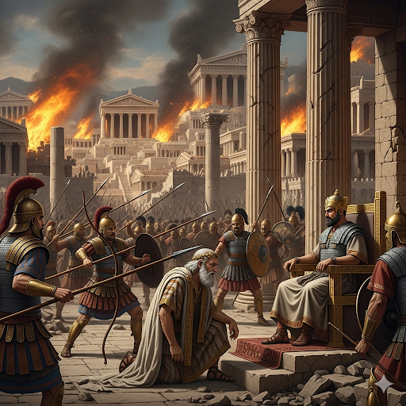

# The Lydian King

King Croesus was once one of the richest kings in the world. He ruled over Lydia, an ancient empire located near modern-day Turkey and controlled a valuable commodity: gold. Many people were very envious of him.

One day, a messenger disclosed some interesting news: political unrest in Persia had weakened the empire. Before then, the Persians had taken over many countries. Many leaders were scared of the Persian conquest. But King Croesus understood the dynamics of war better than most. He decided that it would be a good time to try to beat the Persians while they were weak.

He advocated starting war, but nobody shared his sentiment. Then he asked a wise member of the senate who was visiting from Athens. The sage didn’t say whether he should attack the Persians or not. He only warned him that his good luck wouldn’t last.

Finally, King Croesus sent a messenger to visit the Oracle, a special lady who could see the future. The messenger gave the Oracle jugs of wine and baskets of lentils in order to make her happy.

When the messenger came back, he was in a festive mood.

“What was the Oracle’s prophecy?” asked King Croesus.

The jolly messenger responded, “She said that if you attack Persia, you will destroy a great empire.”

The news filled Croesus with euphoria. After hearing the Oracle’s prophecy, many civilians enrolled in the Lydian army. The king marshaled his troops and prepared them for a war with Persia. Their morale was high because they were sure they would win. Soon, King Croesus authorized an attack against the Persians.

However, the Persian army was still very strong. After a few months of fighting, it was obvious that the Oracle’s prophecy had come true: by attacking the Persians, King Croesus had destroyed a great empire—his own! King Croesus should have considered the advice more carefully.

## Sentences of story

The Lydian King

King Croesus was once one of the richest kings in the world.

He ruled over Lydia, an ancient empire located near modern-day Turkey and controlled a valuable commodity: gold.

Many people were very envious of him.

One day, a messenger disclosed some interesting news: political unrest in Persia had weakened the empire.

Before then, the Persians had taken over many countries.

Many leaders were scared of the Persian conquest.

But King Croesus understood the dynamics of war better than most.

He decided that it would be a good time to try to beat the Persians while they were weak.

He advocated starting war, but nobody shared his sentiment.

Then he asked a wise member of the senate who was visiting from Athens.

The sage didn’t say whether he should attack the Persians or not.

He only warned him that his good luck wouldn’t last.

Finally, King Croesus sent a messenger to visit the Oracle, a special lady who could see the future.

The messenger gave the Oracle jugs of wine and baskets of lentils in order to make her happy.

When the messenger came back, he was in a festive mood.

“What was the Oracle’s prophecy?” asked King Croesus.

The jolly messenger responded, “She said that if you attack Persia, you will destroy a great empire.”

The news filled Croesus with euphoria.

After hearing the Oracle’s prophecy, many civilians enrolled in the Lydian army.

The king marshaled his troops and prepared them for a war with Persia.

Their morale was high because they were sure they would win.

Soon, King Croesus authorized an attack against the Persians.

However, the Persian army was still very strong.

After a few months of fighting, it was obvious that the Oracle’s prophecy had come true: by attacking the Persians, King Croesus had destroyed a great empire—his own!

King Croesus should have considered the advice more carefully.

## List of word

advocate, authorize, civilian, commodity, conquest, disclose, dynamics, enroll, envious, euphoria, festive, jolly, lentil, marshal, morale, prophecy, sage, senate, sentiment, unrest

## 1. advocate

### IPA: /ˈæd.və.keɪt/
### Class: v
### Câu truyện ẩn dụ:
"Áo đờ vô kẹt rồi!" - người luật sư la lên khi chiếc áo choàng của ông bị kẹt vào cửa. Dù vậy, ông vẫn cố gắng **biện hộ**, **ủng hộ** cho thân chủ của mình.

### Định nghĩa : 
Biện hộ, ủng hộ, tán thành.

### English definition: 
To publicly support or suggest an idea, development, or way of doing something.

### Sentence of stroy:
He **advocated** starting war, but nobody shared his sentiment.

## 2. authorize

### IPA: /ˈɔː.θər.aɪz/
### Class: v
### Câu truyện ẩn dụ:
Viên sĩ quan nói với lính của mình: "Tao `cho` mày `rời` khỏi đây, nhưng phải có giấy **cho phép** của tao." Ông ta đang **ủy quyền** cho người lính được rời đi.

### Định nghĩa : 
Cho phép, ủy quyền.

### English definition: 
To give official permission for something to happen, or to give someone official permission to do something.

### Sentence of stroy:
Soon, King Croesus **authorized** an attack against the Persians.

## 3. civilian

### IPA: /səˈvɪl.jən/
### Class: n
### Câu truyện ẩn dụ:
"Xe vỉa hè liền" - Xe của **thường dân** thì đậu liền trên vỉa hè, không giống như xe quân sự phải đậu đúng nơi quy định.

### Định nghĩa : 
Thường dân, dân thường.

### English definition: 
A person who is not a member of the police or the armed forces.

### Sentence of stroy:
After hearing the Oracle’s prophecy, many **civilians** enrolled in the Lydian army.

## 4. commodity

### IPA: /kəˈmɒd.ə.ti/
### Class: n
### Câu truyện ẩn dụ:
"Cứ mó đi tí" - người bán hàng nói với khách. Món **hàng hóa** này quý lắm, chỉ cho sờ một tí thôi. Đây là một loại **mặt hàng** có giá trị.

### Định nghĩa : 
Hàng hóa, mặt hàng.

### English definition: 
A substance or product that can be traded, bought, or sold.

### Sentence of stroy:
He ruled over Lydia, an ancient empire located near modern-day Turkey and controlled a valuable **commodity**: gold.

## 5. conquest

### IPA: /ˈkɒŋ.kwest/
### Class: n
### Câu truyện ẩn dụ:
"Con quét" dọn sạch sẽ chiến trường sau khi giành được chiến thắng. **Sự chinh phục** này đã mang lại hòa bình, và giờ là lúc "con quét" dọn.

### Định nghĩa : 
Sự chinh phục, sự xâm chiếm.

### English definition: 
The act of conquering a country, area, or situation.

### Sentence of stroy:
Many leaders were scared of the Persian **conquest**.

## 6. disclose

### IPA: /dɪˈskləʊz/
### Class: v
### Câu truyện ẩn dụ:
Người điệp viên nói: "Chỉ cần 'đít sờ lâu' vào cái két sắt là nó sẽ mở ra và **tiết lộ** toàn bộ tài liệu mật."

### Định nghĩa : 
Tiết lộ, phơi bày, vạch trần.

### English definition: 
To make something known publicly, or to show something that was hidden.

### Sentence of stroy:
One day, a messenger **disclosed** some interesting news: political unrest in Persia had weakened the empire.

## 7. dynamics

### IPA: /daɪˈnæm.ɪks/
### Class: n
### Câu truyện ẩn dụ:
"Đai nam míc" - chiếc đai đặc biệt của các nam ca sĩ có micro. **Động lực học** của chiếc đai này giúp họ di chuyển và hát một cách linh hoạt trên sân khấu, thể hiện các **động lực** của màn trình diễn.

### Định nghĩa : 
Động lực học, động lực.

### English definition: 
Forces or properties that stimulate growth, development, or change within a system or process.

### Sentence of stroy:
But King Croesus understood the **dynamics** of war better than most.

## 8. enroll

### IPA: /ɪnˈrəʊl/
### Class: v
### Câu truyện ẩn dụ:
"Em rồ lên" vì sung sướng khi được **ghi danh** vào trường đại học mơ ước. Cô ấy đã chính thức **đăng ký nhập học**.

### Định nghĩa : 
Ghi danh, đăng ký vào học/tham gia.

### English definition: 
To put yourself or someone else onto the official list of members of a course, college, or group.

### Sentence of stroy:
After hearing the Oracle’s prophecy, many civilians **enrolled** in the Lydian army.

## 9. envious

### IPA: /ˈen.vi.əs/
### Class: adj
### Câu truyện ẩn dụ:
Cô gái `em vì` anh mà trở nên **ghen tị** với tất cả những người xung quanh anh. Cô ấy cảm thấy **đố kỵ** và thèm muốn những gì người khác có.

### Định nghĩa : 
Ghen tị, đố kỵ, thèm muốn.

### English definition: 
Wishing you had what another person has.

### Sentence of stroy:
Many people were very **envious** of him.

## 10. euphoria

### IPA: /juːˈfɔː.ri.ə/
### Class: n
### Câu truyện ẩn dụ:
"Yêu phở Hà Nội à?" - "Đúng vậy, ăn phở Hà Nội xong tôi cảm thấy một **trạng thái hưng phấn**, một niềm **vui sướng tột độ**."

### Định nghĩa : 
Trạng thái hưng phấn, phởn phơ.

### English definition: 
A feeling of extreme happiness and excitement.

### Sentence of stroy:
The news filled Croesus with **euphoria**.

## 11. festive

### IPA: /ˈfes.tɪv/
### Class: adj
### Câu truyện ẩn dụ:
"Phép tí" thôi là không khí trở nên **vui vẻ**, như **ngày hội** ngay. Chỉ cần một chút phép thuật là có ngay không khí **lễ hội**.

### Định nghĩa : 
Có không khí lễ hội, vui vẻ.

### English definition: 
Relating to a festival; special and enjoyable.

### Sentence of stroy:
When the messenger came back, he was in a **festive** mood.

## 12. jolly

### IPA: /ˈdʒɒl.i/
### Class: adj
### Câu truyện ẩn dụ:
"Cho ly" bia này là ông ấy sẽ trở nên **vui vẻ**, **hồ hởi** ngay. Ông già Noel là một người rất **vui tính**.

### Định nghĩa : 
Vui vẻ, vui tính.

### English definition: 
Happy and smiling.

### Sentence of stroy:
The **jolly** messenger responded, “She said that if you attack Persia, you will destroy a great empire.”

## 13. lentil

### IPA: /ˈlen.tɪl/
### Class: n
### Câu truyện ẩn dụ:
"Len thêu" hình hạt **đậu lăng** trông rất đẹp. Người ta dùng sợi len để thêu lên những hạt **đậu lăng** nhiều màu sắc.

### Định nghĩa : 
Đậu lăng.

### English definition: 
A very small, round, flat seed, dried and used for food.

### Sentence of stroy:
The messenger gave the Oracle jugs of wine and baskets of **lentils** in order to make her happy.

## 14. marshal

### IPA: /ˈmɑː.ʃəl/
### Class: v
### Câu truyện ẩn dụ:
Vị tướng ra lệnh: "Mã sồ ra!". Lập tức, toàn bộ kỵ binh **tập hợp** lại, **sắp xếp** đội hình để chuẩn bị xuất quân.

### Định nghĩa : 
Sắp xếp, tập hợp (quân đội).

### English definition: 
To arrange or assemble (a group of people, especially soldiers) in order.

### Sentence of stroy:
The king **marshaled** his troops and prepared them for a war with Persia.

## 15. morale

### IPA: /məˈrɑːl/
### Class: n
### Câu truyện ẩn dụ:
"Mơ rào" cản bị phá bỏ, **tinh thần** của cả đội dâng cao. Khi không còn rào cản, **nhuệ khí** của họ trở nên rất tốt.

### Định nghĩa : 
Tinh thần, nhuệ khí.

### English definition: 
The amount of confidence felt by a person or group of people, especially when in a dangerous or difficult situation.

### Sentence of stroy:
Their **morale** was high because they were sure they would win.

## 16. prophecy

### IPA: /ˈprɒf.ə.si/
### Class: n
### Câu truyện ẩn dụ:
Vị tiên tri nói: "**Rõ phết sờ sờ** ra đây, không sai được đâu!". **Lời tiên tri** của ông ấy luôn chính xác, rõ ràng như sờ thấy được.

### Định nghĩa : 
Lời tiên tri, sự tiên tri.

### English definition: 
A statement that says what is going to happen in the future.

### Sentence of stroy:
“What was the Oracle’s **prophecy**?” asked King Croesus.

## 17. sage

### IPA: /seɪdʒ/
### Class: n
### Câu truyện ẩn dụ:
Vị **nhà hiền triết** tuổi đã cao, da dẻ trông "xệ cả" rồi nhưng kiến thức của ông thì vô cùng uyên bác. Ông là một **người thông thái**.

### Định nghĩa : 
Nhà hiền triết, người thông thái.

### English definition: 
A very wise person.

### Sentence of stroy:
The **sage** didn’t say whether he should attack the Persians or not.

## 18. senate

### IPA: /ˈsen.ət/
### Class: n
### Câu truyện ẩn dụ:
"Xem net" ở **thượng viện** là không được phép. Các nghị sĩ phải tập trung vào việc thảo luận chính sách quốc gia.

### Định nghĩa : 
Thượng viện.

### English definition: 
The smaller and more important of the two parts of the government with the power to make laws, in countries such as the US, Australia, and France.

### Sentence of stroy:
Then he asked a wise member of the **senate** who was visiting from Athens.

## 19. sentiment

### IPA: /ˈsen.tɪ.mənt/
### Class: n
### Câu truyện ẩn dụ:
"Sợ tình mình tan" - đó là một **tình cảm**, một **quan điểm** đầy lo lắng của cô gái khi yêu.

### Định nghĩa : 
Quan điểm, ý kiến; tình cảm.

### English definition: 
A thought, opinion, or idea based on a feeling about a situation, or a way of thinking about something.

### Sentence of stroy:
He advocated starting war, but nobody shared his **sentiment**.

## 20. unrest

### IPA: /ʌnˈrest/
### Class: n
### Câu truyện ẩn dụ:
"Ăn rết" - người dân phải ăn cả rết vì đói khổ. Điều này đã dẫn đến **sự náo động**, **tình trạng bất ổn** trong cả vương quốc.

### Định nghĩa : 
Sự náo động, tình trạng bất ổn.

### English definition: 
A state of dissatisfaction, disturbance, and agitation in a group of people, typically involving public demonstrations or disorder.

### Sentence of stroy:
One day, a messenger disclosed some interesting news: political **unrest** in Persia had weakened the empire.
