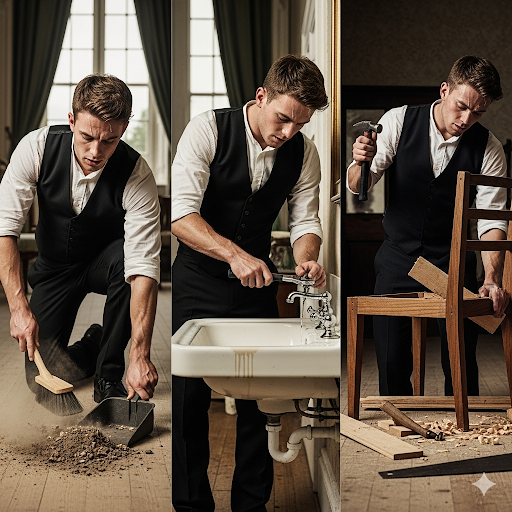
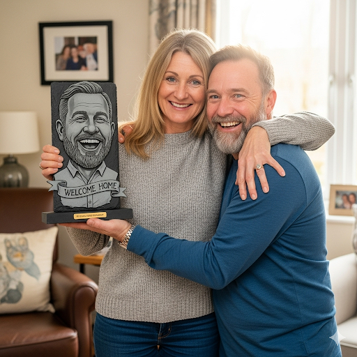
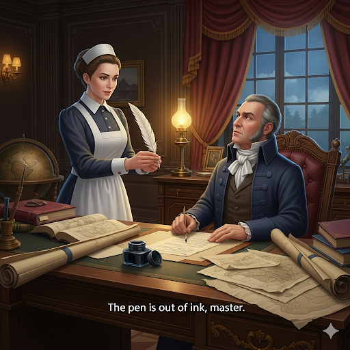
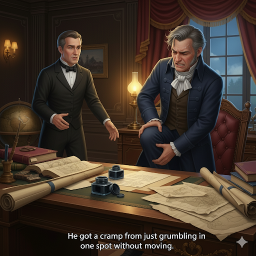
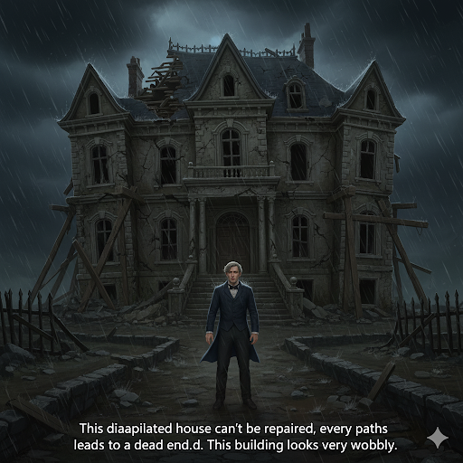
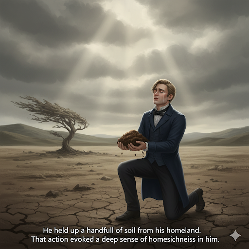
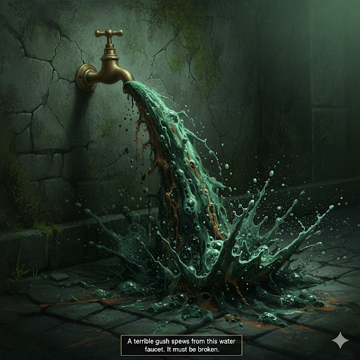

# The Butler

Greta was an elderly lady who lived alone in a huge, dilapidated mansion. The mansion was in terrible condition. It was covered with filth, and most of the furniture was broken. Plus, the kitchen sink leaked water all over the floor. Greta was too old to do housekeeping and repairs herself, so she hired a butler named Gordon.

Gordon was a young, muscular man. His muscles were a testament to his strong work ethic. He believed that if he worked hard, great things would happen for him. On his first day, he worked for hours cleaning and making repairs. He swept up mounds of dirt. He tightened the valve underneath the kitchen faucet to stop the leak. He even bought timber to build new stools for the kitchen. He worked so hard that his fingers went numb, and he got cramps in his shoulders.

Gordon worked hard every day. Even when tasks were boring, he was never reckless. He made sure there were no flaws in his work. Gordon was worried, however, that Greta wasn’t pleased. She never expressed thanks or said that he did a good job. The lack of appreciation evoked unhappy feelings in Gordon. He even thought about quitting. But he decided the right thing to do was to keep working hard.

One day, while Gordon was sweeping, Greta said, “Gordon! I have a surprise for you!” He went to Greta’s room and saw a beautiful slate statue. It looked just like him! It was adorned with a banner that read: “Welcome home.”

Greta said, “You’ve made this ugly old mansion look new again. I’m so thankful for your hard work that I want you to have it. I’ll move into a smaller house.”

He grinned and gave Greta a big hug. He said, “ I’m in bliss! My hard work really paid off!”

The two said their farewells, and Gordon spent the afternoon admiring his beautiful new home.

## Sentences of story

The Butler

Greta was an elderly lady who lived alone in a huge, dilapidated mansion.

The mansion was in terrible condition.

It was covered with filth, and most of the furniture was broken.

Plus, the kitchen sink leaked water all over the floor.

Greta was too old to do housekeeping and repairs herself, so she hired a butler named Gordon.

Gordon was a young, muscular man.

His muscles were a testament to his strong work ethic.

He believed that if he worked hard, great things would happen for him.

On his first day, he worked for hours cleaning and making repairs.

He swept up mounds of dirt.

He tightened the valve underneath the kitchen faucet to stop the leak.

He even bought timber to build new stools for the kitchen.

He worked so hard that his fingers went numb, and he got cramps in his shoulders.

Gordon worked hard every day.

Even when tasks were boring, he was never reckless.

He made sure there were no flaws in his work.

Gordon was worried, however, that Greta wasn’t pleased.

She never expressed thanks or said that he did a good job.

The lack of appreciation evoked unhappy feelings in Gordon.

He even thought about quitting.

But he decided the right thing to do was to keep working hard.

One day, while Gordon was sweeping, Greta said, “Gordon! I have a surprise for you!”

He went to Greta’s room and saw a beautiful slate statue.

It looked just like him!

It was adorned with a banner that read: “Welcome home.”

Greta said, “You’ve made this ugly old mansion look new again.

I’m so thankful for your hard work that I want you to have it.

I’ll move into a smaller house.”

He grinned and gave Greta a big hug.

He said, “ I’m in bliss! My hard work really paid off!”

The two said their farewells, and Gordon spent the afternoon admiring his beautiful new home.

## List of word

adorn, bliss, butler, cramp, dilapidated, evoke, farewell, faucet, filth, flaw, grin, housekeeping, mound, numb, reckless, slate, stool, testament, timber, valve

## 1. adorn

### IPA: /əˈdɔːn/
### Class: v
### Câu truyện ẩn dụ:
"Ờ, đo ni" - người thợ may nói, đo chiếc ni để làm một vật trang trí. Ông ấy đang **tô điểm**, **trang trí** cho chiếc váy.

### Định nghĩa : 
Tô điểm, trang trí.

### English definition: 
To add something decorative to a person or thing.

### Sentence of stroy:
It was **adorned** with a banner that read: “Welcome home.”

## 2. bliss

### IPA: /blɪs/
### Class: n
### Câu truyện ẩn dụ:
Cô gái "bị lịt" lưỡi vì quá **sung sướng**. Cô ấy đang ở trong trạng thái **hạnh phúc viên mãn**.

### Định nghĩa : 
Hạnh phúc viên mãn, sung sướng tột độ.

### English definition: 
Perfect happiness.

### Sentence of stroy:
He said, “ I’m in **bliss**! My hard work really paid off!”

## 3. butler

### IPA: /ˈbʌt.lər/
### Class: n
### Câu truyện ẩn dụ:
Người **quản gia** nói với chủ: "Bút lơ" mực rồi ạ, để tôi đi mua bút mới.

### Định nghĩa : 
Quản gia (nam).

### English definition: 
The main male servant in a large house.

### Sentence of stroy:
Greta was too old to do housekeeping and repairs herself, so she hired a **butler** named Gordon.

## 4. cramp

### IPA: /kræmp/
### Class: n
### Câu truyện ẩn dụ:
Anh ấy bị **chuột rút** vì cứ "cờ ràm" (càm ràm) mãi một chỗ không chịu vận động.

### Định nghĩa : 
Chuột rút, sự co cứng cơ.

### English definition: 
A sudden, painful tightening of a muscle, which you cannot control.

### Sentence of stroy:
He worked so hard that his fingers went numb, and he got **cramps** in his shoulders.

## 5. dilapidated

### IPA: /dɪˈlæp.ɪ.deɪ.tɪd/
### Class: adj
### Câu truyện ẩn dụ:
"Đi lắp đi đây tịt" - Ngôi nhà **đổ nát** này không lắp thêm được gì nữa, đi đâu cũng thấy tịt đường. Tòa nhà này trông rất **xiêu vẹo**.

### Định nghĩa : 
Đổ nát, xiêu vẹo, ọp ẹp.

### English definition: 
Old and in poor condition.

### Sentence of stroy:
Greta was an elderly lady who lived alone in a huge, **dilapidated** mansion.

## 6. evoke

### IPA: /ɪˈvəʊk/
### Class: v
### Câu truyện ẩn dụ:
"Y vốc" một nắm đất quê hương lên, hành động đó **gợi lên** trong anh nỗi nhớ nhà da diết.

### Định nghĩa : 
Gợi lên (ký ức, cảm xúc).

### English definition: 
To make someone remember something or feel an emotion.

### Sentence of stroy:
The lack of appreciation **evoked** unhappy feelings in Gordon.

## 7. farewell

### IPA: /ˌfeəˈwel/
### Class: n
### Câu truyện ẩn dụ:
Khi **tạm biệt**, cô ấy nói: "Phải queo" lựa con đường tốt nhất mà đi nhé. Đây là **lời chào tạm biệt** của cô.

### Định nghĩa : 
Lời chào tạm biệt.

### English definition: 
An occasion when someone says goodbye.

### Sentence of stroy:
The two said their **farewells**, and Gordon spent the afternoon admiring his beautiful new home.

## 8. faucet

### IPA: /ˈfɔː.sɪt/
### Class: n
### Câu truyện ẩn dụ:
"Pho xịt" ra từ cái **vòi nước** này trông thật kinh khủng. Chắc là vòi nước bị hỏng rồi.

### Định nghĩa : 
Vòi nước.

### English definition: 
A device that controls the flow of liquid, especially water, from a pipe.

### Sentence of stroy:
He tightened the valve underneath the kitchen **faucet** to stop the leak.

## 9. filth

### IPA: /fɪlθ/
### Class: n
### Câu truyện ẩn dụ:
"Phim" này toàn **rác rưởi**, **bẩn thỉu**. Nội dung của nó thật là **dơ bẩn**.

### Định nghĩa : 
Rác rưởi, sự bẩn thỉu, dơ dáy.

### English definition: 
Thick, unpleasant dirt.

### Sentence of stroy:
It was covered with **filth**, and most of the furniture was broken.

## 10. flaw

### IPA: /flɔː/
### Class: n
### Câu truyện ẩn dụ:
"Phờ lo" vì sản phẩm có **thiếu sót**. Anh ta sợ khách hàng sẽ phát hiện ra **khuyết điểm** này.

### Định nghĩa : 
Thiếu sót, khuyết điểm, sai lầm.

### English definition: 
A fault, mistake, or weakness, especially one that happens while something is being planned or made, or that causes something not to be perfect.

### Sentence of stroy:
He made sure there were no **flaws** in his work.

## 11. grin

### IPA: /ɡrɪn/
### Class: v
### Câu truyện ẩn dụ:
Anh ấy **cười toe toét** khi nhận được quà, "gờ rin" (green - màu xanh) cả mặt vì sung sướng.

### Định nghĩa : 
Cười toe toét, cười nhe răng.

### English definition: 
To smile a wide smile.

### Sentence of stroy:
He **grinned** and gave Greta a big hug.

## 12. housekeeping

### IPA: /ˈhaʊsˌkiː.pɪŋ/
### Class: n
### Câu truyện ẩn dụ:
"Hao kíp tiền" vì **công việc nội trợ**. Việc **quản gia** tốn kém quá.

### Định nghĩa : 
Công việc nội trợ, công việc quản gia.

### English definition: 
The management of a home and the work that needs to be done in it, such as cleaning.

### Sentence of stroy:
Greta was too old to do **housekeeping** and repairs herself, so she hired a butler named Gordon.

## 13. mound

### IPA: /maʊnd/
### Class: n
### Câu truyện ẩn dụ:
"Mao đần" độn nên đã chất đất thành một **đống**, một **ụ** cao mà không biết dùng để làm gì.

### Định nghĩa : 
Đống, ụ, gò.

### English definition: 
A large pile of earth, stones, etc. like a small hill.

### Sentence of stroy:
He swept up **mounds** of dirt.

## 14. numb

### IPA: /nʌm/
### Class: adj
### Câu truyện ẩn dụ:
Ngồi lâu quá chân bị **tê**, "nằm" một lúc cho đỡ. Cảm giác **tê cóng** rất khó chịu.

### Định nghĩa : 
Tê, tê cóng, không cảm giác.

### English definition: 
If a part of your body is numb, you are unable to feel it, usually for a short time.

### Sentence of stroy:
He worked so hard that his fingers went **numb**, and he got cramps in his shoulders.

## 15. reckless

### IPA: /ˈrek.ləs/
### Class: adj
### Câu truyện ẩn dụ:
"Rách hết" cả quần áo vì hành động **liều lĩnh**, **coi thường nguy hiểm** của mình.

### Định nghĩa : 
Liều lĩnh, táo bạo, coi thường nguy hiểm.

### English definition: 
Doing something dangerous and not worrying about the risks and the possible results.

### Sentence of stroy:
Even when tasks were boring, he was never **reckless**.

## 16. slate

### IPA: /sleɪt/
### Class: n
### Câu truyện ẩn dụ:
"Sợ lết" trên con đường lợp bằng **đá phiến** này vì nó rất trơn.

### Định nghĩa : 
Đá phiến.

### English definition: 
A dark grey rock that can be easily split into thin, flat layers.

### Sentence of stroy:
He went to Greta’s room and saw a beautiful **slate** statue.

## 17. stool

### IPA: /stuːl/
### Class: n
### Câu truyện ẩn dụ:
Cái **ghế đẩu** này "sờ tun" lạnh vì làm bằng sắt.

### Định nghĩa : 
Ghế đẩu, ghế không có lưng tựa.

### English definition: 
A seat without any support for the back or arms.

### Sentence of stroy:
He even bought timber to build new **stools** for the kitchen.

## 18. testament

### IPA: /ˈtes.tə.mənt/
### Class: n
### Câu truyện ẩn dụ:
"Test tờ mình" - bài kiểm tra này là **minh chứng**, là **bằng chứng** cho sự nỗ lực học tập của mình.

### Định nghĩa : 
Bằng chứng, minh chứng.

### English definition: 
Proof of something.

### Sentence of stroy:
His muscles were a **testament** to his strong work ethic.

## 19. timber

### IPA: /ˈtɪm.bər/
### Class: n
### Câu truyện ẩn dụ:
"Tim bơ" phờ vì phải vác **gỗ** xây nhà. Khúc **gỗ xây dựng** này nặng quá.

### Định nghĩa : 
Gỗ xây dựng.

### English definition: 
Wood used for building.

### Sentence of stroy:
He even bought **timber** to build new stools for the kitchen.

## 20. valve

### IPA: /vælv/
### Class: n
### Câu truyện ẩn dụ:
Cái **van** này "vẹo" rồi, không khóa nước được nữa.

### Định nghĩa : 
Van (khóa nước, hơi...).

### English definition: 
A device that opens and closes to control the flow of liquids or gases.

### Sentence of stroy:
He tightened the **valve** underneath the kitchen faucet to stop the leak.