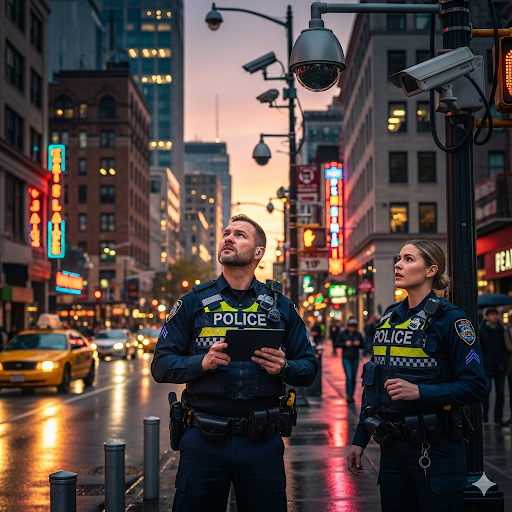

# The End of Smallpox

Smallpox was once the most deadly disease in the world. During the 1800s, more than 20 million people got the disease every year. Of those, nearly half died. At the onset of smallpox, people suffered from high fevers, headaches, vomiting, and aching muscles. Yet the worst symptom of all was an intolerable rash that caused irritation on the entire body. Those who survived the disease were often rendered blind or left with gross scars on their face and body.

Today, however, cases of smallpox are very rare due to the work of many countries during the late 1900s. This federation of countries collaborated to completely destroy smallpox. Early in the century, wealthy countries in Europe and North America had developed a substance that made the body immune to smallpox. They had required all their citizens to get this vaccine to counteract the disease. Hence, the people of these countries no longer had to worry about smallpox.

However, many of the needy people in poorer parts of the world still suffered from the disease. Their countries could not afford the vaccine nor supply enough doctors to curb the spread of smallpox.

In 1950, the wealthier countries of the world vowed to free the world of the disease. They pledged to supply the vaccine to any country that could not afford it. Scientists compiled lists of areas where the disease still thrived. Then doctors diagnosed people who had the disease in these areas. They enacted laws that prohibited people with smallpox from mixing with those who did not. In this way, they could not transmit the disease to others. Then the doctors gave all of them the vaccine.

It took a longtime and a lot of work. But nearly thirty years later, on December 9,1979, a group of scientists certified that smallpox had been successfully stopped. The humane efforts of people from all over the world had accomplished a great task.

## Sentences of story

The End of Smallpox

Smallpox was once the most deadly disease in the world.

During the 1800s, more than 20 million people got the disease every year.

Of those, nearly half died.

At the onset of smallpox, people suffered from high fevers, headaches, vomiting, and aching muscles.

Yet the worst symptom of all was an intolerable rash that caused irritation on the entire body.

Those who survived the disease were often rendered blind or left with gross scars on their face and body.

Today, however, cases of smallpox are very rare due to the work of many countries during the late 1900s.

This federation of countries collaborated to completely destroy smallpox.

Early in the century, wealthy countries in Europe and North America had developed a substance that made the body immune to smallpox.

They had required all their citizens to get this vaccine to counteract the disease.

Hence, the people of these countries no longer had to worry about smallpox.

However, many of the needy people in poorer parts of the world still suffered from the disease.

Their countries could not afford the vaccine nor supply enough doctors to curb the spread of smallpox.

In 1950, the wealthier countries of the world vowed to free the world of the disease.

They pledged to supply the vaccine to any country that could not afford it.

Scientists compiled lists of areas where the disease still thrived.

Then doctors diagnosed people who had the disease in these areas.

They enacted laws that prohibited people with smallpox from mixing with those who did not.

In this way, they could not transmit the disease to others.

Then the doctors gave all of them the vaccine.

It took a longtime and a lot of work.

But nearly thirty years later, on December 9,1979, a group of scientists certified that smallpox had been successfully stopped.

The humane efforts of people from all over the world had accomplished a great task.

## List of word

certify, collaborate, compile, counteract, curb, diagnose, enact, federation, gross, humane, intolerable, needy, onset, pledge, prohibit, rash, render, smallpox, transmit, vow

## 1. certify

### IPA: /ˈsɜː.tɪ.faɪ/
### Class: v
### Câu truyện ẩn dụ:
Người nghệ nhân dệt lụa vô cùng lo lắng, "sợ tơ phai" màu theo năm tháng. Để đảm bảo giá trị vĩnh cửu cho tác phẩm của mình, ông quyết định mang tấm lụa quý đến một tổ chức uy tín để **chứng nhận**, **chứng thực** rằng nó được làm từ vật liệu tốt nhất và sẽ không bao giờ mất đi vẻ đẹp ban đầu.

### Định nghĩa : 
Chứng nhận, chứng thực.

### English definition: 
To state that something is true, accurate, or of a good standard.

### Sentence of stroy:
But nearly thirty years later, on December 9,1979, a group of scientists **certified** that smallpox had been successfully stopped.

## 2. collaborate

### IPA: /kəˈlæb.ə.reɪt/
### Class: v
### Câu truyện ẩn dụ:
"Cả làng bơ rết" (rate) - cả ngôi làng cùng nhau đánh giá một sản phẩm thủ công mới. Mọi người từ già trẻ, lớn bé đều tham gia. Họ đã **cộng tác** với nhau trong nhiều tháng, từ khâu lên ý tưởng, thiết kế đến sản xuất. Chính nhờ sự hợp tác ăn ý này mà sản phẩm cuối cùng đã nhận được đánh giá 5 sao tuyệt đối.

### Định nghĩa : 
Cộng tác, hợp tác.

### English definition: 
To work with someone else for a special purpose.

### Sentence of stroy:
This federation of countries **collaborated** to completely destroy smallpox.

## 3. compile

### IPA: /kəmˈpaɪl/
### Class: v
### Câu truyện ẩn dụ:
Vị đầu bếp nổi tiếng muốn tạo ra một cuốn sách độc đáo. Ông dành nhiều năm đi khắp nơi, "cơm bài" (cặm cụi) bên bàn giấy, để **biên soạn** lại những công thức thất truyền. Ông đã **sưu tập** thông tin từ các tài liệu cổ, phỏng vấn những người già và thử nghiệm không ngừng để hoàn thành công trình tâm huyết của mình.

### Định nghĩa : 
Biên soạn, sưu tập tài liệu.

### English definition: 
To collect information and arrange it in a book, report, or list.

### Sentence of stroy:
Scientists **compiled** lists of areas where the disease still thrived.

## 4. counteract

### IPA: /ˌkaʊn.tərˈækt/
### Class: v
### Câu truyện ẩn dụ:
Chiếc diều "cao tơ rách" một mảng lớn do gió giật mạnh. Để cứu vãn nó, cậu bé nhanh trí dùng một miếng vải khác dán lên. Miếng vải này hoạt động như một biện pháp để **chống lại** việc vết rách lan rộng, giúp **trung hòa** tác động của luồng gió mạnh và làm cho chiếc diều có thể bay trở lại.

### Định nghĩa : 
Chống lại, trung hòa, làm mất tác dụng.

### English definition: 
To reduce the effect of something unwanted by producing an opposite effect.

### Sentence of stroy:
They had required all their citizens to get this vaccine to **counteract** the disease.

## 5. curb

### IPA: /kɜːb/
### Class: v
### Câu truyện ẩn dụ:
Tình hình "cướp" giật trong thành phố ngày càng gia tăng, khiến người dân bất an. Chính quyền đã phải triển khai nhiều biện pháp mạnh tay để **kiềm chế** làn sóng tội phạm này. Họ tăng cường tuần tra, lắp đặt camera an ninh khắp nơi nhằm **hạn chế** và **ngăn chặn** những hành vi phạm pháp, trả lại sự bình yên cho người dân.

### Định nghĩa : 
Kiềm chế, nén lại, hạn chế.

### English definition: 
To control or limit something that is not wanted.

### Sentence of stroy:
Their countries could not afford the vaccine nor supply enough doctors to **curb** the spread of smallpox.

## 6. diagnose

### IPA: /ˈdaɪ.əɡ.nəʊz/
### Class: v
### Câu truyện ẩn dụ:
Bệnh nhân trông có vẻ bối rối khi vị bác sĩ già hỏi một câu lạ lùng: "Đái ở nâu?". Thực ra, đó là cách nói ngọng của ông khi hỏi về các triệu chứng. Dựa trên câu trả lời và các xét nghiệm khác, vị bác sĩ giàu kinh nghiệm có thể **chẩn đoán** chính xác căn bệnh mà bệnh nhân đang mắc phải.

### Định nghĩa : 
Chẩn đoán.

### English definition: 
To say what is wrong with someone who is ill.

### Sentence of stroy:
Then doctors **diagnosed** people who had the disease in these areas.

## 7. enact

### IPA: /ɪˈnækt/
### Class: v
### Câu truyện ẩn dụ:
Vấn đề mùi cơ thể của "y nách" (anh ấy) trở thành một chủ đề nóng trong các cuộc họp hội đồng thành phố. Sau nhiều cuộc tranh luận sôi nổi về vấn đề vệ sinh công cộng, họ đã quyết định **ban hành** một đạo luật mới. Luật này quy định về các tiêu chuẩn vệ sinh cá nhân ở nơi công cộng.

### Định nghĩa : 
Ban hành (đạo luật).

### English definition: 
To put a law into practice.

### Sentence of stroy:
They **enacted** laws that prohibited people with smallpox from mixing with those who did not.

## 8. federation

### IPA: /ˌfed.ərˈeɪ.ʃən/
### Class: n
### Câu truyện ẩn dụ:
Các quốc gia nhỏ lẻ thường gặp nhiều khó khăn, giống như một "phe đờ rầy sần" (phe đó rầy rà, phiền phức). Nhận ra điều đó, họ quyết định thành lập một **liên đoàn**, một **liên bang** vững mạnh. Bằng cách hợp nhất, họ có thể chia sẻ tài nguyên, hỗ trợ lẫn nhau và có tiếng nói chung mạnh mẽ hơn trên trường quốc tế.

### Định nghĩa : 
Liên đoàn, liên bang.

### English definition: 
A group of states or organizations that have joined together.

### Sentence of stroy:
This **federation** of countries collaborated to completely destroy smallpox.

## 9. gross

### IPA: /ɡrəʊs/
### Class: adj
### Câu truyện ẩn dụ:
Cảnh tượng trong căn bếp bị bỏ hoang thật khủng khiếp. Thức ăn thừa vương vãi khắp nơi, và trên "gờ râu" (cái gờ của bồn rửa mặt) bám đầy một lớp chất bẩn nhầy nhụa, bốc mùi. Mọi thứ trông thật **kinh tởm** và **ghê tởm**, đến nỗi không ai dám bước chân vào để dọn dẹp.

### Định nghĩa : 
Kinh tởm, ghê tởm.

### English definition: 
Extremely unpleasant.

### Sentence of stroy:
Those who survived the disease were often rendered blind or left with **gross** scars on their face and body.

## 10. humane

### IPA: /hjuːˈmeɪn/
### Class: adj
### Câu truyện ẩn dụ:
Chú "hưu mến" người trông coi vườn thú vô cùng. Mỗi ngày, ông đều đến trò chuyện, nhẹ nhàng vuốt ve và cho nó ăn những món ngon nhất. Cách đối xử đầy tình yêu thương của ông không chỉ dành cho chú hươu mà còn cho tất cả các con vật khác, thể hiện một tấm lòng **nhân đạo** và **nhân văn** sâu sắc.

### Định nghĩa : 
Nhân đạo, nhân văn.

### English definition: 
Kind, especially towards people or animals that are suffering.

### Sentence of stroy:
The **humane** efforts of people from all over the world had accomplished a great task.

## 11. intolerable

### IPA: /ɪnˈtɒl.ər.ə.bəl/
### Class: adj
### Câu truyện ẩn dụ:
Tiếng ồn từ công trường "in to lò rèn bồ" (in to, lò rèn, bồ) cạnh nhà vang lên suốt ngày đêm. Âm thanh chát chúa, đinh tai nhức óc khiến cuộc sống của mọi người trở nên **không thể chịu đựng nổi**. Họ đã khiếu nại nhiều lần nhưng tình hình không cải thiện, đó là một sự tra tấn **không thể tha thứ**.

### Định nghĩa : 
Không thể chịu đựng nổi, không thể tha thứ.

### English definition: 
Too bad or unpleasant to deal with or accept.

### Sentence of stroy:
Yet the worst symptom of all was an **intolerable** rash that caused irritation on the entire body.

## 12. needy

### IPA: /ˈniː.di/
### Class: adj
### Câu truyện ẩn dụ:
Mỗi ngày, cô bé "ní đi" (bé đi) khắp các con phố với chiếc nón rách, hy vọng nhận được sự giúp đỡ của người qua đường. Gia đình em thuộc diện **nghèo túng**, **thiếu thốn** nhất trong làng, bữa đói bữa no. Em làm vậy để phụ giúp cha mẹ đang đau ốm, mong có đủ tiền mua thuốc và thức ăn.

### Định nghĩa : 
Nghèo túng, thiếu thốn.

### English definition: 
Poor and not having enough food, clothes, etc.

### Sentence of stroy:
However, many of the **needy** people in poorer parts of the world still suffered from the disease.

## 13. onset

### IPA: /ˈɒn.set/
### Class: n
### Câu truyện ẩn dụ:
Khi chiếc xe buýt bắt đầu lăn bánh, cậu bé cảm thấy "ón sết" (buồn nôn và mệt mỏi) khắp người. Đó chính là **sự bắt đầu**, triệu chứng đầu tiên của cơn say xe tồi tệ. Cảm giác khó chịu này ngày càng tăng lên, báo hiệu một chuyến đi dài và đầy mệt mỏi sắp diễn ra.

### Định nghĩa : 
Sự bắt đầu, sự tấn công (của một căn bệnh).

### English definition: 
The beginning of something, usually something unpleasant.

### Sentence of stroy:
At the **onset** of smallpox, people suffered from high fevers, headaches, vomiting, and aching muscles.

## 14. pledge

### IPA: /pledʒ/
### Class: v
### Câu truyện ẩn dụ:
Nhìn thấy "bờ lét" (bờ kè) của con sông đầy rác thải, người dân trong khu phố cảm thấy rất xấu hổ. Họ đã cùng nhau tổ chức một cuộc họp và đưa ra một lời **cam kết** mạnh mẽ. Mọi người cùng nhau **thề** sẽ dành mỗi cuối tuần để dọn dẹp, trả lại vẻ sạch đẹp cho bờ sông.

### Định nghĩa : 
Cam kết, hứa, thề.

### English definition: 
To make a serious or formal promise to give or do something.

### Sentence of stroy:
They **pledged** to supply the vaccine to any country that could not afford it.

## 15. prohibit

### IPA: /prəˈhɪb.ɪt/
### Class: v
### Câu truyện ẩn dụ:
"Bồ hít bít tất" là một thói quen kỳ quặc và mất vệ sinh. Ở nơi công cộng, hành vi này bị **cấm** triệt để. Các biển báo được dựng lên khắp nơi để **ngăn cấm** mọi người làm điều đó, vì nó không chỉ gây khó chịu cho người khác mà còn có thể lây lan vi khuẩn và bệnh tật.

### Định nghĩa : 
Cấm, ngăn cấm.

### English definition: 
To officially forbid something.

### Sentence of stroy:
They enacted laws that **prohibited** people with smallpox from mixing with those who did not.

## 16. rash

### IPA: /ræʃ/
### Class: n
### Câu truyện ẩn dụ:
Sau khi đi xuyên qua khu rừng rậm, cậu bé thấy trên tay mình nổi đầy những nốt đỏ. Cảm giác vừa ngứa vừa "rát" vô cùng khó chịu. Mẹ cậu nhìn thấy và lo lắng nói rằng đó là một dạng **phát ban** do dị ứng với lá cây. Những nốt mẩn đỏ lan ra rất nhanh và gây đau rát.

### Định nghĩa : 
Sự phát ban.

### English definition: 
A lot of small red spots on the skin.

### Sentence of stroy:
Yet the worst symptom of all was an intolerable **rash** that caused irritation on the entire body.

## 17. render

### IPA: /ˈren.dər/
### Class: v
### Câu truyện ẩn dụ:
Chiếc máy tính cũ kỹ kêu "ren đơ" một tiếng rồi màn hình tối sầm lại. Nó đã hoạt động quá công suất khi phải xử lý một tệp đồ họa quá lớn. Việc này **làm cho** toàn bộ hệ thống bị treo, **khiến cho** người dùng rơi vào tình trạng không thể làm gì được ngoài việc khởi động lại.

### Định nghĩa : 
Làm cho, khiến cho (rơi vào một tình trạng nào đó).

### English definition: 
To cause someone or something to be in a particular state.

### Sentence of stroy:
Those who survived the disease were often **rendered** blind or left with gross scars on their face and body.

## 18. smallpox

### IPA: /ˈsmɔːl.pɒks/
### Class: n
### Câu truyện ẩn dụ:
Trong các tài liệu y học cổ, người ta mô tả một căn bệnh khủng khiếp. Khi mắc phải, da bệnh nhân sẽ nổi đầy mụn nước, khi vỡ ra sẽ để lại sẹo lõm. Người ta ví von một cách đáng sợ rằng nó như thể "sờ mông bóc" cả mảng da, đó chính là mô tả về **bệnh đậu mùa** gieo rắc kinh hoàng một thời.

### Định nghĩa : 
Bệnh đậu mùa.

### English definition: 
A serious disease that causes spots and can leave marks on the skin.

### Sentence of stroy:
**Smallpox** was once the most deadly disease in the world.

## 19. transmit

### IPA: /trænzˈmɪt/
### Class: v
### Câu truyện ẩn dụ:
Vị giáo sư sinh học giải thích cho sinh viên rằng, ngay cả một hành động đơn giản như chạm vào "trán mít" (trán đầy mồ hôi như quả mít) của người bệnh rồi đưa tay lên mặt cũng có thể **truyền** bệnh. Vi khuẩn và vi-rút có thể dễ dàng **lây lan** qua con đường tiếp xúc trực tiếp như vậy.

### Định nghĩa : 
Truyền, truyền nhiễm, lây lan.

### English definition: 
To pass a disease from one person or animal to another.

### Sentence of stroy:
In this way, they could not **transmit** the disease to others.

## 20. vow

### IPA: /vaʊ/
### Class: v
### Câu truyện ẩn dụ:
Sau khi trải qua một biến cố lớn trong đời, người đàn ông quyết định thay đổi. Anh "vào" một ngôi đền cổ, đứng trước tượng Phật và thành tâm **thề**. Anh **nguyện** từ bỏ mọi thói quen xấu, dành phần đời còn lại để làm việc thiện, giúp đỡ những người khó khăn, sống một cuộc đời có ý nghĩa hơn.

### Định nghĩa : 
Thề, nguyện.

### English definition: 
To make a determined decision or promise to do something.

### Sentence of stroy:
In 1950, the wealthier countries of the world **vowed** to free the world of the disease.