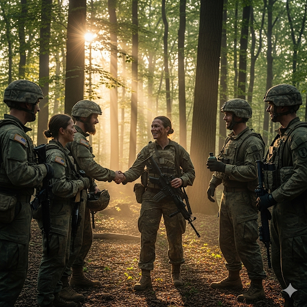

# The Coward’s Lesson

Tom was easily frightened. He enlisted in the army because he thought the military would teach him courage. And though he needed courage, he never imagined how he would learn it.

During a march across a tract of wilderness near his country’s frontier, Tom strayed from his squad. He had stopped to gaze at a splendid view of a lush valley. When he turned around, his squad was gone. He searched for them, but because their outfits had camouflage, he couldn’t find them.

It was getting dark, and Tom grew weary. All he had was a knife, a boomerang, and his handbook. He made a camp for the night. It was cold, and the ground was hard. He wished he had his cot and a blanket. Instead, he made a fire, wrapped himself tightly in his jacket, and fell asleep.

A loud noise roused him from his sleep. “What was that?” he wondered.

Then he noticed it. An animal of substantial size had left a print from its paw in the dirt. He sat closer to the fire and looked into the darkness. He imagined a large beast jumping from the gloom and attacking him. He shook so much from fear that it felt like the marrow in his bones quivered.

Tom contemplated many different plans. He was hesitant to act. He decided to stay by the fire, but during his vigil, he heard more noises.

He couldn’t contend with his fear any longer. He knew what he had to do. He made a torch and followed the prints. He heard a twig snap very close ahead, but he bravely went on. Seconds later, he discovered what had scared him. It was only a kangaroo.

Tom went back to his camp and slept. In the morning, he found his squad. He had finally learned courage. He learned that he had to confront his fear in order to conquer it.

## Sentences of story

The Coward’s Lesson

Tom was easily frightened.

He enlisted in the army because he thought the military would teach him courage.

And though he needed courage, he never imagined how he would learn it.

During a march across a tract of wilderness near his country’s frontier, Tom strayed from his squad.

He had stopped to gaze at a splendid view of a lush valley.

When he turned around, his squad was gone.

He searched for them, but because their outfits had camouflage, he couldn’t find them.

It was getting dark, and Tom grew weary.

All he had was a knife, a boomerang, and his handbook.

He made a camp for the night.

It was cold, and the ground was hard.

He wished he had his cot and a blanket.

Instead, he made a fire, wrapped himself tightly in his jacket, and fell asleep.

A loud noise roused him from his sleep.

“What was that?” he wondered.

Then he noticed it.

An animal of substantial size had left a print from its paw in the dirt.

He sat closer to the fire and looked into the darkness.

He imagined a large beast jumping from the gloom and attacking him.

He shook so much from fear that it felt like the marrow in his bones quivered.

Tom contemplated many different plans.

He was hesitant to act.

He decided to stay by the fire, but during his vigil, he heard more noises.

He couldn’t contend with his fear any longer.

He knew what he had to do.

He made a torch and followed the prints.

He heard a twig snap very close ahead, but he bravely went on.

Seconds later, he discovered what had scared him.

It was only a kangaroo.

Tom went back to his camp and slept.

In the morning, he found his squad.

He had finally learned courage.

He learned that he had to confront his fear in order to conquer it.

## List of word

camouflage, contemplate, contend, cot, enlist, frontier, handbook, hesitant, lush, marrow, paw, quiver, splendid, stray, substantial, torch, tract, vigil, weary

## 1. camouflage

### IPA: /ˈkæm.ə.flɑːʒ/
### Class: n
### Câu truyện ẩn dụ:
"Ca múa flash" (ca múa trong ánh đèn flash) trên sân khấu thật lộng lẫy, nhưng khi bước xuống, người nghệ sĩ lại mặc đồ rằn ri, hòa mình vào đám đông. Đó là cách anh ấy **ngụy trang** để tránh sự chú ý, giống như những người lính dùng trang phục để ẩn mình trong rừng.

### Định nghĩa : 
Sự ngụy trang.

### English definition: 
The use of leaves, branches, paints, and clothes for hiding soldiers or military equipment so that they cannot be seen against the area around them.

### Sentence of stroy:
He searched for them, but because their outfits had **camouflage**, he couldn’t find them.

## 2. contemplate

### IPA: /ˈkɒn.təm.pleɪt/
### Class: v
### Câu truyện ẩn dụ:
Ngồi bên "còn tem प्लेट" (đĩa tem cổ), nhà sưu tập già **suy ngẫm** về giá trị của thời gian. Mỗi con tem là một câu chuyện, một dấu ấn lịch sử, và ông dành hàng giờ để **trầm ngâm**, ngắm nghía từng chi tiết nhỏ.

### Định nghĩa : 
Suy ngẫm, trầm ngâm.

### English definition: 
To spend time considering a possible future action, or to think very carefully about something for a long time.

### Sentence of stroy:
Tom **contemplated** many different plans.

## 3. contend

### IPA: /kənˈtend/
### Class: v
### Câu truyện ẩn dụ:
"Con tem" này quá quý hiếm, nên hai nhà sưu tập đã phải **đấu tranh** quyết liệt trong phiên đấu giá. Họ liên tục đưa ra mức giá cao hơn để **tranh giành** quyền sở hữu nó, không ai chịu nhường ai.

### Định nghĩa : 
Đấu tranh, tranh giành.

### English definition: 
To struggle against a difficulty or danger.

### Sentence of stroy:
He couldn’t **contend** with his fear any longer.

## 4. cot

### IPA: /kɒt/
### Class: n
### Câu truyện ẩn dụ:
Chú bộ đội xa nhà, "cót" két tiếng giường gấp mỗi khi trở mình. Cái **giường xếp** đơn sơ ấy là người bạn đồng hành trong những đêm hành quân, tuy không êm ái nhưng mang lại giấc ngủ quý giá.

### Định nghĩa : 
Cái giường xếp, giường gấp.

### English definition: 
A small, light bed that you can fold and carry.

### Sentence of stroy:
He wished he had his **cot** and a blanket.

## 5. enlist

### IPA: /ɪnˈlɪst/
### Class: v
### Câu truyện ẩn dụ:
Chàng trai trẻ "in list" (ghi tên vào danh sách) để **gia nhập** quân đội. Anh quyết định **nhập ngũ** với mong muốn cống hiến sức trẻ, bảo vệ tổ quốc và rèn luyện bản thân trở nên mạnh mẽ hơn.

### Định nghĩa : 
Nhập ngũ, gia nhập.

### English definition: 
To join the armed forces.

### Sentence of stroy:
He **enlisted** in the army because he thought the military would teach him courage.

## 6. frontier

### IPA: /ˈfrʌn.tɪər/
### Class: n
### Câu truyện ẩn dụ:
Những người lính "phăng tia" laze canh gác vùng **biên giới**. Họ ngày đêm tuần tra dọc theo đường **biên cương** của tổ quốc, đảm bảo sự an toàn và toàn vẹn lãnh thổ.

### Định nghĩa : 
Biên giới, biên cương.

### English definition: 
A border between two countries.

### Sentence of stroy:
During a march across a tract of wilderness near his country’s **frontier**, Tom strayed from his squad.

## 7. handbook

### IPA: /ˈhænd.bʊk/
### Class: n
### Câu truyện ẩn dụ:
"Tay xách" (hand) cuốn "sách" (book) nhỏ, người lính mới luôn mang theo bên mình cuốn **sổ tay hướng dẫn**. Nó chứa đựng mọi quy định, kỹ năng cần thiết để sinh tồn và chiến đấu, là kim chỉ nam cho mọi hoạt động.

### Định nghĩa : 
Sổ tay hướng dẫn.

### English definition: 
A small book giving useful facts.

### Sentence of stroy:
All he had was a knife, a boomerang, and his **handbook**.

## 8. hesitant

### IPA: /ˈhez.ɪ.tənt/
### Class: adj
### Câu truyện ẩn dụ:
Cậu bé "he di tần" (đi loanh quanh) trước cửa hàng đồ chơi, tỏ ra rất **do dự**. Cậu muốn mua món đồ chơi mới nhưng lại sợ tốn tiền, cứ đứng **ngập ngừng**, không quyết định được.

### Định nghĩa : 
Do dự, ngập ngừng.

### English definition: 
If you are hesitant, you do not do something immediately or quickly because you are nervous or not certain.

### Sentence of stroy:
He was **hesitant** to act.

## 9. lush

### IPA: /lʌʃ/
### Class: adj
### Câu truyện ẩn dụ:
Cánh đồng lúa "lất" phất trong gió, xanh mướt và **tươi tốt**. Những bông lúa trĩu nặng, **sum suê** hứa hẹn một mùa màng bội thu, mang lại ấm no cho người nông dân.

### Định nghĩa : 
Tươi tốt, sum suê.

### English definition: 
A lush area has a lot of green, healthy plants, grass, and trees.

### Sentence of stroy:
He had stopped to gaze at a splendid view of a **lush** valley.

## 10. marrow

### IPA: /ˈmær.əʊ/
### Class: n
### Câu truyện ẩn dụ:
Bác sĩ nói rằng để chữa bệnh, cần phải cấy ghép "me râu" (một loại cây thuốc quý). Nhưng thực ra, phương pháp hiệu quả nhất là cấy ghép **tủy xương**, phần tinh túy nhất nằm sâu trong xương.

### Định nghĩa : 
Tủy xương.

### English definition: 
The soft, fatty substance in the hollow centre of bones.

### Sentence of stroy:
He shook so much from fear that it felt like the **marrow** in his bones quivered.

## 11. paw

### IPA: /pɔː/
### Class: n
### Câu truyện ẩn dụ:
Chú mèo "bò" nhẹ nhàng trên sàn nhà, để lại dấu **chân** nhỏ xíu. Nó dùng cái **chân có móng vuốt** mềm mại của mình để chơi đùa với cuộn len.

### Định nghĩa : 
Chân (có móng vuốt của chó, mèo...).

### English definition: 
The foot of an animal that has claws or nails, such as a cat, dog, or bear.

### Sentence of stroy:
An animal of substantial size had left a print from its **paw** in the dirt.

## 12. quiver

### IPA: /ˈkwɪv.ər/
### Class: v
### Câu truyện ẩn dụ:
"Quy vờ" (con rùa giả vờ) sợ hãi, toàn thân **run rẩy** khi thấy con cáo tiến lại gần. Nó rụt đầu vào mai, và cái mai cũng **rung lên** bần bật, trông rất tội nghiệp.

### Định nghĩa : 
Run rẩy, rung lên.

### English definition: 
To shake slightly, often because of strong emotion.

### Sentence of stroy:
He shook so much from fear that it felt like the marrow in his bones **quivered**.

## 13. splendid

### IPA: /ˈsplen.dɪd/
### Class: adj
### Câu truyện ẩn dụ:
"Sờ lên đĩa" pha lê, cô bé cảm nhận được sự tinh xảo của nó. Chiếc đĩa được chạm khắc công phu, dưới ánh đèn trông thật **lộng lẫy** và **tuyệt vời**, một tác phẩm nghệ thuật thực sự.

### Định nghĩa : 
Tuyệt vời, lộng lẫy.

### English definition: 
Excellent, or beautiful and impressive.

### Sentence of stroy:
He had stopped to gaze at a **splendid** view of a lush valley.

## 14. stray

### IPA: /streɪ/
### Class: v
### Câu truyện ẩn dụ:
Chú chó con mải mê đuổi theo "sợi rây" (sợi dây) phấp phới trong gió nên đã **đi lạc** khỏi nhà. Nó ngơ ngác nhìn quanh, không biết đường về, trở thành một chú chó hoang.

### Định nghĩa : 
Đi lạc, lạc đường.

### English definition: 
To travel along a route that was not originally intended, or to move outside a limited area.

### Sentence of stroy:
During a march across a tract of wilderness near his country’s frontier, Tom **strayed** from his squad.

## 15. substantial

### IPA: /səbˈstæn.ʃəl/
### Class: adj
### Câu truyện ẩn dụ:
"Sếp tẩn sờ" vào bản báo cáo, gật gù hài lòng. Anh nhân viên đã tạo ra một sự thay đổi **quan trọng** và **đáng kể** trong dự án, mang lại lợi nhuận **lớn** cho công ty.

### Định nghĩa : 
Lớn, đáng kể, quan trọng.

### English definition: 
Large in size, value, or importance.

### Sentence of stroy:
An animal of **substantial** size had left a print from its paw in the dirt.

## 16. torch

### IPA: /tɔːtʃ/
### Class: n
### Câu truyện ẩn dụ:
Vận động viên chạy "tót" lên đỉnh núi, tay giơ cao **ngọn đuốc** Olympic. Ánh lửa rực sáng soi đường trong đêm, biểu tượng cho tinh thần thể thao và hòa bình.

### Định nghĩa : 
Ngọn đuốc.

### English definition: 
A thick stick with material that burns tied to the top of it, used for light.

### Sentence of stroy:
He made a **torch** and followed the prints.

## 17. tract

### IPA: /trækt/
### Class: n
### Câu truyện ẩn dụ:
Chiếc máy kéo "trắc" trở đi qua một **vùng** đất rộng lớn. **Dải đất** này cằn cỗi và hoang sơ, kéo dài tít tắp đến tận chân trời, là một thử thách lớn đối với người nông dân.

### Định nghĩa : 
Vùng, dải (đất, nước).

### English definition: 
An area of land, especially a large one.

### Sentence of stroy:
During a march across a **tract** of wilderness near his country’s frontier, Tom strayed from his squad.

## 18. vigil

### IPA: /ˈvɪdʒ.ɪl/
### Class: n
### Câu truyện ẩn dụ:
Người lính "vi diệu" có khả năng thức trắng nhiều đêm. Trong **phiên gác đêm** của mình, anh luôn tỉnh táo, mắt không rời khỏi khu vực tuần tra. **Sự canh thức** cẩn mật của anh đảm bảo an toàn cho cả đơn vị.

### Định nghĩa : 
Sự canh thức, phiên gác đêm.

### English definition: 
An act of staying awake, especially at night, in order to be with a person who is very ill or dying, or to make a protest, or to pray.

### Sentence of stroy:
He decided to stay by the fire, but during his **vigil**, he heard more noises.

## 19. weary

### IPA: /ˈwɪə.ri/
### Class: adj
### Câu truyện ẩn dụ:
Sau một ngày dài "quơ rì" (quơ cái rìu) đốn củi, người tiều phu cảm thấy vô cùng **mệt mỏi**. Anh lê bước về nhà, toàn thân **mệt lử**, chỉ muốn nằm xuống nghỉ ngơi ngay lập tức.

### Định nghĩa : 
Mệt mỏi, mệt lử.

### English definition: 
Very tired, especially after working hard for a long time.

### Sentence of stroy:
It was getting dark, and Tom grew **weary**.