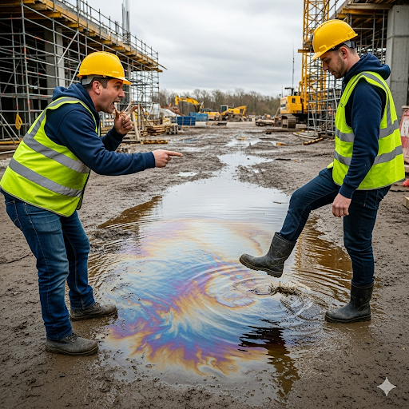
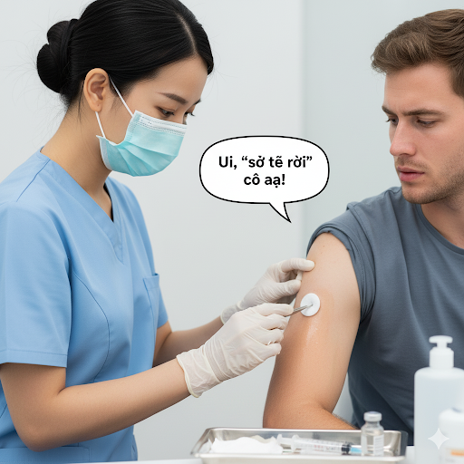
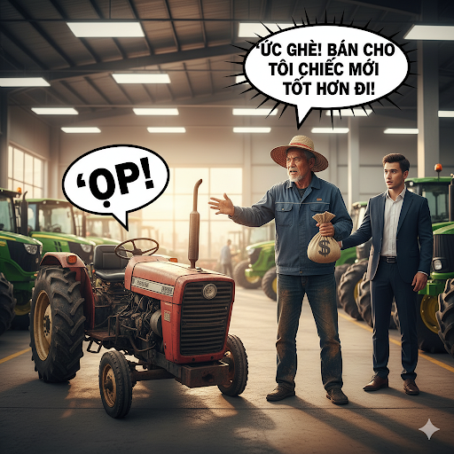

# Epidemic in Zimbabwe

In August of 2008, a deadly cholera epidemic manifested in Zimbabwe. A severe health hazard caused the outbreak. There was an extreme lack of clean drinking water in the overcrowded urban cities. Garbage and chemicals got into the public water supplies and contaminated them. Since people did not have access to other sources, they had to drink the dirty water.

The outbreak spread rapidly and infected almost 16,000 people. The illness caused extreme pain in people’s intestines. It also caused a deficiency of important fluids in sick people’s bodies. Without the proper fluids and minerals, metabolic processes stopped working correctly. People were unable to digest food properly or replenish their lost nutrients. If they had not received viable treatment, they would have been likely to die. It was imperative for help to come soon.

However, the government of Zimbabwe was unable to provide help to its people. The government didn’t have a plan to stop the spread of cholera. In addition, the country was too poor to get clean water or medication for the sick. The people seemed to be doomed.

Luckily, many other countries recognized the paramount need to contain the outbreak. Dozens of voluntary practitioners from Britain, France, the United States, and other countries went to Zimbabwe to treat the disease. Through the provision of sterile drinking water and medication, people finally got the treatment they badly needed. The compassionate doctors were able to save the lives of thousands. By January of 2009, the epidemic was almost completely contained.

Today, the Zimbabwean government is working with other countries to prevent future epidemics. They are cleaning up the water supply and learning how to avoid health hazards. The system used to filter water is being upgraded. The government now administers the water supply plants and makes sure that they adhere to strict safety guidelines. Hopefully, future instances of cholera will be treated before they start deadly epidemics.

## Sentences of story

Epidemic in Zimbabwe

In August of 2008, a deadly cholera epidemic manifested in Zimbabwe.

A severe health hazard caused the outbreak.

There was an extreme lack of clean drinking water in the overcrowded urban cities.

Garbage and chemicals got into the public water supplies and contaminated them.

Since people did not have access to other sources, they had to drink the dirty water.

The outbreak spread rapidly and infected almost 16,000 people.

The illness caused extreme pain in people’s intestines.

It also caused a deficiency of important fluids in sick people’s bodies.

Without the proper fluids and minerals, metabolic processes stopped working correctly.

People were unable to digest food properly or replenish their lost nutrients.

If they had not received viable treatment, they would have been likely to die.

It was imperative for help to come soon.

However, the government of Zimbabwe was unable to provide help to its people.

The government didn’t have a plan to stop the spread of cholera.

In addition, the country was too poor to get clean water or medication for the sick.

The people seemed to be doomed.

Luckily, many other countries recognized the paramount need to contain the outbreak.

Dozens of voluntary practitioners from Britain, France, the United States, and other countries went to Zimbabwe to treat the disease.

Through the provision of sterile drinking water and medication, people finally got the treatment they badly needed.

The compassionate doctors were able to save the lives of thousands.

By January of 2009, the epidemic was almost completely contained.

Today, the Zimbabwean government is working with other countries to prevent future epidemics.

They are cleaning up the water supply and learning how to avoid health hazards.

The system used to filter water is being upgraded.

The government now administers the water supply plants and makes sure that they adhere to strict safety guidelines.

Hopefully, future instances of cholera will be treated before they start deadly epidemics.

## List of word

adhere, administer, compassionate, contaminate, deficiency, epidemic, hazard, imperative, intestines, manifest, metabolic, overcrowded, paramount, practitioner, provision, replenish, sterile, upgrade, viable, voluntary

## 1. adhere

### IPA: /ədˈhɪər/
### Class: v
### Câu truyện ẩn dụ:

Anh thợ mộc đang làm việc thì vô tình làm đổ lọ keo siêu dính ra bàn. Ông không để ý, liền đặt một chiếc đĩa lên trên. Lúc sau, ông định nhấc chiếc đĩa ra thì nó không hề nhúc nhích. Ông ngạc nhiên thốt lên: "`Ấy, đĩa`!". Chiếc đĩa đã hoàn toàn **dính chặt vào** mặt bàn gỗ.

### Định nghĩa : 
Tuân thủ, dính chặt vào.

### English definition: 
To stick firmly to something.

### Sentence of stroy:
The government now administers the water supply plants and makes sure that they **adhere** to strict safety guidelines.

## 2. administer

### IPA: /ədˈmɪn.ɪ.stər/
### Class: v
### Câu truyện ẩn dụ:

Khi vị quan mới được bổ nhiệm đến một vùng đất nổi tiếng là khó trị, các bô lão liền trình lên ông một chồng luật lệ cũ rích. Nhìn những quy định vô lý, ông cảm thấy chúng chẳng khác nào một quả mìn đang chờ nổ. Ông liền chỉ tay vào chúng và nói: "`Át mìn ni tờ` lệnh này đi!". Câu nói đó thể hiện quyết tâm của ông sẽ **quản lý** và **cai trị** vùng đất này theo một cách hoàn toàn mới.

### Định nghĩa : 
Quản lý, trông nom, cai quản.

### English definition: 
To manage or control the operation of something, such as a business, organization, or country.

### Sentence of stroy:
The government now **administers** the water supply plants and makes sure that they adhere to strict safety guidelines.

## 3. compassionate

### IPA: /kəmˈpæʃ.ən.ət/
### Class: adj
### Câu truyện ẩn dụ:

Một vị công nương đi ngang qua khu chợ nghèo vào một ngày đông giá rét. Nàng nhìn thấy một ông lão ăn xin đang ngồi co ro trong góc, tay run run `cầm bát sành nát` duy nhất của mình. Hình ảnh đó đã khơi dậy trong lòng công nương một sự **đồng cảm** và **lòng trắc ẩn** sâu sắc. Nàng liền sai người hầu mang cho ông một chiếc áo ấm và một bát cháo nóng.

### Định nghĩa : 
Đầy lòng trắc ẩn, thương cảm.

### English definition: 
Feeling or showing sympathy and concern for others.

### Sentence of stroy:
The **compassionate** doctors were able to save the lives of thousands.

## 4. contaminate

### IPA: /kənˈtæm.ɪ.neɪt/
### Class: v
### Câu truyện ẩn dụ:

Người mẹ cẩn thận pha một ly sữa tươi cho con trai, ly sữa trắng ngần, tinh khiết. Đứa con đang nghịch ngợm gần đó, bỗng vô tình làm rơi một thứ gì đó vào ly. Người mẹ nhìn kỹ và vội la lên: "`Con, tăm nát`! Đừng uống!". Thì ra đó là một que tăm cũ đã gãy nát và bẩn thỉu. Cái tăm đó đã **làm ô nhiễm** và **làm bẩn** cả ly sữa.

### Định nghĩa : 
Làm ô uế, làm bẩn.

### English definition: 
To make something less pure or make it poisonous.

### Sentence of stroy:
Garbage and chemicals got into the public water supplies and **contaminated** them.

## 5. deficiency

### IPA: /dɪˈfɪʃ.ən.si/
### Class: n
### Câu truyện ẩn dụ:

Trong một võ đường nọ, có một võ sinh trẻ rất tài năng nhưng luôn để tâm đến người bạn đồng môn giỏi nhất. Thay vì tập trung vào bài quyền của mình, cậu ta thường liếc mắt nhìn bạn, trong lòng đầy bực tức.

Sư phụ của cậu quan sát điều này, liền gọi cậu lại và nói: "Con đã `để phí sân si` quá nhiều thời gian và tâm sức."

Ông tiếp lời: "Chính điều đó đã tạo ra **sự thiếu hụt** nghiêm trọng trong kỹ năng và sự tiến bộ của con so với những gì con có thể đạt được."

### Định nghĩa : 
Sự thiếu hụt, không đầy đủ.

### English definition: 
A state of not having, or not having enough, of something that is needed.

### Sentence of stroy:
It also caused a **deficiency** of important fluids in sick people’s bodies.

## 6. epidemic

### IPA: /ˌep.ɪˈdem.ɪk/
### Class: n
### Câu truyện ẩn dụ:

Tại một ngôi làng cổ xưa, một căn bệnh lạ bắt đầu lan rộng với tốc độ chóng mặt. Người bệnh ho không ngớt và sốt rất cao.

Khi phát hiện thêm một người nữa có triệu chứng, vị trưởng làng đã vô cùng hoảng hốt, ông chỉ tay và ra lệnh cho lính canh: "`Ê! Bị đem xích` người đó lại ngay, không được để anh ta đi lung tung!".

Mệnh lệnh tàn nhẫn đó được đưa ra chỉ vì một lý do duy nhất: để ngăn chặn **bệnh dịch** lây lan ra cả làng.

### Định nghĩa : 
Bệnh dịch.

### English definition: 
The appearance of a particular disease in a large number of people at the same time.

### Sentence of stroy:
In August of 2008, a deadly cholera **epidemic** manifested in Zimbabwe.

## 7. hazard

### IPA: /ˈhæz.əd/
### Class: n
### Câu truyện ẩn dụ:

Tại một công trường xây dựng, người công nhân nhìn thấy bạn mình tên Hà đang đi về phía một vũng dầu loang trên sàn. Anh vội hét lớn: "`Hà, dợt`! Đừng đi qua đó!". Lời cảnh báo khẩn thiết đó được đưa ra vì có một **mối nguy hiểm** rõ ràng có thể khiến bạn anh bị trượt ngã.

### Định nghĩa : 
Mối nguy hiểm, rủi ro.

### English definition: 
Something that is dangerous and likely to cause damage.

### Sentence of stroy:
A severe health **hazard** caused the outbreak.

## 8. imperative

### IPA: /ɪmˈper.ə.tɪv/
### Class: adj
### Câu truyện ẩn dụ:

Đứa con trai nhỏ đột nhiên sốt cao, khóc không ngớt. Người mẹ hốt hoảng lay vai chồng, giọng đầy khẩn khoản: "`Im bé ra tiệm` ngay đi anh! Phải mua thuốc hạ sốt gấp!".

Trong hoàn cảnh đó, việc đi mua thuốc không chỉ là một lời đề nghị, mà là một mệnh lệnh **cấp bách**, một việc làm **bắt buộc**.

### Định nghĩa : 
Cấp bách, khẩn thiết.

### English definition: 
Extremely important or urgent.

### Sentence of stroy:
It was **imperative** for help to come soon.

## 9. intestines

### IPA: /ɪnˈtes.tɪnz/
### Class: n
### Câu truyện ẩn dụ:

Vị bệnh nhân ôm bụng, nhăn nhó miêu tả triệu chứng cho bác sĩ: "Thưa bác sĩ, nó đau quặn lên cứ như có ai đang đánh tôi từ bên trong vậy! Đau đến mức có thể `in tét tin` lên báo được luôn ấy!".

Nghe xong, vị bác sĩ gật gù, hiểu ngay rằng vấn đề nằm ở bộ **ruột** của bệnh nhân.

### Định nghĩa : 
Ruột.

### English definition: 
A long tube through which food travels from the stomach and out of the body while it is being digested.

### Sentence of stroy:
The illness caused extreme pain in people’s **intestines**.

## 10. manifest

### IPA: /ˈmæn.ɪ.fest/
### Class: v
### Câu truyện ẩn dụ:

Nhà phê bình nghệ thuật nổi tiếng là khó tính đến xem bức tranh mới của một họa sĩ trẻ. Ông im lặng hồi lâu, soi xét từng đường nét khiến người họa sĩ vô cùng căng thẳng.

Bất ngờ, ông chỉ tay vào tác phẩm và thốt lên: "`Me ni phết`! Tác giả đã thành công rồi!".

Câu nói đó đã **biểu lộ rõ ràng** sự thán phục tột độ của ông, một cảm xúc mà ông hiếm khi thể hiện.

### Định nghĩa : 
Biểu hiện, biểu lộ rõ ràng.

### English definition: 
To show something clearly, through signs or actions.

### Sentence of stroy:
In August of 2008, a deadly cholera epidemic **manifested** in Zimbabwe.

## 11. metabolic

### IPA: /ˌmet.əˈbɒl.ɪk/
### Class: adj
### Câu truyện ẩn dụ:

Người con trai luôn thắc mắc tại sao mẹ mình có thể ăn rất nhiều bò lúc lắc mà không hề tăng cân. Mỗi lần thấy mẹ ăn, cậu lại nghĩ: "`Mẹ tớ, bò lúc lắc`...".

Cậu bé sau này mới hiểu, đó là vì mẹ cậu có một hệ **trao đổi chất** (thuộc về sự trao đổi chất) cực kỳ tốt, giúp cơ thể chuyển hóa thức ăn rất hiệu quả.

### Định nghĩa : 
(thuộc) trao đổi chất.

### English definition: 
Relating to metabolism (the chemical processes within the body by which food is changed into energy).

### Sentence of stroy:
Without the proper fluids and minerals, **metabolic** processes stopped working correctly.

## 12. overcrowded

### IPA: /ˌəʊ.vəˈkraʊ.dɪd/
### Class: adj
### Câu truyện ẩn dụ:

Một người khách du lịch lần đầu tiên đi xe buýt vào giờ cao điểm ở thành phố. Khi cánh cửa vừa mở ra, anh ta choáng ngợp bởi cảnh tượng bên trong và buột miệng: "`Ôi, vợ! Rao bán đứa nào đi` cho đỡ chật!".

Dĩ nhiên, đó chỉ là một lời nói đùa, nhưng nó phản ánh chính xác tình trạng **quá đông đúc**, chen chúc đến nghẹt thở trên chiếc xe buýt đó.

### Định nghĩa : 
Quá đông đúc, chật chội.

### English definition: 
Containing too many people or things.

### Sentence of stroy:
There was an extreme lack of clean drinking water in the **overcrowded** urban cities.

## 13. paramount

### IPA: /ˈpær.ə.maʊnt/
### Class: adj
### Câu truyện ẩn dụ:

Vị tướng quân sắp đến nhà để duyệt một bản kế hoạch tác chiến quan trọng. Cậu con trai nhỏ đang chơi gần đó bỗng thấy một ngọn lửa nhỏ bùng lên từ chiếc đèn dầu, bén vào chồng tài liệu trên bàn.

Hoảng hốt, cậu bé chạy ra sân và hét lớn gọi cha mình: "`Ba ra mau!`".

Nghe tiếng con, người cha hiểu ngay có chuyện chẳng lành. Trong tình huống ngàn cân treo sợi tóc đó, việc dập lửa để bảo vệ tài liệu và ngôi nhà là nhiệm vụ **tối quan trọng**, là ưu tiên **hàng đầu**.

### Định nghĩa : 
Tối cao, tột bậc, rất quan trọng.

### English definition: 
More important than anything else.

### Sentence of stroy:
Luckily, many other countries recognized the **paramount** need to contain the outbreak.

## 14. practitioner

### IPA: /prækˈtɪʃ.ən.ər/
### Class: n
### Câu truyện ẩn dụ:

Một võ sư trẻ tuổi mới mở võ đường, nhưng lại thường xuyên bị các võ đường khác đến gây sự, thách đấu. Anh ta cảm thấy rất bực bội, liền than thở với sư phụ của mình: "Sư phụ ơi, `bọn rắc-ti-sừn-ờ` (bọn rắc rối-sân si-ờ) cứ đến gây sự với con hoài!".

Người sư phụ nghe vậy mỉm cười và nói: "Con đừng bận tâm. Đó là thử thách mà bất kỳ **người hành nghề** nào, dù là y hay võ, cũng phải đối mặt để chứng tỏ bản lĩnh của mình."

### Định nghĩa : 
Người hành nghề (đặc biệt là y, luật).

### English definition: 
Someone involved in a skilled job or activity, especially medicine or law.

### Sentence of stroy:
Dozens of voluntary **practitioners** from Britain, France, the United States, and other countries went to Zimbabwe to treat the disease.

## 15. provision

### IPA: /prəˈvɪʒ.ən/
### Class: n
### Câu truyện ẩn dụ:

Trước mùa đông khắc nghiệt, vị trưởng làng làm việc không quản ngày đêm, hối thúc mọi người tích trữ lương thực và củi khô. Thấy ông vất vả đến quên ăn quên ngủ, một người dân cảm thán: "Trông ông ấy cứ như `rồ vì dân` vậy!".

Mọi người đều hiểu, chính nhờ **sự cung cấp** và **dự trữ** mà ông đang cố gắng tạo ra, cả làng mới có thể an toàn vượt qua mùa đông giá rét.

### Định nghĩa : 
Sự cung cấp, sự dự phòng.

### English definition: 
The act of providing something for someone.

### Sentence of stroy:
Through the **provision** of sterile drinking water and medication, people finally got the treatment they badly needed.

## 16. replenish

### IPA: /rɪˈplen.ɪʃ/
### Class: v
### Câu truyện ẩn dụ:

Trong một chuyến dã ngoại, người đội trưởng kiểm tra bình nước lớn của cả đội và thấy nó đã gần cạn. Anh quay sang cậu bé Len, thành viên nhỏ tuổi nhất ("nít") trong đoàn, người có nhiệm vụ lấy nước.

Anh cau mày hỏi: "`Rì, Len? Ít` thế này sao đủ uống?".

Ngay sau đó, anh ra lệnh cho cậu phải quay lại con suối để **làm đầy lại** bình nước ngay lập tức.

### Định nghĩa : 
Làm đầy lại, bổ sung.

### English definition: 
To fill something up again.

### Sentence of stroy:
People were unable to digest food properly or **replenish** their lost nutrients.

## 17. sterile

### IPA: /ˈster.aɪl/
### Class: adj
### Câu truyện ẩn dụ:

Trước khi tiêm thuốc cho bệnh nhân, cô y tá cẩn thận lấy một miếng bông tẩm cồn lau kỹ vùng da. Bệnh nhân cảm nhận sự lạnh buốt và tê tê, liền nói: "Ui, `sờ tê rồi` cô ạ!".

Cô y tá mỉm cười đáp: "Vâng ạ, phải làm như vậy để đảm bảo vùng da này hoàn toàn **vô trùng** thì mới an toàn được."

### Định nghĩa : 
Tiệt trùng, vô trùng.

### English definition: 
Completely clean and free from dirt and bacteria.

### Sentence of stroy:
Through the provision of **sterile** drinking water and medication, people finally got the treatment they badly needed.

## 18. upgrade

### IPA: /ʌpˈɡreɪd/
### Class: v
### Câu truyện ẩn dụ:

Chiếc máy cày cũ của bác nông dân cứ chạy được một lúc lại phát ra tiếng kêu "`ọp!`" rồi tắt máy. Quá bực mình, bác liền quyết định mang hết số tiền tiết kiệm ra tiệm và nói với người chủ: "`Ức ghê!` Bán cho tôi chiếc máy mới tốt hơn đi!".

Hành động của bác nông dân chính là để **nâng cấp** công cụ lao động của mình.

### Định nghĩa : 
Nâng cấp.

### English definition: 
To improve the quality or usefulness of something, or change it for a better one.

### Sentence of stroy:
The system used to filter water is being **upgraded**.

## 19. viable

### IPA: /ˈvaɪ.ə.bəl/
### Class: adj
### Câu truyện ẩn dụ:

Một nhóm kỹ sư trình lên vị giám đốc một bản thiết kế cây cầu dây văng vô cùng hoành tráng nhưng tốn kém và khó xây dựng. Sau khi xem xét, vị giám đốc lắc đầu và nói: "Kế hoạch này `phải ở bộ` hồ sơ thôi, chứ không thực hiện được."

Ông tiếp lời: "Chúng ta cần một phương án khác **khả thi** và có thể thực hiện được trong điều kiện hiện tại."

### Định nghĩa : 
Khả thi, có thể làm được.

### English definition: 
Able to work as intended or able to succeed.

### Sentence of stroy:
If they had not received **viable** treatment, they would have been likely to die.

## 20. voluntary

### IPA: /ˈvɒl.ən.tər.i/
### Class: adj
### Câu truyện ẩn dụ:

Khi ngôi làng bị lũ lụt tàn phá, vị trưởng làng đứng lên kêu gọi mọi người chung tay dọn dẹp. Một chàng trai trẻ tên Luân, người nổi tiếng lười biếng, lại là người đầu tiên xắn tay áo bước ra.

Thấy vậy, mọi người ngạc nhiên, một cụ già liền hỏi: "Sao hôm nay `va lưng trơ` ra thế cháu?".

Chàng trai mỉm cười đáp: "Làng gặp nạn, cháu không thể ngồi yên ạ." Hành động của anh là hoàn toàn **tự nguyện**.

### Định nghĩa : 
Tự nguyện, tình nguyện.

### English definition: 
Done, made, or given willingly, without being forced or paid to do it.

### Sentence of stroy:
Dozens of **voluntary** practitioners from Britain, France, the United States, and other countries went to Zimbabwe to treat the disease.