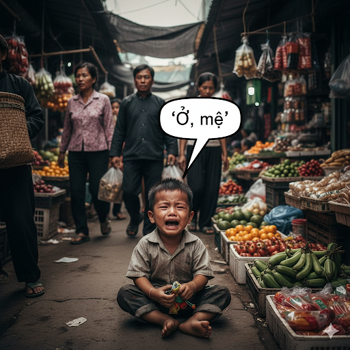
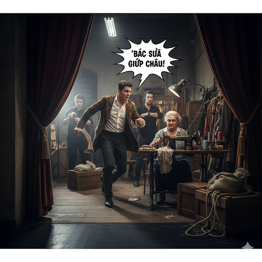
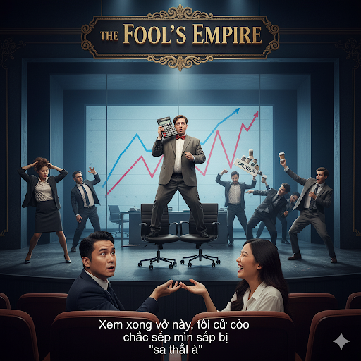
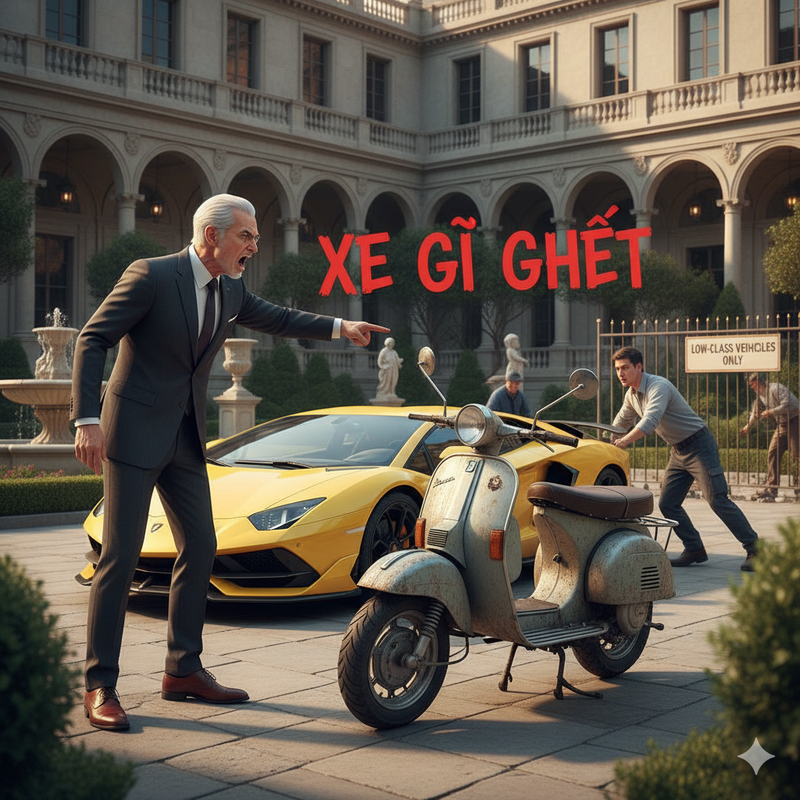

# The Brute and the Billionaire

Hundreds of people had come to see a popular satire, but during the performance a fire started in the theater. The audience and actors evacuated the building. Luckily, no one was hurt, and the fire was soon put out. Immediately, the audience assembled into an angry mob and demanded to know what had happened.

It was soon revealed that the fire had started backstage, and only two people were in the area at the time. One was the husband of the play’s star actress, the billionaire Henry Rich. The other was the theater’s janitor, Bill, a large and strong man who looked like a brute.

The crowd segregated the two men and demanded to know who the culprit was. Most of the crowd thought that Bill was to blame. They felt that he had started the fire without ever subjecting him to any scrutiny. Bill resented this but said nothing.

Luckily, the billionaire’s wife testified in his defense. “Your decision is premature,” she told the crowd. “ I fell down amid the tumult while everyone fled the fire. Bill rescued me and carried me out of the building. I think you underestimate his character. Besides, in order to be close enough to save me, he couldn’t have been near the place where the fire began.”

The crowd then turned their eyes to the billionaire. “ He did it!” they shouted. “Make him pay!”

“Wait,” the billionaire said over the uproar. “ I admit that I started the fire, but it was an accident. I was going backstage to see my wife and was clumsy. I collided with a lamp, and it fell to the floor. The floor was flammable. A fire started, and I fled.”

The mob was surprised. The man they blamed was innocent, and the billionaire was guilty. To pay for his error, the billionaire not only repaired the theater but had it remade to be better than before.

## Sentences of story

The Brute and the Billionaire

Hundreds of people had come to see a popular satire, but during the performance a fire started in the theater.

The audience and actors evacuated the building.

Luckily, no one was hurt, and the fire was soon put out.

Immediately, the audience assembled into an angry mob and demanded to know what had happened.

It was soon revealed that the fire had started backstage, and only two people were in the area at the time.

One was the husband of the play’s star actress, the billionaire Henry Rich.

The other was the theater’s janitor, Bill, a large and strong man who looked like a brute.

The crowd segregated the two men and demanded to know who the culprit was.

Most of the crowd thought that Bill was to blame.

They felt that he had started the fire without ever subjecting him to any scrutiny.

Bill resented this but said nothing.

Luckily, the billionaire’s wife testified in his defense.

“Your decision is premature,” she told the crowd.

“ I fell down amid the tumult while everyone fled the fire.

Bill rescued me and carried me out of the building.

I think you underestimate his character.

Besides, in order to be close enough to save me, he couldn’t have been near the place where the fire began.”

The crowd then turned their eyes to the billionaire.

“ He did it!” they shouted.

“Make him pay!”

“Wait,” the billionaire said over the uproar.

“ I admit that I started the fire, but it was an accident.

I was going backstage to see my wife and was clumsy.

I collided with a lamp, and it fell to the floor.

The floor was flammable.

A fire started, and I fled.”

The mob was surprised.

The man they blamed was innocent, and the billionaire was guilty.

To pay for his error, the billionaire not only repaired the theater but had it remade to be better than before.

## List of word

amid, backstage, billionaire, brute, clumsy, collide, culprit, evacuate, flammable, mob, premature, resent, satire, scrutiny, segregate, subject, testify, tumult, underestimate, uproar

## 1. amid

### IPA: /əˈmɪd/
### Class: prep
### Câu truyện ẩn dụ:

Hai người bạn đang đi dạo trên con đường làng yên tĩnh thì bất ngờ phải dừng lại. Một người chỉ xuống và kêu lên: "`A, mít!`". Thì ra, một quả mít lớn vừa rụng, nằm chình ình **ở giữa** lối đi, **trong bối cảnh** cây cối xum xuê hai bên.

### Định nghĩa : 
Ở giữa, trong lúc.

### English definition: 
In the middle of or surrounded by.

### Sentence of stroy:
I fell down **amid** the tumult while everyone fled the fire.

## 2. backstage

### IPA: /ˌbækˈsteɪdʒ/
### Class: adv
### Câu truyện ẩn dụ:

Trong một vở xiếc, người nghệ sĩ đu dây vừa thực hiện một cú nhào lộn khó và tiếp đất không thành công. Anh vội vã chạy vào trong cánh gà, mặt nhăn nhó vì đau.

Một người đồng nghiệp chạy theo lo lắng hỏi: "Anh có sao không?".

Người nghệ sĩ chỉ vào lưng mình và nói: "Chắc bị va đập rồi, `bách sờ tấy` cả lên!". Nơi anh đang đứng để kiểm tra vết thương chính là khu vực **hậu trường**, **phía sau sân khấu**.

### Định nghĩa : 
Ở hậu trường, phía sau sân khấu.

### English definition: 
In the area behind the stage in a theatre, including the rooms where the actors get dressed.

### Sentence of stroy:
It was soon revealed that the fire had started **backstage**, and only two people were in the area at the time.

## 3. billionaire

### IPA: /ˌbɪl.jəˈneər/
### Class: n
### Câu truyện ẩn dụ:

Ông Ba, một người bán vé số nghèo, cuối ngày giữ lại cho mình một tờ vé số độc đắc duy nhất. Tối đó, khi đang dò kết quả trên TV, một người hàng xóm đi ngang qua hỏi vọng vào: "Sao rồi Ba, có trúng không?".

Ông Ba đứng bật dậy, tay run run chỉ vào dãy số trên màn hình và hét lớn trong sung sướng: "`Bị liền nè!`".

Kể từ giây phút đó, cuộc đời ông đã thay đổi hoàn toàn, ông chính thức trở thành một **tỷ phú**.

### Định nghĩa : 
Tỷ phú.

### English definition: 
A person who has money, property, etc. that is worth at least 1,000,000,000 dollars, pounds, euros, etc.

### Sentence of stroy:
One was the husband of the play’s star actress, the **billionaire** Henry Rich.

## 4. brute

### IPA: /bruːt/
### Class: n
### Câu truyện ẩn dụ:

Người ta kể rằng, sâu trong khu rừng Cấm có một con quái vật khổng lồ, không có trí khôn mà chỉ hành động theo bản năng hoang dã.

Khi nó tóm được bất kỳ sinh vật nào, sức mạnh khủng khiếp trong bàn tay nó siết chặt đến nỗi nạn nhân có cảm giác như toàn bộ gân cốt của mình `bị rút` ra.

Chính vì hành động tàn bạo đó, dân làng gọi nó là **kẻ vũ phu**, một con **quái vật** cục súc.

### Định nghĩa : 
Kẻ vũ phu, người thô lỗ cục cằn.

### English definition: 
A rough and sometimes violent man.

### Sentence of stroy:
The other was the theater’s janitor, Bill, a large and strong man who looked like a **brute**.

## 5. clumsy

### IPA: /ˈklʌm.zi/
### Class: adj
### Câu truyện ẩn dụ:

Trong buổi lễ diễu hành, anh lính mới được giao cầm một lá cờ lớn. Do quá hồi hộp, anh cầm không vững, khiến lá cờ cứ xiêu vẹo, suýt thì làm rơi.

Vị chỉ huy nghiêm khắc tiến lại, gắt lên: "`Cờ làm gì` mà run thế kia?".

Ai cũng thấy rõ sự **vụng về**, **lóng ngóng** của anh lính trẻ.

### Định nghĩa : 
Vụng về, lóng ngóng.

### English definition: 
Awkward in movement or handling things.

### Sentence of stroy:
I was going backstage to see my wife and was **clumsy**.

## 6. collide

### IPA: /kəˈlaɪd/
### Class: v
### Câu truyện ẩn dụ:

Trên con đường làng nhỏ hẹp, hai người nông dân lái xe công nông đi ngược chiều nhau. Gặp nhau ở khúc cua, không ai chịu nhường ai. Một người bực tức, rồ ga và lẩm bẩm: "`Cứ lái` thẳng tới xem ai sợ!".

"RẦM!" - một tiếng động lớn vang lên. Hai chiếc xe đã **va chạm** mạnh vào nhau, chỉ vì sự cố chấp của cả hai.

### Định nghĩa : 
Va chạm, đụng nhau.

### English definition: 
(especially of moving objects) to hit something violently.

### Sentence of stroy:
I **collided** with a lamp, and it fell to the floor.

## 7. culprit

### IPA: /ˈkʌl.prɪt/
### Class: n
### Câu truyện ẩn dụ:

Một vụ trộm táo táo tợn vừa xảy ra trong vườn nhà phú ông, khiến ông vô cùng tức giận. Ông triệu tập tất cả gia nhân lại và tuyên bố: "Ta sẽ treo thưởng lớn cho ai tìm ra kẻ đã `cào rách` hàng rào để vào đây ăn trộm!".

Lời nói của phú ông đã chỉ điểm rất rõ ràng, ai có hành động "cào rách" hàng rào, người đó chính là **thủ phạm**.

### Định nghĩa : 
Thủ phạm, kẻ có tội.

### English definition: 
A person who is responsible for a crime or other misdeed.

### Sentence of stroy:
The crowd segregated the two men and demanded to know who the **culprit** was.

## 8. evacuate

### IPA: /ɪˈvæk.ju.eɪt/
### Class: v
### Câu truyện ẩn dụ:

Cơn bão lịch sử đang đổ bộ vào một làng chài ven biển. Nước biển dâng lên nhanh đến chóng mặt, sắp tràn qua cả con đê.

Giữa khung cảnh hỗn loạn, vị trưởng làng hét lên với tất cả sức lực của mình: "`Y, vác cua hết` đi bà con ơi!".

Lời hiệu triệu khẩn cấp đó là mệnh lệnh để tất cả mọi người phải lập tức **sơ tán**, **di tản** đến nơi an toàn trước khi quá muộn.

### Định nghĩa : 
Sơ tán, di tản.

### English definition: 
To move people from a dangerous place to somewhere safer.

### Sentence of stroy:
The audience and actors **evacuated** the building.

## 9. flammable

### IPA: /ˈflæm.ə.bəl/
### Class: adj
### Câu truyện ẩn dụ:

Trong buổi cắm trại, người đội trưởng thấy một cậu bé mặc chiếc áo dính đầy dầu mỡ đang định đến gần đống lửa trại. Ông vội kéo cậu lại và nghiêm giọng cảnh báo: "Không được! Áo cháu `phải lem mỡ` thế kia, lại gần lửa là nguy hiểm lắm!".

Ai cũng biết, quần áo dính dầu mỡ thì rất **dễ cháy**.

### Định nghĩa : 
Dễ cháy, dễ bắt lửa.

### English definition: 
Able to be burned easily.

### Sentence of stroy:
The floor was **flammable**.

## 10. mob

### IPA: /mɒb/
### Class: n
### Câu truyện ẩn dụ:

Vị địa chủ vừa tuyên bố một khoản thuế vô lý, khiến tất cả dân làng nổi giận. Họ nhanh chóng tụ tập lại, vây quanh chiếc xe hơi bóng loáng của ông ta. Trong cơn phẫn nộ, họ xô đẩy, la hét và đập vào chiếc xe.

Một lúc sau, người ta thấy cánh cửa xe đã bị `móp` méo xệch. Cảnh tượng đó chính là sức mạnh đáng sợ của một **đám đông giận dữ**.

### Định nghĩa : 
Đám đông hỗn loạn, giận dữ.

### English definition: 
A large, angry, and often violent crowd of people.

### Sentence of stroy:
Immediately, the audience assembled into an angry **mob** and demanded to know what had happened.

## 11. premature

### IPA: /ˈprem.ə.tʃʊər/
### Class: adj
### Câu truyện ẩn dụ:

Một người thợ làm vườn đang ươm một giống hoa hồng quý hiếm. Ông chăm sóc nó rất kỹ, mong chờ đến ngày hoa nở. Tuy nhiên, cậu con trai nghịch ngợm của ông đã táy máy, bóc từng lớp cánh hoa non ra để xem bên trong có gì.

Khi người cha phát hiện, ông đau lòng thốt lên: "Sao con lại `bẻ ria méo` thế này!".

Hành động đó đã khiến bông hoa bị nở **sớm**, nở **non** một cách ép buộc, làm hỏng hết vẻ đẹp của nó.

### Định nghĩa : 
Sớm, vội vàng, hấp tấp (trước thời hạn).

### English definition: 
Happening or done too soon, especially before the natural or suitable time.

### Sentence of stroy:
“Your decision is **premature**,” she told the crowd.

## 12. resent

### IPA: /rɪˈzent/
### Class: v
### Câu truyện ẩn dụ:

Trong cuộc thi chạy của làng, Tí và Tèo là hai đối thủ ngang tài ngang sức. Về gần đến đích, Tèo bất ngờ dùng tiểu xảo, giẫm lên dây giày của Tí khiến cậu ngã sõng soài. Tèo về nhất trong sự ngỡ ngàng của mọi người.

Sau cuộc thi, Tí nhìn Tèo với ánh mắt tóe lửa, trong đầu luôn nghĩ: "`Rì xem`! Tôi sẽ không bao giờ tha thứ cho anh!".

Ánh mắt và suy nghĩ đó chứa đầy sự **phẫn uất**, **oán giận** vì hành động chơi xấu của Tèo.

### Định nghĩa : 
Bực bội, phẫn uất.

### English definition: 
To feel angry because you have been forced to accept someone or something that you do not like.

### Sentence of stroy:
Bill **resented** this but said nothing.

## 13. satire

### IPA: /ˈsæt.aɪər/
### Class: n
### Câu truyện ẩn dụ:

Tại buổi chầu của nhà vua, một vị quan đại thần nổi tiếng chỉ biết nghe ngóng chuyện tầm phào mà không làm được việc gì.

Anh hề của triều đình đã bắt chước y hệt dáng điệu của ông ta, đi khắp sân chầu, tay thì luôn đưa lên tai như đang hóng chuyện. Cuối cùng, anh hề tiến đến gần vị quan và hỏi một câu tỉnh bơ: "`Sờ tai à?`".

Cả triều đình bật cười rần rần vì hiểu ngầm ý của anh hề. Hành động và câu hỏi đó chính là một lời **châm biếm** sâu cay, dùng sự hài hước để chỉ trích thói xấu của vị quan.

### Định nghĩa : 
Lời châm biếm, sự trào phúng.

### English definition: 
A way of criticizing people or ideas in a humorous way, especially in order to make a political point.

### Sentence of stroy:
Hundreds of people had come to see a popular **satire**, but during the performance a fire started in the theater.

## 14. scrutiny

### IPA: /ˈskruː.tɪ.ni/
### Class: n
### Câu truyện ẩn dụ:

Tại cửa khẩu an ninh, một nhân viên hải quan chặn một vị khách có vẻ ngoài khả nghi. Trong hành lý của người này có một bức tượng rùa ngọc bích cực kỳ nhỏ và tinh xảo.

Nghi ngờ có điều bất thường, viên hải quan đeo găng tay trắng vào, cẩn thận cầm bức tượng lên. Ông nheo mắt, dùng đầu ngón tay `sờ con ru tí ni` này, xoay nó dưới ánh đèn, gõ nhẹ vào mai nó.

Tất cả hành động của ông đều là một **sự xem xét kỹ lưỡng**, một **sự soi xét cẩn thận** để đảm bảo không có gì phi pháp được giấu bên trong.

### Định nghĩa : 
Sự xem xét kỹ lưỡng, sự giám sát chặt chẽ.

### English definition: 
The careful and detailed examination of something in order to get information about it.

### Sentence of stroy:
They felt that he had started the fire without ever subjecting him to any **scrutiny**.

## 15. segregate

### IPA: /ˈseɡ.rɪ.ɡeɪt/
### Class: v
### Câu truyện ẩn dụ:

Một ông chủ nhà giàu có và cực kỳ khó tính coi bộ sưu tập siêu xe của mình như báu vật.

Một ngày nọ, ông phát hiện người làm vườn đã đỗ chiếc xe máy cũ kỹ, dính đầy bùn đất ngay cạnh chiếc Lamborghini bóng loáng của mình. Ông đùng đùng nổi giận, chỉ tay vào chiếc xe máy và quát lớn: "`Xe gì ghét` thế này! Mang nó ra khỏi đây ngay!".

Ngay sau đó, ông yêu cầu phải xây một khu vực riêng ở góc sân chỉ để đậu những chiếc xe "không đẳng cấp". Hành động này của ông chính là để **phân biệt** và **tách riêng** chúng ra.

### Định nghĩa : 
Tách riêng, cách ly.

### English definition: 
To keep one group of people apart from another and treat them differently.

### Sentence of stroy:
The crowd **segregated** the two men and demanded to know who the culprit was.

## 16. subject

### IPA: /səbˈdʒekt/
### Class: v
### Câu truyện ẩn dụ:

Trong một vương quốc cổ đại, có một tên bạo chúa tàn ác. Khi bắt được một hiệp sĩ dũng cảm của phe địch, thay vì xử tử ngay, hắn muốn bẻ gãy ý chí của người hiệp sĩ.

Tên bạo chúa ra lệnh lột hết áo giáp và quần áo ấm của người hiệp sĩ, sau đó xích anh ta lên đỉnh núi cao nhất trong một trận bão tuyết.

Bị cái lạnh cắt da cắt thịt hành hạ, cơ thể người hiệp sĩ dần mất đi cảm giác. Anh run rẩy, trong đầu chỉ còn một suy nghĩ duy nhất: "Mình `sắp chết` rồi...".

Bằng hành động đó, tên bạo chúa đã **bắt anh phải chịu đựng** một thử thách khắc nghiệt và tàn khốc.

### Định nghĩa : 
Bắt phải chịu, khiến cho phải chịu đựng.

### English definition: 
To cause someone or something to experience something, especially something unpleasant.

### Sentence of stroy:
They felt that he had started the fire without ever **subjecting** him to any scrutiny.

## 17. testify

### IPA: /ˈtes.tɪ.faɪ/
### Class: v
### Câu truyện ẩn dụ:

Chiếc bình gốm cổ mà mẹ yêu quý nhất đã vỡ tan tành trên sàn nhà. Hai anh em Tí và Tèo cứ đùn đẩy trách nhiệm cho nhau, không ai chịu nhận lỗi.

Mất hết kiên nhẫn, người mẹ cầm cây roi mây lên, chỉ vào hai đứa và nói dứt khoát: "Bây giờ, một là tự giác, hai là `tét thì phải` khai thật!".

Nghe đến đó, cậu em Tí sợ quá, liền lắp bắp nhận tội và kể lại toàn bộ sự việc. Lời đe dọa của mẹ đã buộc Tí phải đứng ra **làm chứng**, **khai báo** sự thật.

### Định nghĩa : 
Làm chứng, khai.

### English definition: 
To speak seriously about something, especially in a law court, or to give or provide proof.

### Sentence of stroy:
Luckily, the billionaire’s wife **testified** in his defense.

## 18. tumult

### IPA: /ˈtʃuː.mʌlt/
### Class: n
### Câu truyện ẩn dụ:

Tại một lễ hội làng đông như nêm cối, bé Tú đang mải mê nhìn gian hàng tò he sặc sỡ, chỉ buông tay mẹ ra một thoáng. Khi cậu bé ngẩng lên, mẹ đã hòa vào dòng người đông đúc.

Hoảng hốt, cậu bé mếu máo chạy quanh, miệng không ngừng gọi lớn: "`Tú mất` mẹ rồi! `Tú mất` mẹ rồi!".

Tiếng la khóc của cậu bé đã ngay lập tức gây ra một **sự huyên náo**, **hỗn loạn** nhỏ giữa khu chợ. Mọi người xúm lại, tiếng hỏi han, tiếng bàn tán xôn xao, tạo nên một cảnh tượng vô cùng ồn ào.

### Định nghĩa : 
Sự huyên náo, sự hỗn loạn.

### English definition: 
A loud noise, especially that produced by that of a large crowd, or a state of confusion, change, or uncertainty.

### Sentence of stroy:
I fell down amid the **tumult** while everyone fled the fire.

## 19. underestimate

### IPA: /ˌʌn.dərˈes.tɪ.meɪt/
### Class: v
### Câu truyện ẩn dụ:

Tại một võ đường danh tiếng, có một võ sinh trẻ tên Kiên, võ công cao cường nhưng tính tình lại có phần kiêu ngạo.

Một hôm, vị sư phụ già, dáng người nhỏ bé, yêu cầu anh giữ một thế tấn trung bình tấn trong vòng một nén hương. Kiên nhếch mép cười, cho rằng đây là bài tập cho trẻ con. Nhìn thái độ của anh, mấy người bạn đồng môn rỉ tai nhau: "`Anh-đó-sợ-tí-mệt` nên mới coi thường bài tập này thôi."

Thế nhưng, chỉ sau mười phút, chân anh bắt đầu run rẩy. Mồ hôi túa ra như tắm. Cuối cùng, anh ngã quỵ xuống sàn trước khi nén hương kịp tàn.

Vị sư phụ ôn tồn nói: "Con đã thất bại, không phải vì con yếu, mà vì con đã **đánh giá thấp** sức bền cần có cho một thử thách trông có vẻ đơn giản."

### Định nghĩa : 
Đánh giá thấp.

### English definition: 
To fail to guess or understand the real cost, size, difficulty, etc. of something.

### Sentence of stroy:
I think you **underestimate** his character.

## 20. uproar

### IPA: /ˈʌp.rɔːr/
### Class: n
### Câu truyện ẩn dụ:

Trận chung kết bóng rổ đang ở những giây cuối cùng, tỉ số hoàn toàn cân bằng. Cầu thủ ngôi sao của đội nhà bật cao, thực hiện một cú "`úp rổ`" sấm sét, ghi điểm quyết định ngay khi tiếng còi kết thúc trận đấu vang lên.

Thế nhưng, vị trọng tài lại phất tay, không công nhận bàn thắng với lý do bóng chưa hoàn toàn rời tay khi hết giờ.

Quyết định đó ngay lập tức đã thổi bùng lên một **sự náo động ầm ĩ** trên khắp khán đài. Tiếng la ó, phản đối và giận dữ vang dội khắp nhà thi đấu.

### Định nghĩa : 
Sự náo động, tiếng la ó om sòm.

### English definition: 
A situation in which a lot of people complain about something angrily or make a lot of noise.

### Sentence of stroy:
“Wait,” the billionaire said over the **uproar**.