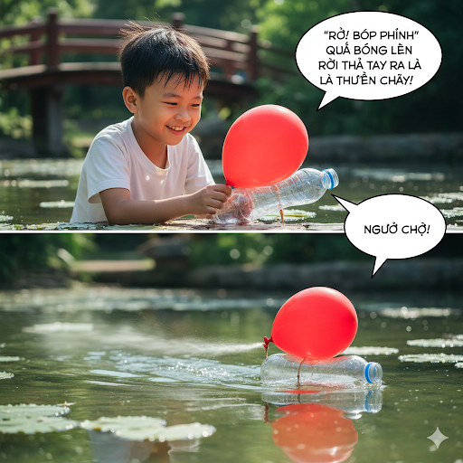

# The Tenacious Inventor

A young student of meteorology was having a difficult time with an experiment. He was attempting to duplicate lightning in clouds. He had made a device that could simulate lightning. It worked by releasing an electromagnetic pulse into the cloud. This pulse, in turn, stimulated the electrons in the cloud’s particles. Then the electrons produced lightning.

But his meteorological experiment had a major defect. He couldn’t get the device into the sky.

He had tied it to balloons, but they had burst. He had shot the device from a cannon, but the force of the cannon had damaged it.

“You should give up,” his friends told him. “You’ll never get that thing into the air.”

But his friends’ criticisms only spurred him to try again. The student was very innovative, and at last, he thought that he had an innovation that would work. He attached wings to the device, and on one dreary day, when clouds blocked the light of the sun, he started his experiment anew.

He placed the device on a rocket and launched it into the sky. The propulsion of the rocket carried the device high into the air. The rocket accelerated into the clouds and then released the device. It glided on its wings through the clouds, and when it penetrated the center of a large black cloud, it emitted the electromagnetic pulse. And just as he had predicted, lightning shot from the cloud!

He called his professors, and the next day they came to watch. He successfully duplicated the experiment. His teachers were extremely impressed and called the student and his invention ingenious.

The student was given many awards and became a famous inventor. He had not given up. He had remained tenacious and succeeded.

## Sentences of story

The Tenacious Inventor

A young student of meteorology was having a difficult time with an experiment.

He was attempting to duplicate lightning in clouds.

He had made a device that could simulate lightning.

It worked by releasing an electromagnetic pulse into the cloud.

This pulse, in turn, stimulated the electrons in the cloud’s particles.

Then the electrons produced lightning.

But his meteorological experiment had a major defect.

He couldn’t get the device into the sky.

He had tied it to balloons, but they had burst.

He had shot the device from a cannon, but the force of the cannon had damaged it.

“You should give up,” his friends told him.

“You’ll never get that thing into the air.”

But his friends’ criticisms only spurred him to try again.

The student was very innovative, and at last, he thought that he had an innovation that would work.

He attached wings to the device, and on one dreary day, when clouds blocked the light of the sun, he started his experiment anew.

He placed the device on a rocket and launched it into the sky.

The propulsion of the rocket carried the device high into the air.

The rocket accelerated into the clouds and then released the device.

It glided on its wings through the clouds, and when it penetrated the center of a large black cloud, it emitted the electromagnetic pulse.

And just as he had predicted, lightning shot from the cloud!

He called his professors, and the next day they came to watch.

He successfully duplicated the experiment.

His teachers were extremely impressed and called the student and his invention ingenious.

The student was given many awards and became a famous inventor.

He had not given up.

He had remained tenacious and succeeded.

## List of word

accelerate, anew, defect, dreary, duplicate, electromagnetic, electron, glide, ingenious, innovation, innovative, launch, meteorological, meteorology, penetrate, propulsion, simulate, spur, stimulate, tenacious

## 1. accelerate

### IPA: /əkˈsel.ə.reɪt/
### Class: v
### Câu truyện ẩn dụ:

Bất chấp lời mẹ dặn đi chậm, cậu bé Tí phấn khích với chiếc xe mới, liền nghĩ thầm: "`Anh sẽ lờ rầy`!". Cậu bỏ qua lời cảnh báo, đạp thật mạnh khiến chiếc xe ngay lập tức **tăng tốc** lao vút xuống con dốc.

### Định nghĩa : 
Tăng tốc, làm nhanh hơn.

### English definition: 
To happen or make something happen sooner or faster.

### Sentence of stroy:
The rocket **accelerated** into the clouds and then released the device.

## 2. anew

### IPA: /əˈnjuː/
### Class: adv
### Câu truyện ẩn dụ:

Sau khi bản thiết kế đầu tiên bị bác bỏ, người kiến trúc sư chợt nhìn thấy chiếc niêu đất trên bàn và reo lên: "`À, niêu`!". Nguồn cảm hứng bất chợt này đã giúp anh vứt bỏ ý tưởng cũ và bắt đầu công việc **lại từ đầu** với một tinh thần hoàn toàn mới mẻ.

### Định nghĩa : 
Lại một lần nữa, bắt đầu lại.

### English definition: 
Again or one more time, especially in a different way.

### Sentence of stroy:
...he started his experiment **anew**.

## 3. defect

### IPA: /ˈdiː.fekt/
### Class: n
### Câu truyện ẩn dụ:

Anh chàng đó nổi tiếng khắp làng vì tật hay `đi phét` (nói dối), khoác lác về những chiến công không có thật. Mọi người đều ngán ngẩm và cho rằng, đó chính là **khuyết điểm**, là **lỗi** lớn nhất trong tính cách của anh ta, khiến không ai có thể tin tưởng được.

### Định nghĩa : 
Khuyết điểm, thiếu sót, lỗi.

### English definition: 
A fault or a lack of something that means that a thing or a person is not perfect.

### Sentence of stroy:
But his meteorological experiment had a major **defect**.

## 4. dreary

### IPA: /ˈdrɪə.ri/
### Class: adj
### Câu truyện ẩn dụ:

Một cô gái ngồi bên cửa sổ nhìn ra ngoài trời mưa tầm tã, mây đen kịt. Cô thở dài, cảm thấy chán nản và nói với con mèo đang nằm bên cạnh: "`Ria ri` rỉ rả suốt ngày, chán quá đi!". Khung cảnh thật **ảm đạm**, **buồn tẻ**.

### Định nghĩa : 
Ảm đạm, buồn tẻ, u ám.

### English definition: 
Boring and making you feel unhappy.

### Sentence of stroy:
...on one **dreary** day, when clouds blocked the light of the sun, he started his experiment anew.

## 5. duplicate

### IPA: /ˈdʒuː.plɪ.keɪt/
### Class: v
### Câu truyện ẩn dụ:

Ảo thuật gia đặt một chiếc ly duy nhất lên bàn, phủ khăn lên rồi hô to câu thần chú: "`Đúp ly kết`!". Khi ông nhấc chiếc khăn ra, một chiếc ly y hệt nữa đã xuất hiện bên cạnh. Bằng cách đó, ông đã **sao chép** thành công vật thể một cách hoàn hảo.

### Định nghĩa : 
Sao chép, nhân đôi, tạo bản sao.

### English definition: 
To make an exact copy of something.

### Sentence of stroy:
He was attempting to **duplicate** lightning in clouds.

## 6. electromagnetic

### IPA: /iˌlek.trəʊ.mæɡˈnet.ɪk/
### Class: adj
### Câu truyện ẩn dụ:

Nhà khoa học điên giơ ra một chiếc nhãn mác tự chế và reo lên: "`Y lẹ trổ mác nè, tích!`". Ngay lập tức, chiếc nhãn mác tóe ra một tia lửa điện nhỏ, hút chặt lấy chiếc kẹp giấy trên bàn. Mọi người trầm trồ, đó là một thiết bị hoạt động dựa trên nguyên lý **điện từ**.

### Định nghĩa : 
(thuộc) Điện từ.

### English definition: 
Having both electrical and magnetic properties.

### Sentence of stroy:
It worked by releasing an **electromagnetic** pulse into the cloud.

## 7. electron

### IPA: /iˈlek.trɒn/
### Class: n
### Câu truyện ẩn dụ:

Thầy giáo vật lý giảng bài: "Xung quanh hạt nhân nguyên tử có một hạt `y lẹc, tròn` và nhỏ xíu, di chuyển với tốc độ cực nhanh". Thầy đang mô tả về **hạt điện tử** (electron), một thành phần cơ bản của vật chất.

### Định nghĩa : 
Điện tử, electron.

### English definition: 
A particle with a negative charge that is a part of an atom.

### Sentence of stroy:
This pulse, in turn, stimulated the **electrons** in the cloud’s particles.

## 8. glide

### IPA: /ɡlaɪd/
### Class: v
### Câu truyện ẩn dụ:

Trên đỉnh núi cao, chú chim đại bàng dang rộng đôi cánh, tự tin lao vào khoảng không. Chú không cần đập cánh nhiều, chỉ cần khéo léo lượn theo những luồng gió. Mọi người nhìn theo và trầm trồ: "Wow, `giỏi lái` ghê!". Chú chim đang **lướt đi** một cách nhẹ nhàng và điêu luyện trên bầu trời.

### Định nghĩa : 
Lướt đi, trượt đi nhẹ nhàng.

### English definition: 
To move easily without stopping and without effort or noise.

### Sentence of stroy:
It **glided** on its wings through the clouds...

## 9. ingenious

### IPA: /ɪnˈdʒiː.ni.əs/
### Class: adj
### Câu truyện ẩn dụ:

Khi chiếc bình cổ bị vỡ, thay vì vứt đi, người nghệ nhân đã dùng vàng để hàn lại các mảnh vỡ. Một người xem trầm trồ: "Cách này `in Ghi nhớ` được này!". Đó là một phương pháp sửa chữa **khéo léo**, **tài tình**, biến khuyết điểm thành một vẻ đẹp độc đáo.

### Định nghĩa : 
Khéo léo, tài tình, mưu trí.

### English definition: 
(of a person) very intelligent and skilful, or (of a thing) skilfully made or planned and involving new ideas and methods.

### Sentence of stroy:
His teachers were extremely impressed and called the student and his invention **ingenious**.

## 10. innovation

### IPA: /ˌɪn.əˈveɪ.ʃən/
### Class: n
### Câu truyện ẩn dụ:

Một nhà phát minh trẻ trình làng chiếc bếp lò mới có thể nấu ăn chỉ bằng vài cành củi nhỏ. Dân làng tụ tập xem và bàn tán: "`Í, nó vây quanh` cái bếp mà vẫn mát!". Đó quả là một **sự đổi mới**, một **phát kiến** đột phá giúp tiết kiệm năng lượng.

### Định nghĩa : 
Sự đổi mới, sự cách tân, sáng kiến.

### English definition: 
A new idea, method, or invention.

### Sentence of stroy:
...he thought that he had an **innovation** that would work.

## 11. innovative

### IPA: /ˈɪn.ə.və.tɪv/
### Class: adj
### Câu truyện ẩn dụ:

Cậu bé Tí dùng lá sen thay cho đĩa để đựng xôi. Bà cậu thấy vậy liền cười khen: "`Í, nó vây Tít` ghê!". Cách làm **sáng tạo**, **đột phá** này không chỉ độc đáo mà còn rất tiện lợi và thân thiện với môi trường.

### Định nghĩa : 
Có tính đổi mới, có tính sáng tạo.

### English definition: 
Using new methods or ideas.

### Sentence of stroy:
The student was very **innovative**...

## 12. launch

### IPA: /lɔːntʃ/
### Class: v
### Câu truyện ẩn dụ:

Tại một lễ hội làng kỳ quặc, người ta chuẩn bị một màn trình diễn có một không hai. Một con `lợn chờ` sẵn trên một chiếc máy bắn đá khổng lồ. Khi người điều khiển hô lớn, chú lợn ngay lập tức được **phóng** vút lên không trung trong tiếng reo hò của dân làng.

### Định nghĩa : 
Phóng (tên lửa, tàu), hạ thủy (tàu), tung ra (sản phẩm).

### English definition: 
To send something out, such as a new product or a rocket.

### Sentence of stroy:
He placed the device on a rocket and **launched** it into the sky.

## 13. meteorological

### IPA: /ˌmiː.ti.ə.rəˈlɒdʒ.ɪ.kəl/
### Class: adj
### Câu truyện ẩn dụ:

Người dẫn chương trình dự báo thời tiết chỉ lên bản đồ và nói: "Cái `mì to to, rõ logic`" này cho thấy sắp có bão lớn đổ bộ". Anh đang đề cập đến các dữ liệu và hiện tượng **thuộc về khí tượng học**, giúp mọi người chuẩn bị phòng chống thiên tai.

### Định nghĩa : 
(thuộc) Khí tượng học.

### English definition: 
Relating to weather conditions.

### Sentence of stroy:
But his **meteorological** experiment had a major defect.

## 14. meteorology

### IPA: /ˌmiː.ti.əˈrɒl.ə.dʒi/
### Class: n
### Câu truyện ẩn dụ:

Khi được hỏi về ngành học của mình, cậu sinh viên tự hào trả lời: "Cháu nghiên cứu về `mì to, rõ logic` ạ!". Cậu đang giải thích một cách hài hước rằng mình theo học **khí tượng học**, ngành khoa học nghiên cứu về các hiện tượng thời tiết một cách logic và có cơ sở.

### Định nghĩa : 
Khí tượng học.

### English definition: 
The scientific study of the processes that cause the earth's weather.

### Sentence of stroy:
A young student of **meteorology** was having a difficult time with an experiment.

## 15. penetrate

### IPA: /ˈpen.ɪ.treɪt/
### Class: v
### Câu truyện ẩn dụ:

Người thợ săn căng nỏ, nhắm thẳng vào con lợn rừng da dày. Mũi tên lao đi vun vút, cắm phập vào thân con vật. Một người đi cùng thốt lên: "`Bé né trầy` da thôi mà đã vào sâu thế!". Mũi tên sắc bén đã **xuyên qua** lớp da cứng một cách dễ dàng.

### Định nghĩa : 
Xuyên qua, thâm nhập.

### English definition: 
To move into or through something.

### Sentence of stroy:
...when it **penetrated** the center of a large black cloud, it emitted the electromagnetic pulse.

## 16. propulsion

### IPA: /prəˈpʌl.ʃən/
### Class: n
### Câu truyện ẩn dụ:

Cậu bé Tí chế một chiếc thuyền đồ chơi độc đáo bằng cách gắn một quả bóng bay vào sau đuôi. Cậu nói: "`Rồ! Bóp phình` quả bóng lên rồi thả tay ra là thuyền chạy!". Luồng khí phụt ra từ quả bóng đã tạo ra **sức đẩy tới**, giúp con thuyền lao đi vun vút.

### Định nghĩa : 
Sự đẩy tới, lực đẩy.

### English definition: 
A force that pushes something forward.

### Sentence of stroy:
The **propulsion** of the rocket carried the device high into the air.

## 17. simulate

### IPA: /ˈsɪm.jə.leɪt/
### Class: v
### Câu truyện ẩn dụ:

Bé Biếng Ăn ngồi ỉu xìu trước bát cháo. Mẹ bé liền lấy một con tôm khô, giơ lên trước mặt con và nói: "`Xí! Tí mì lát` nữa mẹ cho ăn nhé?". Hình ảnh món ăn vặt hấp dẫn đó đã **kích thích** vị giác, khiến bé chịu há miệng ăn cháo.

### Định nghĩa : 
Mô phỏng, giả lập.

### English definition: 
To do or make something that looks real but is not real.

### Sentence of stroy:
He had made a device that could **simulate** lightning.

## 18. spur

### IPA: /spɜːr/
### Class: v
### Câu truyện ẩn dụ:

Con ngựa đua đang chạy ì ạch, có nguy cơ về bét. Người nài ngựa liền dùng đôi giày có mũi nhọn `sờ` nhẹ vào hông nó. Cú thúc bất ngờ đó như một sự **thúc đẩy**, **khích lệ**, khiến con ngựa chồm lên, bứt tốc và lao về phía trước.

### Định nghĩa : 
Thúc đẩy, khuyến khích, khích lệ.

### English definition: 
To encourage an activity or development or make it happen faster.

### Sentence of stroy:
But his friends’ criticisms only **spurred** him to try again.

## 19. stimulate

### IPA: /ˈstɪm.jə.leɪt/
### Class: v
### Câu truyện ẩn dụ:

Bé Biếng Ăn ngồi ỉu xìu trước bát cháo. Mẹ bé liền lấy một gói mì tôm, giơ lên và dỗ dành: "`Xí! Tí mì lát` nữa mẹ cho ăn nhé?". Lời hứa về món ăn vặt hấp dẫn đó đã thành công **kích thích** vị giác, khiến bé chịu há miệng ăn hết bát cháo.

### Định nghĩa : 
Kích thích, khuyến khích.

### English definition: 
To encourage something to grow, develop, or become active.

### Sentence of stroy:
This pulse, in turn, **stimulated** the electrons in the cloud’s particles.

## 20. tenacious

### IPA: /təˈneɪ.ʃəs/
### Class: adj
### Câu truyện ẩn dụ:

Dù bị đối thủ vật ngã xuống sàn đấu hết lần này đến lần khác, người võ sĩ vẫn gượng dậy. Một khán giả thốt lên: "Cú ngã `té ná sờ`n cả da thịt mà anh ta vẫn đứng lên!". Ai cũng phải nể phục ý chí **kiên trì**, **ngoan cường** của người võ sĩ đó.

### Định nghĩa : 
Kiên trì, ngoan cường, bền bỉ.

### English definition: 
Holding tightly onto something, or keeping an opinion in a determined way.

### Sentence of stroy:
He had remained **tenacious** and succeeded.