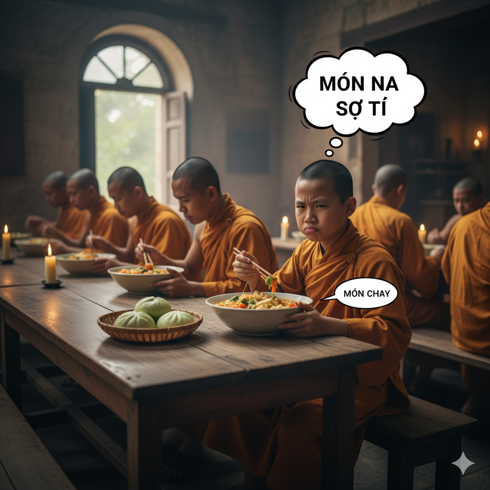
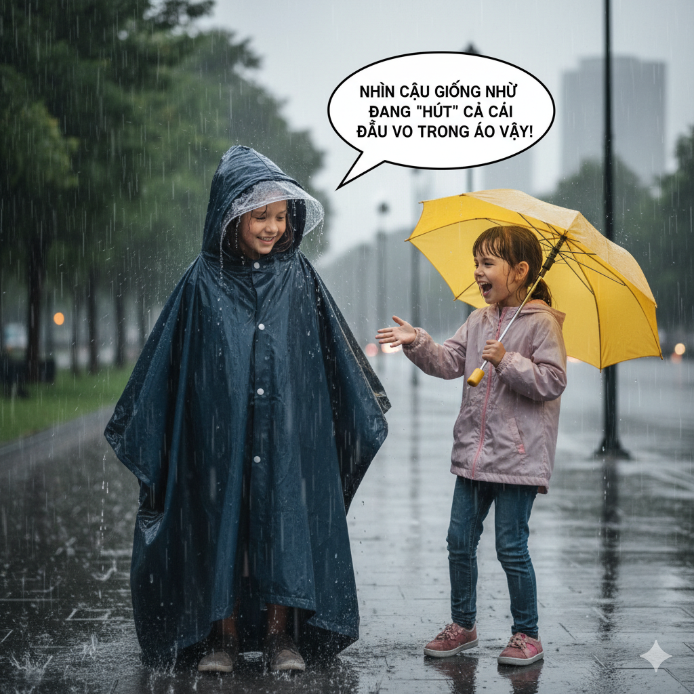
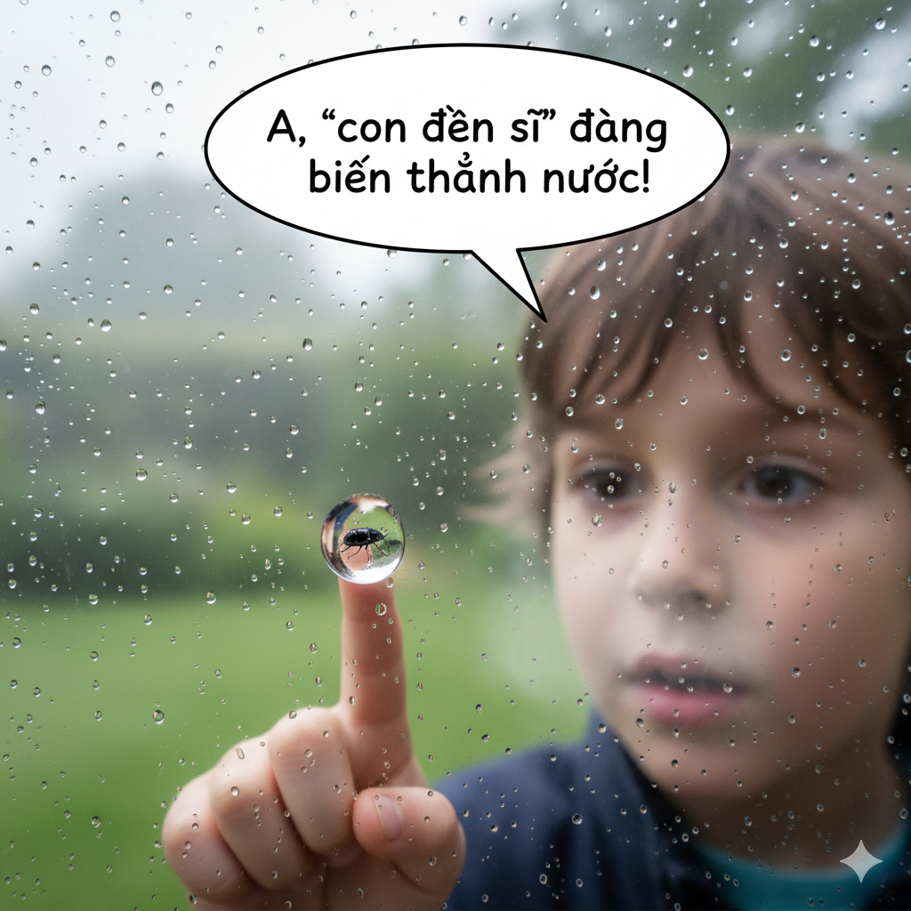
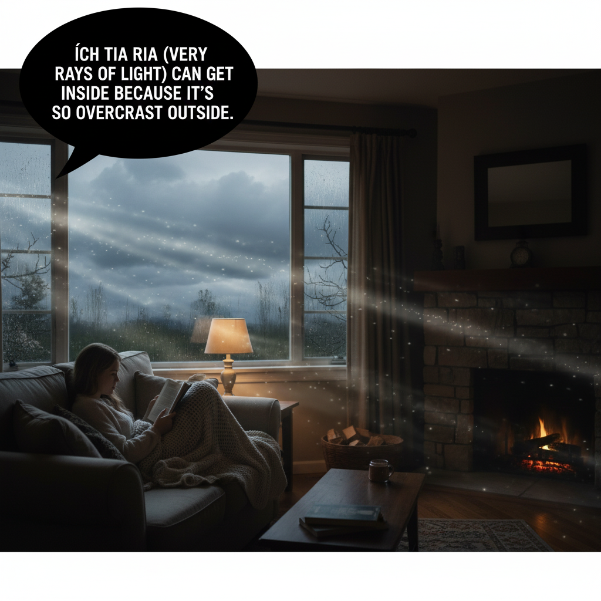
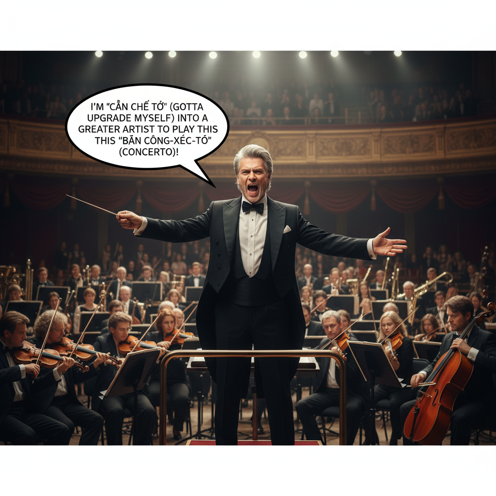

# The Nurse’s Lesson

One of the children in the nursery was sick. The child’s mother, who was usually quite vivacious and chattered constantly, was quiet and worried. She knew that if she did not act quickly, the child’s condition would deteriorate.

She summoned the children’s nurse and said to her, “The monks make a medicine that can cure my child’s sickness. Please, hurry tonight to the monastery and get it.”

The nurse immediately hurried from the manor to get the medicine. The monastery was far away by Rabbit Cove, and there was no freeway leading to it. The only way there was to walk along a dark and winding trail.

The temperature was close to zero degrees centigrade, and it was raining. Luckily, the nurse had grabbed her raincoat beforehand. She zipped it up and pulled the hood over her head.

“ I’ll never make it there,” she thought. “ Perhaps I should return and go in the morning.” But she remembered the sick child and decided to continue.

Finally, she arrived at the monastery. It was very late. She feared the monks would not be hospitable. But she approached the door and knocked anyway. The rain had condensed on the exterior of the windows by the door. All she could see was the profile of a large man coming to answer the door. Again, she was filled with fear.

But the monk smiled at her when he opened the door. He took her outstretched hand and welcomed her with a hearty voice. The place was warm, and she heard a concerto playing in another room. She relaxed.

“ How can I help you?” the monk asked, and the nurse explained the situation.

He instantly knew what to do. He grabbed a parcel of medicine and took her back to the manor in a carriage. The medicine worked. The nurse was happy she had persevered through the bad weather and found the monastery. Now the boy would be able to live a long natural life.

## Sentences of story

The Nurse’s Lesson

One of the children in the nursery was sick.

The child’s mother, who was usually quite vivacious and chattered constantly, was quiet and worried.

She knew that if she did not act quickly, the child’s condition would deteriorate.

She summoned the children’s nurse and said to her, “The monks make a medicine that can cure my child’s sickness. Please, hurry tonight to the monastery and get it.”

The nurse immediately hurried from the manor to get the medicine.

The monastery was far away by Rabbit Cove, and there was no freeway leading to it.

The only way there was to walk along a dark and winding trail.

The temperature was close to zero degrees centigrade, and it was raining.

Luckily, the nurse had grabbed her raincoat beforehand.

She zipped it up and pulled the hood over her head.

“ I’ll never make it there,” she thought.

“ Perhaps I should return and go in the morning.”

But she remembered the sick child and decided to continue.

Finally, she arrived at the monastery.

It was very late.

She feared the monks would not be hospitable.

But she approached the door and knocked anyway.

The rain had condensed on the exterior of the windows by the door.

All she could see was the profile of a large man coming to answer the door.

Again, she was filled with fear.

But the monk smiled at her when he opened the door.

He took her outstretched hand and welcomed her with a hearty voice.

The place was warm, and she heard a concerto playing in another room.

She relaxed.

“ How can I help you?” the monk asked, and the nurse explained the situation.

He instantly knew what to do.

He grabbed a parcel of medicine and took her back to the manor in a carriage.

The medicine worked.

The nurse was happy she had persevered through the bad weather and found the monastery.

Now the boy would be able to live a long natural life.

## List of word

vivacious, chatter, deteriorate, summon, monastery, manor, cove, freeway, winding, trail, centigrade, beforehand, zip, hood, hospitable, condense, exterior, profile, concerto, persevere

## 1. vivacious

### IPA: /vɪˈveɪ.ʃəs/
### Class: adj
### Câu truyện ẩn dụ:

Một cô gái đi xem ca nhạc, cô `vì vé sớt` (vì mua được vé vớt) mà vui mừng khôn xiết, nhảy múa hát hò rất **sôi nổi**, **hoạt bát**.

### Định nghĩa : 
Sôi nổi, hoạt bát, lanh lợi.

### English definition: 
Attractively lively and animated.

### Sentence of stroy:
The child’s mother, who was usually quite **vivacious** and chattered constantly, was quiet and worried.

## 2. chatter

### IPA: /ˈtʃæt.ər/
### Class: v
### Câu truyện ẩn dụ:

Đám trẻ con ngồi trong lớp, không chú ý nghe giảng mà cứ `chát tơ` (nhắn tin) với nhau, **nói huyên thuyên** đủ thứ chuyện trên trời dưới đất.

### Định nghĩa : 
Nói luôn mồm, nói huyên thuyên.

### English definition: 
To talk for a long time about things that are not important.

### Sentence of stroy:
The child’s mother, who was usually quite vivacious and **chattered** constantly, was quiet and worried.

## 3. deteriorate

### IPA: /dɪˈtɪə.ri.ə.reɪt/
### Class: v
### Câu truyện ẩn dụ:

Chiếc xe cũ để ngoài mưa nắng, `đi tia ria rết` (các tia ria, gỉ sét) xuất hiện ngày càng nhiều, khiến tình trạng của nó **tồi tệ đi** nhanh chóng.

### Định nghĩa : 
Xấu đi, tồi tệ đi, xuống cấp.

### English definition: 
To become worse.

### Sentence of stroy:
She knew that if she did not act quickly, the child’s condition would **deteriorate**.

## 4. summon

### IPA: /ˈsʌm.ən/
### Class: v
### Câu truyện ẩn dụ:

Vị vua muốn gặp vị tướng, liền sai lính mang theo một quả `sâm ngon` đến làm quà và **triệu tập** ông đến cung điện ngay lập tức.

### Định nghĩa : 
Triệu tập, gọi đến.

### English definition: 
To order someone to come to or be present at a particular place.

### Sentence of stroy:
She **summoned** the children’s nurse and said to her...

## 5. monastery

### IPA: /ˈmɒn.ə.stri/
### Class: n
### Câu truyện ẩn dụ:

Các nhà sư sống trong **tu viện** rất giản dị, bữa ăn của họ chỉ có `món na sợ Tí` (món na mà Tí sợ), vì Tí không thích ăn chay.

### Định nghĩa : 
Tu viện.

### English definition: 
A building in which monks live and worship.

### Sentence of stroy:
Please, hurry tonight to the **monastery** and get it.

## 6. manor

### IPA: /ˈmæn.ər/
### Class: n
### Câu truyện ẩn dụ:

Người quản gia của **trang viên** rộng lớn luôn giữ thái độ, `manh nơ` (manner) lịch thiệp với tất cả mọi người.

### Định nghĩa : 
Trang viên, thái ấp.

### English definition: 
A large old house in the country with land belonging to it.

### Sentence of stroy:
The nurse immediately hurried from the **manor** to get the medicine.

## 7. cove

### IPA: /kəʊv/
### Class: n
### Câu truyện ẩn dụ:

Dân làng chài thường hay `khoe` (cove ~ khoe) về những mẻ cá lớn bắt được ở **vịnh nhỏ** gần làng.

### Định nghĩa : 
Vịnh nhỏ, vũng.

### English definition: 
A small bay or sheltered inlet.

### Sentence of stroy:
The monastery was far away by Rabbit **Cove**...

## 8. freeway

### IPA: /ˈfriː.weɪ/
### Class: n
### Câu truyện ẩn dụ:

Trên **đường cao tốc**, bạn có thể đi lại một cách `free way` (tự do), không bị đèn đỏ hay giao cắt cản trở.

### Định nghĩa : 
Đường cao tốc.

### English definition: 
A wide road for fast-moving traffic.

### Sentence of stroy:
...and there was no **freeway** leading to it.

## 9. winding

### IPA: /ˈwaɪn.dɪŋ/
### Class: adj
### Câu truyện ẩn dụ:

Con đường lên núi **quanh co**, uốn lượn như một sợi `dây đinh` khổng lồ bị vứt lung tung.

### Định nghĩa : 
Quanh co, uốn lượn.

### English definition: 
Following a twisting or curving course.

### Sentence of stroy:
The only way there was to walk along a dark and **winding** trail.

## 10. trail

### IPA: /treɪl/
### Class: n
### Câu truyện ẩn dụ:

Người đi rừng thường đi theo **đường mòn** để không bị lạc, họ tin rằng đó là con đường `trời yêu` dành cho họ.

### Định nghĩa : 
Đường mòn.

### English definition: 
A path through a countryside, mountain, or forest area.

### Sentence of stroy:
...to walk along a dark and winding **trail**.

## 11. centigrade

### IPA: /ˈsen.tɪ.ɡreɪd/
### Class: n
### Câu truyện ẩn dụ:

Nhà khoa học đo nhiệt độ sôi của nước, ông reo lên: "`Xen tí gạch` nữa thôi là đủ 100 **độ C** rồi!".

### Định nghĩa : 
Độ C, bách phân.

### English definition: 
A scale of temperature on which water freezes at 0° and boils at 100°.

### Sentence of stroy:
The temperature was close to zero degrees **centigrade**...

## 12. beforehand

### IPA: /bɪˈfɔː.hænd/
### Class: adv
### Câu truyện ẩn dụ:

Người đầu bếp thông thái luôn chuẩn bị mọi nguyên liệu **trước**, ông nói: "Thịt bò kho phải `bì pho hầm` (bì và phô mai phải hầm) **sẵn** thì mới ngon".

### Định nghĩa : 
Trước, sẵn, trước đó.

### English definition: 
Earlier (than a particular time).

### Sentence of stroy:
Luckily, the nurse had grabbed her raincoat **beforehand**.

## 13. zip

### IPA: /zɪp/
### Class: v
### Câu truyện ẩn dụ:

Con vẹt thấy cô chủ **kéo khóa** áo, nó liền bắt chước kêu "`díp, díp`" theo tiếng của dây kéo.

### Định nghĩa : 
Kéo khóa (dây kéo).

### English definition: 
To fasten something with a zip.

### Sentence of stroy:
She **zipped** it up and pulled the hood over her head.

## 14. hood

### IPA: /hʊd/
### Class: n
### Câu truyện ẩn dụ:

Trời mưa, cô bé trùm **mũ áo** lên đầu. Bạn cô trêu: "Nhìn cậu giống như đang `hút` cả cái đầu vào trong áo vậy!".

### Định nghĩa : 
Mũ trùm đầu (của áo).

### English definition: 
A part of a coat that you can pull up to cover your head and neck.

### Sentence of stroy:
...and pulled the **hood** over her head.

## 15. hospitable

### IPA: /hɒsˈpɪt.ə.bəl/
### Class: adj
### Câu truyện ẩn dụ:

Một người **hiếu khách** sẽ đối xử với bạn tốt như ở trong `hospital` (bệnh viện), luôn sẵn lòng chăm sóc và giúp đỡ.

### Định nghĩa : 
Hiếu khách, mến khách.

### English definition: 
Friendly and welcoming to guests and visitors.

### Sentence of stroy:
She feared the monks would not be **hospitable**.

## 16. condense

### IPA: /kənˈdens/
### Class: v
### Câu truyện ẩn dụ:

Hơi nước gặp lạnh liền **ngưng tụ** lại thành giọt. Cậu bé nhìn thấy và nói: "A, `con đen sì` đang biến thành nước!". Cậu đang chỉ vào một con bọ đen bị kẹt trong giọt nước ngưng tụ.

### Định nghĩa : 
Ngưng tụ, cô đọng.

### English definition: 
To change from a gas to a liquid or solid state.

### Sentence of stroy:
The rain had **condensed** on the exterior of the windows by the door.

## 17. exterior

### IPA: /ɪkˈstɪə.ri.ər/
### Class: n
### Câu truyện ẩn dụ:

`Ích tia ria` (ít tia sáng) có thể lọt vào trong nhà vì **bên ngoài** trời đang rất u ám.

### Định nghĩa : 
Bên ngoài, bề ngoài.

### English definition: 
The outside part of something.

### Sentence of stroy:
...on the **exterior** of the windows by the door.

## 18. profile

### IPA: /ˈprəʊ.faɪl/
### Class: n
### Câu truyện ẩn dụ:

Người họa sĩ nói: "Tôi `rồ` (mê mẩn) `phải` vẽ **dáng nhìn nghiêng** của cô ấy, nó thật hoàn hảo".

### Định nghĩa : 
Dáng nhìn nghiêng, hình bóng.

### English definition: 
A side view of a person's head.

### Sentence of stroy:
All she could see was the **profile** of a large man coming to answer the door.

## 19. concerto

### IPA: /kənˈtʃɜː.təʊ/
### Class: n
### Câu truyện ẩn dụ:

Nhạc trưởng chỉ huy dàn nhạc, ông hô to: "`Cần chế tớ` thành một nghệ sĩ vĩ đại hơn để chơi được **bản công-xéc-tô** này!".

### Định nghĩa : 
Bản công-xéc-tô.

### English definition: 
A long piece of music for one or more main solo instruments and an orchestra.

### Sentence of stroy:
...and she heard a **concerto** playing in another room.

## 20. persevere

### IPA: /ˌpɜː.səˈvɪər/
### Class: v
### Câu truyện ẩn dụ:

Dù bài tập rất khó, cậu học sinh vẫn `bơ đi mà làm, sợ gì`. Cậu ấy đã rất **kiên trì** và cuối cùng cũng giải được.

### Định nghĩa : 
Kiên trì, bền bỉ.

### English definition: 
To continue making an effort to do or achieve something, despite difficulties.

### Sentence of stroy:
The nurse was happy she had **persevered** through the bad weather and found the monastery.

