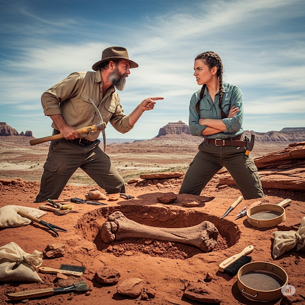
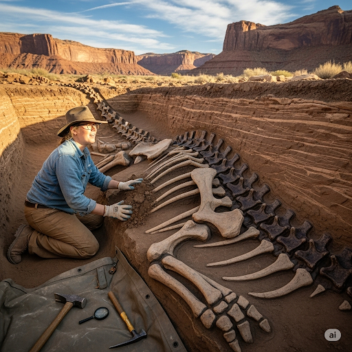
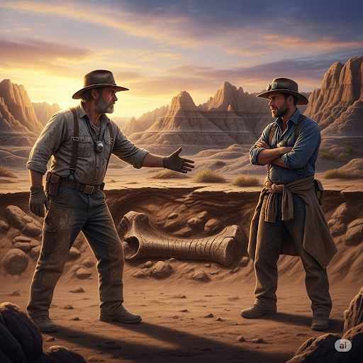
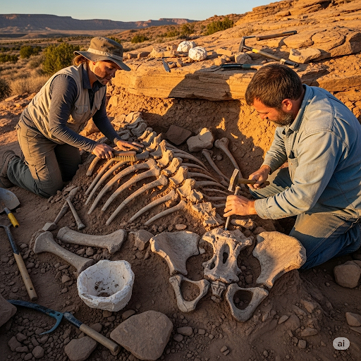
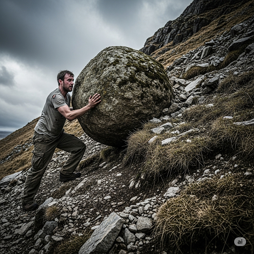
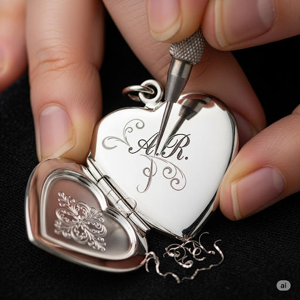
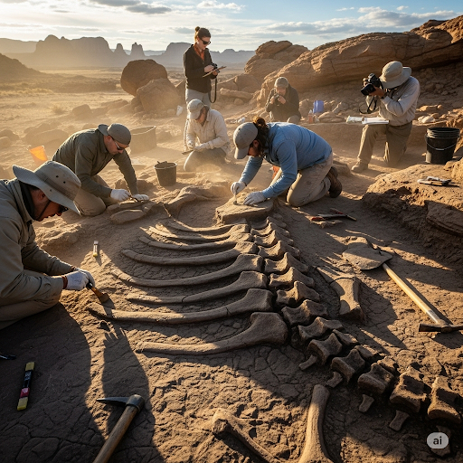
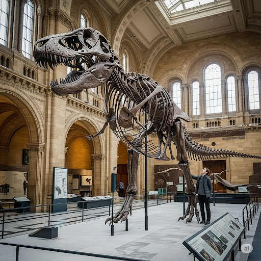
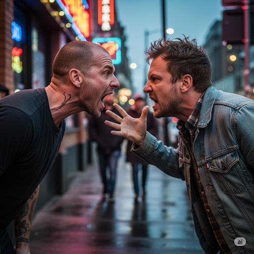

# The Fossil Hunters 

Tim and Dean were great fossil hunters. They were the very best at finding dinosaur bones. Although Tim and Dean were quite similar, they were outright enemies. The two men got into vicious arguments all the time. They couldn’t coexist peacefully because their egos were too large. Tim thought he was the best fossil hunter, while Dean was sure that he was much better than Tim.

One day, Tim was searching for fossils on the periphery of the city when he discovered a huge bone. He had never seen anything like it! He took his shovel and carefully excavated the dirt around it. As he dug, he uncovered more jagged bones. He realized that he had found an entire dinosaur skeleton! Tim couldn’t conceive a plan to remove the huge skeleton all by himself. Such an endeavor would be too arduous. He needed help. He tried to think of people who would be capable of helping him remove the skeleton without breaking it. The only person Tim could think of was Dean, his enemy.

Tim ran into the city to find Dean. Tim found him and said, “ Dean, I’ve found the skeletal remains of a huge terrestrial animal. But I can’t get the skeleton out by myself. Will you please help me?

Dean thought that Tim’s claim might be dubious. He replied, “ If you’re serious about the skeleton, I’ll help.”

Tim excitedly showed Dean the skeleton’s locale. They worked together to carefully remove each bone. And to keep the bones together, they tied them with elastic strips. When they were finished, they had attained a perfect skeleton. They used plaster to make a mold of the dinosaur’s skull. They engraved their initials into it and gave it to the curator of a local museum.

Tim and Dean found out that they could work very well together. They decided to end their feud and become friends. By combining their talents, the men became even greater than they were before.

## Sentences of story

The Fossil Hunters 

Tim and Dean were great fossil hunters.

They were the very best at finding dinosaur bones.

Although Tim and Dean were quite similar, they were outright enemies.

The two men got into vicious arguments all the time.

They couldn’t coexist peacefully because their egos were too large.

Tim thought he was the best fossil hunter, while Dean was sure that he was much better than Tim.

One day, Tim was searching for fossils on the periphery of the city when he discovered a huge bone.

He had never seen anything like it!

He took his shovel and carefully excavated the dirt around it.

As he dug, he uncovered more jagged bones.

He realized that he had found an entire dinosaur skeleton!

Tim couldn’t conceive a plan to remove the huge skeleton all by himself.

Such an endeavor would be too arduous.

He needed help.

He tried to think of people who would be capable of helping him remove the skeleton without breaking it.

The only person Tim could think of was Dean, his enemy.

Tim ran into the city to find Dean.

Tim found him and said, “ Dean, I’ve found the skeletal remains of a huge terrestrial animal. But I can’t get the skeleton out by myself. Will you please help me?

Dean thought that Tim’s claim might be dubious.

He replied, “ If you’re serious about the skeleton, I’ll help.”

Tim excitedly showed Dean the skeleton’s locale.

They worked together to carefully remove each bone.

And to keep the bones together, they tied them with elastic strips.

When they were finished, they had attained a perfect skeleton.

They used plaster to make a mold of the dinosaur’s skull.

They engraved their initials into it and gave it to the curator of a local museum.

Tim and Dean found out that they could work very well together.

They decided to end their feud and become friends.

By combining their talents, the men became even greater than they were before.

## List of word

arduous, attain, coexist, conceive, dubious, ego, elastic, endeavor, engrave, excavate, jagged, locale, mold, outright, periphery, plaster, shovel, skeletal, terrestrial, vicious

## 1. arduous

### IPA: /ˈɑː.dju.əs/
### Class: adj
### Câu truyện ẩn dụ:
Một nhân viên than thở với đồng nghiệp: "*A, đưa sếp* cái báo cáo này đi, công việc này **gian khổ** (arduous), khó nhằn quá, làm mãi không xong."

### Định nghĩa : 
Gian khổ, khó khăn, đòi hỏi nhiều nỗ lực.

### English definition: 
Difficult, needing a lot of effort and energy.

### Sentence of stroy:
Such an endeavor would be too **arduous**.

### Ví dụ thông dụng:
1. It was an arduous journey across the mountains.
2. He went through a long and arduous training program.

## 2. attain

### IPA: /əˈteɪn/
### Class: v
### Câu truyện ẩn dụ:
Cảnh sát nói về một tên trộm thông minh: "*Ờ, tên* đó cuối cùng cũng **đạt được** (attain) mục tiêu lấy cắp viên kim cương mà không bị ai phát hiện."

### Định nghĩa : 
Đạt được, giành được.

### English definition: 
To reach or succeed in getting something.

### Sentence of stroy:
When they were finished, they had **attained** a perfect skeleton.

### Ví dụ thông dụng:
1. He has attained the highest rank in his profession.
2. She was able to attain her goal of becoming a doctor.

## 3. coexist

### IPA: /ˌkəʊ.ɪɡˈzɪst/
### Class: v
### Câu truyện ẩn dụ:
Trong một bệnh viện, vị giám đốc nói: "Tất cả mọi người *cùng y sĩ* phải học cách **cùng tồn tại** (coexist) hòa bình để phục vụ bệnh nhân tốt nhất."

### Định nghĩa : 
Cùng tồn tại, chung sống.

### English definition: 
To live or exist together at the same time or in the same place.

### Sentence of stroy:
They couldn’t **coexist** peacefully because their egos were too large.

### Ví dụ thông dụng:
1. Two different species can coexist in the same habitat.
2. It is possible for different cultures to coexist peacefully.

## 4. conceive

### IPA: /kənˈsiːv/
### Class: v
### Câu truyện ẩn dụ:
Mọi người trong công ty thường nói rằng "*con sếp*" lúc nào cũng **hình dung** (conceive) ra những ý tưởng kinh doanh rất độc đáo và mới lạ.

### Định nghĩa : 
Hình dung, tưởng tượng, nhận thức.

### English definition: 
To imagine something.

### Sentence of stroy:
Tim couldn’t **conceive** a plan to remove the huge skeleton all by himself.

### Ví dụ thông dụng:
1. I cannot conceive of a world without music.
2. He couldn't conceive of a reason for her behavior.

## 5. dubious

### IPA: /ˈdʒuː.bi.əs/
### Class: adj
### Câu truyện ẩn dụ:
Một người bạn rủ đi bơi, người kia đáp: "*Đi bơi ở* cái hồ này á? Tớ thấy hơi **đáng ngờ** (dubious) về độ an toàn của nó."

### Định nghĩa : 
Đáng ngờ, không chắc chắn, mơ hồ.

### English definition: 
Thought not to be completely true or not able to be trusted.

### Sentence of stroy:
Dean thought that Tim’s claim might be **dubious**.

### Ví dụ thông dụng:
1. I'm dubious about his promises to change.
2. The story seemed a bit dubious to me.

## 6. ego

### IPA: /ˈiː.ɡəʊ/
### Class: n
### Câu truyện ẩn dụ:
Mặt mũi anh ta trông "*y gồ*" ghề mà lúc nào cũng tự cho mình là đẹp trai nhất, đúng là **cái tôi** (ego) quá lớn.

### Định nghĩa : 
Cái tôi, lòng tự trọng.

### English definition: 
Your idea or opinion of yourself, especially your feeling of your own importance and ability.

### Sentence of stroy:
They couldn’t coexist peacefully because their **egos** were too large.

### Ví dụ thông dụng:
1. He has a huge ego; he thinks he's the best at everything.
2. That failure was a blow to my ego.

## 7. elastic

### IPA: /iˈlæs.tɪk/
### Class: n
### Câu truyện ẩn dụ:
Người ta nói chị "*Y lanh tích*" trữ rất nhiều **dây thun** (elastic) để buộc tóc và gói quà.

### Định nghĩa : 
Dây thun, chất co giãn.

### English definition: 
A type of rubber that is able to stretch and return to its original size.

### Sentence of stroy:
And to keep the bones together, they tied them with **elastic** strips.

### Ví dụ thông dụng:
1. The waistband of these pants is made of elastic.
2. She tied her hair back with an elastic.

## 8. endeavor

### IPA: /enˈdev.ər/
### Class: n
### Câu truyện ẩn dụ:
Một người chồng nói đùa: "*Em đè vợ* dậy học bài mỗi sáng là cả một **sự nỗ lực** (endeavor) để giúp vợ thi đỗ."

### Định nghĩa : 
Sự nỗ lực, sự cố gắng.

### English definition: 
An attempt to do something.

### Sentence of stroy:
Such an **endeavor** would be too arduous.

### Ví dụ thông dụng:
1. Writing a book is a huge endeavor.
2. We wish you the best in your future endeavors.

## 9. engrave

### IPA: /ɪnˈɡreɪv/
### Class: v
### Câu truyện ẩn dụ:
Người thợ kim hoàn nói với khách: "Mẫu này *in rồi*, giờ tôi sẽ **khắc** (engrave) tên của anh lên chiếc nhẫn này."

### Định nghĩa : 
Khắc, chạm trổ.

### English definition: 
To cut words, pictures, or patterns into the surface of a hard object.

### Sentence of stroy:
They **engraved** their initials into it and gave it to the curator of a local museum.

### Ví dụ thông dụng:
1. The trophy was engraved with the winner's name.
2. He engraved the date on the back of the watch.

## 10. excavate

### IPA: /ˈek.skə.veɪt/
### Class: v
### Câu truyện ẩn dụ:
Con ếch nói với con nhái: "*Ếch sợ vầy* lắm nên chúng ta phải **đào** (excavate) một cái hang thật sâu để trốn thôi."

### Định nghĩa : 
Đào, khai quật.

### English definition: 
To remove earth that is covering very old objects buried in the ground in order to discover things about the past.

### Sentence of stroy:
He took his shovel and carefully **excavated** the dirt around it.

### Ví dụ thông dụng:
1. Archaeologists are excavating a Roman villa.
2. They excavated a ditch to lay the new water pipes.

## 11. jagged

### IPA: /ˈdʒæɡ.ɪd/
### Class: adj
### Câu truyện ẩn dụ:
Cầm mảnh kính vỡ **nham nhở** (jagged) này cẩn thận không "*cháy túi*" vì phải đi viện khâu vết thương đó.

### Định nghĩa : 
Lởm chởm, có nhiều cạnh sắc nhọn.

### English definition: 
Rough and with sharp points.

### Sentence of stroy:
As he dug, he uncovered more **jagged** bones.

### Ví dụ thông dụng:
1. The bottle broke, leaving a jagged edge.
2. We hiked over jagged rocks.

## 12. locale

### IPA: /ləʊˈkɑːl/
### Class: n
### Câu truyện ẩn dụ:
"*Lâu cá* không về" nên những người ngư dân phải đi tìm một **địa điểm** (locale) mới để đánh bắt.

### Định nghĩa : 
Nơi chốn, địa điểm (của một sự kiện).

### English definition: 
A place where something happens or is set, or that has particular events associated with it.

### Sentence of stroy:
Tim excitedly showed Dean the skeleton’s **locale**.

### Ví dụ thông dụng:
1. The book's locale is a small town in the Midwest.
2. The film crew chose a beautiful tropical island as their locale.

## 13. mold

### IPA: /məʊld/
### Class: n
### Câu truyện ẩn dụ:
Người thợ làm bánh nói: "**Mời** anh xem, đây là cái **khuôn** (mold) tôi dùng để tạo ra những chiếc bánh xinh xắn này."

### Định nghĩa : 
Khuôn đúc.

### English definition: 
A hollow container with a particular shape into which you pour a liquid substance so that it will become a solid in that shape.

### Sentence of stroy:
They used plaster to make a **mold** of the dinosaur’s skull.

### Ví dụ thông dụng:
1. Pour the chocolate into a heart-shaped mold.
2. The statue was cast from a plaster mold.

## 14. outright

### IPA: /ˈaʊt.raɪt/
### Class: adj
### Câu truyện ẩn dụ:
Người chủ đất khẳng định: "Cái *ao này* là tài sản của gia đình tôi một cách **hoàn toàn** (outright), không có tranh chấp gì cả."

### Định nghĩa : 
Hoàn toàn, thẳng thừng, dứt khoát.

### English definition: 
Complete and total.

### Sentence of stroy:
Although Tim and Dean were quite similar, they were **outright** enemies.

### Ví dụ thông dụng:
1. It was an outright lie.
2. He won the election outright.

## 15. periphery

### IPA: /pəˈrɪf.ər.i/
### Class: n
### Câu truyện ẩn dụ:
Mẹ dặn con gái: "**Bơ đi phơi đi**, nhưng đừng phơi ở giữa sân, phơi ở **vùng ven** (periphery) thôi cho gọn."

### Định nghĩa : 
Vùng ngoại vi, vùng ven, chu vi.

### English definition: 
The outer edge of an area.

### Sentence of stroy:
One day, Tim was searching for fossils on the **periphery** of the city when he discovered a huge bone.

### Ví dụ thông dụng:
1. The factory is located on the periphery of the town.
2. Many people live in the periphery and commute to the city for work.

## 16. plaster

### IPA: /ˈplɑː.stər/
### Class: n
### Câu truyện ẩn dụ:
Cậu bé than thở: "Chân con *bị lát sơ* một chút thôi mà bác sĩ phải bó bột **thạch cao** (plaster) to thế này ạ?"

### Định nghĩa : 
Thạch cao.

### English definition: 
A substance that becomes hard as it dries and is used especially for covering walls and ceilings and for making sculptures.

### Sentence of stroy:
They used **plaster** to make a mold of the dinosaur’s skull.

### Ví dụ thông dụng:
1. His leg was in plaster for six weeks.
2. The walls are made of plaster.

## 17. shovel

### IPA: /ˈʃʌv.əl/
### Class: n
### Câu truyện ẩn dụ:
Cậu bé nói: "Cháu **sợ vãi** cả ra khi thấy người đàn ông cầm cái **xẻng** (shovel) đi trong đêm tối."

### Định nghĩa : 
Cái xẻng.

### English definition: 
A tool consisting of a wide, square metal blade attached to a handle, used for moving coal, earth, snow, etc.

### Sentence of stroy:
He took his **shovel** and carefully excavated the dirt around it.

### Ví dụ thông dụng:
1. He used a shovel to clear the snow from the path.
2. Dig a hole with a shovel.

## 18. skeletal

### IPA: /ˈskel.ə.təl/
### Class: adj
### Câu truyện ẩn dụ:
Nhìn anh ấy gầy "*sơ keo tồ*" đến mức trông như một bộ xương di động, đúng là **(thuộc) bộ xương** (skeletal).

### Định nghĩa : 
Thuộc về bộ xương, gầy trơ xương.

### English definition: 
Relating to the skeleton.

### Sentence of stroy:
I’ve found the **skeletal** remains of a huge terrestrial animal.

### Ví dụ thông dụng:
1. The museum has a collection of skeletal remains.
2. The starving dog was almost skeletal.

## 19. terrestrial

### IPA: /təˈres.tri.əl/
### Class: adj
### Câu truyện ẩn dụ:
Người hướng dẫn viên nói: "**Tớ rẽ trái rồi** đi tiếp là đến khu bảo tồn các loài động vật **sống trên cạn** (terrestrial)."

### Định nghĩa : 
(Sống) trên cạn, thuộc về trái đất.

### English definition: 
Relating to the Earth or to land; living on land.

### Sentence of stroy:
...the skeletal remains of a huge **terrestrial** animal.

### Ví dụ thông dụng:
1. Lions are terrestrial animals.
2. The movie is about an alien visiting a terrestrial planet.

## 20. vicious

### IPA: /ˈvɪʃ.əs/
### Class: adj
### Câu truyện ẩn dụ:
Cậu bé giải thích: "**Vì sợ** con chó **hung dữ** (vicious) đó nên con không dám đi vào nhà."

### Định nghĩa : 
Hung dữ, xấu xa, tàn bạo.

### English definition: 
Vicious people or actions show an intention or wish to hurt someone or something very badly.

### Sentence of stroy:
The two men got into **vicious** arguments all the time.

### Ví dụ thông dụng:
1. He was attacked by a vicious dog.
2. She has a vicious temper.