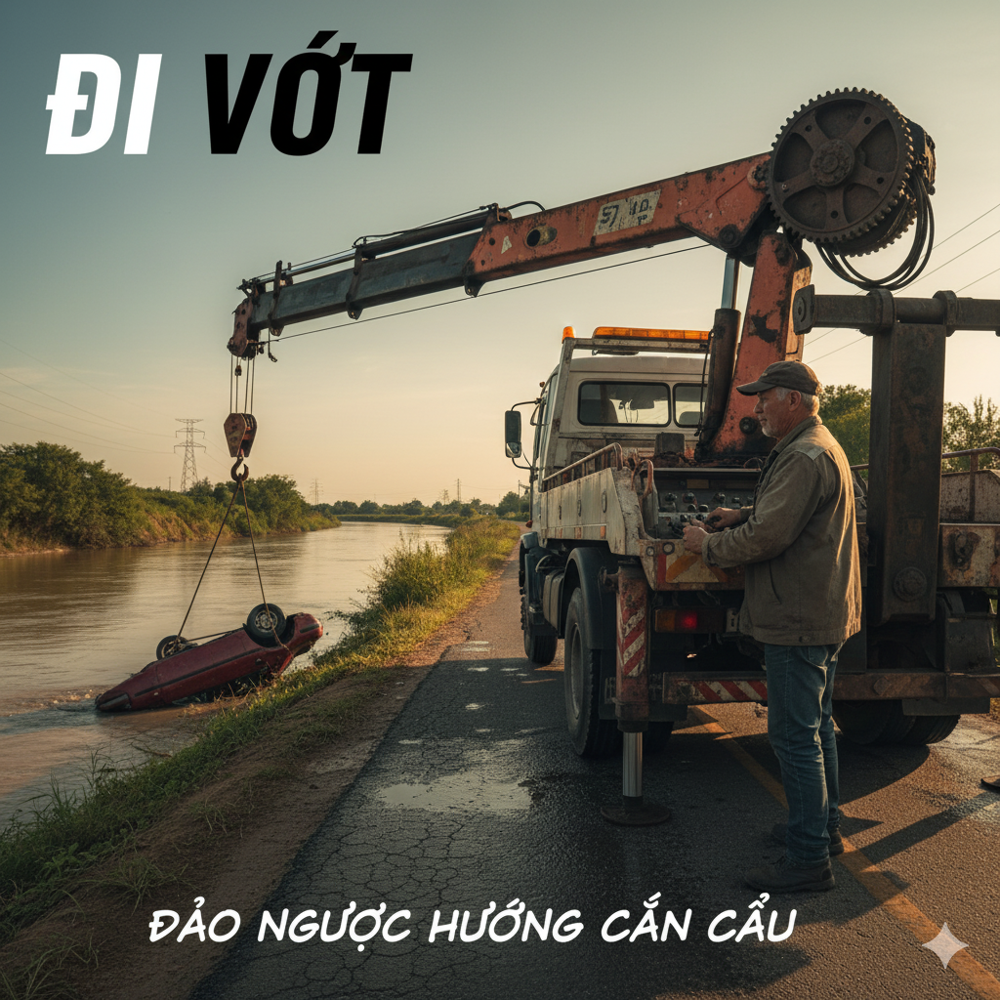

# The Greedy Bee

A young bee had passed his intermediate level exams. He now knew everything about flowers. He understood how they used photosynthesis to make oxygen and which ones produced the best pollen. Bees had an important dependency on pollen. From the beginning of time, bees’ eternal task was to gather pollen and make honey with it.

Since he passed his exams, the little bee had earned his inclusion in the swarms that gathered pollen. He was excited because he was finally allowed to leave the hive. He left with the next swarm and was determined to find the perfect flower. Soon he saw a large, vibrant flower full of pollen. He landed on a petal and walked toward the pollen at the flower’s center.

Immediately, he began rolling in the pollen, gathering it on his legs and wings. The fine texture of the pollen tickled when it stuck to his body. It was the best experience the little bee had ever had. He gathered as much as he could.

But when he was flying back home, he realized that all the pollen had an adverse effect. He had no control over his flight. The intermittent wind fluctuated in power. He was blown to and fro. One minute he was flying straight, and the next minute the wind had reversed his course.

He tried to dump some of the pollen, but it acted as an adhesive. He couldn’t get it off. He became tired and fell to the ground.

“What am I going to do now?” he thought. Just then, his mentor landed next to him and began cleaning the excess pollen off the little bee. “You shouldn’t have taken so much,” his mentor said.

Finally, with the pollen off of him, the bee easily regained his strength, and like a phoenix, the young bee flew back into the air. When he returned to the hive, he turned to his mentor and said, “ I learned an important lesson today. I will never be greedy again.”

## Sentences of story

The Greedy Bee

A young bee had passed his intermediate level exams.

He now knew everything about flowers.

He understood how they used photosynthesis to make oxygen and which ones produced the best pollen.

Bees had an important dependency on pollen.

From the beginning of time, bees’ eternal task was to gather pollen and make honey with it.

Since he passed his exams, the little bee had earned his inclusion in the swarms that gathered pollen.

He was excited because he was finally allowed to leave the hive.

He left with the next swarm and was determined to find the perfect flower.

Soon he saw a large, vibrant flower full of pollen.

He landed on a petal and walked toward the pollen at the flower’s center.

Immediately, he began rolling in the pollen, gathering it on his legs and wings.

The fine texture of the pollen tickled when it stuck to his body.

It was the best experience the little bee had ever had.

He gathered as much as he could.

But when he was flying back home, he realized that all the pollen had an adverse effect.

He had no control over his flight.

The intermittent wind fluctuated in power.

He was blown to and fro.

One minute he was flying straight, and the next minute the wind had reversed his course.

He tried to dump some of the pollen, but it acted as an adhesive.

He couldn’t get it off.

He became tired and fell to the ground.

“What am I going to do now?” he thought.

Just then, his mentor landed next to him and began cleaning the excess pollen off the little bee.

“You shouldn’t have taken so much,” his mentor said.

Finally, with the pollen off of him, the bee easily regained his strength, and like a phoenix, the young bee flew back into the air.

When he returned to the hive, he turned to his mentor and said, “ I learned an important lesson today.

I will never be greedy again.”

## List of word

adhesive, adverse, dependency, dump, eternal, fluctuate, fro, inclusion, intermediate, intermittent, mentor, phoenix, photosynthesis, pollen, regain, reverse, swarm, texture, tickle, vibrant

## 1. adhesive

### IPA: /ədˈhiː.sɪv/
### Class: n
### Câu truyện ẩn dụ:

`Ở đây ship` (adhesive) hàng dễ vỡ nên người ta phải dùng rất nhiều **chất kết dính** để dán thùng hàng cho chắc.

### Định nghĩa : 
Chất kết dính, keo dán.

### English definition: 
A substance used for sticking objects or materials together; glue.

### Sentence of stroy:
He tried to dump some of the pollen, but it acted as an **adhesive**.

## 2. adverse

### IPA: /ˈæd.vɜːs/
### Class: adj
### Câu truyện ẩn dụ:

Quảng cáo (`ad`) `vớ vẩn` (verse) sẽ gây ra những tác động **bất lợi**, tiêu cực cho thương hiệu.

### Định nghĩa : 
Bất lợi, có hại.

### English definition: 
Preventing success or development; harmful; unfavorable.

### Sentence of stroy:
But when he was flying back home, he realized that all the pollen had an **adverse** effect.

## 3. dependency

### IPA: /dɪˈpen.dən.si/
### Class: n
### Câu truyện ẩn dụ:

`Đi Ben đi City` (dependency) đều là những lựa chọn tốt, nhưng **sự phụ thuộc** vào xe hơi khiến môi trường ô nhiễm.

### Định nghĩa : 
Sự phụ thuộc, sự lệ thuộc.

### English definition: 
A state of being dependent on a particular person or thing.

### Sentence of stroy:
Bees had an important **dependency** on pollen.

## 4. dump

### IPA: /dʌmp/
### Class: v
### Câu truyện ẩn dụ:

Chiếc xe tải `đâm` (dump) vào gốc cây rồi **đổ**, **vứt bỏ** hết hàng hóa xuống đường.

### Định nghĩa : 
Vứt bỏ, đổ đi.

### English definition: 
To get rid of something unwanted, especially by leaving it in a place where it is not allowed to be.

### Sentence of stroy:
He tried to **dump** some of the pollen, but it acted as an adhesive.

## 5. eternal

### IPA: /ɪˈtɜː.nəl/
### Class: adj
### Câu truyện ẩn dụ:

Tình yêu của họ không `ít tơ non` (eternal) nớt mà là một tình yêu **vĩnh cửu**, sâu đậm.

### Định nghĩa : 
Vĩnh cửu, bất diệt.

### English definition: 
Lasting or existing forever; without end or beginning.

### Sentence of stroy:
From the beginning of time, bees’ **eternal** task was to gather pollen and make honey with it.

## 6. fluctuate

### IPA: /ˈflʌk.tʃu.eɪt/
### Class: v
### Câu truyện ẩn dụ:

Cái `phích lắc chuối` (fluctuate) làm cho mực nước bên trong cứ **dao động** lên xuống.

### Định nghĩa : 
Dao động, biến động.

### English definition: 
To rise and fall irregularly in number or amount.

### Sentence of stroy:
The intermittent wind **fluctuated** in power.

## 7. fro

### IPA: /frəʊ/
### Class: adv
### Câu truyện ẩn dụ:

Cô bé `phờ râu` (fro) vì phải chạy đi chạy lại, **qua lại** giữa hai đầu sân.

### Định nghĩa : 
Qua lại, tới lui (thường đi với "to and fro").

### English definition: 
Backwards and forwards.

### Sentence of stroy:
He was blown to and **fro**.

## 8. inclusion

### IPA: /ɪnˈkluː.ʒən/
### Class: n
### Câu truyện ẩn dụ:

`In cả lu sành` (inclusion) vào bức tranh là một **sự bao gồm**, sự thêm vào rất táo bạo của người họa sĩ.

### Định nghĩa : 
Sự bao gồm, sự kể cả.

### English definition: 
The action or state of including or of being included within a group or structure.

### Sentence of stroy:
Since he passed his exams, the little bee had earned his **inclusion** in the swarms that gathered pollen.

## 9. intermediate

### IPA: /ˌɪn.təˈmiː.di.ət/
### Class: adj
### Câu truyện ẩn dụ:

`Trong tớ mì đi ết` (intermediate) là món ăn ưa thích ở trình độ **trung cấp** khi còn là sinh viên.

### Định nghĩa : 
Trung cấp, ở giữa.

### English definition: 
Being between two other related things, levels, or points.

### Sentence of stroy:
A young bee had passed his **intermediate** level exams.

## 10. intermittent

### IPA: /ˌɪn.təˈmɪt.ənt/
### Class: adj
### Câu truyện ẩn dụ:

`Trong tớ mít` (intermittent) mọc **không liên tục**, lúc có quả lúc không.

### Định nghĩa : 
Gián đoạn, không liên tục.

### English definition: 
Occurring at irregular intervals; not continuous or steady.

### Sentence of stroy:
The **intermittent** wind fluctuated in power.

## 11. mentor

### IPA: /ˈmen.tɔːr/
### Class: n
### Câu truyện ẩn dụ:

Anh ấy là **người hướng dẫn** của tôi, `men` (man) `tốt` (tor) lắm.

### Định nghĩa : 
Người hướng dẫn, người cố vấn.

### English definition: 
An experienced and trusted adviser.

### Sentence of stroy:
Just then, his **mentor** landed next to him and began cleaning the excess pollen off the little bee.

## 12. phoenix

### IPA: /ˈfiː.nɪks/
### Class: n
### Câu truyện ẩn dụ:

Con **phượng hoàng** `phí ních` (phoenix) phụ vì nó có thể tái sinh từ tro tàn.

### Định nghĩa : 
Phượng hoàng.

### English definition: 
(in classical mythology) a unique bird that lived for five or six centuries in the Arabian desert, after this time burning itself on a funeral pyre and rising from the ashes with renewed youth to live through another cycle.

### Sentence of stroy:
...and like a **phoenix**, the young bee flew back into the air.

## 13. photosynthesis

### IPA: /ˌfəʊ.təʊˈsɪn.θə.sɪs/
### Class: n
### Câu truyện ẩn dụ:

`Phơi tô xin tí thịt` (photosynthesis) để có năng lượng, giống như cây cần **sự quang hợp** để tạo ra năng lượng.

### Định nghĩa : 
Sự quang hợp.

### English definition: 
The process by which green plants and some other organisms use sunlight to synthesize foods with the help of chlorophyll pigment.

### Sentence of stroy:
He understood how they used **photosynthesis** to make oxygen...

## 14. pollen

### IPA: /ˈpɒl.ən/
### Class: n
### Câu truyện ẩn dụ:

`Bỏ lên` (pollen) đĩa một ít **phấn hoa** để trang trí món ăn.

### Định nghĩa : 
Phấn hoa.

### English definition: 
A fine powdery substance, typically yellow, consisting of microscopic grains discharged from the male part of a flower or from a male cone.

### Sentence of stroy:
...and which ones produced the best **pollen**.

## 15. regain

### IPA: /rɪˈɡeɪn/
### Class: v
### Câu truyện ẩn dụ:

Anh ấy `đi ghen` (regain) với tình địch, nhưng sau đó đã **lấy lại** được bình tĩnh và niềm tin.

### Định nghĩa : 
Lấy lại, giành lại.

### English definition: 
To get back something that you no longer have.

### Sentence of stroy:
...the bee easily **regained** his strength...

## 16. reverse

### IPA: /rɪˈvɜːs/
### Class: v
### Câu truyện ẩn dụ:

Bác tài xế `đi vớt` (reverse) chiếc xe bị rơi xuống sông bằng cách **đảo ngược** hướng cần cẩu.

### Định nghĩa : 
Đảo ngược, đảo chiều.

### English definition: 
To change the direction, order, position, result, etc. of something to its opposite.

### Sentence of stroy:
...the next minute the wind had **reversed** his course.

## 17. swarm

### IPA: /swɔːm/
### Class: n
### Câu truyện ẩn dụ:

`Sợ quá` (swarm) khi thấy một **đàn** ong bay về phía mình.

### Định nghĩa : 
Đàn, bầy (côn trùng).

### English definition: 
A large or dense group of insects, especially flying ones.

### Sentence of stroy:
He left with the next **swarm** and was determined to find the perfect flower.

## 18. texture

### IPA: /ˈteks.tʃər/
### Class: n
### Câu truyện ẩn dụ:

`Té-sờ` (texture) vào bề mặt vải để cảm nhận **kết cấu** và độ mịn của nó.

### Định nghĩa : 
Kết cấu, bề mặt.

### English definition: 
The feel, appearance, or consistency of a surface or a substance.

### Sentence of stroy:
The fine **texture** of the pollen tickled when it stuck to his body.

## 19. tickle

### IPA: /ˈtɪk.əl/
### Class: v
### Câu truyện ẩn dụ:

Cái lông gà `tí tẹo` (tickle) mà **làm nhột** tôi quá.

### Định nghĩa : 
Làm nhột, cù lét.

### English definition: 
To lightly touch or stroke a part of a person's body in a way that causes mild discomfort or itching and often laughter.

### Sentence of stroy:
The fine texture of the pollen **tickled** when it stuck to his body.

## 20. vibrant

### IPA: /ˈvaɪ.brənt/
### Class: adj
### Câu truyện ẩn dụ:

`Vai bự rận` (vibrant) nhưng anh ấy vẫn mặc chiếc áo màu sắc **rực rỡ**, đầy sức sống.

### Định nghĩa : 
Rực rỡ, đầy sức sống.

### English definition: 
Full of energy and enthusiasm.

### Sentence of stroy:
Soon he saw a large, **vibrant** flower full of pollen.