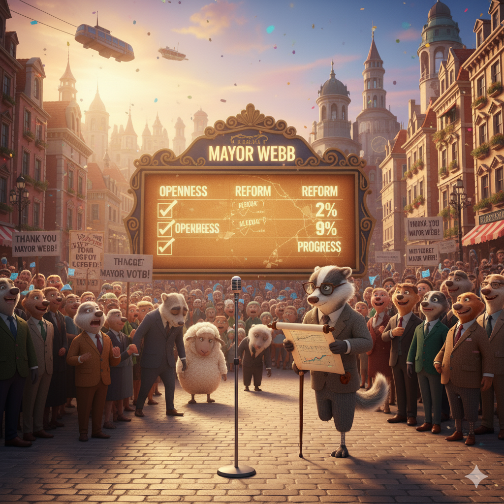

# The Mayor of Sherman

The cosmopolitan city of Sherman needed to elect a new mayor. Two men aspired to become mayor: Mr. Jones and Mr. Webb. Mr. Jones was a tall, handsome man. He was a phenomenal speaker, and the citizens loved him. However, Mr. Jones didn’t know much about running a city. He was a pathological liar who merely flattered people with his words. Mr. Webb was very different. He was a small, unattractive man. He was lame and limped when he walked. But he was an expert on politics and knew what was best for the people.

The citizens of Sherman didn’t care about what the politicians had to say. No one listened to Mr. Webb, even though he had great ideas. They cheered when Mr. Jones spoke, although he didn’t talk about important things. His pretty words put people in a trance. All the polls predicted that Mr. Jones would win the election.

When the votes were totaled, Mr. Jones won easily. But when he took office, he didn’t know what to do! He tried to hide his ignorance by working in secrecy. He added a law to the city’s constitution that prevented citizens from seeing the mayor. He even censored newspapers that tried to disseminate information about his inability to help the people.

Soon, however, Mr. Jones became infamous for his poor leadership. There was an outburst of anger among the citizens. They were full of remorse for their misguided decision to elect an ignorant mayor. They voted to remove Mr. Jones and let Mr. Webb take over.

Immediately, Mr. Webb proved that he was a great mayor. He abolished Mr. Jones’s law, and he was willing to talk openly with everyone. He tackled important issues and amended unfair laws in the city’s charter.

The citizens learned that a pleasant appearance and nice words do not make a good leader. The most important qualities are intelligence and a desire to help others.

## Sentences of story

The Mayor of Sherman

The cosmopolitan city of Sherman needed to elect a new mayor.

Two men aspired to become mayor: Mr. Jones and Mr. Webb.

Mr. Jones was a tall, handsome man.

He was a phenomenal speaker, and the citizens loved him.

However, Mr. Jones didn’t know much about running a city.

He was a pathological liar who merely flattered people with his words.

Mr. Webb was very different.

He was a small, unattractive man.

He was lame and limped when he walked.

But he was an expert on politics and knew what was best for the people.

The citizens of Sherman didn’t care about what the politicians had to say.

No one listened to Mr. Webb, even though he had great ideas.

They cheered when Mr. Jones spoke, although he didn’t talk about important things.

His pretty words put people in a trance.

All the polls predicted that Mr. Jones would win the election.

When the votes were totaled, Mr. Jones won easily.

But when he took office, he didn’t know what to do!

He tried to hide his ignorance by working in secrecy.

He added a law to the city’s constitution that prevented citizens from seeing the mayor.

He even censored newspapers that tried to disseminate information about his inability to help the people.

Soon, however, Mr. Jones became infamous for his poor leadership.

There was an outburst of anger among the citizens.

They were full of remorse for their misguided decision to elect an ignorant mayor.

They voted to remove Mr. Jones and let Mr. Webb take over.

Immediately, Mr. Webb proved that he was a great mayor.

He abolished Mr. Jones’s law, and he was willing to talk openly with everyone.

He tackled important issues and amended unfair laws in the city’s charter.

The citizens learned that a pleasant appearance and nice words do not make a good leader.

The most important qualities are intelligence and a desire to help others.

## List of word

abolish, amend, aspire, censor, charter, constitution, cosmopolitan, disseminate, flatter, infamous, lame, limp, outburst, pathological, phenomenal, poll, remorse, secrecy, tackle, trance

## 1. abolish

### IPA: /əˈbɒl.ɪʃ/
### Class: v
### Câu truyện ẩn dụ:

`Ơ bồ` (abo) `lít` (lish) rượu này đi, chúng ta nên **hủy bỏ** thói quen nhậu nhẹt.

### Định nghĩa : 
Hủy bỏ, bãi bỏ (một luật lệ, hệ thống).

### English definition: 
To formally put an end to a system, practice, or institution.

### Sentence of stroy:
He **abolished** Mr. Jones’s law, and he was willing to talk openly with everyone.

## 2. amend

### IPA: /əˈmend/
### Class: v
### Câu truyện ẩn dụ:

`Ơ mèn` (amend) ơi, cái luật này sai quá, phải **sửa đổi** lại thôi.

### Định nghĩa : 
Sửa đổi, cải thiện (văn bản, luật pháp).

### English definition: 
To make minor changes to a text, piece of legislation, etc., in order to make it fairer, more accurate, or more up-to-date.

### Sentence of stroy:
He tackled important issues and **amended** unfair laws in the city’s charter.

## 3. aspire

### IPA: /əˈspaɪər/
### Class: v
### Câu truyện ẩn dụ:

`Ơ spa` (aspire) này, tôi **khao khát** được làm việc ở đây.

### Định nghĩa : 
Khao khát, mong muốn.

### English definition: 
To have a strong wish or hope to do or have something.

### Sentence of stroy:
Two men **aspired** to become mayor: Mr. Jones and Mr. Webb.

## 4. censor

### IPA: /ˈsen.sər/
### Class: v
### Câu truyện ẩn dụ:

`Xe sơ` (censor) sài quá nên bị **kiểm duyệt** và cấm lưu hành.

### Định nghĩa : 
Kiểm duyệt (sách, báo, phim ảnh).

### English definition: 
To examine books, movies, etc., and remove things that are considered to be offensive, immoral, or harmful.

### Sentence of stroy:
He even **censored** newspapers that tried to disseminate information about his inability to help the people.

## 5. charter

### IPA: /ˈtʃɑː.tər/
### Class: n
### Câu truyện ẩn dụ:

Người `cha tớ` (charter) đã viết ra bản **hiến chương** cho công ty.

### Định nghĩa : 
Hiến chương, điều lệ.

### English definition: 
A formal statement of the rights of a country's people, or of an organization or a particular social group, that is agreed by or given to them by a ruler or government.

### Sentence of stroy:
He tackled important issues and amended unfair laws in the city’s **charter**.

## 6. constitution

### IPA: /ˌkɒn.stɪˈtʃuː.ʃən/
### Class: n
### Câu truyện ẩn dụ:

`Con sợ tí tu sờn` (constitution) rách mất quyển **hiến pháp** quý giá này.

### Định nghĩa : 
Hiến pháp.

### English definition: 
The set of political principles by which a state or organization is governed, especially in relation to the rights of the people it governs.

### Sentence of stroy:
He added a law to the city’s **constitution** that prevented citizens from seeing the mayor.

## 7. cosmopolitan

### IPA: /ˌkɒz.məˈpɒl.ɪ.tən/
### Class: adj
### Câu truyện ẩn dụ:

`Có mô` (cosmo) `bồ ly Tần` (politan) Thủy Hoàng không? Ở thành phố **toàn thế giới** này chắc là có.

### Định nghĩa : 
Thuộc toàn thế giới, quốc tế.

### English definition: 
Containing or having experience of people and things from many different parts of the world.

### Sentence of stroy:
The **cosmopolitan** city of Sherman needed to elect a new mayor.

## 8. disseminate

### IPA: /dɪˈsem.ɪ.neɪt/
### Class: v
### Câu truyện ẩn dụ:

`Đi xem mi nết` (disseminate) tốt thì phải **phổ biến**, **gieo rắc** cho mọi người học tập.

### Định nghĩa : 
Phổ biến, gieo rắc (thông tin, ý tưởng).

### English definition: 
To spread or give out something, especially news, information, ideas, etc., to a lot of people.

### Sentence of stroy:
He even censored newspapers that tried to **disseminate** information about his inability to help the people.

## 9. flatter

### IPA: /ˈflæt.ər/
### Class: v
### Câu truyện ẩn dụ:

Cái bánh `phá lấu tơ` (flatter) này ngon quá, tôi không phải đang **nịnh bợ** đâu.

### Định nghĩa : 
Tâng bốc, nịnh bợ.

### English definition: 
To praise someone in order to make them feel attractive or important, sometimes in a way that is not sincere.

### Sentence of stroy:
He was a pathological liar who merely **flattered** people with his words.

## 10. infamous

### IPA: /ˈɪn.fə.məs/
### Class: adj
### Câu truyện ẩn dụ:

`Trong phim` (infam) `Mỹ` (ous), hắn là một tên tội phạm **khét tiếng**.

### Định nghĩa : 
Khét tiếng, tai tiếng.

### English definition: 
Famous for something considered bad.

### Sentence of stroy:
Soon, however, Mr. Jones became **infamous** for his poor leadership.

## 11. lame

### IPA: /leɪm/
### Class: adj
### Câu truyện ẩn dụ:

Anh ấy bị ngã xe nên chân đi **què**, `lêm` (lame) khêm.

### Định nghĩa : 
Què, khập khiễng.

### English definition: 
(of a person or animal) unable to walk normally because of an injury or illness affecting the leg or foot.

### Sentence of stroy:
He was **lame** and limped when he walked.

## 12. limp

### IPA: /lɪmp/
### Class: v
### Câu truyện ẩn dụ:

Chân đau nên anh ấy phải **đi khập khiễng**, trông như đang múa `li-m` (limp) bo.

### Định nghĩa : 
Đi khập khiễng.

### English definition: 
To walk with difficulty because of a damaged or stiff leg or foot.

### Sentence of stroy:
He was lame and **limped** when he walked.

## 13. outburst

### IPA: /ˈaʊt.bɜːst/
### Class: n
### Câu truyện ẩn dụ:

`Ngoài bớt` (outburst) nóng giận đi, **sự bùng nổ** cảm xúc này không giải quyết được gì đâu.

### Định nghĩa : 
Sự bùng nổ (cảm xúc).

### English definition: 
A sudden forceful expression of emotion, especially anger.

### Sentence of stroy:
There was an **outburst** of anger among the citizens.

## 14. pathological

### IPA: /ˌpæθ.əˈlɒdʒ.ɪ.kəl/
### Class: adj
### Câu truyện ẩn dụ:

`Bà thỏ lò dí cồ` (pathological) vào lửa là một hành động **bệnh hoạn**, không bình thường.

### Định nghĩa : 
Bệnh hoạn, không bình thường (về hành vi).

### English definition: 
(of a person) unable to control part of their behavior; unreasonable.

### Sentence of stroy:
He was a **pathological** liar who merely flattered people with his words.

## 15. phenomenal

### IPA: /fəˈnɒm.ɪ.nəl/
### Class: adj
### Câu truyện ẩn dụ:

`Phí nọ mì nờ` (phenomenal) là bao nhiêu cho một bữa ăn **phi thường** như thế này?

### Định nghĩa : 
Phi thường, ấn tượng.

### English definition: 
Extremely successful or special, especially in a surprising way.

### Sentence of stroy:
He was a **phenomenal** speaker, and the citizens loved him.

## 16. poll

### IPA: /pəʊl/
### Class: n
### Câu truyện ẩn dụ:

Cuộc **thăm dò ý kiến** cho thấy mọi người thích ăn `bò` (po) `lúc lắc` (ll) hơn.

### Định nghĩa : 
Cuộc thăm dò ý kiến, cuộc bỏ phiếu.

### English definition: 
A study in which people are asked for their opinions about a subject or person.

### Sentence of stroy:
All the **polls** predicted that Mr. Jones would win the election.

## 17. remorse

### IPA: /rɪˈmɔːs/
### Class: n
### Câu truyện ẩn dụ:

Anh ta tỏ ra **hối hận** vì đã `rì mót` (remorse) hết đồ ăn của bạn.

### Định nghĩa : 
Sự ăn năn, hối hận.

### English definition: 
A feeling of sadness and being sorry for something you have done.

### Sentence of stroy:
They were full of **remorse** for their misguided decision to elect an ignorant mayor.

## 18. secrecy

### IPA: /ˈsiː.krə.si/
### Class: n
### Câu truyện ẩn dụ:

`Sợ cờ ra xi` (secrecy) nên họ phải hành động trong **sự bí mật**.

### Định nghĩa : 
Sự bí mật, sự giữ kín.

### English definition: 
The state of being secret or of keeping something secret.

### Sentence of stroy:
He tried to hide his ignorance by working in **secrecy**.

## 19. tackle

### IPA: /ˈtæk.əl/
### Class: v
### Câu truyện ẩn dụ:

Để **giải quyết** vấn đề, anh ấy đã `tắc cồ` (tackle) họng đối thủ trong trận đấu.

### Định nghĩa : 
Giải quyết, xử lý (một vấn đề).

### English definition: 
To try to deal with something or someone.

### Sentence of stroy:
He **tackled** important issues and amended unfair laws in the city’s charter.

## 20. trance

### IPA: /trɑːns/
### Class: n
### Câu truyện ẩn dụ:

Anh ấy nhìn cô gái đẹp như đang ở trong **trạng thái mê mẩn**, `trán` (trance) đẫm mồ hôi.

### Định nghĩa : 
Trạng thái mê mẩn, hôn mê.

### English definition: 
A state in which you are not aware of what is happening around you, but are able to think, see, etc.

### Sentence of stroy:
His pretty words put people in a **trance**.