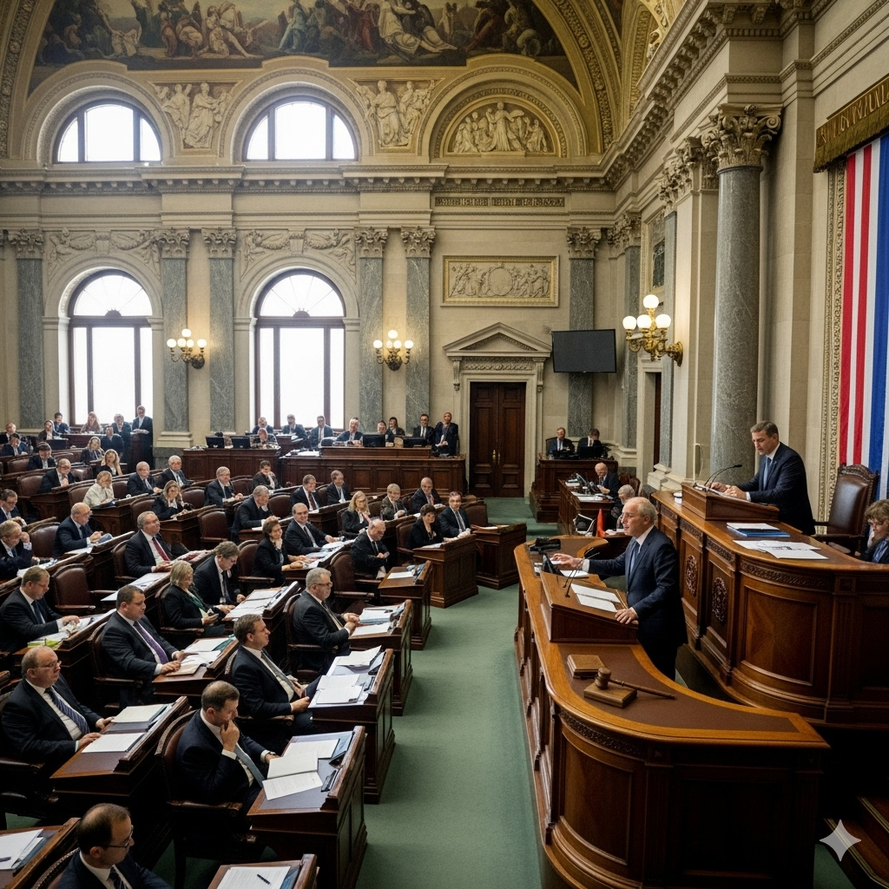
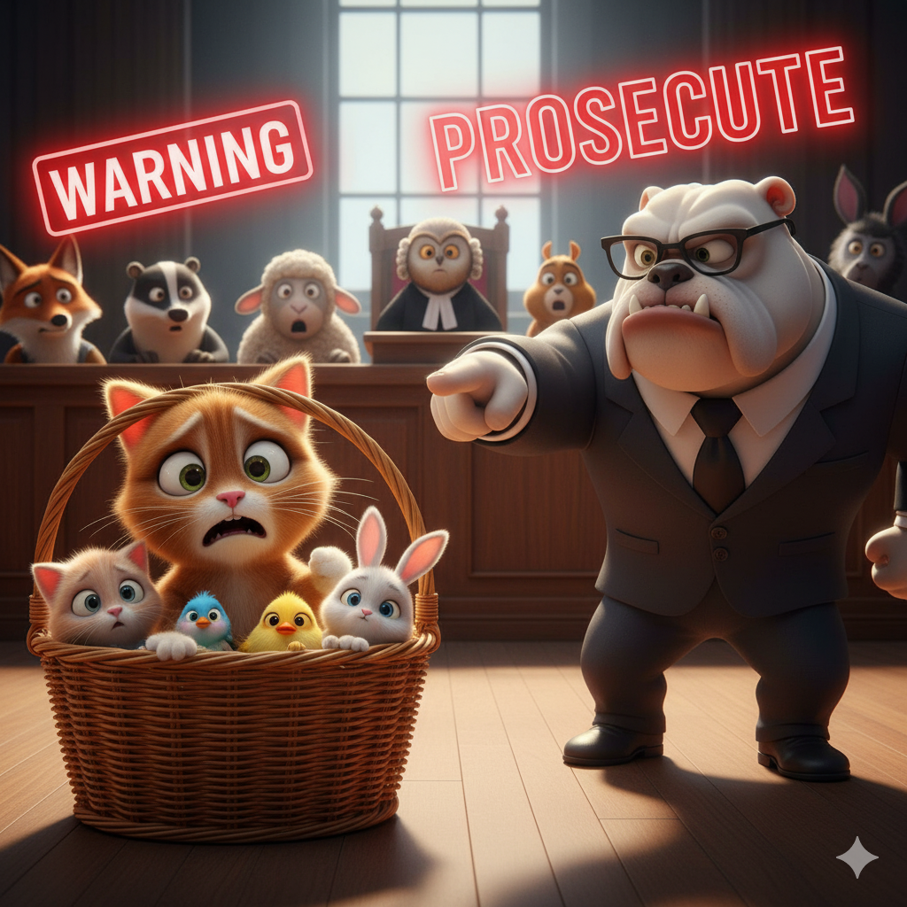

# The Editor’s Choice

A newspaper editor sat at his desk and stared at the flashing cursor on his computer’s screen. He didn’t know if he should delete the article he had just written or go ahead and publish it. He was scared and filled with doubt.

The empire had passed a new law stating that citizens could only use the imperial language. The editor disagreed with the law and decided to write an article about why it was wrong. He felt that the new law excluded people of different nationalities and racial and ethnic backgrounds. He had firsthand knowledge of what it feels like not to be fluent in the imperial language because he was from a remote part of the empire.

He felt that the empire shouldn’t be monolingual and should be more inclusive. Yet he was afraid that he would get in trouble for having this belief. Many would say that he was not a patriot—that he didn’t love the empire. But he didn’t wish to undermine the authority of the empire. He wanted to argue that the empire could be stronger if it accepted people of various cultures and beliefs.

At last, he decided to stop being a coward and to be earnest about how he felt. He wrote the article. It wasn’t rude or angry, but rather, very solemn and intelligent. The next day it was published in all the papers.

Everyone was impressed by his tact and showed solidarity with his ideas. He expected to be arrested any day, but the police never came. Surprisingly, instead of being prosecuted, he became a hero. The legislature changed the law, and people from many linguistic backgrounds praised him.

"Never be afraid to be vocal," the editor later wrote. "If you think something is wrong, then stand up for what you believe."

## Sentences of story

The Editor’s Choice

A newspaper editor sat at his desk and stared at the flashing cursor on his computer’s screen.

He didn’t know if he should delete the article he had just written or go ahead and publish it.

He was scared and filled with doubt.

The empire had passed a new law stating that citizens could only use the imperial language.

The editor disagreed with the law and decided to write an article about why it was wrong.

He felt that the new law excluded people of different nationalities and racial and ethnic backgrounds.

He had firsthand knowledge of what it feels like not to be fluent in the imperial language because he was from a remote part of the empire.

He felt that the empire shouldn’t be monolingual and should be more inclusive.

Yet he was afraid that he would get in trouble for having this belief.

Many would say that he was not a patriot—that he didn’t love the empire.

But he didn’t wish to undermine the authority of the empire.

He wanted to argue that the empire could be stronger if it accepted people of various cultures and beliefs.

At last, he decided to stop being a coward and to be earnest about how he felt.

He wrote the article.

It wasn’t rude or angry, but rather, very solemn and intelligent.

The next day it was published in all the papers.

Everyone was impressed by his tact and showed solidarity with his ideas.

He expected to be arrested any day, but the police never came.

Surprisingly, instead of being prosecuted, he became a hero.

The legislature changed the law, and people from many linguistic backgrounds praised him.

"Never be afraid to be vocal," the editor later wrote.

"If you think something is wrong, then stand up for what you believe."

## List of word

coward, delete, firsthand, earnest, ethnic, exclude, fluent, imperial, inclusive, legislature, linguistic, monolingual, nationality, patriot, prosecute, racial, solemn, solidarity, tact, undermine

## 1. coward

### IPA: /ˈkaʊ.əd/
### Class: n
### Câu truyện ẩn dụ:

`Cao` (cow) `quá` (ard), tôi không dám leo, tôi là một kẻ **hèn nhát**.

### Định nghĩa : 
Kẻ hèn nhát, nhút nhát.

### English definition: 
A person who is not brave and is too eager to avoid danger, difficulty, or pain.

### Sentence of stroy:
At last, he decided to stop being a **coward** and to be earnest about how he felt.

## 2. delete

### IPA: /dɪˈliːt/
### Class: v
### Câu truyện ẩn dụ:

`Đi Lít` (delete) ơi, **xóa** giùm tớ file này với.

### Định nghĩa : 
Xóa bỏ.

### English definition: 
To remove something, especially written or computer-stored information.

### Sentence of stroy:
He didn’t know if he should **delete** the article he had just written or go ahead and publish it.

## 3. firsthand

### IPA: /ˌfɜːstˈhænd/
### Class: adj
### Câu truyện ẩn dụ:

Tôi có **kinh nghiệm trực tiếp** khi `phớt` (first) `kem lên tay` (hand) mình.

### Định nghĩa : 
Trực tiếp, tận mắt.

### English definition: 
Obtained or experienced yourself.

### Sentence of stroy:
He had **firsthand** knowledge of what it feels like not to be fluent in the imperial language because he was from a remote part of the empire.

## 4. earnest

### IPA: /ˈɜː.nɪst/
### Class: adj
### Câu truyện ẩn dụ:

Anh ấy `ở gần nhất` (earnest) với sếp vì anh ấy rất **đứng đắn**, **nghiêm túc**.

### Định nghĩa : 
Đứng đắn, nghiêm túc, chân thành.

### English definition: 
Serious and sincere.

### Sentence of stroy:
At last, he decided to stop being a coward and to be **earnest** about how he felt.

## 5. ethnic

### IPA: /ˈeθ.nɪk/
### Class: adj
### Câu truyện ẩn dụ:

`Ếch nít` (ethnic) là món ăn đặc trưng của một nhóm **dân tộc** thiểu số.

### Định nghĩa : 
Thuộc dân tộc, sắc tộc.

### English definition: 
Relating to a particular race of people.

### Sentence of stroy:
He felt that the new law excluded people of different nationalities and racial and **ethnic** backgrounds.

## 6. exclude

### IPA: /ɪkˈskluːd/
### Class: v
### Câu truyện ẩn dụ:

`Ích kỉ lu bu` (exclude) nên anh ta bị **loại trừ** khỏi nhóm.

### Định nghĩa : 
Loại trừ, không bao gồm.

### English definition: 
To prevent someone or something from entering a place or taking part in an activity.

### Sentence of stroy:
He felt that the new law **excluded** people of different nationalities and racial and ethnic backgrounds.

## 7. fluent

### IPA: /ˈfluː.ənt/
### Class: adj
### Câu truyện ẩn dụ:

Anh ấy nói tiếng Anh `phù, luôn` (fluent), thật là **lưu loát**.

### Định nghĩa : 
Trôi chảy, lưu loát (về ngôn ngữ).

### English definition: 
Able to speak or write a language easily, well, and quickly.

### Sentence of stroy:
He had firsthand knowledge of what it feels like not to be **fluent** in the imperial language because he was from a remote part of the empire.

## 8. imperial

### IPA: /ɪmˈpɪə.ri.əl/
### Class: adj
### Câu truyện ẩn dụ:

`Im đi, bồ` (impe) `rảnh` (rial) quá, dám nói xấu hoàng gia, đây là luật lệ của **đế quốc**.

### Định nghĩa : 
Thuộc đế quốc, hoàng gia.

### English definition: 
Belonging or relating to an empire or the person or country that rules it.

### Sentence of stroy:
The empire had passed a new law stating that citizens could only use the **imperial** language.

## 9. inclusive

### IPA: /ɪnˈkluː.sɪv/
### Class: adj
### Câu truyện ẩn dụ:

`Trong khu` (inclu) `đó có ship` (sive) không? Chính sách của họ là **bao trùm**, **gồm tất cả** mọi nơi.

### Định nghĩa : 
Bao gồm, không loại trừ.

### English definition: 
Including all the services or items normally expected or required.

### Sentence of stroy:
He felt that the empire shouldn’t be monolingual and should be more **inclusive**.

## 10. legislature

### IPA: /ˈledʒ.ɪ.slə.tʃər/
### Class: n
### Câu truyện ẩn dụ:

`Lén giết sư` (legisla) `cha` (ture) là tội lớn, **cơ quan lập pháp** sẽ trừng trị.

### Định nghĩa : 
Cơ quan lập pháp, quốc hội.

### English definition: 
The group of people in a country or part of a country who have the power to make and change laws.

### Sentence of stroy:
The **legislature** changed the law, and people from many linguistic backgrounds praised him.

## 11. linguistic

### IPA: /lɪŋˈɡwɪs.tɪk/
### Class: adj
### Câu truyện ẩn dụ:

`Linh quý` (linguis) `tích` (tic) trữ nhiều sách **thuộc về ngôn ngữ**.

### Định nghĩa : 
Thuộc về ngôn ngữ, ngôn ngữ học.

### English definition: 
Connected with language or the study of language.

### Sentence of stroy:
The legislature changed the law, and people from many **linguistic** backgrounds praised him.

## 12. monolingual

### IPA: /ˌmɒn.əʊˈlɪŋ.ɡwəl/
### Class: adj
### Câu truyện ẩn dụ:

`Mẹ nó Linh` (monolin) `gồ` (gual) lưng học một thứ tiếng, nên giờ nó chỉ là người **đơn ngữ**.

### Định nghĩa : 
Đơn ngữ, chỉ nói một thứ tiếng.

### English definition: 
Speaking or using only one language.

### Sentence of stroy:
He felt that the empire shouldn’t be **monolingual** and should be more inclusive.

## 13. nationality

### IPA: /ˌnæʃ.ənˈæl.ə.ti/
### Class: n
### Câu truyện ẩn dụ:

`Nà, sợ nó li tì` (nationality) là sai, **quốc tịch** của anh ấy rõ ràng lắm.

### Định nghĩa : 
Quốc tịch.

### English definition: 
The official right to belong to a particular country.

### Sentence of stroy:
He felt that the new law excluded people of different **nationalities** and racial and ethnic backgrounds.

## 14. patriot

### IPA: /ˈpæt.ri.ət/
### Class: n
### Câu truyện ẩn dụ:

Người **yêu nước** chân chính sẽ không `bẻ trì` (patri) `ớt` (ot) của dân.

### Định nghĩa : 
Người yêu nước.

### English definition: 
A person who loves their country and, if necessary, will fight for it.

### Sentence of stroy:
Many would say that he was not a **patriot**—that he didn’t love the empire.

## 15. prosecute

### IPA: /ˈprɒs.ɪ.kjuːt/
### Class: v
### Câu truyện ẩn dụ:

`Bỏ rổ si` (prose) `cút` (cute) đi, nếu không cậu sẽ bị **truy tố**.

### Định nghĩa : 
Truy tố, khởi tố.

### English definition: 
To officially accuse someone of committing a crime in a law court.

### Sentence of stroy:
Surprisingly, instead of being **prosecuted**, he became a hero.

## 16. racial

### IPA: /ˈreɪ.ʃəl/
### Class: adj
### Câu truyện ẩn dụ:

`Ray sờ` (racial) vào người khác màu da là hành vi phân biệt **chủng tộc**.

### Định nghĩa : 
Thuộc chủng tộc.

### English definition: 
Relating to a person's race.

### Sentence of stroy:
He felt that the new law excluded people of different nationalities and **racial** and ethnic backgrounds.

## 17. solemn

### IPA: /ˈsɒl.əm/
### Class: adj
### Câu truyện ẩn dụ:

`Sợ lầm` (solemn) nên anh ấy giữ vẻ mặt **trang nghiêm** trong buổi lễ.

### Định nghĩa : 
Trang nghiêm, nghiêm nghị.

### English definition: 
Serious and without any humor.

### Sentence of stroy:
It wasn’t rude or angry, but rather, very **solemn** and intelligent.

## 18. solidarity

### IPA: /ˌsɒl.ɪˈdær.ə.ti/
### Class: n
### Câu truyện ẩn dụ:

`Sợ ly tan` (solida) nên `rủ đi` (rity) cùng nhau để thể hiện **sự đoàn kết**.

### Định nghĩa : 
Sự đoàn kết, tình đoàn kết.

### English definition: 
Agreement between and support for the members of a group, especially a political group.

### Sentence of stroy:
Everyone was impressed by his tact and showed **solidarity** with his ideas.

## 19. tact

### IPA: /tækt/
### Class: n
### Câu truyện ẩn dụ:

Anh ấy `tách` (tact) hai người đang cãi nhau ra một cách đầy **khéo léo**, **tế nhị**.

### Định nghĩa : 
Sự khéo léo, tế nhị (trong ứng xử).

### English definition: 
The ability to say or do the right thing in order to avoid offending or upsetting someone.

### Sentence of stroy:
Everyone was impressed by his **tact** and showed solidarity with his ideas.

## 20. undermine

### IPA: /ˌʌn.dəˈmaɪn/
### Class: v
### Câu truyện ẩn dụ:

`Ấn đè mai` (undermine) xuống để **làm suy yếu** nền móng của nó.

### Định nghĩa : 
Làm suy yếu, phá hoại ngầm.

### English definition: 
To make someone less confident, less powerful, or less likely to succeed, or to make something weaker, often gradually.

### Sentence of stroy:
But he didn’t wish to **undermine** the authority of the empire.