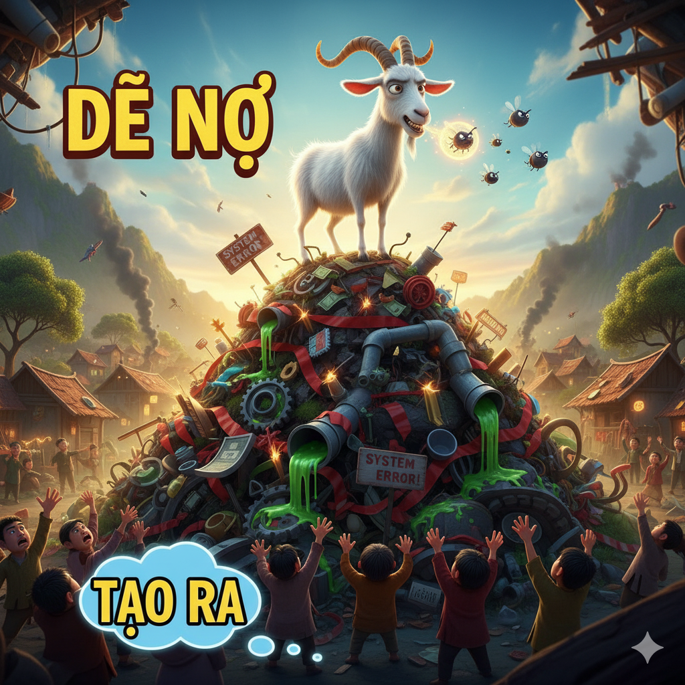
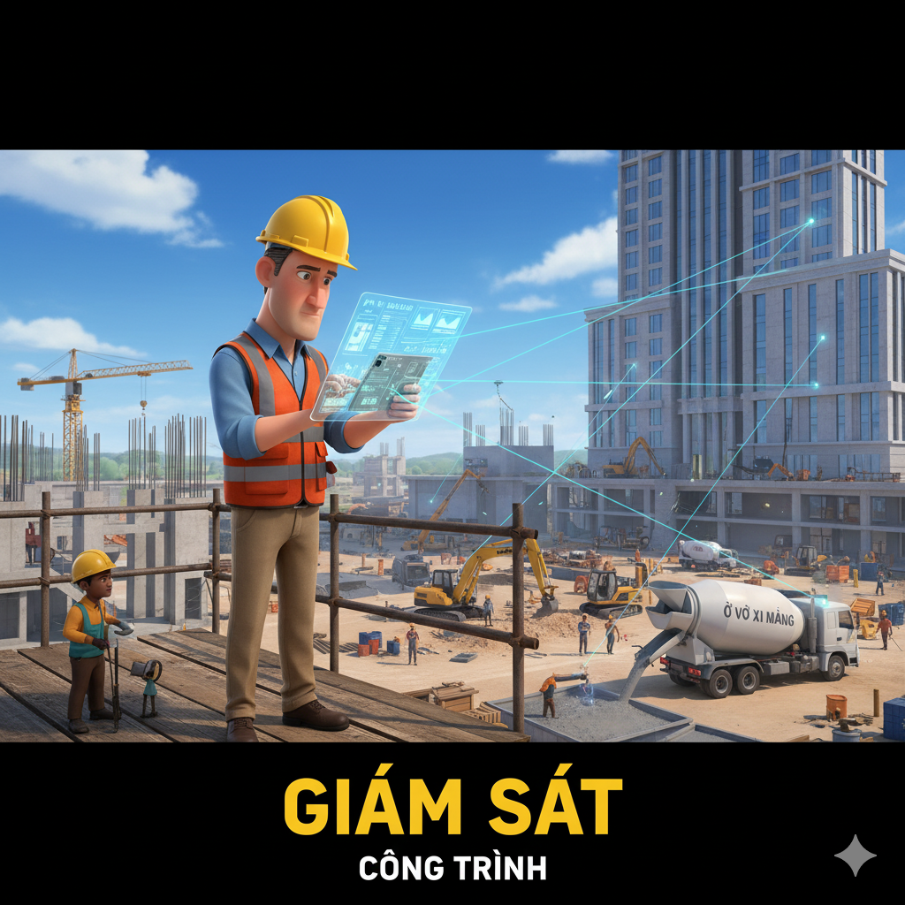

# The Ice House

Last year, Erik constructed one of the world’s strangest houses in the glacial landscape of northern Sweden. He called it the Ice House: a house made entirely of ice and snow. All of the beds, chairs, tables, and walls are cold, hard sculptures of ice.

A group of architects and volunteers from all over the world traveled to the site of the Ice House and began its construction. The multicultural group journeyed through blizzards and frigid temperatures to reach the site. Once the builders arrived, there was an interchange of ideas, and tools were allocated to each worker. An expert was selected to oversee the building process to make sure there was no discord between the workers. Once a plan was generated, they got right to work. The design was very unique; the builders couldn’t replicate the design from normal houses.

The first step was to build the walls and ceiling. The builders used a metal frame to help them build the structure. After the ice was in place, the frame was removed. The builders then created furniture and art pieces. Designs were carved into each piece. One worker carved big wavy lines, and another made tiny clockwise, concentric circles. Finally, the workers carved small cavities in the roof and inserted colored lights. When the work was finished, the beautiful house was ready for a resident to enjoy.

Living in the Ice House is an experience like no other. Erik stores his belongings in an ice locker and lays out a sleeping bag on his ice bed. At dinner, he dines on a delicious salad with crisp toppings. And for the main course, he enjoys appetizing fish caught from a nearby river. The fish are pierced with icicles and served on ice plates. After dinner, he gets ready for a cold night. The omission of heaters can be too much for his visitors sometimes. Luckily, there are warm rooms nearby, as a courtesy to people who get too cold.

## Sentences of story

The Ice House

Last year, Erik constructed one of the world’s strangest houses in the glacial landscape of northern Sweden.

He called it the Ice House: a house made entirely of ice and snow.

All of the beds, chairs, tables, and walls are cold, hard sculptures of ice.

A group of architects and volunteers from all over the world traveled to the site of the Ice House and began its construction.

The multicultural group journeyed through blizzards and frigid temperatures to reach the site.

Once the builders arrived, there was an interchange of ideas, and tools were allocated to each worker.

An expert was selected to oversee the building process to make sure there was no discord between the workers.

Once a plan was generated, they got right to work.

The design was very unique; the builders couldn’t replicate the design from normal houses.

The first step was to build the walls and ceiling.

The builders used a metal frame to help them build the structure.

After the ice was in place, the frame was removed.

The builders then created furniture and art pieces.

Designs were carved into each piece.

One worker carved big wavy lines, and another made tiny clockwise, concentric circles.

Finally, the workers carved small cavities in the roof and inserted colored lights.

When the work was finished, the beautiful house was ready for a resident to enjoy.

Living in the Ice House is an experience like no other.

Erik stores his belongings in an ice locker and lays out a sleeping bag on his ice bed.

At dinner, he dines on a delicious salad with crisp toppings.

And for the main course, he enjoys appetizing fish caught from a nearby river.

The fish are pierced with icicles and served on ice plates.

After dinner, he gets ready for a cold night.

The omission of heaters can be too much for his visitors sometimes.

Luckily, there are warm rooms nearby, as a courtesy to people who get too cold.

## List of word

allocate, appetizing, blizzard, cavity, clockwise, concentric, courtesy, crisp, discord, frigid, generate, glacial, interchange, locker, multicultural, omission, oversee, pierce, replicate, wavy

## 1. allocate

### IPA: /ˈæl.ə.keɪt/
### Class: v
### Câu truyện ẩn dụ:

`Ở đâu` (allo) `cất` (cate) đồ thì **phân bổ** cho hợp lý.

### Định nghĩa : 
Phân bổ, phân phát.

### English definition: 
To give something to someone as their share of a total amount, to use in a particular way.

### Sentence of stroy:
Once the builders arrived, there was an interchange of ideas, and tools were **allocated** to each worker.

## 2. appetizing

### IPA: /ˈæp.ə.taɪ.zɪŋ/
### Class: adj
### Câu truyện ẩn dụ:

`Ăn bơ tái` (appe-ti) `zing` (zing) lên thì **ngon miệng** lắm.

### Định nghĩa : 
Ngon miệng, hấp dẫn.

### English definition: 
Appetizing food or drink smells or looks attractive.

### Sentence of stroy:
And for the main course, he enjoys **appetizing** fish caught from a nearby river.

## 3. blizzard

### IPA: /ˈblɪz.əd/
### Class: n
### Câu truyện ẩn dụ:

`Bò lí` (bliz) `zô` (zard) chuồng vì có **bão tuyết**.

### Định nghĩa : 
Bão tuyết.

### English definition: 
A severe snow storm with strong winds.

### Sentence of stroy:
The multicultural group journeyed through **blizzards** and frigid temperatures to reach the site.

## 4. cavity

### IPA: /ˈkæv.ə.ti/
### Class: n
### Câu truyện ẩn dụ:

`Ca sĩ Vy` (cavity) bị sâu răng tạo ra một cái **lỗ hổng**.

### Định nghĩa : 
Lỗ hổng, khoang.

### English definition: 
A hole, or an empty space between two surfaces.

### Sentence of stroy:
Finally, the workers carved small **cavities** in the roof and inserted colored lights.

## 5. clockwise

### IPA: /ˈklɒk.waɪz/
### Class: adv
### Câu truyện ẩn dụ:

`Cờ lóc` (clock) `quai` (wise) quay **theo chiều kim đồng hồ**.

### Định nghĩa : 
Theo chiều kim đồng hồ.

### English definition: 
In the same direction as the hands of a clock move.

### Sentence of stroy:
One worker carved big wavy lines, and another made tiny **clockwise**, concentric circles.

## 6. concentric

### IPA: /kənˈsen.trɪk/
### Class: adj
### Câu truyện ẩn dụ:

`Con sên` (concen) `trích` (tric) vẽ những vòng tròn **đồng tâm**.

### Định nghĩa : 
Đồng tâm.

### English definition: 
Concentric circles or rings have the same center.

### Sentence of stroy:
One worker carved big wavy lines, and another made tiny clockwise, **concentric** circles.

## 7. courtesy

### IPA: /ˈkɜː.tə.si/
### Class: n
### Câu truyện ẩn dụ:

`Có tờ giấy` (courte) `xịn` (sy) là một **sự lịch sự**, **nhã nhặn** khi tặng quà.

### Định nghĩa : 
Sự lịch sự, nhã nhặn.

### English definition: 
Polite behavior, or a polite action or remark.

### Sentence of stroy:
Luckily, there are warm rooms nearby, as a **courtesy** to people who get too cold.

## 8. crisp

### IPA: /krɪsp/
### Class: adj
### Câu truyện ẩn dụ:

Khoai tây chiên `cờ rít` (crisp) lên khi ăn vì nó rất **giòn**.

### Định nghĩa : 
Giòn, cứng và tươi.

### English definition: 
(of food) hard enough to be broken easily instead of bent.

### Sentence of stroy:
At dinner, he dines on a delicious salad with **crisp** toppings.

## 9. discord

### IPA: /ˈdɪs.kɔːd/
### Class: n
### Câu truyện ẩn dụ:

`Đi có` (dis-co) `đờn` (rd) mà còn cãi nhau thì thật là **bất hòa**.

### Định nghĩa : 
Sự bất hòa, mối bất đồng.

### English definition: 
The state of not agreeing or sharing opinions.

### Sentence of stroy:
An expert was selected to oversee the building process to make sure there was no **discord** between the workers.

## 10. frigid

### IPA: /ˈfrɪdʒ.ɪd/
### Class: adj
### Câu truyện ẩn dụ:

`Free ship` (fri) `đồ` (gid) đến nơi **lạnh giá**, **băng giá** này không?

### Định nghĩa : 
Lạnh giá, băng giá.

### English definition: 
(of weather conditions or the conditions in a room) extremely cold.

### Sentence of stroy:
The multicultural group journeyed through blizzards and **frigid** temperatures to reach the site.

## 11. generate

### IPA: /ˈdʒen.ə.reɪt/
### Class: v
### Câu truyện ẩn dụ:

`Dê nợ` (gene) `rầy` (rate) quá, **tạo ra** nhiều vấn đề.

### Định nghĩa : 
Tạo ra, phát ra.

### English definition: 
To cause something to exist.

### Sentence of stroy:
Once a plan was **generated**, they got right to work.

## 12. glacial

### IPA: /ˈɡleɪ.ʃəl/
### Class: adj
### Câu truyện ẩn dụ:

`Gờ lây` (gla) `sờ` (cial) vào tảng băng **thuộc về băng hà**.

### Định nghĩa : 
Thuộc về băng, băng giá.

### English definition: 
Relating to glaciers or ice.

### Sentence of stroy:
Last year, Erik constructed one of the world’s strangest houses in the **glacial** landscape of northern Sweden.

## 13. interchange

### IPA: /ˈɪn.tə.tʃeɪndʒ/
### Class: n
### Câu truyện ẩn dụ:

`Trong` (inter) `chén` (change) có sự **trao đổi** thức ăn.

### Định nghĩa : 
Sự trao đổi.

### English definition: 
An exchange, especially of ideas or information, between different people or groups.

### Sentence of stroy:
Once the builders arrived, there was an **interchange** of ideas, and tools were allocated to each worker.

## 14. locker

### IPA: /ˈlɒk.ər/
### Class: n
### Câu truyện ẩn dụ:

`Lóc cơ` (locker) thể hình xong, anh ta cất đồ vào **tủ có khóa**.

### Định nghĩa : 
Tủ có khóa (thường ở nơi công cộng).

### English definition: 
A small cupboard, often one of a group, that you can lock and keep your possessions in.

### Sentence of stroy:
Erik stores his belongings in an ice **locker** and lays out a sleeping bag on his ice bed.

## 15. multicultural

### IPA: /ˌmʌl.tiˈkʌl.tʃər.əl/
### Class: adj
### Câu truyện ẩn dụ:

`Món ti` (multi) `khó chờ` (cultural) là đặc sản của vùng đất **đa văn hóa** này.

### Định nghĩa : 
Đa văn hóa.

### English definition: 
Including people who have many different customs and beliefs.

### Sentence of stroy:
The **multicultural** group journeyed through blizzards and frigid temperatures to reach the site.

## 16. omission

### IPA: /əʊˈmɪʃ.ən/
### Class: n
### Câu truyện ẩn dụ:

`Ở mít` (omis) `sần` (sion) có một **sự thiếu sót**, đó là không có hạt.

### Định nghĩa : 
Sự bỏ sót, sự thiếu sót.

### English definition: 
The act of not including something or someone that should have been included.

### Sentence of stroy:
The **omission** of heaters can be too much for his visitors sometimes.

## 17. oversee

### IPA: /ˌəʊ.vəˈsiː/
### Class: v
### Câu truyện ẩn dụ:

`Ở vơ` (over) `xi` (see) măng để **giám sát** công trình.

### Định nghĩa : 
Giám sát, trông nom.

### English definition: 
To watch or organize a job or an activity to make certain that it is being done correctly.

### Sentence of stroy:
An expert was selected to **oversee** the building process to make sure there was no discord between the workers.

## 18. pierce

### IPA: /pɪəs/
### Class: v
### Câu truyện ẩn dụ:

`Bia` (pie) `sờ` (rce) vào lạnh buốt, phải **xuyên** qua lớp đá mới lấy được.

### Định nghĩa : 
Xuyên qua, đâm thủng.

### English definition: 
To go into or through something, making a hole in it using a sharp point.

### Sentence of stroy:
The fish are **pierced** with icicles and served on ice plates.

## 19. replicate

### IPA: /ˈrep.lɪ.keɪt/
### Class: v
### Câu truyện ẩn dụ:

`Rép đi cày` (repli-cate) để **sao chép**, **tái tạo** lại mô hình nông nghiệp cũ.

### Định nghĩa : 
Tái tạo, sao chép.

### English definition: 
To make or do something again in exactly the same way.

### Sentence of stroy:
The design was very unique; the builders couldn’t **replicate** the design from normal houses.

## 20. wavy

### IPA: /ˈweɪ.vi/
### Class: adj
### Câu truyện ẩn dụ:

`Quẩy đi` (wavy) theo điệu nhạc có những đường **gợn sóng**.

### Định nghĩa : 
Gợn sóng, lượn sóng.

### English definition: 
Having a series of curves.

### Sentence of stroy:
One worker carved big **wavy** lines, and another made tiny clockwise, concentric circles.