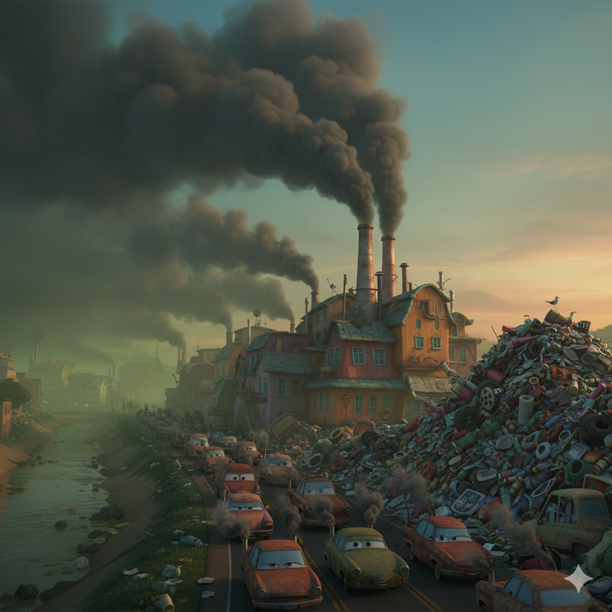
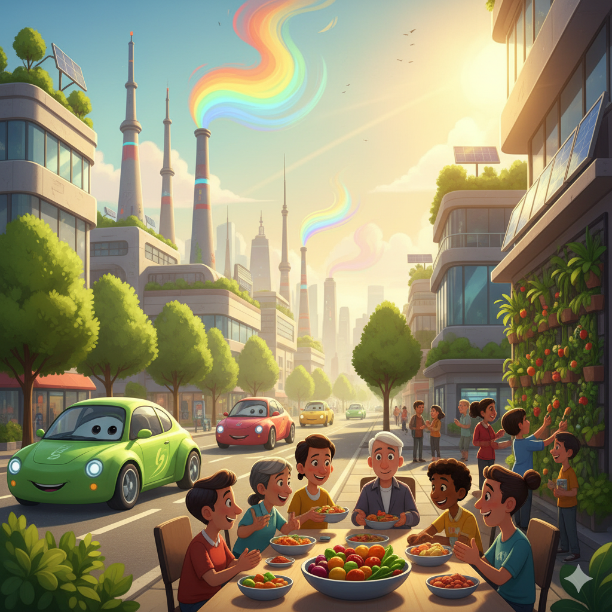
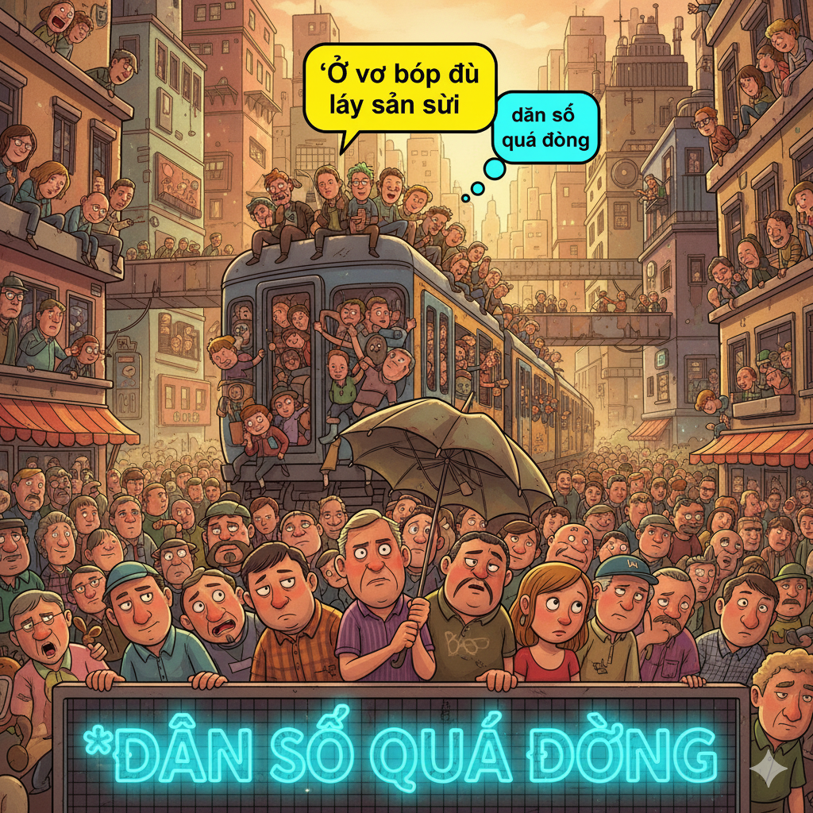

# Preparing for the Future

Overpopulation is a big problem in the world today. Too many people are crammed into cities and towns around the globe. Earth’s population is about 6.5 billion people. This number is growing every day. In just 50 years, the population will be almost 9 billion.

Many people worry that the Earth won’t have enough resources to support so many people. One major reason for this is that wasting resources and polluting have become habitual behaviors. Industrial output results in polluting the air with dangerous fumes. Also, cars and machines waste a ton of important natural resources like oil and water. It’s possible that the Earth may become so damaged that it cannot support a large population of humans.

Another issue is the lack of useful land for cultivating crops. Even today, many people subsist on mere scraps of food and little water. In 50 years, many experts worry that huge numbers of people will starve to death. So what is being done to prepare for the future?

People are realizing they can no longer justify their wasteful behavior or defer action to fix it. Many car companies already have patents on prototypes for very efficient cars. Such cars waste no resources and produce no pollution. A conversion to clean cars means that petroleum can be saved for the future. In addition, the environmental sectors of many governments are setting strict rules for industries that pollute too much. If companies do not abide by the standards, they are penalized with higher taxes. In some cases, their operations might be suspended altogether. Food is also an issue that is being tackled. Many countries are now subscribing to the point of view that immediate action is needed. They are determining ways to export goods to people in need, so that no one goes hungry. Experts will continue to come up with ideas for the future, and a synthesis of these ideas will help to support the growing population.

## Sentences of story

Preparing for the Future

Overpopulation is a big problem in the world today.

Too many people are crammed into cities and towns around the globe.

Earth’s population is about 6.5 billion people.

This number is growing every day.

In just 50 years, the population will be almost 9 billion.

Many people worry that the Earth won’t have enough resources to support so many people.

One major reason for this is that wasting resources and polluting have become habitual behaviors.

Industrial output results in polluting the air with dangerous fumes.

Also, cars and machines waste a ton of important natural resources like oil and water.

It’s possible that the Earth may become so damaged that it cannot support a large population of humans.

Another issue is the lack of useful land for cultivating crops.

Even today, many people subsist on mere scraps of food and little water.

In 50 years, many experts worry that huge numbers of people will starve to death.

So what is being done to prepare for the future?

People are realizing they can no longer justify their wasteful behavior or defer action to fix it.

Many car companies already have patents on prototypes for very efficient cars.

Such cars waste no resources and produce no pollution.

A conversion to clean cars means that petroleum can be saved for the future.

In addition, the environmental sectors of many governments are setting strict rules for industries that pollute too much.

If companies do not abide by the standards, they are penalized with higher taxes.

In some cases, their operations might be suspended altogether.

Food is also an issue that is being tackled.

Many countries are now subscribing to the point of view that immediate action is needed.

They are determining ways to export goods to people in need, so that no one goes hungry.

Experts will continue to come up with ideas for the future, and a synthesis of these ideas will help to support the growing population.

## List of word

abide, conversion, cram, defer, export, fume, habitual, justify, output, overpopulation, patent, penalize, petroleum, prototype, scrap, sector, subscribe, subsist, suspend, synthesis

## 1. abide

### IPA: /əˈbaɪd/
### Class: v
### Câu truyện ẩn dụ:

`Ở bãi` (abide) biển phải **tuân theo** quy định.

### Định nghĩa : 
Tuân theo, tôn trọng.

### English definition: 
To accept or act in accordance with a rule, decision, or recommendation.

### Sentence of stroy:
If companies do not **abide** by the standards, they are penalized with higher taxes.

## 2. conversion

### IPA: /kənˈvɜː.ʃən/
### Class: n
### Câu truyện ẩn dụ:

`Con vơ` (conver) `sờ` (sion) vào cái nút **chuyển đổi**.

### Định nghĩa : 
Sự chuyển đổi, sự biến đổi.

### English definition: 
The process of converting something from one thing to another.

### Sentence of stroy:
A **conversion** to clean cars means that petroleum can be saved for the future.

## 3. cram

### IPA: /kræm/
### Class: v
### Câu truyện ẩn dụ:

`Cả ram` (cram) bánh được **nhồi nhét** vào miệng.

### Định nghĩa : 
Nhồi nhét, tống vào.

### English definition: 
To force a lot of things into a small space.

### Sentence of stroy:
Too many people are **crammed** into cities and towns around the globe.

## 4. defer

### IPA: /dɪˈfɜːr/
### Class: v
### Câu truyện ẩn dụ:

`Đi phờ` (defer) cả người nên phải **trì hoãn** công việc.

### Định nghĩa : 
Trì hoãn, hoãn lại.

### English definition: 
To delay something until a later time.

### Sentence of stroy:
People are realizing they can no longer justify their wasteful behavior or **defer** action to fix it.

## 5. export

### IPA: /ˈek.spɔːt/
### Class: v
### Câu truyện ẩn dụ:

`Ếch to` (ex) `bọt` (port) mép vì phải **xuất khẩu** quá nhiều.

### Định nghĩa : 
Xuất khẩu.

### English definition: 
To send goods to another country in order to sell them there.

### Sentence of stroy:
They are determining ways to **export** goods to people in need, so that no one goes hungry.

## 6. fume

### IPA: /fjuːm/
### Class: n
### Câu truyện ẩn dụ:

`Phim` (fume) ảnh về nhà máy đầy **khói**, **khí độc**.

### Định nghĩa : 
Khói, hơi (độc).

### English definition: 
Strong, unpleasant, and sometimes dangerous gas or smoke.

### Sentence of stroy:
Industrial output results in polluting the air with dangerous **fumes**.

## 7. habitual

### IPA: /həˈbɪtʃ.u.əl/
### Class: adj
### Câu truyện ẩn dụ:

`Hà biết chùa` (habitual) này vì đến đây là **thói quen** của cô ấy.

### Định nghĩa : 
Thuộc về thói quen, thường xuyên.

### English definition: 
Done or doing constantly or as a habit.

### Sentence of stroy:
One major reason for this is that wasting resources and polluting have become **habitual** behaviors.

## 8. justify

### IPA: /ˈdʒʌs.tɪ.faɪ/
### Class: v
### Câu truyện ẩn dụ:

`Chớ đi file` (justify) này, không có lý do gì để **biện minh** cho việc đó đâu.

### Định nghĩa : 
Biện minh, bào chữa.

### English definition: 
To show or prove that something is reasonable or necessary.

### Sentence of stroy:
People are realizing they can no longer **justify** their wasteful behavior or defer action to fix it.

## 9. output

### IPA: /ˈaʊt.pʊt/
### Class: n
### Câu truyện ẩn dụ:

`Ao` (out) `put` (put) cá này có **sản lượng** rất cao.

### Định nghĩa : 
Sản lượng, đầu ra.

### English definition: 
The amount of something produced by a person, machine, or industry.

### Sentence of stroy:
Industrial **output** results in polluting the air with dangerous fumes.

## 10. overpopulation

### IPA: /ˌəʊ.və.pɒp.jəˈleɪ.ʃən/
### Class: n
### Câu truyện ẩn dụ:

`Ở vơ` (over) `bóp dù lấy` (popula) `sần` (tion) sùi cũng phải chịu vì **dân số quá đông**.

### Định nghĩa : 
Sự đông dân quá mức.

### English definition: 
The fact of a country or city having too many people for the amount of food, materials, and space available there.

### Sentence of stroy:
**Overpopulation** is a big problem in the world today.

## 11. patent

### IPA: /ˈpeɪ.tənt/
### Class: n
### Câu truyện ẩn dụ:

`Bé Tần` (patent) đã có **bằng sáng chế** cho phát minh của mình.

### Định nghĩa : 
Bằng sáng chế.

### English definition: 
The official legal right to make or sell an invention for a particular number of years.

### Sentence of stroy:
Many car companies already have **patents** on prototypes for very efficient cars.

## 12. penalize

### IPA: /ˈpiː.nəl.aɪz/
### Class: v
### Câu truyện ẩn dụ:

`Bị nơ` (pena) `lai` (lize) giống nên bị **trừng phạt**.

### Định nghĩa : 
Trừng phạt, xử phạt.

### English definition: 
To cause someone to suffer for breaking a rule or law.

### Sentence of stroy:
If companies do not abide by the standards, they are **penalized** with higher taxes.

## 13. petroleum

### IPA: /pəˈtrəʊ.li.əm/
### Class: n
### Câu truyện ẩn dụ:

`Bé trâu` (petro) `liếm` (leum) phải **dầu mỏ**.

### Định nghĩa : 
Dầu mỏ.

### English definition: 
Oil that is found under the surface of the Earth or the sea bed.

### Sentence of stroy:
A conversion to clean cars means that **petroleum** can be saved for the future.

## 14. prototype

### IPA: /ˈprəʊ.tə.taɪp/
### Class: n
### Câu truyện ẩn dụ:

`Pro` (pro) `tô type` (totype) này là **nguyên mẫu** đầu tiên.

### Định nghĩa : 
Nguyên mẫu, mẫu đầu tiên.

### English definition: 
The first example of a machine or other industrial product, from which all later forms are developed.

### Sentence of stroy:
Many car companies already have patents on **prototypes** for very efficient cars.

## 15. scrap

### IPA: /skræp/
### Class: n
### Câu truyện ẩn dụ:

`Sợ cạp` (scrap) phải **mảnh vụn** sắt.

### Định nghĩa : 
Mảnh vụn, mẩu thừa.

### English definition: 
A small piece of something or a small amount of something.

### Sentence of stroy:
Even today, many people subsist on mere **scraps** of food and little water.

## 16. sector

### IPA: /ˈsek.tər/
### Class: n
### Câu truyện ẩn dụ:

`Sếp tớ` (sector) làm trong **khu vực** kinh tế đối ngoại.

### Định nghĩa : 
Khu vực, lĩnh vực (kinh tế).

### English definition: 
One of the areas into which the economic activity of a country is divided.

### Sentence of stroy:
In addition, the environmental **sectors** of many governments are setting strict rules for industries that pollute too much.

## 17. subscribe

### IPA: /səbˈskraɪb/
### Class: v
### Câu truyện ẩn dụ:

`Súp` (sub) `cờ rai` (scribe) ngon quá, tôi phải **tán thành** quan điểm nên mua dài hạn.

### Định nghĩa : 
Tán thành, đồng ý với (một quan điểm).

### English definition: 
To agree with or support an opinion, theory, etc.

### Sentence of stroy:
Many countries are now **subscribing** to the point of view that immediate action is needed.

## 18. subsist

### IPA: /səbˈsɪst/
### Class: v
### Câu truyện ẩn dụ:

`Sợp` (sub) `xít` (sist) vào nhau để **tồn tại** qua mùa đông.

### Định nghĩa : 
Tồn tại, sinh sống (một cách cầm cự).

### English definition: 
To get enough food or money to stay alive, but no more.

### Sentence of stroy:
Even today, many people **subsist** on mere scraps of food and little water.

## 19. suspend

### IPA: /səˈspend/
### Class: v
### Câu truyện ẩn dụ:

`Sợ sếp` (sus) `bẻn` (pend) gãy cây bút nên công việc bị **đình chỉ**.

### Định nghĩa : 
Đình chỉ, tạm dừng.

### English definition: 
To stop something from being active, either temporarily or permanently.

### Sentence of stroy:
In some cases, their operations might be **suspended** altogether.

## 20. synthesis

### IPA: /ˈsɪn.θə.sɪs/
### Class: n
### Câu truyện ẩn dụ:

`Xin thì` (synthe) `xít` (sis) vào để **tổng hợp** ý kiến.

### Định nghĩa : 
Sự tổng hợp.

### English definition: 
The mixing of different ideas, influences, or things to make a whole that is different, or new.

### Sentence of stroy:
Experts will continue to come up with ideas for the future, and a **synthesis** of these ideas will help to support the growing population.

