# Hundred Plays

Over two thousand years ago, Chinese farmers had a problem. Even though they were very industrious, the weather became too cold outside to plant their staple food, rice. So what did they do? Since they had so much free time during the long, cold winters, the inventive farmers started performing tricks to entertain themselves. They used their farm tools and anything they could find to make their tricks more spectacular. They even twisted their bodies into crazy shapes and performed awesome jumps. Overtime, they became great acrobats, and their art form came to be known as “ Hundred Plays.”

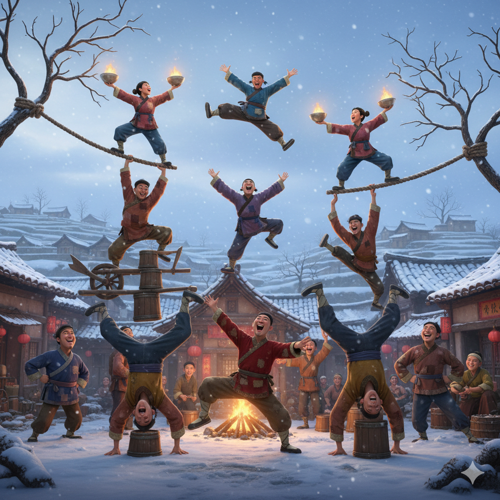

Hundred Plays involves doing many kinds of tricks. For example, in Mandarin-speaking parts of China, performers do the lion dance. They wear costumes and mimic the animal’s movements. Early performers also did tricks on ropes and vines that were high above the ground.

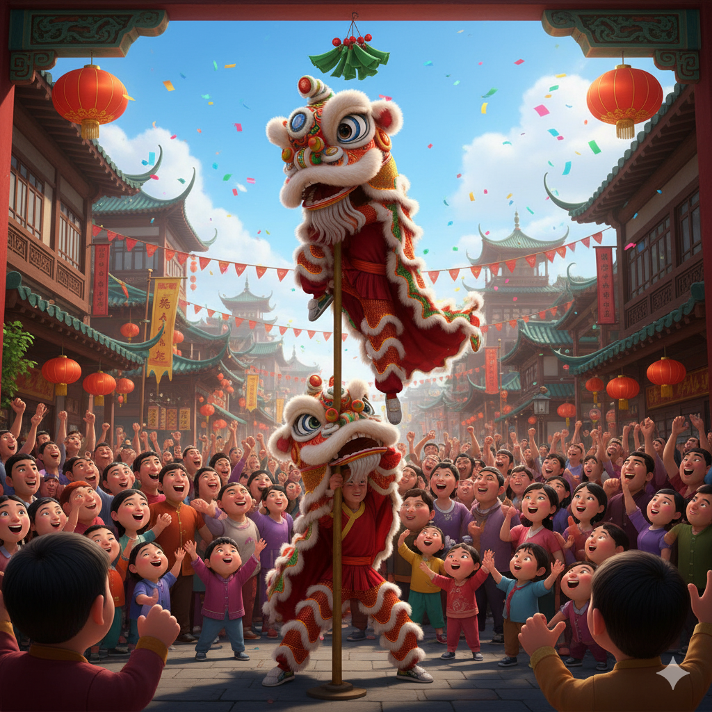

Even though the acrobats’ fluid movements may have looked easy, they took a lot of work.

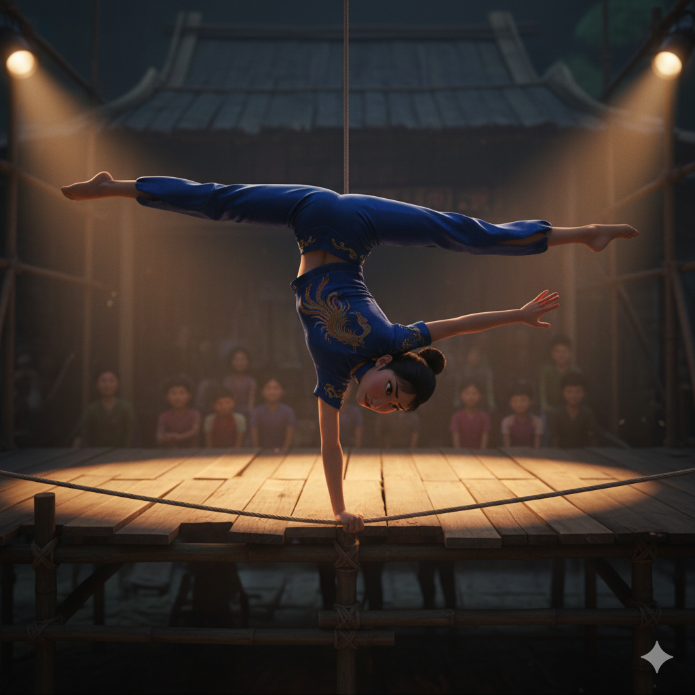

Learning Hundred Plays is a communal event. A veteran of the acrobatic arts usually teaches younger people in the village. They spend a lot of time rehearsing. The young performers also learn an old philosophy. The teachings help them harmonize the sensory aspects of acrobatics with mental aspects. In other words, it teaches them to use their physical and mental strength together.

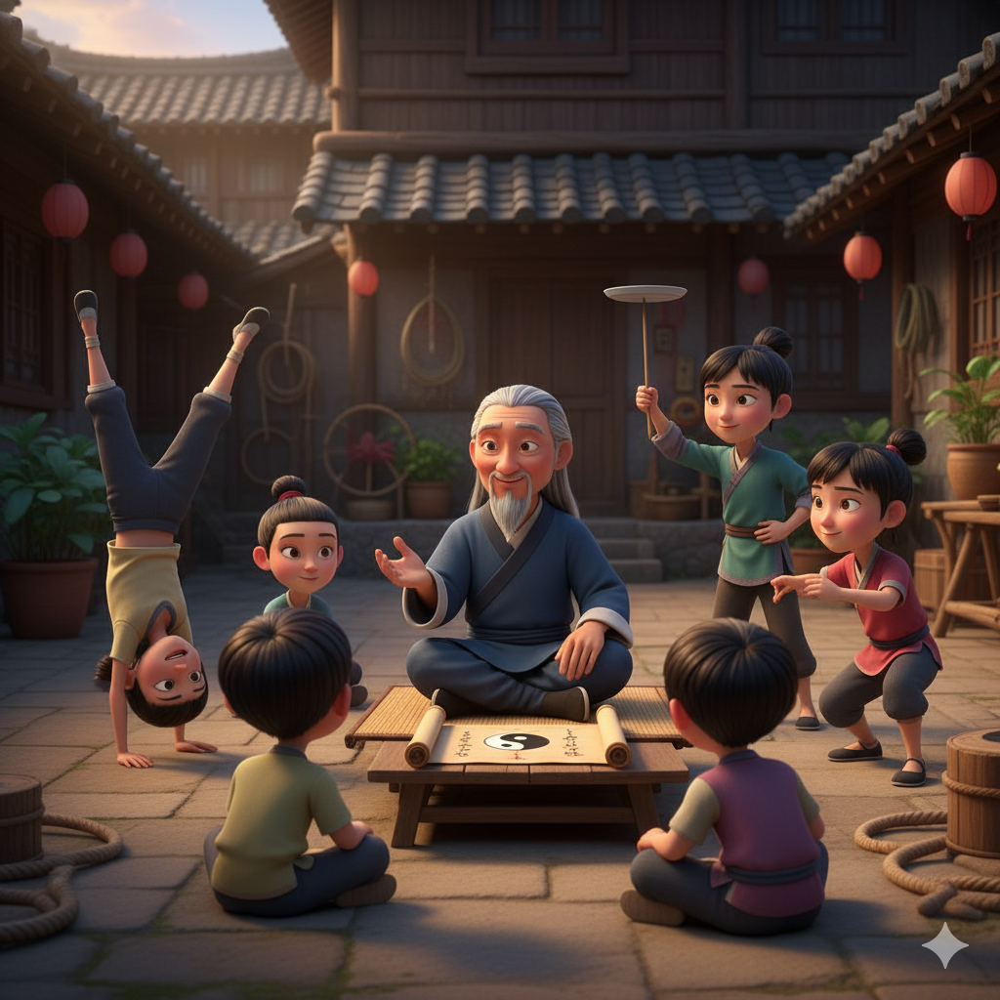

Since the art has its origins with poor farmers, rich people used to scorn acrobats. They thought acrobats were villains. The rich people thought the acrobats just wanted to trick them. But later, their misguided opinions changed. Acrobats came to be respected in Chinese society. They were invited to perform in metropolitan areas as well as in small villages. They performed for important people, including judicial officers. Arts advocacy groups convinced the government to support Chinese acrobatics. As a result, there is now a statute that made several villages the center of training future acrobats.

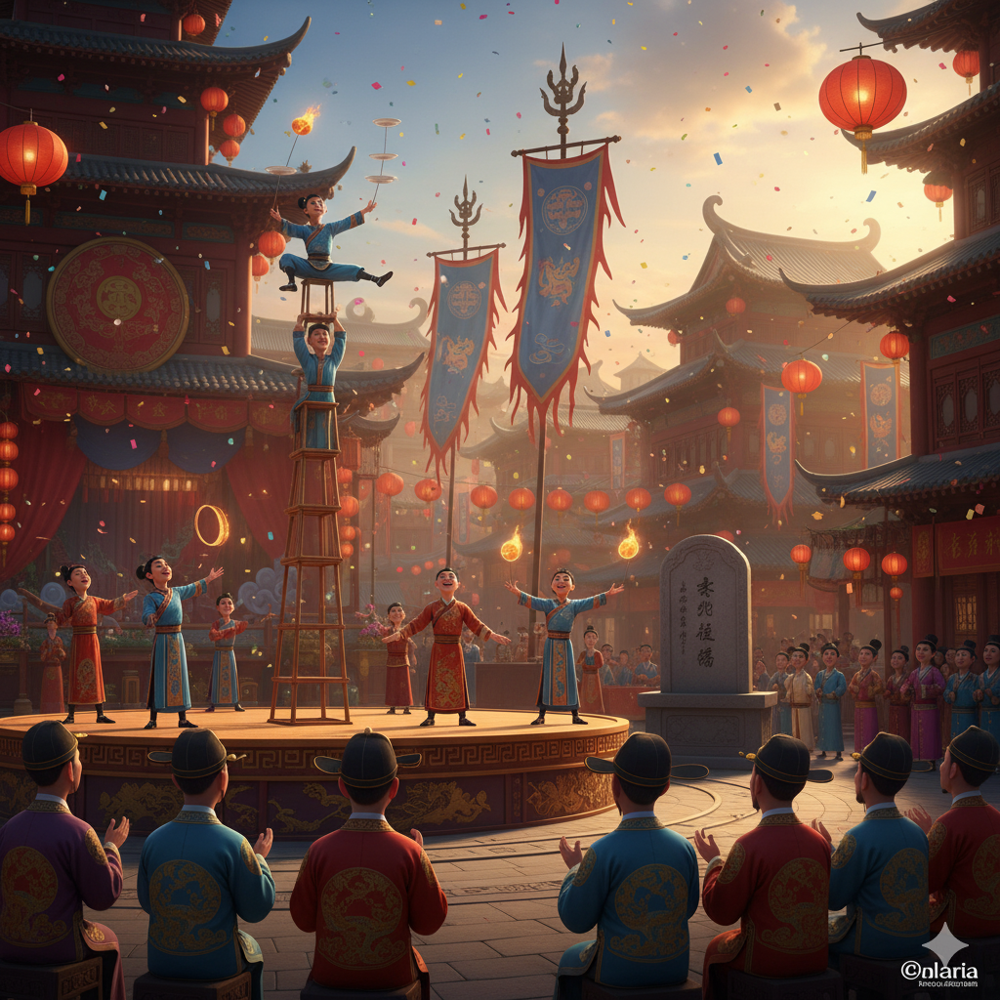

## Sentences of story

Hundred Plays

Over two thousand years ago, Chinese farmers had a problem.

Even though they were very industrious, the weather became too cold outside to plant their staple food, rice.

So what did they do?

Since they had so much free time during the long, cold winters, the inventive farmers started performing tricks to entertain themselves.

They used their farm tools and anything they could find to make their tricks more spectacular.

They even twisted their bodies into crazy shapes and performed awesome jumps.

Overtime, they became great acrobats, and their art form came to be known as “ Hundred Plays.”

Hundred Plays involves doing many kinds of tricks.

For example, in Mandarin-speaking parts of China, performers do the lion dance.

They wear costumes and mimic the animal’s movements.

Early performers also did tricks on ropes and vines that were high above the ground.

Even though the acrobats’ fluid movements may have looked easy, they took a lot of work.

Learning Hundred Plays is a communal event.

A veteran of the acrobatic arts usually teaches younger people in the village.

They spend a lot of time rehearsing.

The young performers also learn an old philosophy.

The teachings help them harmonize the sensory aspects of acrobatics with mental aspects.

In other words, it teaches them to use their physical and mental strength together.

Since the art has its origins with poor farmers, rich people used to scorn acrobats.

They thought acrobats were villains.

The rich people thought the acrobats just wanted to trick them.

But later, their misguided opinions changed.

Acrobats came to be respected in Chinese society.

They were invited to perform in metropolitan areas as well as in small villages.

They performed for important people, including judicial officers.

Arts advocacy groups convinced the government to support Chinese acrobatics.

As a result, there is now a statute that made several villages the center of training future acrobats.

## List of word

acrobat, advocacy, communal, fluid, harmonize, industrious, inventive, judicial, mandarin, metropolitan, mimic, misguided, rehearse, scorn, sensory, stature, veteran, villain, vine

## 1. acrobat
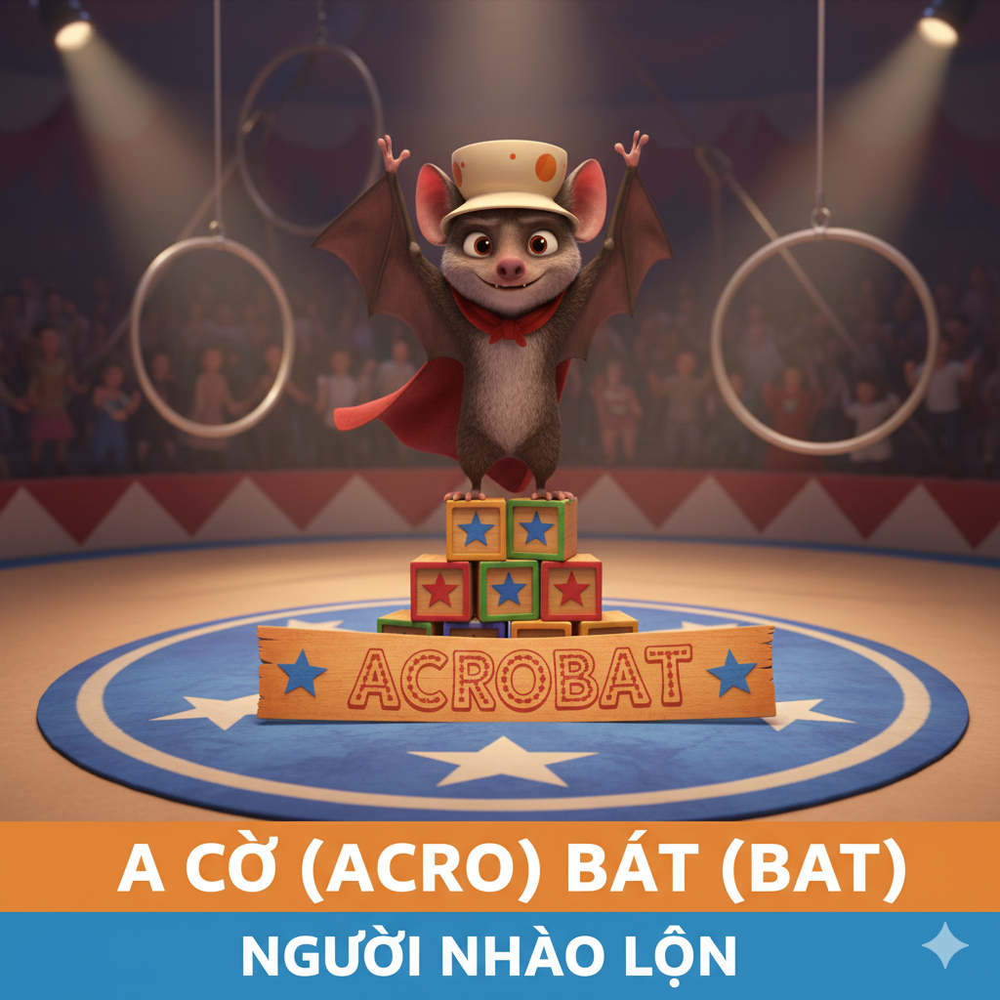

### IPA: /ˈæk.rə.bæt/
### Class: n
### Câu truyện ẩn dụ:

`A cờ` (acro) `bát` (bat) úp lên đầu để làm trò **người nhào lộn**.

### Định nghĩa : 
Người nhào lộn, diễn viên xiếc.

### English definition: 
An entertainer who performs spectacular gymnastic feats.

### Sentence of stroy:
Overtime, they became great **acrobats**, and their art form came to be known as “ Hundred Plays.”

## 2. advocacy

### IPA: /ˈæd.və.kə.si/
### Class: n
### Câu truyện ẩn dụ:

`Áo đó` (advo) `có Sỳ` (cacy) nên tôi phải lên tiếng **ủng hộ**.

### Định nghĩa : 
Sự ủng hộ, sự bào chữa công khai cho một chính sách.

### English definition: 
Public support for or recommendation of a particular cause or policy.

### Sentence of stroy:
Arts **advocacy** groups convinced the government to support Chinese acrobatics.

## 3. communal
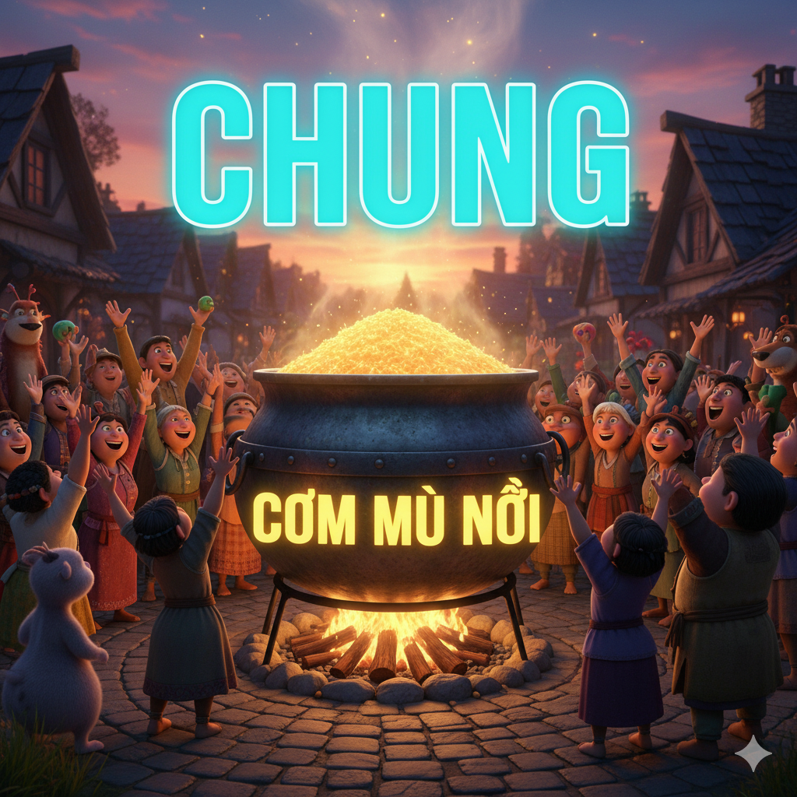

### IPA: /kəˈmjuː.nəl/
### Class: adj
### Câu truyện ẩn dụ:

`Cơm` (com) `mù` (mu) `nồi` (nal) này là tài sản **chung** của cả làng.

### Định nghĩa : 
Chung, công cộng; của chung.

### English definition: 
Shared by all members of a community; for common use.

### Sentence of stroy:
Learning Hundred Plays is a **communal** event.

## 4. fluid
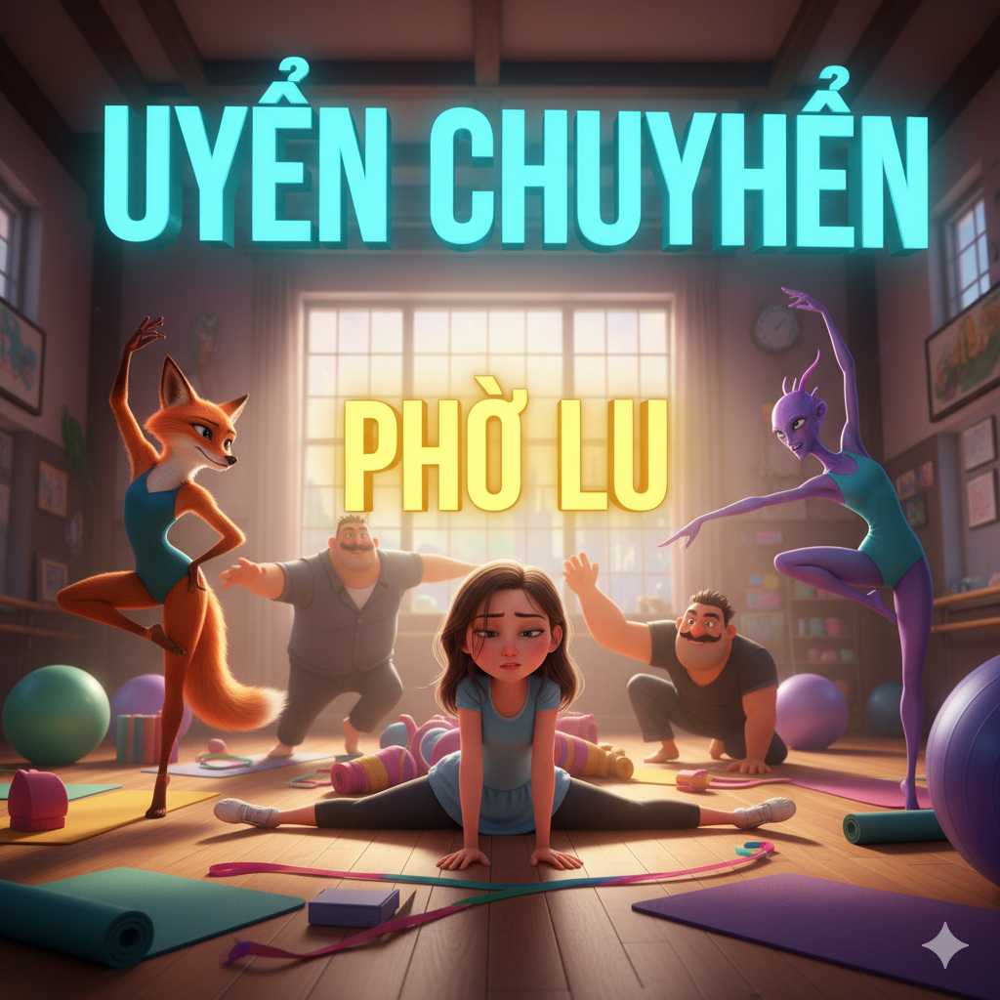

### IPA: /ˈfluː.ɪd/
### Class: adj
### Câu truyện ẩn dụ:

`Phờ lu` (flu) cả người vì tập những động tác **uyển chuyển** này.

### Định nghĩa : 
Mềm dẻo, uyển chuyển, linh hoạt.

### English definition: 
Smooth and elegant or graceful.

### Sentence of stroy:
Even though the acrobats’ **fluid** movements may have looked easy, they took a lot of work.

## 5. harmonize
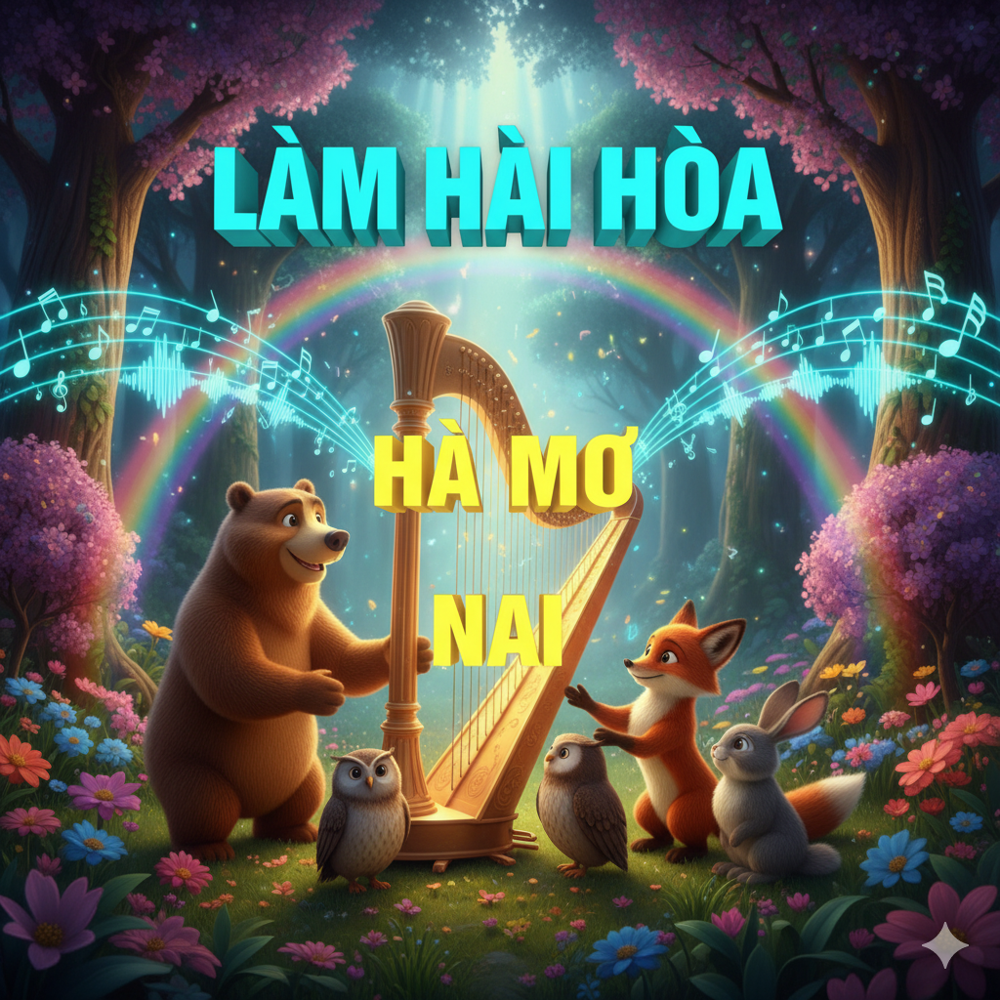

### IPA: /ˈhɑː.mə.naɪz/
### Class: v
### Câu truyện ẩn dụ:

`Hà mơ` (harmo) `nai` (nize) về sẽ **làm hài hòa** khu rừng.

### Định nghĩa : 
Làm hài hoà, làm cân đối.

### English definition: 
To bring into harmony, accord, or agreement.

### Sentence of stroy:
The teachings help them **harmonize** the sensory aspects of acrobatics with mental aspects.

## 6. industrious

### IPA: /ɪnˈdʌs.tri.əs/
### Class: adj
### Câu truyện ẩn dụ:

`In dust` (indus) `try` (tri) `ớt` (ous) là một công việc đòi hỏi sự **cần cù**.

### Định nghĩa : 
Cần cù, siêng năng.

### English definition: 
Diligent and hard-working.

### Sentence of stroy:
Even though they were very **industrious**, the weather became too cold outside to plant their staple food, rice.

## 7. inventive
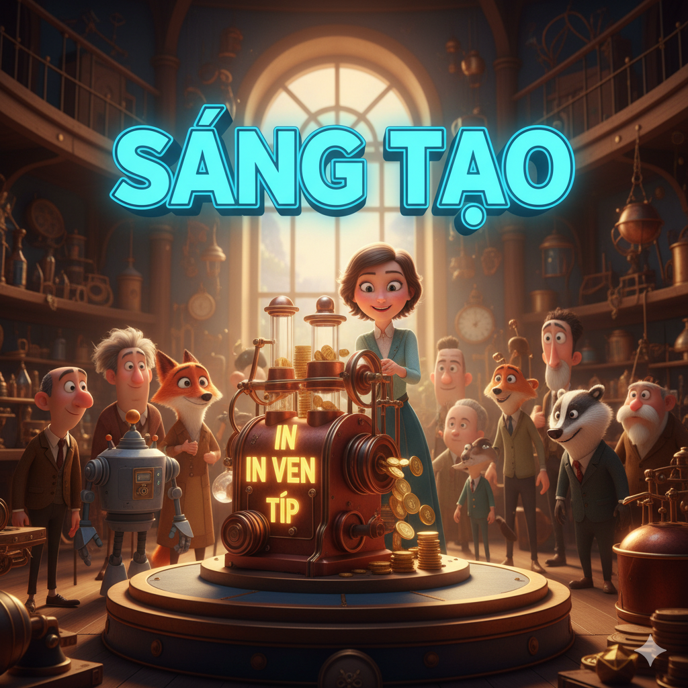

### IPA: /ɪnˈven.tɪv/
### Class: adj
### Câu truyện ẩn dụ:

`In ven` (inven) `típ` (tive) tiền cho người có đầu óc **sáng tạo**.

### Định nghĩa : 
Có tài phát minh, sáng tạo.

### English definition: 
Having the ability to create or design new things or to think originally.

### Sentence of stroy:
Since they had so much free time during the long, cold winters, the **inventive** farmers started performing tricks to entertain themselves.

## 8. judicial

### IPA: /dʒuːˈdɪʃ.əl/
### Class: adj
### Câu truyện ẩn dụ:

`Du đi` (judi) `sợ` (cial) vì đây là khu vực **thuộc về tòa án**.

### Định nghĩa : 
Thuộc về tư pháp, tòa án.

### English definition: 
Of, by, or appropriate to a court or judge.

### Sentence of stroy:
They performed for important people, including **judicial** officers.

## 9. mandarin
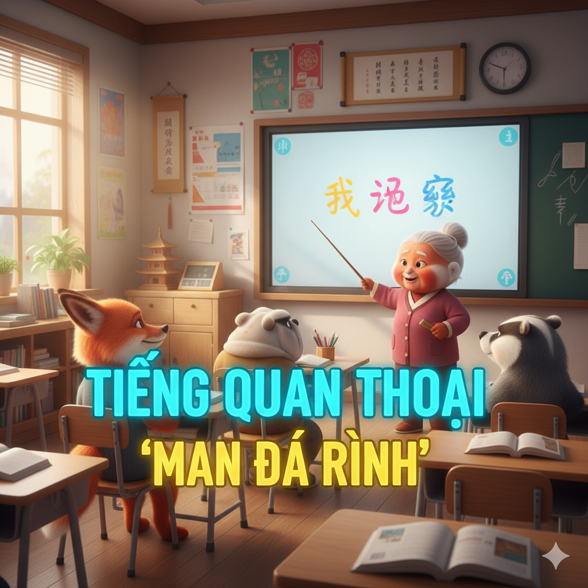

### IPA: /ˈmæn.dər.ɪn/
### Class: n
### Câu truyện ẩn dụ:

`Man` (man) `đá` (da) `rình` (rin) học **tiếng Quan Thoại**.

### Định nghĩa : 
Tiếng Quan Thoại (tiếng Trung phổ thông).

### English definition: 
The standard literary and official form of Chinese based on the Beijing dialect.

### Sentence of stroy:
For example, in **Mandarin**-speaking parts of China, performers do the lion dance.

## 10. metropolitan

### IPA: /ˌmet.rəˈpɒl.ɪ.tən/
### Class: adj
### Câu truyện ẩn dụ:

`Mẹ` (me) `trô` (tro) `bỏ đi` (poli) `tận` (tan) khu **đô thị** lớn.

### Định nghĩa : 
Thuộc về đô thị, thủ phủ.

### English definition: 
Relating to or characteristic of a metropolis or a major city.

### Sentence of stroy:
They were invited to perform in **metropolitan** areas as well as in small villages.

## 11. mimic
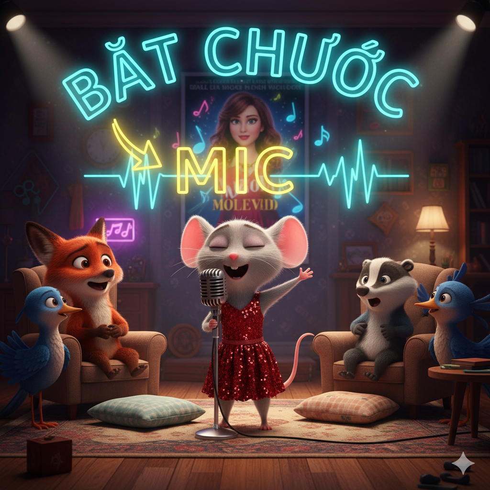

### IPA: /ˈmɪm.ɪk/
### Class: v
### Câu truyện ẩn dụ:

`Mi` (mi) cầm `mic` (mic) để **bắt chước** ca sĩ.

### Định nghĩa : 
Bắt chước, nhại lại.

### English definition: 
To imitate (someone or their actions or words), especially in order to entertain or ridicule.

### Sentence of stroy:
They wear costumes and **mimic** the animal’s movements.

## 12. misguided
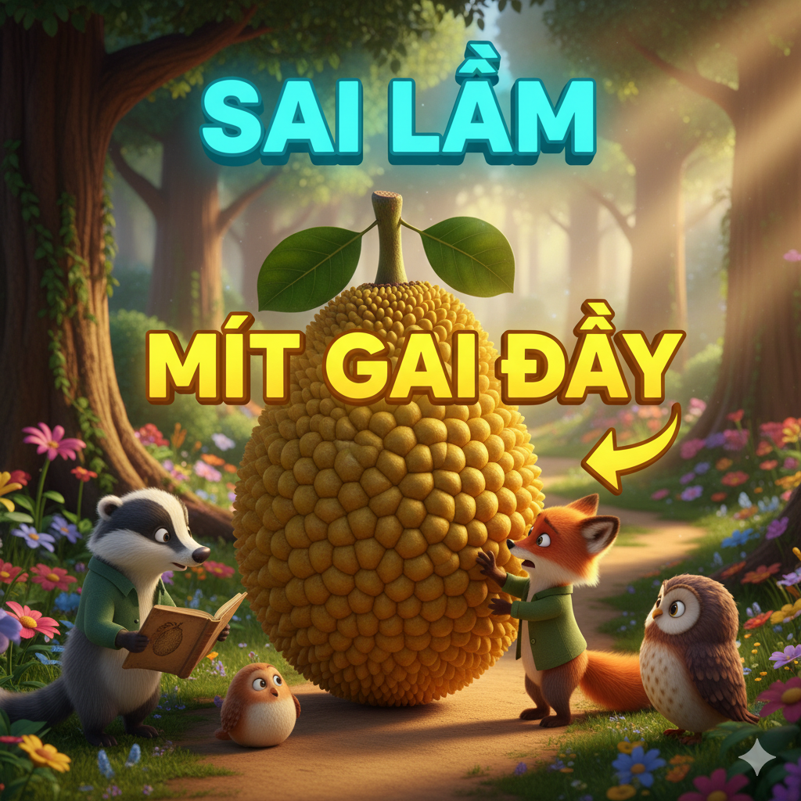

### IPA: /ˌmɪsˈɡaɪ.dɪd/
### Class: adj
### Câu truyện ẩn dụ:

`Mít` (mis) `gai` (gui) `đầy` (ded) là một quan niệm **sai lầm**.

### Định nghĩa : 
Sai lầm, do hiểu lầm.

### English definition: 
Having or showing faulty judgment or reasoning.

### Sentence of stroy:
But later, their **misguided** opinions changed.

## 13. rehearse

### IPA: /rəˈhɜːs/
### Class: v
### Câu truyện ẩn dụ:

`Đi hớt` (rehearse) tóc trước buổi **diễn tập**.

### Định nghĩa : 
Diễn tập, tập dượt.

### English definition: 
To practice a play, piece of music, or other work for later public performance.

### Sentence of stroy:
They spend a lot of time **rehearsing**.

## 14. scorn
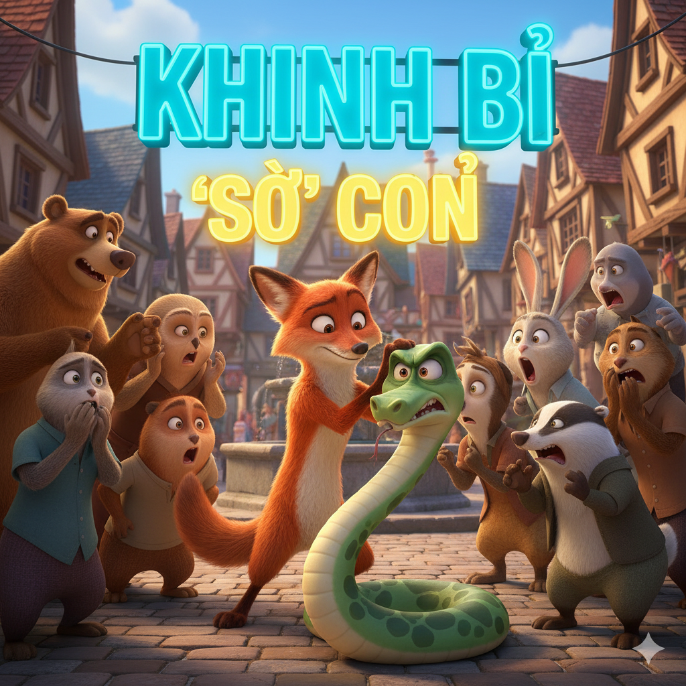

### IPA: /skɔːn/
### Class: v
### Câu truyện ẩn dụ:

`Sờ` (sco) `con` (rn) rắn này nên bị mọi người **khinh bỉ**.

### Định nghĩa : 
Khinh bỉ, khinh miệt.

### English definition: 
To feel or express contempt or derision for.

### Sentence of stroy:
Since the art has its origins with poor farmers, rich people used to **scorn** acrobats.

## 15. sensory
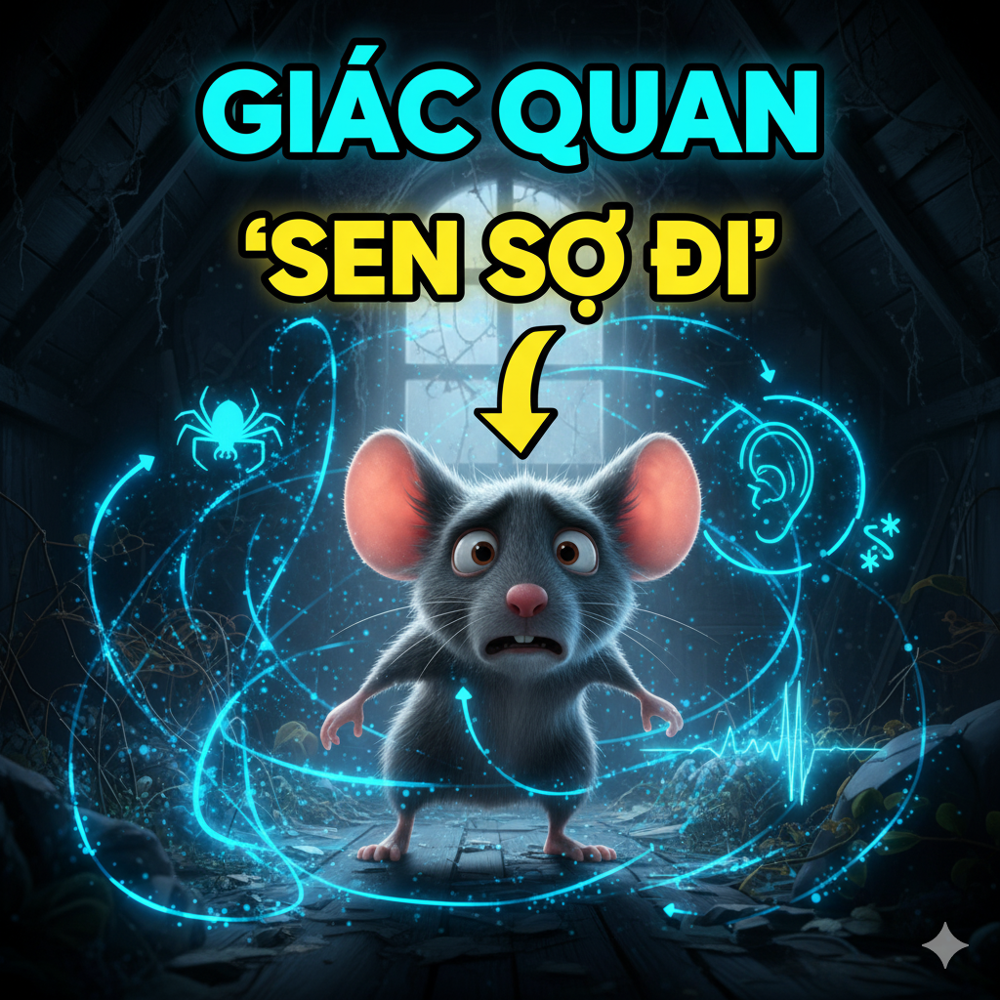

### IPA: /ˈsen.sər.i/
### Class: adj
### Câu truyện ẩn dụ:

`Sen sợ đi` (sensory) vì **giác quan** mách bảo có nguy hiểm.

### Định nghĩa : 
Thuộc về cảm giác, giác quan.

### English definition: 
Relating to sensation or the physical senses; transmitted or perceived by the senses.

### Sentence of stroy:
The teachings help them harmonize the **sensory** aspects of acrobatics with mental aspects.

## 16. stature

### IPA: /ˈstætʃ.ər/
### Class: n
### Câu truyện ẩn dụ:

`Sờ ta` (sta) `chờ` (ture) xem **tầm vóc** của anh ta thế nào.

### Định nghĩa : 
Tầm vóc; uy thế, địa vị cao.

### English definition: 
Importance or reputation gained by ability or achievement.

### Sentence of stroy:
The veteran performer had great **stature** in the village.

## 17. veteran
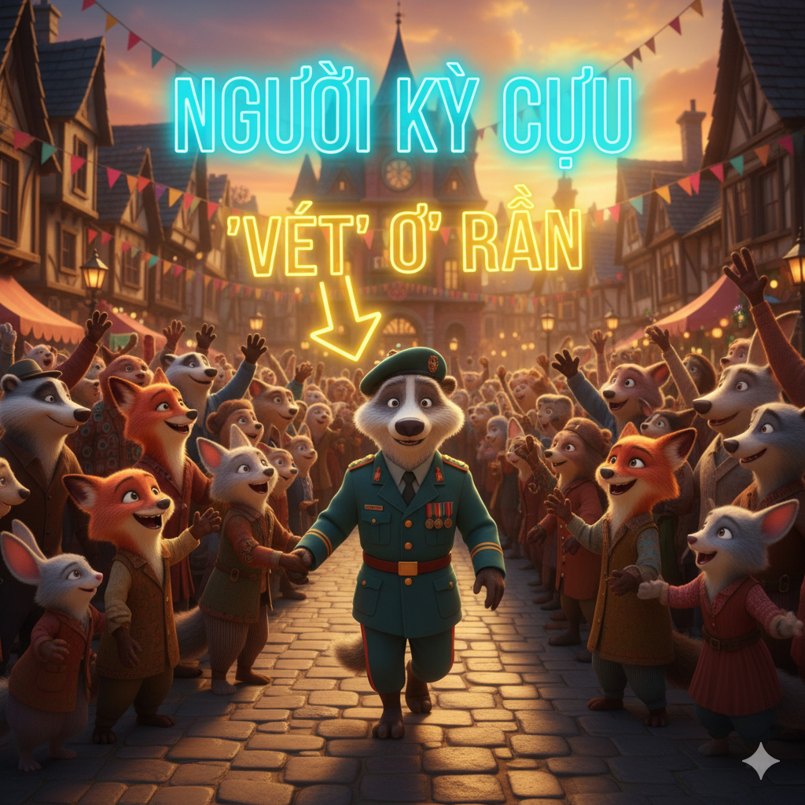

### IPA: /ˈvet.ər.ən/
### Class: n
### Câu truyện ẩn dụ:

`Vét` (vet) `ơ` (er) `rần` (an) rần cả làng vì **người kỳ cựu** này trở về.

### Định nghĩa : 
Người kỳ cựu, người có kinh nghiệm lâu năm.

### English definition: 
A person who has had long experience in a particular field.

### Sentence of stroy:
A **veteran** of the acrobatic arts usually teaches younger people in the village.

## 18. villain
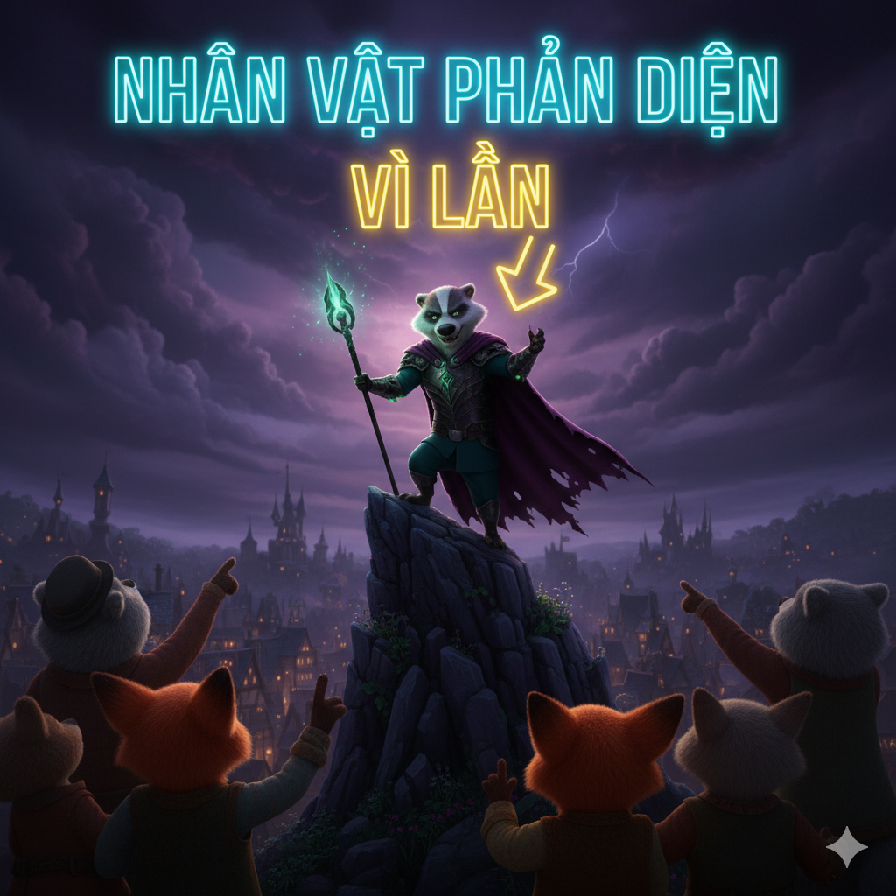

### IPA: /ˈvɪl.ən/
### Class: n
### Câu truyện ẩn dụ:

`Vì lần` (villain) này, hắn đã trở thành **nhân vật phản diện**.

### Định nghĩa : 
Kẻ hung ác, nhân vật phản diện.

### English definition: 
A character whose evil actions or motives are important to the plot.

### Sentence of stroy:
They thought acrobats were **villains**.

## 19. vine
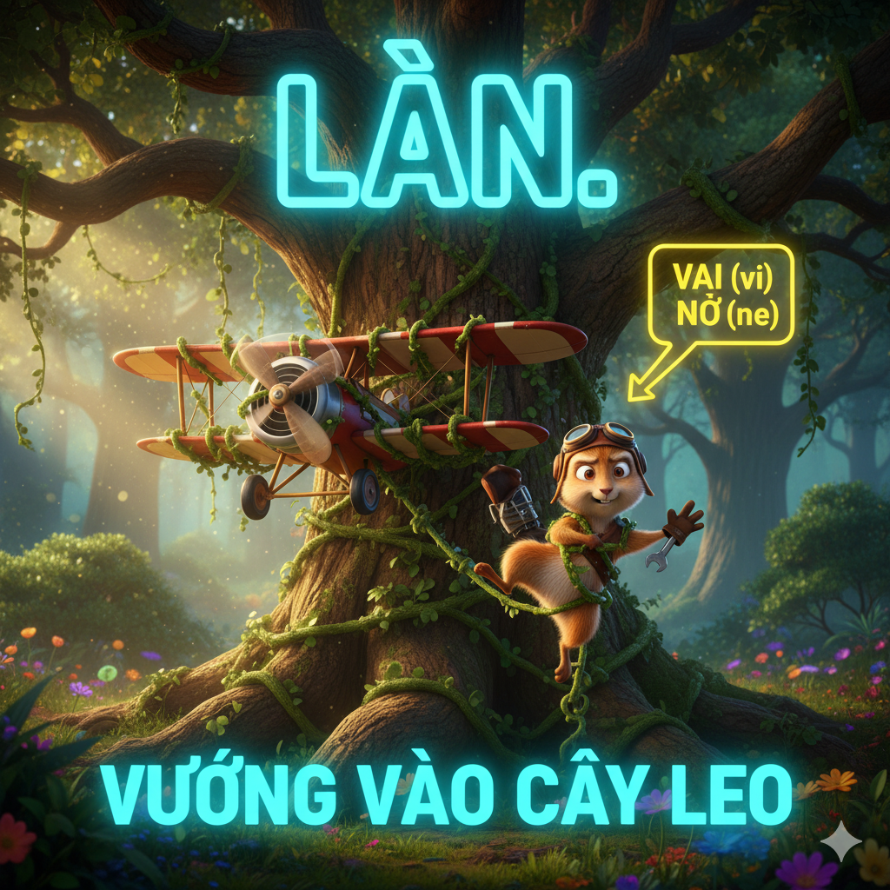

### IPA: /vaɪn/
### Class: n
### Câu truyện ẩn dụ:

`Vai` (vi) `nơ` (ne) vướng vào **cây leo**.

### Định nghĩa : 
Cây leo.

### English definition: 
A climbing or trailing woody-stemmed plant of the grape family.

### Sentence of stroy:
Early performers also did tricks on ropes and **vines** that were high above the ground.
