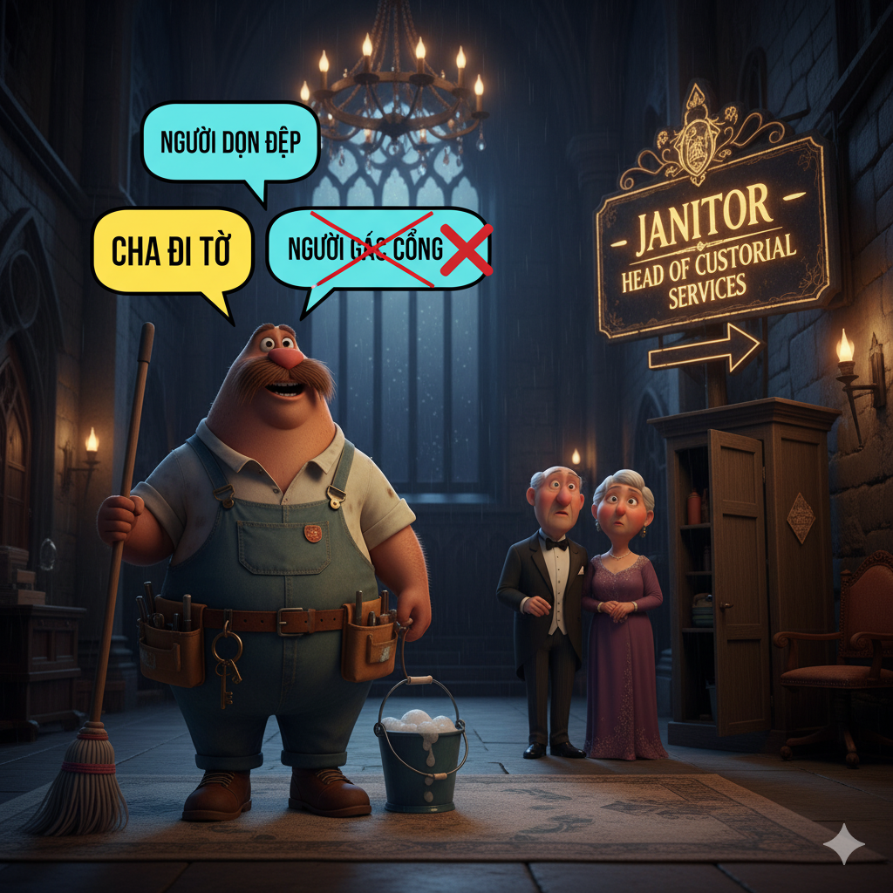
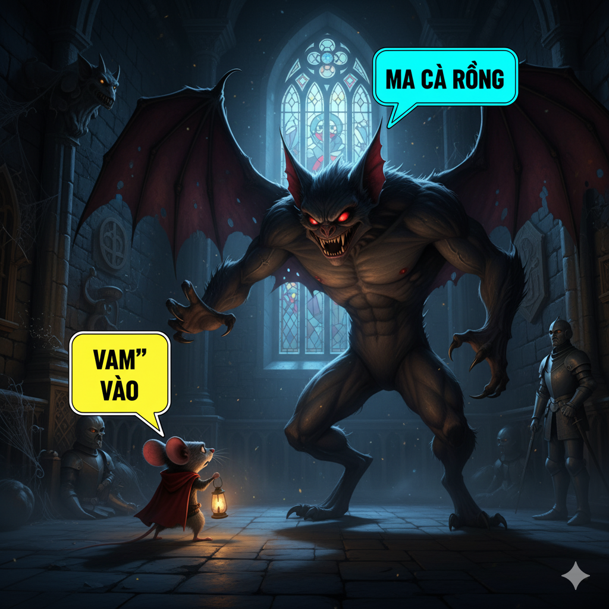

# The Kidnapping

Anne was a very quiet girl who had an inherent fear of almost everything. The kids at school would play tricks on her all the time. They would hide behind the door of the school janitor’s closet, then jump out to scare her. Once, a boy dressed up like a vampire and chased her down the street. Anne hated being constrained by her fears, but she didn’t know how to be brave.

She was walking home from school one day when someone came up behind her. Before she could turn around, a powerful man grabbed her. She couldn’t scream because a huge hand was put over her mouth. Anne knew that this could not be another stunt by her classmates. The scary man restrained her arms and legs and carried her to his house. He tied Anne to a chair. Her guts began to hurt because she was so scared.

The man prodded Anne with his forefinger and said, “You’ll stay right here until I get a ransom from your parents. Then I’ll be rich!” The dirty man spit when he talked. A string of saliva hung from his moist lips. Anne was terrified and intimidated by the horrible man. But she knew she had to escape somehow.

Eventually, the man yawned. Anne waited quietly until he fell asleep. As he slept, she carefully wiggled her arms and legs until the ropes became loose. She slipped out of the ropes and carefully opened the door. She sprinted to the bus depot and boarded a bus to the police station. She told the police what happened, and they arrested the kidnapper.

The kids at school were amazed. They asked her, “Weren’t you too scared to escape?”
She said, “Nope, I knew that I had to be brave and get out of there!”
The kids were very tolerant of Anne from then on. They even decided that they would emulate her bravery if they ever got into a tough situation.

## Sentences of story

The Kidnapping

Anne was a very quiet girl who had an inherent fear of almost everything.

The kids at school would play tricks on her all the time.

They would hide behind the door of the school janitor’s closet, then jump out to scare her.

Once, a boy dressed up like a vampire and chased her down the street.

Anne hated being constrained by her fears, but she didn’t know how to be brave.

She was walking home from school one day when someone came up behind her.

Before she could turn around, a powerful man grabbed her.

She couldn’t scream because a huge hand was put over her mouth.

Anne knew that this could not be another stunt by her classmates.

The scary man restrained her arms and legs and carried her to his house.

He tied Anne to a chair.

Her guts began to hurt because she was so scared.

The man prodded Anne with his forefinger and said, “You’ll stay right here until I get a ransom from your parents. Then I’ll be rich!”

The dirty man spit when he talked.

A string of saliva hung from his moist lips.

Anne was terrified and intimidated by the horrible man.

But she knew she had to escape somehow.

Eventually, the man yawned.

Anne waited quietly until he fell asleep.

As he slept, she carefully wiggled her arms and legs until the ropes became loose.

She slipped out of the ropes and carefully opened the door.

She sprinted to the bus depot and boarded a bus to the police station.

She told the police what happened, and they arrested the kidnapper.

The kids at school were amazed.

They asked her, “Weren’t you too scared to escape?”

She said, “Nope, I knew that I had to be brave and get out of there!”

The kids were very tolerant of Anne from then on.

They even decided that they would emulate her bravery if they ever got into a tough situation.

## List of word

constrain, depot, emulate, forefinger, guts, inherent, intimidate, janitor, moist, nope, prod, ransom, restrain, saliva, spit, sprint, stunt, tolerant, vampire, yawn

## 1. constrain

### IPA: /kənˈstreɪn/
### Class: v
### Câu truyện ẩn dụ:

`Con` `trên` (constrain) tàu bị **kiềm chế** không cho đi lung tung.

### Định nghĩa : 
Kiềm chế, ép buộc.

### English definition: 
To severely restrict the scope, extent, or activity of.

### Sentence of stroy:
Anne hated being **constrained** by her fears, but she didn’t know how to be brave.

## 2. depot

### IPA: /ˈdiː.poʊ/
### Class: n
### Câu truyện ẩn dụ:

`Đi bộ` (depot) ra **bến xe** để về quê.

### Định nghĩa : 
Bến xe, nhà ga; kho chứa.

### English definition: 
A bus station or a railroad station.

### Sentence of stroy:
She sprinted to the bus **depot** and boarded a bus to the police station.

## 3. emulate

### IPA: /ˈem.jə.leɪt/
### Class: v
### Câu truyện ẩn dụ:

`Em` `mua` (emu) `lết` (late) bánh để **bắt chước** chị.

### Định nghĩa : 
Bắt chước, tranh đua.

### English definition: 
To match or surpass (a person or achievement), typically by imitation.

### Sentence of stroy:
They even decided that they would **emulate** her bravery if they ever got into a tough situation.

## 4. forefinger

### IPA: /ˈfɔːˌfɪŋ.ɡər/
### Class: n
### Câu truyện ẩn dụ:

`For` (fore) `phim` `gơ` (finger) phải dùng **ngón tay trỏ** để bấm.

### Định nghĩa : 
Ngón tay trỏ.

### English definition: 
The finger next to the thumb.

### Sentence of stroy:
The man prodded Anne with his **forefinger** and said, “You’ll stay right here until I get a ransom from your parents."

## 5. guts

### IPA: /ɡʌts/
### Class: n
### Câu truyện ẩn dụ:

`Gật` (guts) đầu vì **lòng can đảm** của anh ấy. (Còn có nghĩa là ruột)

### Định nghĩa : 
Ruột; (lóng) sự can đảm, gan dạ.

### English definition: 
The stomach or belly; personal courage and determination.

### Sentence of stroy:
Her **guts** began to hurt because she was so scared.

## 6. inherent

### IPA: /ɪnˈher.ənt/
### Class: adj
### Câu truyện ẩn dụ:

`In` `hè` (inhe) `rần` (rent) rần là một đặc tính **vốn có** của mùa hè.

### Định nghĩa : 
Vốn có, cố hữu.

### English definition: 
Existing in something as a permanent, essential, or characteristic attribute.

### Sentence of stroy:
Anne was a very quiet girl who had an **inherent** fear of almost everything.

## 7. intimidate

### IPA: /ɪnˈtɪm.ɪ.deɪt/
### Class: v
### Câu truyện ẩn dụ:

`In` `tim` `đi` `để` (intimidate) **hăm dọa** đối thủ.

### Định nghĩa : 
Hăm dọa, đe dọa.

### English definition: 
To frighten or overawe (someone), especially in order to make them do what one wants.

### Sentence of stroy:
Anne was terrified and **intimidated** by the horrible man.

## 8. janitor

### IPA: /ˈdʒæn.ɪ.tər/
### Class: n
### Câu truyện ẩn dụ:

`Cha đi tơ` (janitor) tưởng là **người gác cổng** nhưng thực ra là người dọn dẹp.

### Định nghĩa : 
Người dọn dẹp, người coi nhà.

### English definition: 
A person employed as a caretaker of a building; a custodian.

### Sentence of stroy:
They would hide behind the door of the school **janitor**’s closet, then jump out to scare her.

## 9. moist

### IPA: /mɔɪst/
### Class: adj
### Câu truyện ẩn dụ:

`Moi` (moi) `ớt` (st) lên từ đất **ẩm ướt**.

### Định nghĩa : 
Ẩm ướt.

### English definition: 
Slightly wet; damp or humid.

### Sentence of stroy:
A string of saliva hung from his **moist** lips.

## 10. nope

### IPA: /nəʊp/
### Class: adv
### Câu truyện ẩn dụ:

`Nộp` (nope) bài chưa? **Không**.

### Định nghĩa : 
Không (cách nói thân mật).

### English definition: 
No (an informal way of saying no).

### Sentence of stroy:
She said, “**Nope**, I knew that I had to be brave and get out of there!”

## 11. prod

### IPA: /prɒd/
### Class: v
### Câu truyện ẩn dụ:

`Bờ rào đó` (prod) bị người ta **thọc**, **chọc** thủng.

### Định nghĩa : 
Thọc, chọc, thúc.

### English definition: 
To poke (someone) with a finger, foot, or pointed object.

### Sentence of stroy:
The man **prodded** Anne with his forefinger and said, “You’ll stay right here until I get a ransom from your parents.”

## 12. ransom

### IPA: /ˈræn.səm/
### Class: n
### Câu truyện ẩn dụ:

`Rắn` (ran) `sợ` (som) không đủ **tiền chuộc**.

### Định nghĩa : 
Tiền chuộc.

### English definition: 
A sum of money demanded or paid for the release of a captive.

### Sentence of stroy:
“You’ll stay right here until I get a **ransom** from your parents.”

## 13. restrain

### IPA: /rɪˈstreɪn/
### Class: v
### Câu truyện ẩn dụ:

`Rít` (res) `trên` (train) tàu để **kiềm chế** cơn giận.

### Định nghĩa : 
Kiềm chế, cản trở, khống chế.

### English definition: 
To prevent (someone or something) from doing something; keep under control or within limits.

### Sentence of stroy:
The scary man **restrained** her arms and legs and carried her to his house.

## 14. saliva

### IPA: /səˈlaɪ.və/
### Class: n
### Câu truyện ẩn dụ:

`Sa` (sa) `lầy` (li) `và` (va) bị **nước bọt** của con quái vật dính vào người.

### Định nghĩa : 
Nước bọt, nước dãi.

### English definition: 
Watery liquid secreted into the mouth by glands.

### Sentence of stroy:
A string of **saliva** hung from his moist lips.

## 15. spit

### IPA: /spɪt/
### Class: v
### Câu truyện ẩn dụ:

`Sợ` (s) `bít` (pit) đường nên **nhổ** nước bọt để đánh dấu.

### Định nghĩa : 
Khạc, nhổ (nước bọt).

### English definition: 
To eject saliva forcibly from one's mouth.

### Sentence of stroy:
The dirty man **spit** when he talked.

## 16. sprint

### IPA: /sprɪnt/
### Class: v
### Câu truyện ẩn dụ:

`Sợ` (s) `rình` (print) nên phải **chạy nước rút**.

### Định nghĩa : 
Chạy nước rút.

### English definition: 
To run at full speed over a short distance.

### Sentence of stroy:
She **sprinted** to the bus depot and boarded a bus to the police station.

## 17. stunt

### IPA: /stʌnt/
### Class: n
### Câu truyện ẩn dụ:

`Sờ` (s) `tận` (tunt) nơi để thực hiện **trò nguy hiểm** này.

### Định nghĩa : 
Trò nguy hiểm, trò gây chú ý, trò đùa.

### English definition: 
An action displaying spectacular skill and daring; something unusual done to attract attention.

### Sentence of stroy:
Anne knew that this could not be another **stunt** by her classmates.

## 18. tolerant

### IPA: /ˈtɒl.ər.ənt/
### Class: adj
### Câu truyện ẩn dụ:

`Tô` (to) `lơ` (le) `rần` (rant) rần ngoài chợ nhưng mọi người vẫn **khoan dung**.

### Định nghĩa : 
Khoan dung, tha thứ, chịu đựng.

### English definition: 
Showing willingness to allow the existence of opinions or behavior that one does not necessarily agree with.

### Sentence of stroy:
The kids were very **tolerant** of Anne from then on.

## 19. vampire

### IPA: /ˈvæm.paɪər/
### Class: n
### Câu truyện ẩn dụ:

`Vam` (vam) `vào` (pire) **ma cà rồng** trong đêm tối.

### Định nghĩa : 
Ma cà rồng.

### English definition: 
A corpse supposed to leave its grave at night to drink the blood of the living.

### Sentence of stroy:
Once, a boy dressed up like a **vampire** and chased her down the street.

## 20. yawn

### IPA: /jɔːn/
### Class: v
### Câu truyện ẩn dụ:

`Do` (yawn) buồn ngủ nên cứ **ngáp** mãi.

### Định nghĩa : 
Ngáp.

### English definition: 
To involuntarily open one's mouth wide and inhale deeply due to tiredness or boredom.

### Sentence of stroy:
Eventually, the man **yawned**.