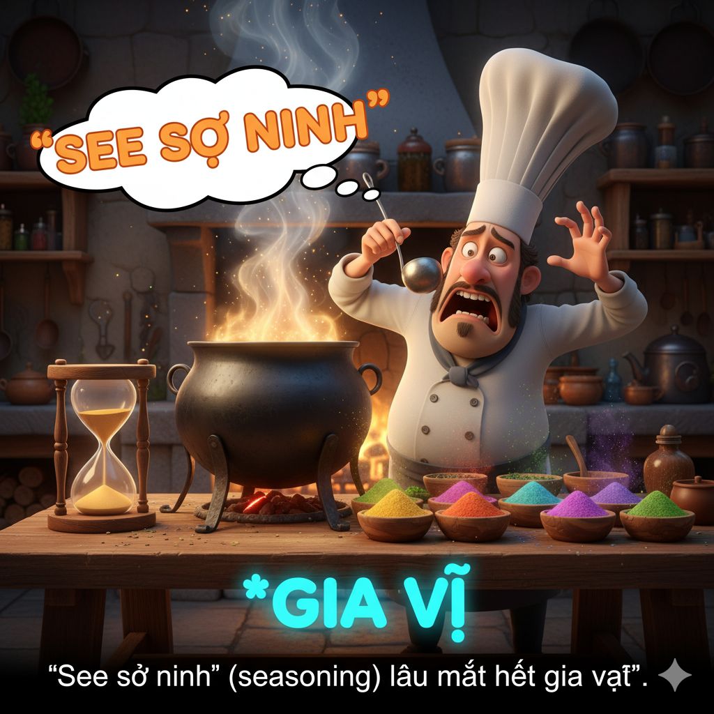

# The Earl of Shining

In the village of Hampton, there was an old soldier named Michael, but he was known to the world as the Earl of Shining. Michael was once an expert archer and a great fighter. In fact, his skills seemed to be hereditary; all the people in his ancestry were famous warriors. However, he was getting old and no longer wished to fight.

One day, he was in the forest hunting prey when he saw a beautiful prophet singing a hymn. She said, “Michael, an evil army is involved in a conspiracy to take over Hampton. You’re the only one who can defeat them and stop the tyranny. The village needs you!”

Michael replied, “ But I’m too old to fight! I’m not confident that I can do it.”

The prophet said, “You must try. I will even make a potion to increase your strength.”

The prophet took out a bottle and a funnel. She poured some vinegar and garlic into the bottle. Next, she added some seasoning and sodium and shook it up.

Michael smelled the potion. “Wow, this is fragrant,” he said in a sarcastic tone. He inverted the bottle and drank the whole potion. He immediately felt stronger. “ I’ll try my best,” he promised.

Michael rode his horse to a hilltop, where he could see the village of Hampton below. He saw the evil tyrant and his men marching in a procession through the town.

Michael charged down the hill and into the village. An enemy deputy officer shouted, “ He looks as strong as an ox!” It was an apt analogy. Michael grabbed the officer and threw him across the street with one arm. The rest of the officers screamed and rode away, and their army followed.

The prophet reappeared. Michael said, “ It’s a good thing you gave me the potion.”

She replied, “ But Michael, the potion was fake! Your strength really came from having confidence!

Michael realized he really was still great. He just needed to believe in himself.

## Sentences of story

The Earl of Shining

In the village of Hampton, there was an old soldier named Michael, but he was known to the world as the Earl of Shining.

Michael was once an expert archer and a great fighter.

In fact, his skills seemed to be hereditary; all the people in his ancestry were famous warriors.

However, he was getting old and no longer wished to fight.

One day, he was in the forest hunting prey when he saw a beautiful prophet singing a hymn.

She said, “Michael, an evil army is involved in a conspiracy to take over Hampton. You’re the only one who can defeat them and stop the tyranny. The village needs you!”

Michael replied, “ But I’m too old to fight! I’m not confident that I can do it.”

The prophet said, “You must try. I will even make a potion to increase your strength.”

The prophet took out a bottle and a funnel.

She poured some vinegar and garlic into the bottle.

Next, she added some seasoning and sodium and shook it up.

Michael smelled the potion.

“Wow, this is fragrant,” he said in a sarcastic tone.

He inverted the bottle and drank the whole potion.

He immediately felt stronger.

“ I’ll try my best,” he promised.

Michael rode his horse to a hilltop, where he could see the village of Hampton below.

He saw the evil tyrant and his men marching in a procession through the town.

Michael charged down the hill and into the village.

An enemy deputy officer shouted, “ He looks as strong as an ox!”

It was an apt analogy.

Michael grabbed the officer and threw him across the street with one arm.

The rest of the officers screamed and rode away, and their army followed.

The prophet reappeared.

Michael said, “ It’s a good thing you gave me the potion.”

She replied, “ But Michael, the potion was fake! Your strength really came from having confidence!

Michael realized he really was still great.

He just needed to believe in himself.

## List of word

analogy, ancestry, archer, conspiracy, deputy, earl, fragrant, funnel, hereditary, hymn, invert, prey, procession, prophet, sarcastic, seasoning, sodium, tyranny, tyrant, vinegar

## 1. analogy

### IPA: /əˈnæl.ə.dʒi/
### Class: n
### Câu truyện ẩn dụ:

`A na` `lơ đi` (analogy) sự **so sánh tương tự** này.

### Định nghĩa : 
Phép loại suy, sự tương tự.

### English definition: 
A comparison between two things, typically for the purpose of explanation or clarification.

### Sentence of stroy:
It was an apt **analogy**.

## 2. ancestry

### IPA: /ˈæn.ses.tri/
### Class: n
### Câu truyện ẩn dụ:

`Ăn` `sét` `try` (ancestry) là truyền thống của **tổ tiên** nhà này.

### Định nghĩa : 
Tổ tiên, dòng dõi.

### English definition: 
One's family or ethnic descent.

### Sentence of stroy:
In fact, his skills seemed to be hereditary; all the people in his **ancestry** were famous warriors.

## 3. archer

### IPA: /ˈɑːr.tʃɚ/
### Class: n
### Câu truyện ẩn dụ:

`Á` `chờ` (archer) mãi mới thấy **xạ thủ**.

### Định nghĩa : 
Xạ thủ, người bắn cung.

### English definition: 
A person who shoots with a bow and arrows.

### Sentence of stroy:
Michael was once an expert **archer** and a great fighter.

## 4. conspiracy

### IPA: /kənˈspɪr.ə.si/
### Class: n
### Câu truyện ẩn dụ:

`Con` `sợ` `bị` `rờ` `xe` (conspiracy) vì dính vào **âm mưu** này.

### Định nghĩa : 
Âm mưu, sự cấu kết.

### English definition: 
A secret plan by a group to do something unlawful or harmful.

### Sentence of stroy:
She said, “Michael, an evil army is involved in a **conspiracy** to take over Hampton.

## 5. deputy

### IPA: /ˈdep.jə.ti/
### Class: n
### Câu truyện ẩn dụ:

`Đẹp` `như ti` (deputy)ên là vị **phó**, người đại diện.

### Định nghĩa : 
Người đại diện, phó.

### English definition: 
A person who is appointed to undertake the duties of a superior in the superior's absence.

### Sentence of stroy:
An enemy **deputy** officer shouted, “ He looks as strong as an ox!”

## 6. earl

### IPA: /ɜːrl/
### Class: n
### Câu truyện ẩn dụ:

`Ơ` (earl) kìa, **bá tước** tới.

### Định nghĩa : 
Bá tước.

### English definition: 
A British nobleman of a rank above a viscount and below a marquess.

### Sentence of stroy:
In the village of Hampton, there was an old soldier named Michael, but he was known to the world as the **Earl** of Shining.

## 7. fragrant

### IPA: /ˈfreɪ.ɡrənt/
### Class: adj
### Câu truyện ẩn dụ:

`Phải` `ráng` (fragrant) ngửi mùi **thơm** này.

### Định nghĩa : 
Thơm, thơm ngát.

### English definition: 
Having a pleasant or sweet smell.

### Sentence of stroy:
“Wow, this is **fragrant**,” he said in a sarcastic tone.

## 8. funnel

### IPA: /ˈfʌn.əl/
### Class: n
### Câu truyện ẩn dụ:

`Phải` `nồ` (funnel) lực để đổ nước qua **cái phễu** này.

### Định nghĩa : 
Cái phễu.

### English definition: 
A tube or pipe that is wide at the top and narrow at the bottom, used for guiding liquid or powder into a small opening.

### Sentence of stroy:
The prophet took out a bottle and a **funnel**.

## 9. hereditary

### IPA: /həˈred.ɪ.ter.i/
### Class: adj
### Câu truyện ẩn dụ:

`Hè` `ra đi` `tới` `nơi` (hereditary) này là một truyền thống **di truyền**.

### Định nghĩa : 
Di truyền.

### English definition: 
(of a characteristic or disease) determined by genetic factors and therefore able to be passed on from parents to their offspring.

### Sentence of stroy:
In fact, his skills seemed to be **hereditary**; all the people in his ancestry were famous warriors.

## 10. hymn

### IPA: /hɪm/
### Class: n
### Câu truyện ẩn dụ:

`Him` (hymn) ta đang hát **thánh ca**.

### Định nghĩa : 
Thánh ca, bài hát ca ngợi.

### English definition: 
A religious song or poem of praise to God or a god.

### Sentence of stroy:
One day, he was in the forest hunting prey when he saw a beautiful prophet singing a **hymn**.

## 11. invert

### IPA: /ɪnˈvɜːrt/
### Class: v
### Câu truyện ẩn dụ:

`In` `vớt` (invert) ra rồi **lộn ngược** lại.

### Định nghĩa : 
Lộn ngược, đảo ngược.

### English definition: 
To put upside down or in the opposite position, order, or arrangement.

### Sentence of stroy:
He **inverted** the bottle and drank the whole potion.

## 12. prey

### IPA: /preɪ/
### Class: n
### Câu truyện ẩn dụ:

`Phải` `rầy` (prey) con mèo vì vồ **con mồi**.

### Định nghĩa : 
Con mồi.

### English definition: 
An animal that is hunted and killed by another for food.

### Sentence of stroy:
One day, he was in the forest hunting **prey** when he saw a beautiful prophet singing a hymn.

## 13. procession

### IPA: /prəˈseʃ.ən/
### Class: n
### Câu truyện ẩn dụ:

`Bờ` `rồ` `sợ` `sần` (procession) sùi nên không dám đi trong **đám rước**.

### Định nghĩa : 
Đám rước, đám diễu hành.

### English definition: 
A number of people or vehicles moving forward in an orderly fashion, especially as part of a ceremony or festival.

### Sentence of stroy:
He saw the evil tyrant and his men marching in a **procession** through the town.

## 14. prophet

### IPA: /ˈprɒf.ɪt/
### Class: n
### Câu truyện ẩn dụ:

`Rờ` `phít` (prophet) vào tay **nhà tiên tri**.

### Định nghĩa : 
Nhà tiên tri.

### English definition: 
A person regarded as an inspired teacher or proclaimer of the will of God.

### Sentence of stroy:
One day, he was in the forest hunting prey when he saw a beautiful **prophet** singing a hymn.

## 15. sarcastic

### IPA: /sɑːrˈkæs.tɪk/
### Class: adj
### Câu truyện ẩn dụ:

`Sa` `cá` `tích` (sarcastic) cực là một lời **mỉa mai**.

### Định nghĩa : 
Mỉa mai, châm biếm.

### English definition: 
Marked by or given to using irony in order to mock or convey contempt.

### Sentence of stroy:
“Wow, this is fragrant,” he said in a **sarcastic** tone.

## 16. seasoning

### IPA: /ˈsiː.zən.ɪŋ/
### Class: n
### Câu truyện ẩn dụ:

`See` `sợ` `ninh` (seasoning) lâu mất hết **gia vị**.

### Định nghĩa : 
Gia vị.

### English definition: 
Salt, herbs, or spices added to food to enhance the flavor.

### Sentence of stroy:
Next, she added some **seasoning** and sodium and shook it up.

## 17. sodium

### IPA: /ˈsoʊ.di.əm/
### Class: n
### Câu truyện ẩn dụ:

`Sô` `đi` `ùm` (sodium) xuống biển đầy **natri**.

### Định nghĩa : 
Natri.

### English definition: 
The chemical element of atomic number 11, a soft silver-white reactive metal.

### Sentence of stroy:
Next, she added some seasoning and **sodium** and shook it up.

## 18. tyranny

### IPA: /ˈtɪr.ə.ni/
### Class: n
### Câu truyện ẩn dụ:

`Tí` `ra đi` (tyranny) để thoát khỏi **sự chuyên chế**.

### Định nghĩa : 
Sự chuyên chế, sự bạo ngược.

### English definition: 
Cruel and oppressive government or rule.

### Sentence of stroy:
You’re the only one who can defeat them and stop the **tyranny**.

## 19. tyrant

### IPA: /ˈtaɪ.rənt/
### Class: n
### Câu truyện ẩn dụ:

`Tai` `rần` (tyrant) rần khi nghe tin về **kẻ bạo chúa**.

### Định nghĩa : 
Kẻ bạo chúa, kẻ chuyên quyền.

### English definition: 
A cruel and oppressive ruler.

### Sentence of stroy:
He saw the evil **tyrant** and his men marching in a procession through the town.

## 20. vinegar

### IPA: /ˈvɪn.ɪ.ɡər/
### Class: n
### Câu truyện ẩn dụ:

`Vì` `ni` `gơ` (vinegar) mới phải ăn **giấm**.

### Định nghĩa : 
Giấm.

### English definition: 
A sour-tasting liquid containing acetic acid, obtained by fermenting dilute alcoholic liquids.

### Sentence of stroy:
She poured some **vinegar** and garlic into the bottle.