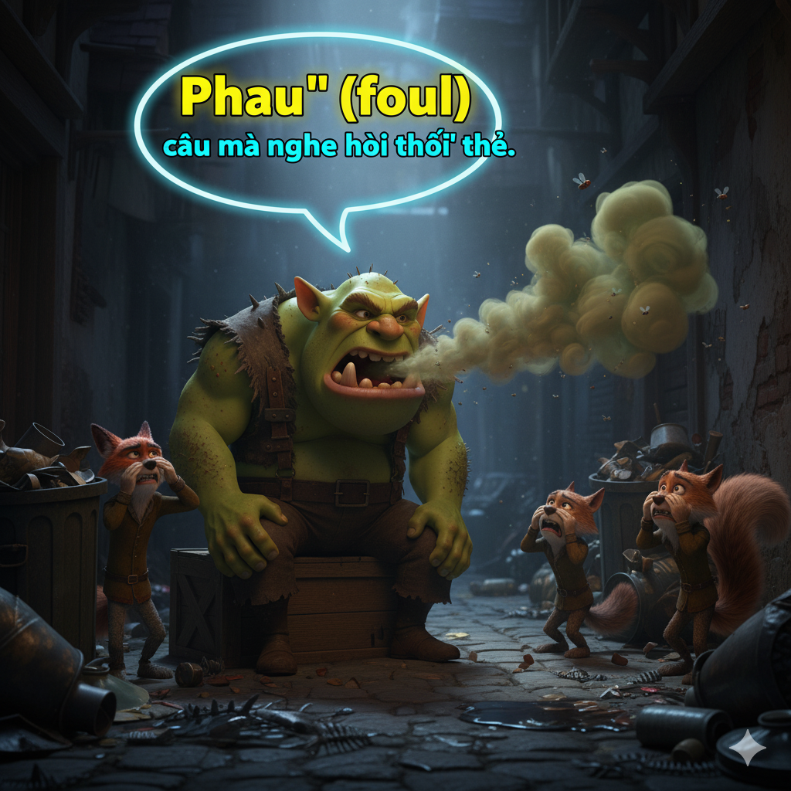
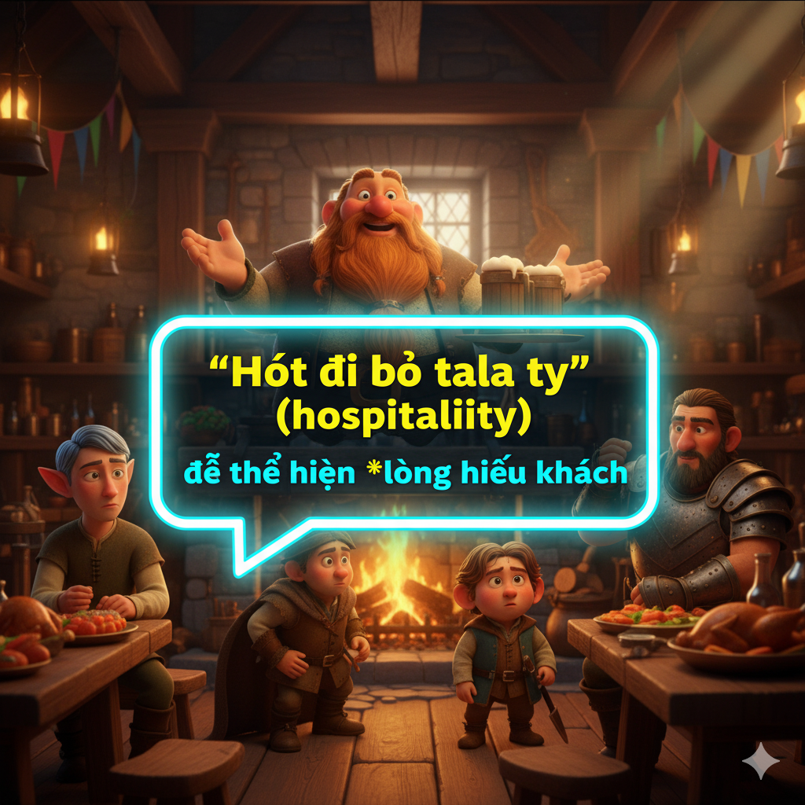
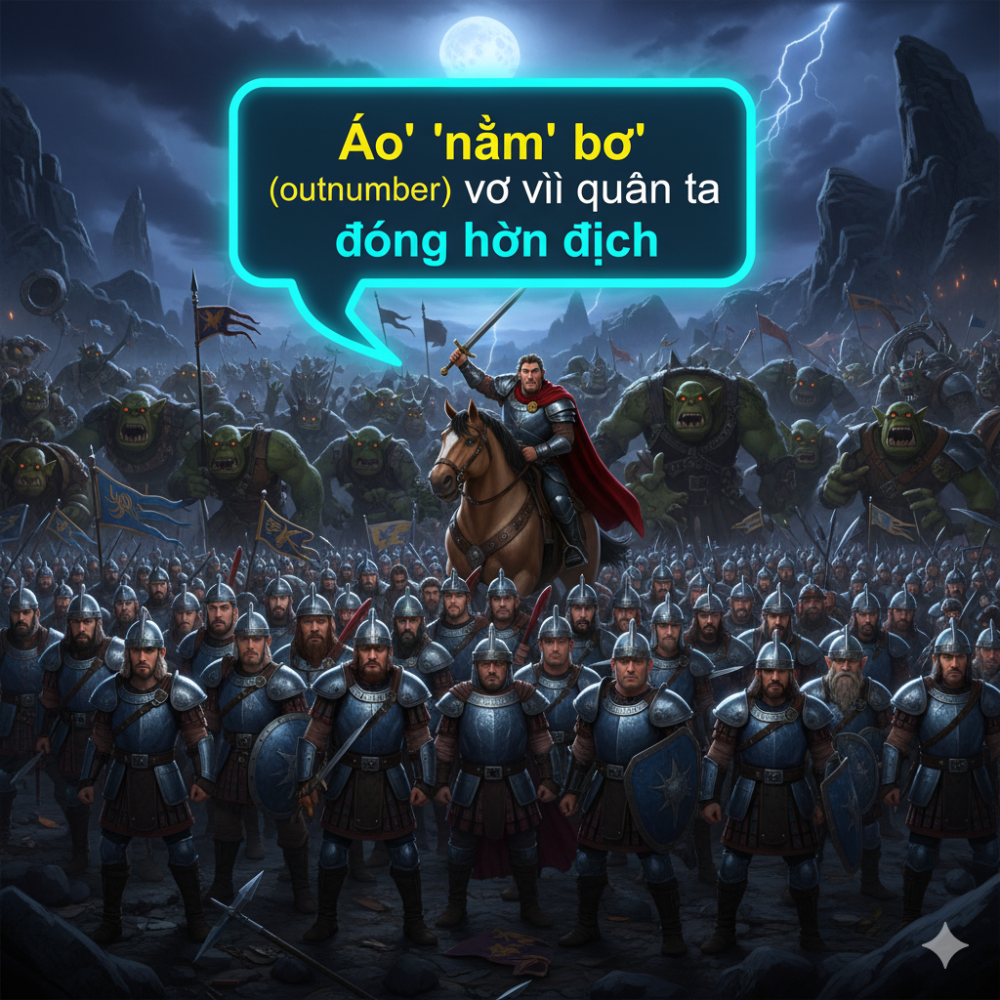
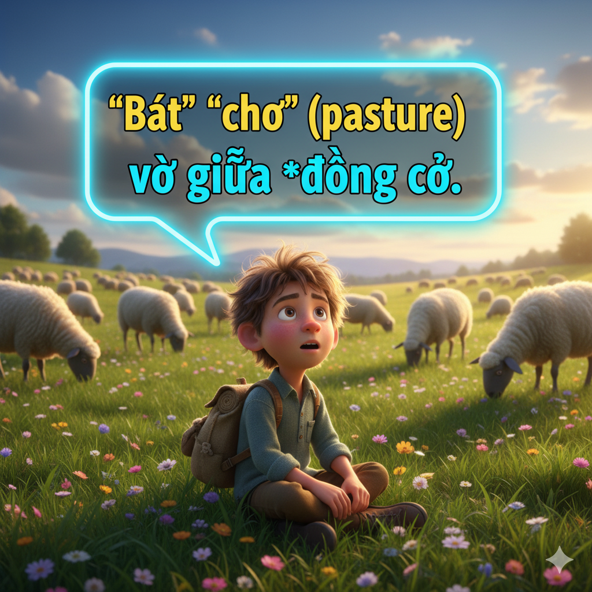
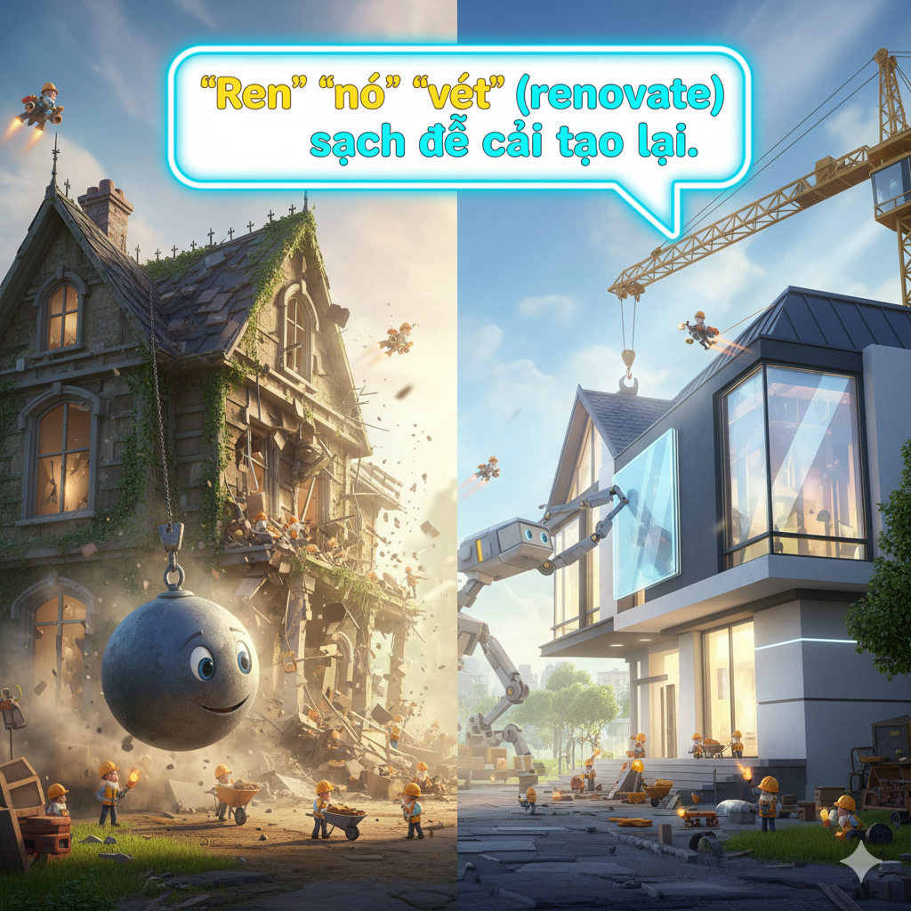
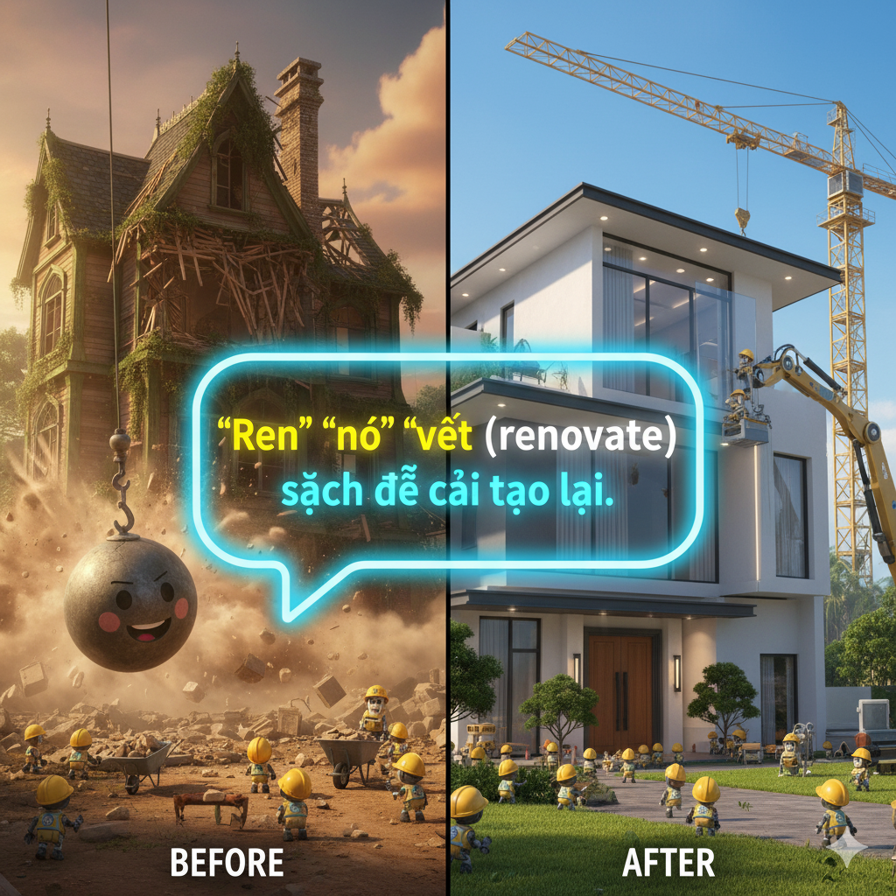

# The Lord and the Farmers

A wealthy lord was renovating his mansion. He had added another story to his home with large windows that overlooked the farmers’ pastures on the eastern border of his land. Around the mansion, he then erected a great wall. He built an arch for the gate out of huge slabs of stone. The lord was overjoyed with the addition to his home.

However, one day while he was sitting on the terrace, some farmers knocked at his door. He invited them in. Despite his hospitality, the farmers appeared to be in a foul mood.

“Why are you so upset?” the lord asked.

One farmer replied, “That is actually the reason for our visit.” He then handed the lord a petition. It alleged that the shadow cast by the mansion was harming their pastures. “Your mansion now casts a shadow over several hectares of our land,” the farmer explained. “The turf in the shadow has died, and our cattle now have less grass to eat.”

“ It is too late for me to revise my plans,” the lord answered. “You will just have to live with the change.”

His reply only heightened the farmers’ anger. They left, but they assembled that night outside the mansion’s gate. They planned to destroy the mansion. The lord’s servants tried to defend the house, but the farmers outnumbered them.

The servants fled, and the farmers rushed into the mansion and set it on fire. Everyone got out of the house, and there were no casualties. However, the fire soon spread from the house to the adjoining pastures that belonged to the farmers.

Both sides’ properties were destroyed. The lord and the farmers were sorry for their actions. The lord promised to pay for the burned pastures, and the farmers promised to rebuild the mansion. They had learned that when you fight, both sides lose.

## Sentences of story

The Lord and the Farmers

A wealthy lord was renovating his mansion.

He had added another story to his home with large windows that overlooked the farmers’ pastures on the eastern border of his land.

Around the mansion, he then erected a great wall.

He built an arch for the gate out of huge slabs of stone.

The lord was overjoyed with the addition to his home.

However, one day while he was sitting on the terrace, some farmers knocked at his door.

He invited them in.

Despite his hospitality, the farmers appeared to be in a foul mood.

“Why are you so upset?” the lord asked.

One farmer replied, “That is actually the reason for our visit.”

He then handed the lord a petition.

It alleged that the shadow cast by the mansion was harming their pastures.

“Your mansion now casts a shadow over several hectares of our land,” the farmer explained.

“The turf in the shadow has died, and our cattle now have less grass to eat.”

“ It is too late for me to revise my plans,” the lord answered.

“You will just have to live with the change.”

His reply only heightened the farmers’ anger.

They left, but they assembled that night outside the mansion’s gate.

They planned to destroy the mansion.

The lord’s servants tried to defend the house, but the farmers outnumbered them.

The servants fled, and the farmers rushed into the mansion and set it on fire.

Everyone got out of the house, and there were no casualties.

However, the fire soon spread from the house to the adjoining pastures that belonged to the farmers.

Both sides’ properties were destroyed.

The lord and the farmers were sorry for their actions.

The lord promised to pay for the burned pastures, and the farmers promised to rebuild the mansion.

They had learned that when you fight, both sides lose.

## List of word

adjoining, allege, arch, assemble, casualty, erect, foul, hectare, heighten, hospitality, mansion, outnumber, overjoyed, pasture, petition, renovate, revise, slab, terrace, turf

## 1. adjoining

### IPA: /əˈdʒɔɪ.nɪŋ/
### Class: adj
### Câu truyện ẩn dụ:

`Ơ` `joining` (adjoining) là để **nối liền** hai cái này.

### Định nghĩa : 
Nối liền, kế bên.

### English definition: 
(of a building, room, or piece of land) next to or joined with.

### Sentence of stroy:
However, the fire soon spread from the house to the **adjoining** pastures that belonged to the farmers.

## 2. allege

### IPA: /əˈledʒ/
### Class: v
### Câu truyện ẩn dụ:

`Ơ` `lét` (allege) go mà không **cho là** có bằng chứng.

### Định nghĩa : 
Cho là, viện cớ là.

### English definition: 
To claim or assert that someone has done something illegal or wrong, typically without proof.

### Sentence of stroy:
It **alleged** that the shadow cast by the mansion was harming their pastures.

## 3. arch

### IPA: /ɑːrtʃ/
### Class: n
### Câu truyện ẩn dụ:

`Á` (arch) cái **mái vòm** đẹp quá.

### Định nghĩa : 
Mái vòm, hình cung.

### English definition: 
A curved symmetrical structure spanning an opening and typically supporting the weight of a bridge, roof, or wall above it.

### Sentence of stroy:
He built an **arch** for the gate out of huge slabs of stone.

## 4. assemble

### IPA: /əˈsem.bəl/
### Class: v
### Câu truyện ẩn dụ:

`Ơ` `xem` `bồ` (assemble) đang **tụ tập** làm gì kìa.

### Định nghĩa : 
Tụ tập, tập hợp.

### English definition: 
To gather together in one place for a common purpose.

### Sentence of stroy:
They left, but they **assembled** that night outside the mansion’s gate.

## 5. casualty

### IPA: /ˈkæʒ.u.əl.ti/
### Class: n
### Câu truyện ẩn dụ:

`Ca` `rua` `lì` (casualty) nên mới có **thương vong**.

### Định nghĩa : 
Người bị thương, người chết, thương vong.

### English definition: 
A person killed or injured in a war or accident.

### Sentence of stroy:
Everyone got out of the house, and there were no **casualties**.

## 6. erect

### IPA: /ɪˈrekt/
### Class: v
### Câu truyện ẩn dụ:

`Í` `réc` (erect) một tiếng là **dựng lên** được cả cái cột.

### Định nghĩa : 
Dựng lên, xây dựng.

### English definition: 
To construct (a building, wall, or other upright structure).

### Sentence of stroy:
Around the mansion, he then **erected** a great wall.

## 7. foul

### IPA: /faʊl/
### Class: adj
### Câu truyện ẩn dụ:

`Phau` (foul) câu mà nghe **hôi thối** thế.

### Định nghĩa : 
Hôi thối, bẩn thỉu; (tâm trạng) tồi tệ, cáu kỉnh.

### English definition: 
Offensive to the senses, especially through having a disgusting smell or taste or being dirty.

### Sentence of stroy:
Despite his hospitality, the farmers appeared to be in a **foul** mood.

## 8. hectare

### IPA: /ˈhek.teər/
### Class: n
### Câu truyện ẩn dụ:

`Hét` `ta` (hectare) lên vì có cả **hecta** đất.

### Định nghĩa : 
Hecta (đơn vị đo diện tích).

### English definition: 
A unit of square measure equal to 100 ares (2.471 acres or 10,000 square meters).

### Sentence of stroy:
“Your mansion now casts a shadow over several **hectares** of our land,” the farmer explained.

## 9. heighten

### IPA: /ˈhaɪ.tən/
### Class: v
### Câu truyện ẩn dụ:

`Hai` `tân` (heighten) binh mới làm **tăng** thêm sức mạnh.

### Định nghĩa : 
Tăng cường, làm cao lên.

### English definition: 
To make or become more intense.

### Sentence of stroy:
His reply only **heightened** the farmers’ anger.

## 10. hospitality

### IPA: /ˌhɒs.pɪˈtæl.ə.ti/
### Class: n
### Câu truyện ẩn dụ:

`Hót` `đi` `bồ` `tala` `ty` (hospitality) để thể hiện **lòng hiếu khách**.

### Định nghĩa : 
Lòng hiếu khách.

### English definition: 
The friendly and generous reception and entertainment of guests, visitors, or strangers.

### Sentence of stroy:
Despite his **hospitality**, the farmers appeared to be in a foul mood.

## 11. mansion

### IPA: /ˈmæn.ʃən/
### Class: n
### Câu truyện ẩn dụ:

`Men` `sần` (mansion) sùi sống trong **biệt thự**.

### Định nghĩa : 
Lâu đài, biệt thự lớn.

### English definition: 
A large impressive house.

### Sentence of stroy:
A wealthy lord was renovating his **mansion**.

## 12. outnumber

### IPA: /ˌaʊtˈnʌm.bər/
### Class: v
### Câu truyện ẩn dụ:

`Áo` `nằm` `bơ` (outnumber) vơ vì quân ta **đông hơn** địch.

### Định nghĩa : 
Đông hơn, nhiều hơn về số lượng.

### English definition: 
To be greater in number than someone or something.

### Sentence of stroy:
The lord’s servants tried to defend the house, but the farmers **outnumbered** them.

## 13. overjoyed

### IPA: /ˌoʊ.vərˈdʒɔɪd/
### Class: adj
### Câu truyện ẩn dụ:

`Âu` `vờ` `choi` (overjoyed) để che giấu sự **vui mừng khôn xiết**.

### Định nghĩa : 
Vui mừng khôn xiết.

### English definition: 
Extremely happy.

### Sentence of stroy:
The lord was **overjoyed** with the addition to his home.

## 14. pasture

### IPA: /ˈpæs.tʃər/
### Class: n
### Câu truyện ẩn dụ:

`Bát` `chơ` (pasture) vơ giữa **đồng cỏ**.

### Định nghĩa : 
Đồng cỏ, bãi chăn thả.

### English definition: 
Land covered with grass and other low plants suitable for grazing animals, especially cattle or sheep.

### Sentence of stroy:
He had added another story to his home with large windows that overlooked the farmers’ **pastures** on the eastern border of his land.

## 15. petition

### IPA: /pəˈtɪʃ.ən/
### Class: n
### Câu truyện ẩn dụ:

`Bị` `thí` `sần` (petition) vì ký vào **đơn kiến nghị**.

### Định nghĩa : 
Đơn kiến nghị, đơn thỉnh cầu.

### English definition: 
A formal written request, typically one signed by many people, appealing to authority with respect to a particular cause.

### Sentence of stroy:
He then handed the lord a **petition**.

## 16. renovate

### IPA: /ˈren.ə.veɪt/
### Class: v
### Câu truyện ẩn dụ:

`Ren` `nó` `vét` (renovate) sạch để **cải tạo** lại.

### Định nghĩa : 
Cải tạo, đổi mới.

### English definition: 
To restore (something old, especially a building) to a good state of repair.

### Sentence of stroy:
A wealthy lord was **renovating** his mansion.

## 17. revise

### IPA: /rɪˈvaɪz/
### Class: v
### Câu truyện ẩn dụ:

`Đi` `vài` (revise) vòng để **xem lại**, sửa lại.

### Định nghĩa : 
Xem lại, sửa lại.

### English definition: 
To re-examine and make alterations to (written or printed matter).

### Sentence of stroy:
“ It is too late for me to **revise** my plans,” the lord answered.

## 18. slab

### IPA: /slæb/
### Class: n
### Câu truyện ẩn dụ:

`Sờ` `láp` (slab) top trên **phiến đá**.

### Định nghĩa : 
Phiến, tấm (đá, gỗ...).

### English definition: 
A large, thick, flat piece of stone, concrete, or wood, typically rectangular.

### Sentence of stroy:
He built an arch for the gate out of huge **slabs** of stone.

## 19. terrace

### IPA: /ˈter.əs/
### Class: n
### Câu truyện ẩn dụ:

`Té` `rớt` (terrace) từ **sân thượng**.

### Định nghĩa : 
Sân thượng, thềm.

### English definition: 
A paved area beside a building; a patio or veranda.

### Sentence of stroy:
However, one day while he was sitting on the **terrace**, some farmers knocked at his door.

## 20. turf

### IPA: /tɜːrf/
### Class: n
### Câu truyện ẩn dụ:

`Tớp` (turf) một miếng **cỏ**.

### Định nghĩa : 
Lớp đất có cỏ, cỏ.

### English definition: 
Grass and the surface layer of earth held together by its roots.

### Sentence of stroy:
“The **turf** in the shadow has died, and our cattle now have less grass to eat.”