# The Shortcut

A truck driver was driving cargo from the outback to the coast. His load was comprised of many types of ore. He needed a huge truck to carry its bulk to a ship waiting at a pier on the country’s eastern coast. At the border between two counties, he’d have to pay a tariff on the cargo. However, he could keep his money if he avoided the station at the border. He worried about getting in trouble for not paying the tariff, but the thought of extra money outweighed this concern.

He took out his road map. To his surprise, it depicted a small road that had a dual advantage. It not only avoided the border station but also was a shorter route to the coast. He decided to take the shortcut.

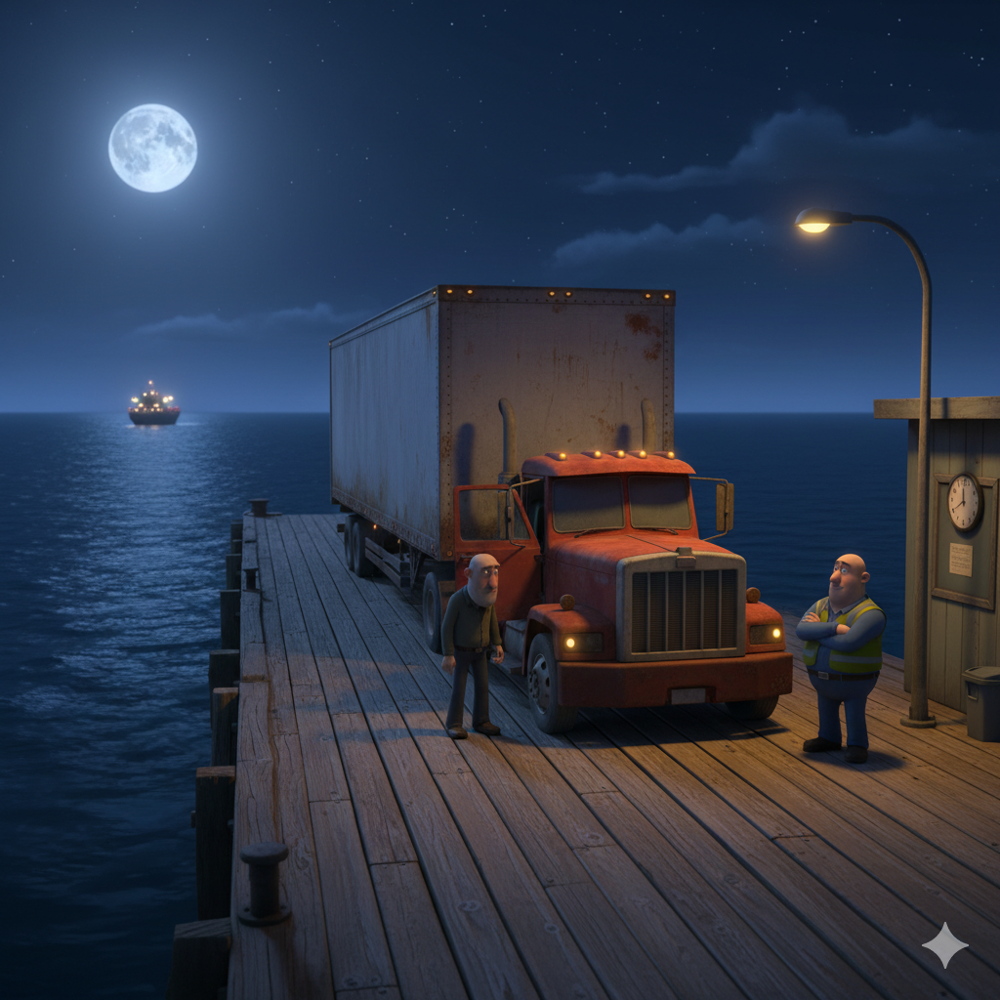

However, along his journey, he soon ran into problems. First, he had to cross a small wooden bridge. His truck weighed too much for the bridge. It was analogous to an elephant trying to stand on a tree branch. The bridge started to break as the truck crossed, and the trailer tilted to the right. Fortunately, the truck made it safely across, but most of the ore fell into the river below.

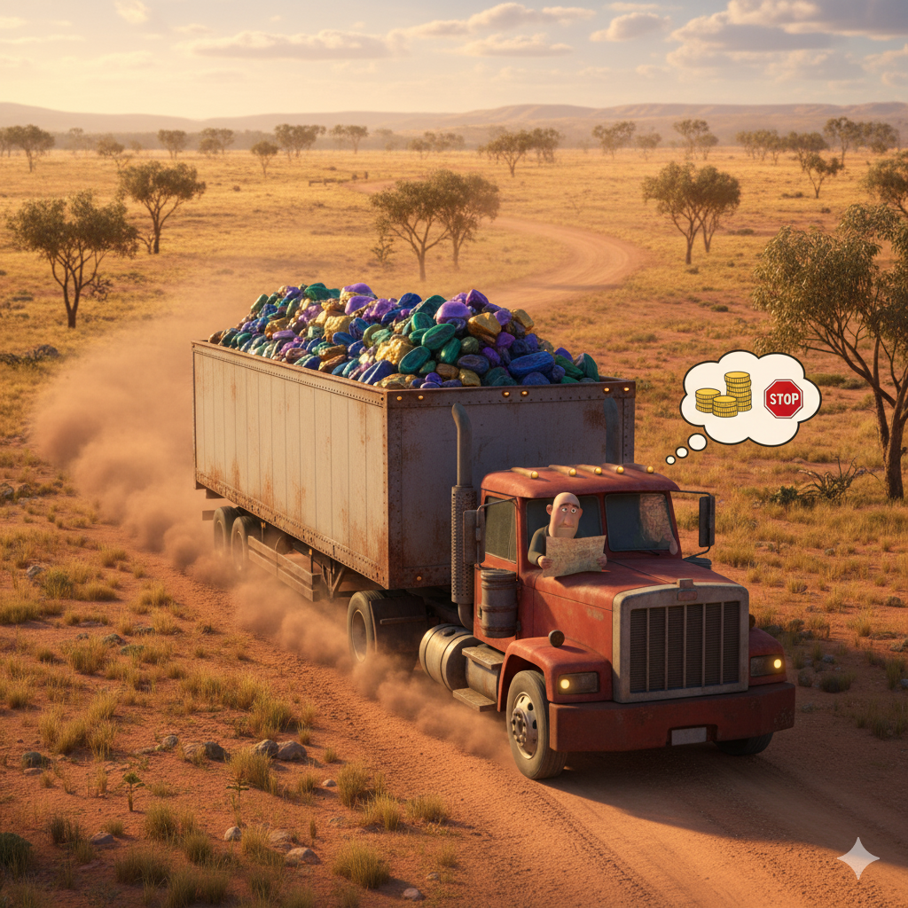

Next, it was a very hot day. The thermometer read over 100 degrees Fahrenheit. The truck’s engine became too hot, so the driver parked it in the shade of a grove of trees until it cooled down.

Later, he took a wrong turn. He stopped and took out his binoculars. He scanned his surroundings and eventually discovered a landmark that led him back to the proper route.

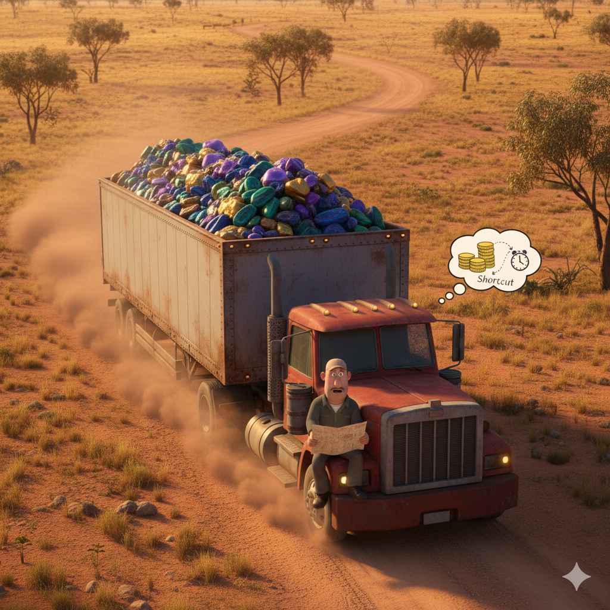

Finally, he arrived at the pier, but the ship wasn’t there. When he asked about the ship’s whereabouts, a man said that it had left thirty minutes ago. He had not fulfilled his duty. He realized then the paradox of the shortcut. The shortest route can be the longest, and vice versa, a long route may be the fastest.

## Sentences of story

The Shortcut

A truck driver was driving cargo from the outback to the coast.

His load was comprised of many types of ore.

He needed a huge truck to carry its bulk to a ship waiting at a pier on the country’s eastern coast.

At the border between two counties, he’d have to pay a tariff on the cargo.

However, he could keep his money if he avoided the station at the border.

He worried about getting in trouble for not paying the tariff, but the thought of extra money outweighed this concern.

He took out his road map.

To his surprise, it depicted a small road that had a dual advantage.

It not only avoided the border station but also was a shorter route to the coast.

He decided to take the shortcut.

However, along his journey, he soon ran into problems.

First, he had to cross a small wooden bridge.

His truck weighed too much for the bridge.

It was analogous to an elephant trying to stand on a tree branch.

The bridge started to break as the truck crossed, and the trailer tilted to the right.

Fortunately, the truck made it safely across, but most of the ore fell into the river below.

Next, it was a very hot day.

The thermometer read over 100 degrees Fahrenheit.

The truck’s engine became too hot, so the driver parked it in the shade of a grove of trees until it cooled down.

Later, he took a wrong turn.

He stopped and took out his binoculars.

He scanned his surroundings and eventually discovered a landmark that led him back to the proper route.

Finally, he arrived at the pier, but the ship wasn’t there.

When he asked about the ship’s whereabouts, a man said that it had left thirty minutes ago.

He had not fulfilled his duty.

He realized then the paradox of the shortcut.

The shortest route can be the longest, and vice versa, a long route may be the fastest.

## List of word

analogous, binoculars, bulk, comprise, depict, dual, Fahrenheit, fulfill, grove, ore, outback, outweigh, paradox, pier, shortcut, tariff, thermometer, tilt, vice versa, whereabouts

## 1. analogous
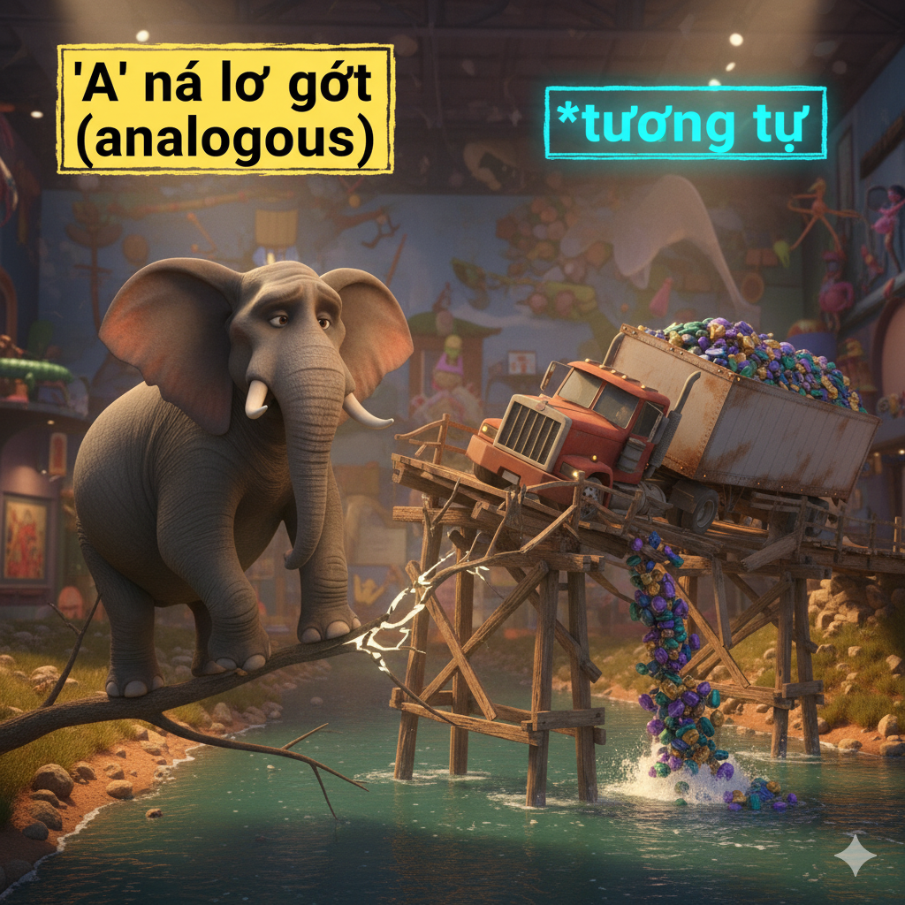

### IPA: /əˈnæl.ə.ɡəs/
### Class: adj
### Câu truyện ẩn dụ:

`A` `ná` `lơ` `gớt` (analogous) vì chúng nó **tương tự** nhau quá.

### Định nghĩa : 
Tương tự, giống nhau.

### English definition: 
Comparable in certain respects, typically in a way which makes clearer the nature of the things compared.

### Sentence of stroy:
It was **analogous** to an elephant trying to stand on a tree branch.

## 2. binoculars
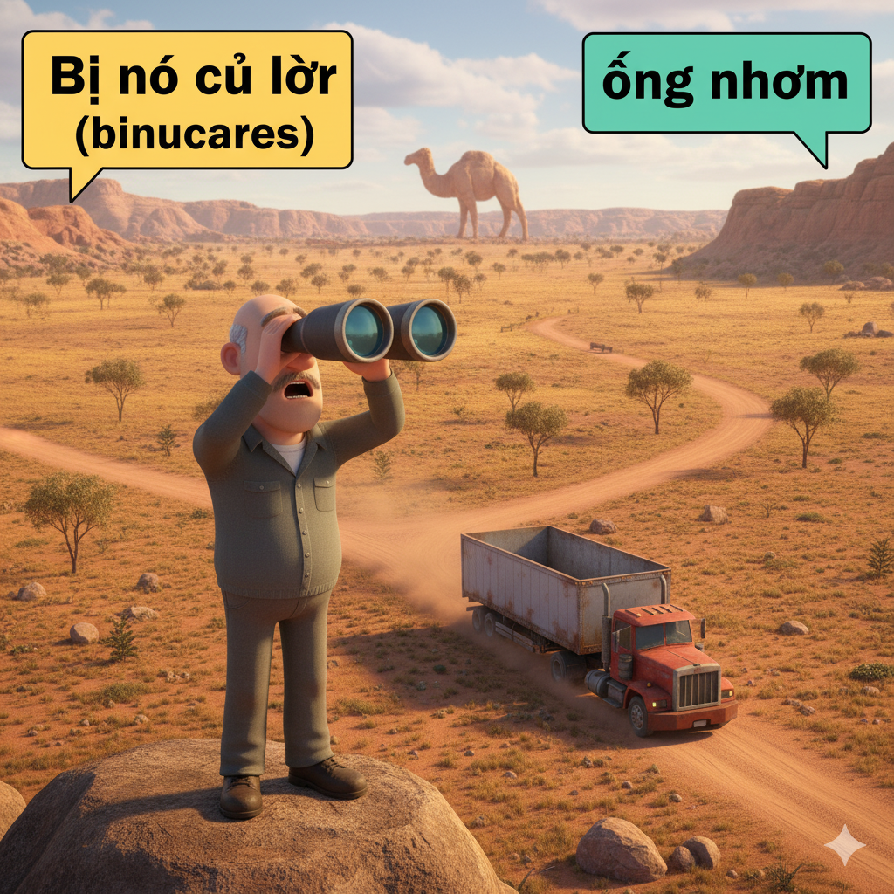

### IPA: /bɪˈnɒk.jə.ləz/
### Class: n
### Câu truyện ẩn dụ:

`Bị` `nó` `cứ` `lơ` (binoculars) vì nó mải nhìn qua **ống nhòm**.

### Định nghĩa : 
Ống nhòm.

### English definition: 
An optical instrument with a lens for each eye, used for viewing distant objects.

### Sentence of stroy:
He stopped and took out his **binoculars**.

## 3. bulk
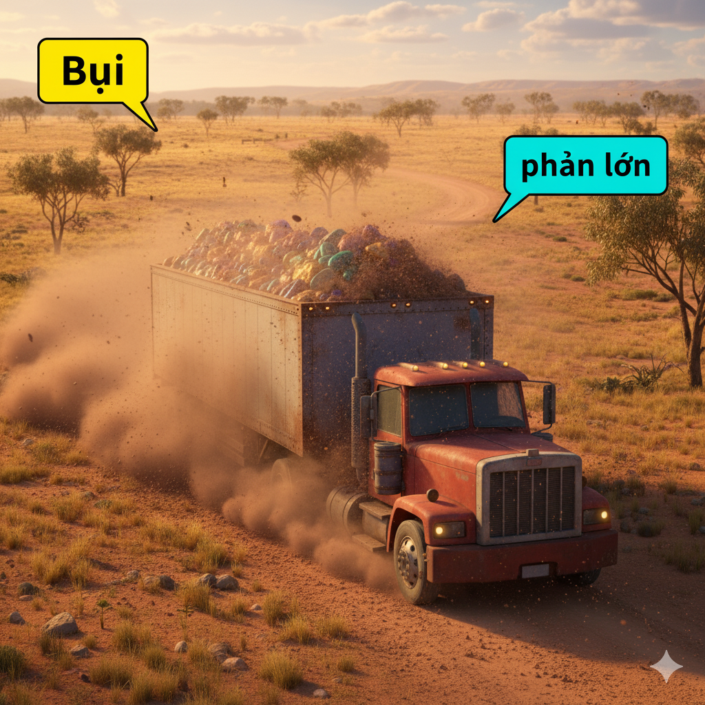

### IPA: /bʌlk/
### Class: n
### Câu truyện ẩn dụ:

`Bụi` (bulk) bám vào **phần lớn** hàng hóa.

### Định nghĩa : 
Phần lớn, số lượng lớn, kích thước lớn.

### English definition: 
The mass or size of something large.

### Sentence of stroy:
He needed a huge truck to carry its **bulk** to a ship waiting at a pier on the country’s eastern coast.

## 4. comprise

### IPA: /kəmˈpraɪz/
### Class: v
### Câu truyện ẩn dụ:

`Cơm` `rai` (comprise) **bao gồm** nhiều món lắm.

### Định nghĩa : 
Bao gồm, gồm có.

### English definition: 
To consist of; be made up of.

### Sentence of stroy:
His load was **comprised** of many types of ore.

## 5. depict

### IPA: /dɪˈpɪkt/
### Class: v
### Câu truyện ẩn dụ:

`Đi` `bích` (depict) là cách **miêu tả** thế bài.

### Định nghĩa : 
Miêu tả, mô tả.

### English definition: 
To represent by or as if by a picture.

### Sentence of stroy:
To his surprise, it **depicted** a small road that had a dual advantage.

## 6. dual

### IPA: /dʒuː.əl/
### Class: adj
### Câu truyện ẩn dụ:

Cả làng `đua` `ồ` (dual) lên vì lợi ích **kép**.

### Định nghĩa : 
Kép, đôi, hai.

### English definition: 
Consisting of two parts, elements, or aspects.

### Sentence of stroy:
To his surprise, it depicted a small road that had a **dual** advantage.

## 7. Fahrenheit
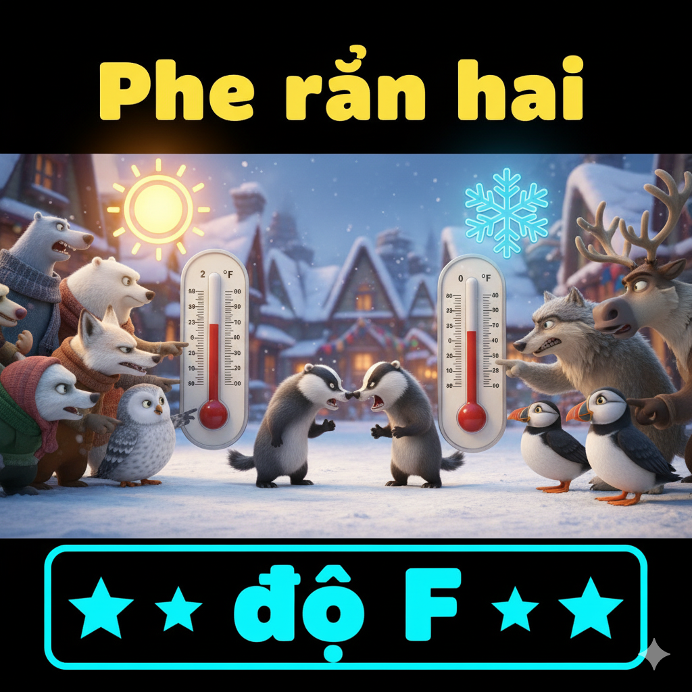

### IPA: /ˈfær.ən.haɪt/
### Class: n
### Câu truyện ẩn dụ:

`Phe` `rần` `hai` (Fahrenheit) bên vì cãi nhau về **độ F**.

### Định nghĩa : 
Độ F (đơn vị đo nhiệt độ).

### English definition: 
Of or denoting a scale of temperature on which water freezes at 32° and boils at 212° under standard conditions.

### Sentence of stroy:
The thermometer read over 100 degrees **Fahrenheit**.

## 8. fulfill
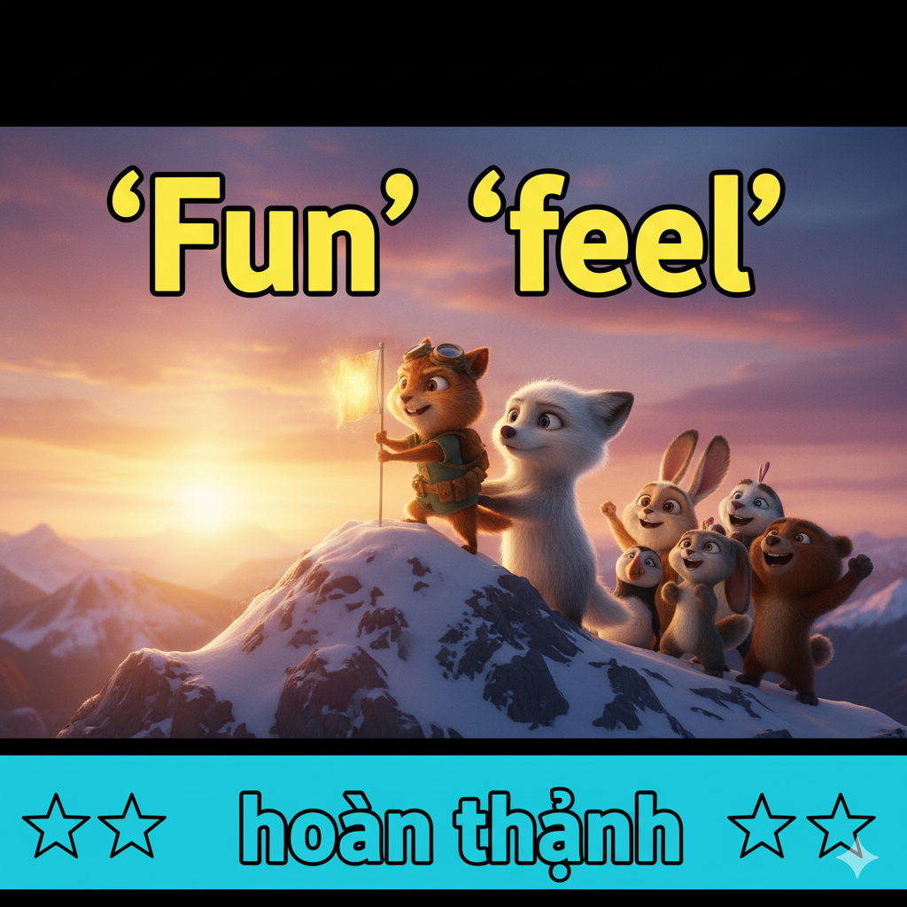

### IPA: /fʊlˈfɪl/
### Class: v
### Câu truyện ẩn dụ:

`Fun` `feel` (fulfill) khi **hoàn thành** nhiệm vụ.

### Định nghĩa : 
Hoàn thành, thực hiện, đáp ứng.

### English definition: 
To bring to completion or reality; achieve or realize (something desired, promised, or predicted).

### Sentence of stroy:
He had not **fulfilled** his duty.

## 9. grove

### IPA: /ɡroʊv/
### Class: n
### Câu truyện ẩn dụ:

`Gờ` `rô` (grove) lên trong **lùm cây**.

### Định nghĩa : 
Lùm cây, khu rừng nhỏ.

### English definition: 
A small wood, orchard, or group of trees.

### Sentence of stroy:
The driver parked it in the shade of a **grove** of trees until it cooled down.

## 10. ore

### IPA: /ɔːr/
### Class: n
### Câu truyện ẩn dụ:

`O` `rê` (ore) lên vì đào được **quặng** vàng.

### Định nghĩa : 
Quặng.

### English definition: 
A naturally occurring solid material from which a metal or valuable mineral can be profitably extracted.

### Sentence of stroy:
His load was comprised of many types of **ore**.

## 11. outback

### IPA: /ˈaʊt.bæk/
### Class: n
### Câu truyện ẩn dụ:

`Áo` `bách` (outback) khoa mặc đi tới **vùng xa xôi hẻo lánh**.

### Định nghĩa : 
Vùng xa xôi hẻo lánh (đặc biệt ở Úc).

### English definition: 
The remote and usually uninhabited inland regions of Australia.

### Sentence of stroy:
A truck driver was driving cargo from the **outback** to the coast.

## 12. outweigh
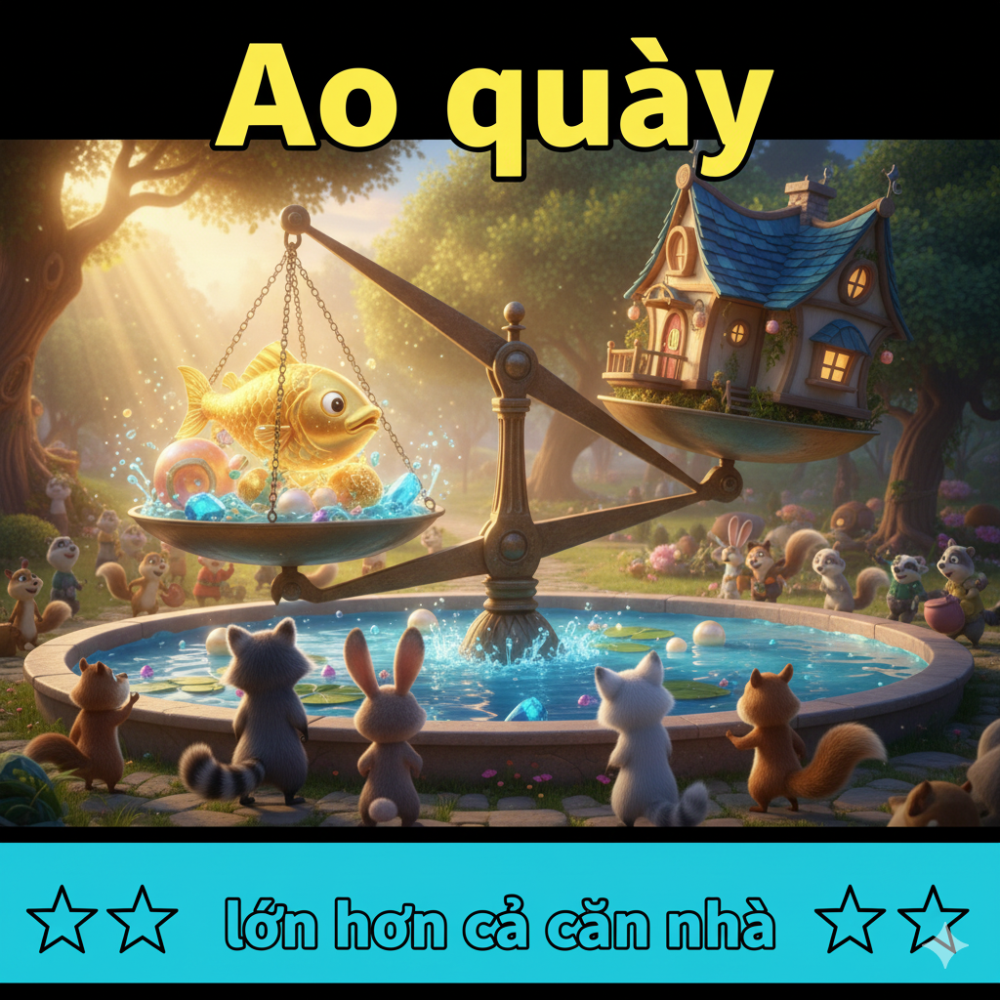

### IPA: /ˌaʊtˈweɪ/
### Class: v
### Câu truyện ẩn dụ:

`Ao` `quây` (outweigh) có giá trị **lớn hơn** cả căn nhà.

### Định nghĩa : 
Nặng hơn, có giá trị hoặc tầm quan trọng lớn hơn.

### English definition: 
To be heavier, greater, or more significant than.

### Sentence of stroy:
He worried about getting in trouble for not paying the tariff, but the thought of extra money **outweighed** this concern.

## 13. paradox

### IPA: /ˈpær.ə.dɒks/
### Class: n
### Câu truyện ẩn dụ:

`Ba` `ra` `đốc` (paradox) tờ hỏi về cái **nghịch lý** này.

### Định nghĩa : 
Nghịch lý.

### English definition: 
A seemingly absurd or self-contradictory statement or proposition that when investigated or explained may prove to be well founded or true.

### Sentence of stroy:
He realized then the **paradox** of the shortcut.

## 14. pier

### IPA: /pɪər/
### Class: n
### Câu truyện ẩn dụ:

Uống `bia` (pier) ở **bến tàu** thì thật tuyệt.

### Định nghĩa : 
Bến tàu, cầu tàu.

### English definition: 
A raised structure, including bridge supports and walkways, typically supported by widely spread piles or columns, extending from land out over water.

### Sentence of stroy:
He needed a huge truck to carry its bulk to a ship waiting at a **pier** on the country’s eastern coast.

## 15. shortcut

### IPA: /ˈʃɔːt.kʌt/
### Class: n
### Câu truyện ẩn dụ:

`Sót` `cắt` (shortcut) mất một đoạn vì đi **đường tắt**.

### Định nghĩa : 
Đường tắt.

### English definition: 
A shorter alternative route.

### Sentence of stroy:
He decided to take the **shortcut**.

## 16. tariff
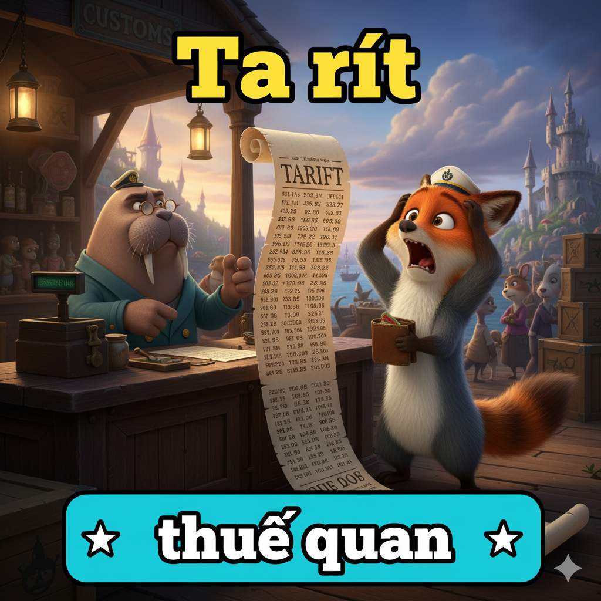

### IPA: /ˈtær.ɪf/
### Class: n
### Câu truyện ẩn dụ:

`Ta` `rít` (tariff) một hơi khi thấy hóa đơn **thuế quan**.

### Định nghĩa : 
Thuế quan, thuế nhập khẩu/xuất khẩu.

### English definition: 
A tax or duty to be paid on a particular class of imports or exports.

### Sentence of stroy:
At the border between two counties, he’d have to pay a **tariff** on the cargo.

## 17. thermometer

### IPA: /θəˈmɒm.ɪ.tər/
### Class: n
### Câu truyện ẩn dụ:

`Thơ` `mẹ` `tớ` (thermometer) nóng như cái **nhiệt kế**.

### Định nghĩa : 
Nhiệt kế.

### English definition: 
An instrument for measuring and indicating temperature.

### Sentence of stroy:
The **thermometer** read over 100 degrees Fahrenheit.

## 18. tilt
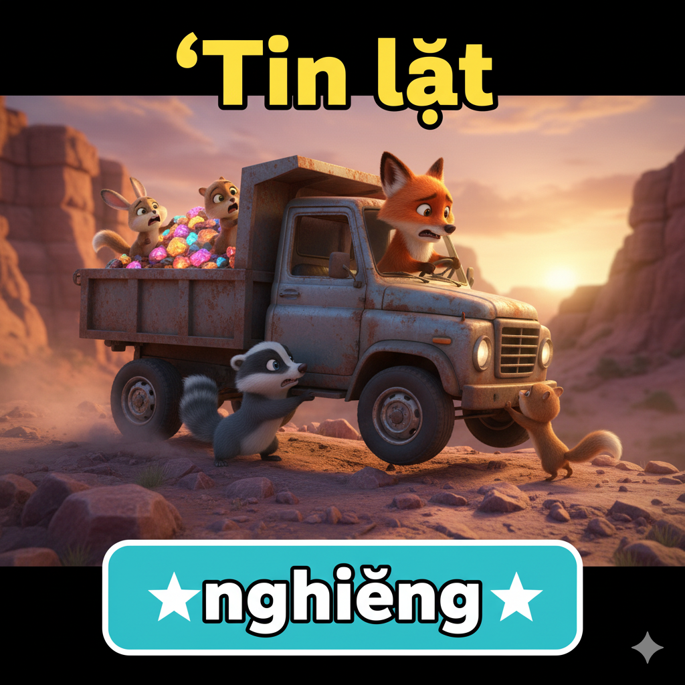

### IPA: /tɪlt/
### Class: v
### Câu truyện ẩn dụ:

`Tin` `lật` (tilt) làm chiếc xe **nghiêng** đi.

### Định nghĩa : 
Nghiêng, làm cho nghiêng.

### English definition: 
To move or cause to move into a sloping position.

### Sentence of stroy:
The bridge started to break as the truck crossed, and the trailer **tilted** to the right.

## 19. vice versa
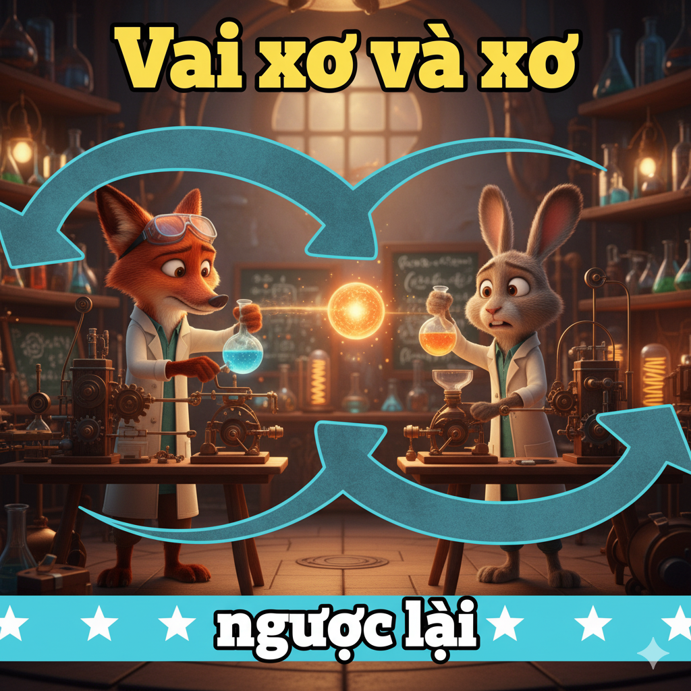

### IPA: /ˌvaɪs ˈvɜː.sə/
### Class: adv
### Câu truyện ẩn dụ:

`Vai` `xơ` `vá` `xơ` (vice versa) làm đi làm lại và **ngược lại**.

### Định nghĩa : 
Ngược lại.

### English definition: 
With the main items in the preceding statement the other way around.

### Sentence of stroy:
The shortest route can be the longest, and **vice versa**, a long route may be the fastest.

## 20. whereabouts

### IPA: /ˈweə.rə.baʊts/
### Class: n
### Câu truyện ẩn dụ:

`Que` `ở` `bãi` (whereabouts) không rõ **tung tích**.

### Định nghĩa : 
Tung tích, chỗ ở.

### English definition: 
The place where someone or something is.

### Sentence of stroy:
When he asked about the ship’s **whereabouts**, a man said that it had left thirty minutes ago.