# Dressed to Excess 

If you traveled back in time to the 1700s in Europe, you would laugh when you saw how the aristocracy dressed. Soon you’d realize, though, that the aristocrats of Europe were very serious about their appearance.

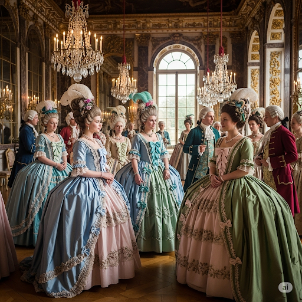

The predominant style in women’s attire was enormous dresses. They were often three times larger than the wearer. Ladies even used pads to enlarge the appearance of their hips and shoulders. On the other extreme, the aristocratic women made their waists appear extremely thin. It took several maids stretching fabric and pulling straps in order to get a lady’s waist to the proper thinness. These ladies could barely breathe and often fainted.

Pale skin was also a craze, yet this too was done in excess. One could not simply be pale. Instead, she needed to look as if she had anemia. In order to look paler, ladies actually cut themselves daily, so they would bleed.

The hairstyles, however, were the hallmark of women’s fashion. These stood a meter high on the ladies’ heads. The columns of hair were a ridiculous tangle of wigs, jewels, flowers, and even stuffed birds.

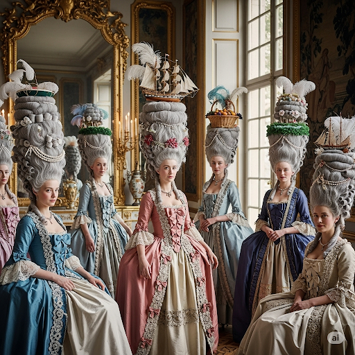

Men’s fashion was similarly absurd. Today it would probably seem very feminine. Reputable men wore wigs of long curly hair. Their shoes had large soles or high heels so that they could walk high above the filth on the streets. Furthermore, just like the ladies, the men wore lipstick and put rouge on their cheeks.

Their clothes were brightly colored, often purple and pink. They were made from the finest of fabrics and decorated with jewels and lace. The men vied with one another to see who wore the more expensive clothes, for the clothing signified his wealth and status.

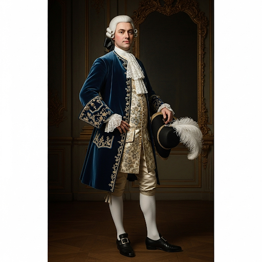

Both men and women spent huge amounts of money and time on how they looked. Though such vanity would seem vulgar today, three hundred years from now, the fashions of our time might also seem completely ridiculous.

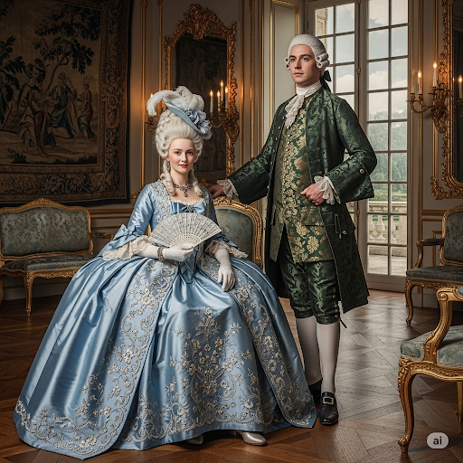

## Sentences of story

Dressed to Excess 

If you traveled back in time to the 1700s in Europe, you would laugh when you saw how the aristocracy dressed.

Soon you’d realize, though, that the aristocrats of Europe were very serious about their appearance.

The predominant style in women’s attire was enormous dresses.

They were often three times larger than the wearer.

Ladies even used pads to enlarge the appearance of their hips and shoulders.

On the other extreme, the aristocratic women made their waists appear extremely thin.

It took several maids stretching fabric and pulling straps in order to get a lady’s waist to the proper thinness.

These ladies could barely breathe and often fainted.

Pale skin was also a craze, yet this too was done in excess.

One could not simply be pale.

Instead, she needed to look as if she had anemia.

In order to look paler, ladies actually cut themselves daily, so they would bleed.

The hairstyles, however, were the hallmark of women’s fashion.

These stood a meter high on the ladies’ heads.

The columns of hair were a ridiculous tangle of wigs, jewels, flowers, and even stuffed birds.

Men’s fashion was similarly absurd.

Today it would probably seem very feminine.

Reputable men wore wigs of long curly hair.

Their shoes had large soles or high heels so that they could walk high above the filth on the streets.

Furthermore, just like the ladies, the men wore lipstick and put rouge on their cheeks.

Their clothes were brightly colored, often purple and pink.

They were made from the finest of fabrics and decorated with jewels and lace.

The men vied with one another to see who wore the more expensive clothes, for the clothing signified his wealth and status.

Both men and women spent huge amounts of money and time on how they looked.

Though such vanity would seem vulgar today, three hundred years from now, the fashions of our time might also seem completely ridiculous.

## List of word

absurd, anemia, aristocracy, aristocrat, attire, craze, enlarge, excess, feminine, hallmark, pad, predominant, reputable, rouge, signify, strap, tangle, vanity, vie, vulgar

## 1. absurd
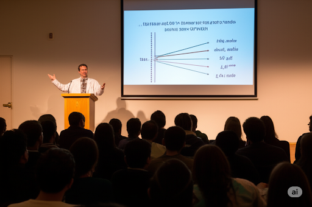

### IPA: /əbˈsɜːd/
### Class: adj
### Câu truyện ẩn dụ:
Một nhà khoa học đang thuyết trình về những phát hiện mới của mình. Bỗng một người trong khán phòng đứng dậy và nói: "Tôi vừa ***ờbsớt*** (ờ, sớt) trên mạng và thấy rằng người ta tin Trái Đất phẳng và do rùa khổng lồ cõng trên lưng." Cả khán phòng bật cười. Vị giáo sư lắc đầu, đáp lại: "Thưa ngài, trong thời đại khoa học này mà vẫn còn những niềm tin như vậy thì thật sự quá **vô lý** (absurd). Đó là một ý tưởng ngớ ngẩn và không hề có cơ sở thực tế nào cả, thật lố bịch."

### Định nghĩa : 
Vô lý, lố bịch, ngớ ngẩn.

### English definition: 
Stupid and unreasonable, or silly in a humorous way.

### Sentence of stroy:
Men’s fashion was similarly **absurd**.

## 2. anemia
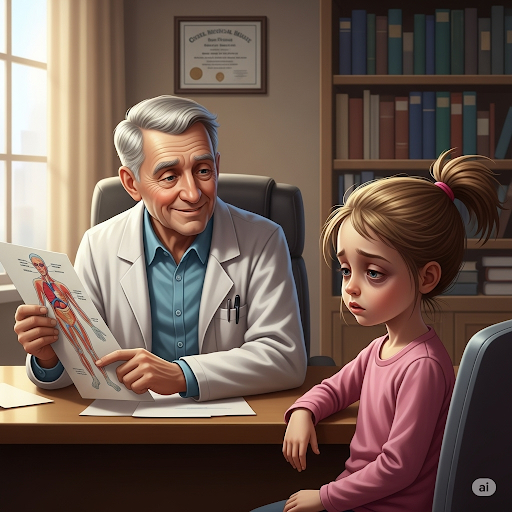

### IPA: /əˈniː.mi.ə/
### Class: n
### Câu truyện ẩn dụ:
Một cô gái trẻ bước vào phòng khám với vẻ mặt xanh xao, mệt mỏi và hay bị choáng váng. Vị bác sĩ già sau khi xem kết quả xét nghiệm máu, liền nhìn cô và hỏi một cách quan tâm: "Cháu gái, có phải tên cháu là ***Ơnimìà*** (ờ, ni mi à) không?" Cô gái ngạc nhiên lắc đầu. Bác sĩ mỉm cười giải thích: "Bác chỉ đùa thôi. Nhìn sắc mặt và các chỉ số của cháu, bác chẩn đoán cháu đã mắc bệnh **thiếu máu** (anemia). Chúng ta cần lên kế hoạch bổ sung sắt và vitamin ngay nhé."

### Định nghĩa : 
Bệnh thiếu máu.

### English definition: 
A medical condition in which there are not enough red blood cells in the blood.

### Sentence of stroy:
Instead, she needed to look as if she had **anemia**.

## 3. aristocracy
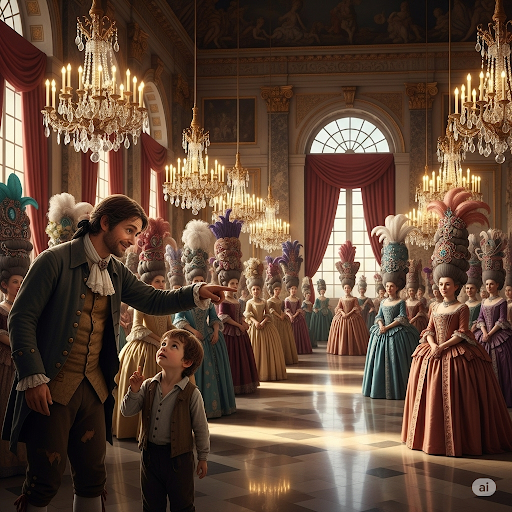

### IPA: /ˌær.ɪˈstɒk.rə.si/
### Class: n
### Câu truyện ẩn dụ:
Trong một buổi dạ tiệc hoàng gia xa hoa, một cậu bé nhà quê lần đầu được tham dự đã thì thầm với cha: "Cha ơi, sao những người kia trông sang trọng và quyền quý thế ạ?" Người cha chỉ vào một nhóm người đang trò chuyện, tóc tai được trang điểm lấp lánh, và nói nhỏ: "Họ thuộc về **tầng lớp quý tộc** (aristocracy) đấy con ạ. Người ta hay nói đùa rằng ***Arìstócrasi*** (A, sờ tóc ra xiền) là có thật, vì họ giàu có đến mức dùng cả bột vàng để trang trí cho mái tóc, thể hiện sự xa hoa và đẳng cấp của mình."

### Định nghĩa : 
Tầng lớp quý tộc.

### English definition: 
A class of people who hold high social rank.

### Sentence of stroy:
...you would laugh when you saw how the **aristocracy** dressed.

## 4. aristocrat
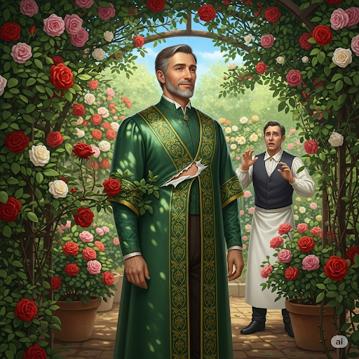

### IPA: /ˈær.ɪ.stə.kræt/
### Class: n
### Câu truyện ẩn dụ:
Một vị công tước đang đi dạo trong khu vườn thì áo choàng lụa của ông vô tình vướng vào một cành hồng gai. Một tiếng "xoẹt" nhỏ vang lên. Người hầu vội vã chạy tới, lo lắng nói: "Thưa ngài, áo của ngài..." Vị công tước chỉ mỉm cười, nhẹ nhàng gỡ tấm áo ra và nói: "Chỉ là ***Arìstocrát*** (a, rách tơ) một chút thôi, không sao cả." Phong thái điềm tĩnh, không hề bận tâm đến tấm áo đắt tiền bị rách của ông đã cho thấy cốt cách của một **người quý tộc** (aristocrat) thực thụ, luôn đặt sự thanh lịch lên trên vật chất.

### Định nghĩa : 
Người quý tộc.

### English definition: 
A person of high social rank who belongs to the aristocracy.

### Sentence of stroy:
...the **aristocrats** of Europe were very serious about their appearance.

## 5. attire
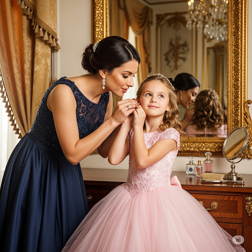

### IPA: /əˈtaɪər/
### Class: n
### Câu truyện ẩn dụ:
Trước khi đến buổi tiệc hoàng gia, một cô bé đang loay hoay trước gương, trên người là chiếc váy dạ hội bồng bềnh. Cô bé cầm một đôi hoa tai kim cương nhỏ và hỏi mẹ: "Mẹ ơi, ***ơthaiờ*** (ờ, tai con) đeo cái này có hợp không ạ?" Người mẹ mỉm cười, âu yếm cài hoa tai cho con gái và nói: "Tất nhiên rồi con yêu. Đôi hoa tai này hoàn hảo để hoàn thiện bộ **trang phục** (attire) lộng lẫy của con đêm nay. Trông con như một nàng công chúa thực sự vậy."

### Định nghĩa : 
Trang phục, quần áo (thường là trang trọng).

### English definition: 
Clothes, especially formal or special ones.

### Sentence of stroy:
The predominant style in women’s **attire** was enormous dresses.

## 6. craze
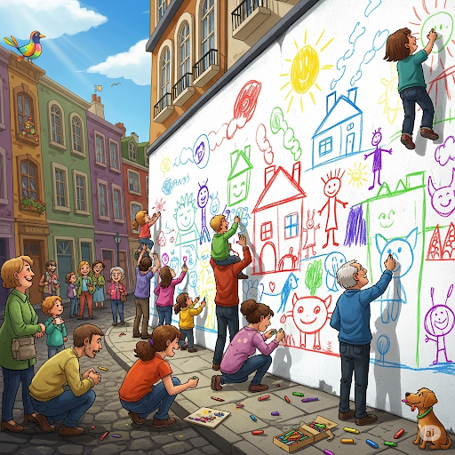

### IPA: /kreɪz/
### Class: n
### Câu truyện ẩn dụ:
Dạo gần đây, trong khu phố bỗng rộ lên một trào lưu kỳ lạ. Bất cứ ai, từ người già đến trẻ nhỏ, đều cầm theo một hộp bút sáp màu. Họ nói rằng đây là **cơn sốt** (craze) mới nhất để giải tỏa căng thẳng. Mọi người gặp nhau không chào hỏi như thường lệ, mà thay vào đó họ sẽ hỏi: "Hôm nay bạn đã dùng ***crâyz*** (cờ-rây-dờn/bút sáp) chưa?" Các bức tường công cộng bắt đầu xuất hiện những hình vẽ nguệch ngoạc nhưng đầy màu sắc, đánh dấu cho một mốt nhất thời vô cùng độc đáo.

### Định nghĩa : 
Cơn sốt, mốt nhất thời.

### English definition: 
An activity, object, or idea that is extremely popular, usually for a short time.

### Sentence of stroy:
Pale skin was also a **craze**, yet this too was done in excess.

## 7. enlarge
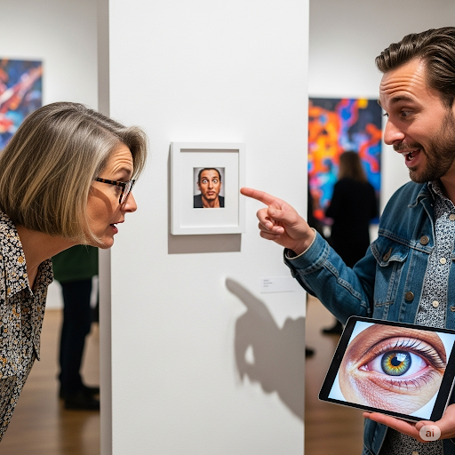

### IPA: /ɪnˈlɑːdʒ/
### Class: v
### Câu truyện ẩn dụ:
Tại một buổi triển lãm ảnh, một vị khách cứ nheo mắt nhìn vào một bức ảnh chân dung rất nhỏ. Ông nói với người nghệ sĩ: "Bức ảnh này của anh ***inlárdge*** (in lác) đác chi tiết quá, tôi không thấy rõ được biểu cảm của người mẫu." Người nghệ sĩ mỉm cười đáp: "Ồ, đó là ý đồ của tôi. Nhưng nếu ngài muốn, tôi có thể **phóng to** (enlarge) nó ra một bản khác lớn hơn. Khi được mở rộng kích thước, ngài sẽ thấy được cả chiều sâu trong đôi mắt của cô ấy."

### Định nghĩa : 
Làm to ra, mở rộng, phóng to.

### English definition: 
To make something bigger.

### Sentence of stroy:
Ladies even used pads to **enlarge** the appearance of their hips and shoulders.

## 8. excess

### IPA: /ɪkˈses/
### Class: n
### Câu truyện ẩn dụ:
Một chàng trai trẻ đến gặp chuyên gia dinh dưỡng và than phiền về việc tăng cân. Anh ta nói: "Tôi không hiểu sao mình lại béo lên. Tôi ăn đồ ngọt cũng ***íchsợ*** (ít sợ) lắm, mỗi ngày chỉ ăn một chút thôi." Vị chuyên gia nhìn vào nhật ký ăn uống của anh ta và nói: "Vấn đề không phải là anh 'ít sợ' hay không. Vấn đề là sự tích tụ. Mỗi ngày một chút sẽ dẫn đến **sự quá mức** (excess). Việc tiêu thụ đường vượt quá nhu cầu của cơ thể, dù chỉ một ít mỗi ngày, chính là nguyên nhân."

### Định nghĩa : 
Sự quá mức, sự thái quá.

### English definition: 
An amount that is more than acceptable, expected, or reasonable.

### Sentence of stroy:
Pale skin was also a craze, yet this too was done in **excess**.

## 9. feminine
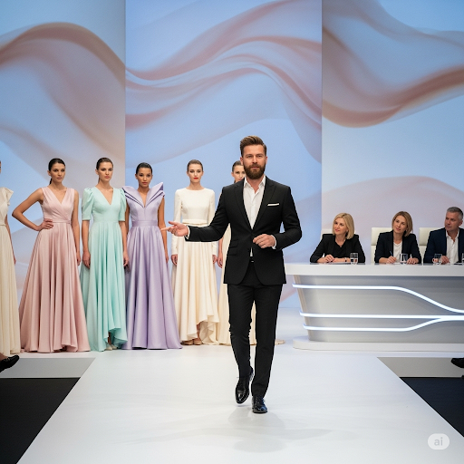

### IPA: /ˈfem.ə.nɪn/
### Class: adj
### Câu truyện ẩn dụ:
Trong một cuộc thi thiết kế thời trang, một nhà thiết kế trình làng bộ sưu tập của mình. Giám khảo nhận xét: "Thiết kế của anh rất táo bạo, nhưng có vẻ hơi cứng nhắc." Nhà thiết kế đáp: "Thực ra, cảm hứng của tôi đến từ những người phụ nữ thuộc ***pheminhon*** (phe mi nhon). Họ tuy nhỏ nhắn nhưng lại rất mạnh mẽ. Vì vậy, tôi đã kết hợp những đường cắt may mạnh mẽ với chất liệu lụa mềm mại và màu sắc pastel để tạo ra một vẻ đẹp vừa mạnh mẽ lại vừa rất **nữ tính** (feminine), thể hiện sự duyên dáng và tinh tế."

### Định nghĩa : 
Nữ tính, yểu điệu, (thuộc) phụ nữ.

### English definition: 
Having qualities or an appearance traditionally associated with women.

### Sentence of stroy:
Today it would probably seem very **feminine**.

## 10. hallmark
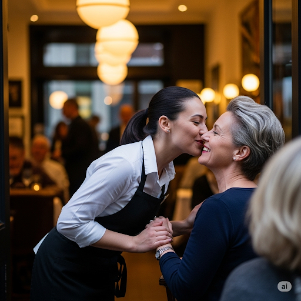

### IPA: /ˈhɔːl.mɑːk/
### Class: n
### Câu truyện ẩn dụ:
Khi được hỏi về bí quyết thành công của chuỗi nhà hàng nổi tiếng, vị đầu bếp trưởng mỉm cười và chia sẻ: "Đối với chúng tôi, chất lượng không chỉ nằm ở món ăn. **Dấu hiệu đặc trưng** (hallmark) của nhà hàng chúng tôi là sự nồng hậu. Mỗi khi khách hàng đến, nhân viên sẽ chào đón họ bằng một nụ cười ấm áp như thể đang ***hônmák*** (hôn má) người thân trong gia đình. Sự thân thiện và hiếu khách đó đã trở thành một đặc điểm nổi bật, giúp chúng tôi khác biệt với mọi đối thủ cạnh tranh."

### Định nghĩa : 
Dấu hiệu đặc trưng, đặc điểm nổi bật.

### English definition: 
A typical characteristic or feature of a person or thing.

### Sentence of stroy:
The hairstyles, however, were the **hallmark** of women’s fashion.

## 11. pad
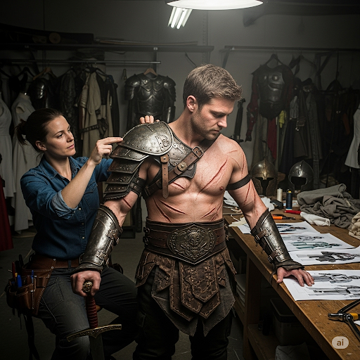

### IPA: /pæd/
### Class: n
### Câu truyện ẩn dụ:
Một anh chàng diễn viên kịch đang chuẩn bị cho vai diễn một chiến binh dũng mãnh. Trang phục của anh trông rất oai vệ, nhưng anh cảm thấy vai mình hơi nhỏ so với bộ giáp. Anh nói với người phụ trách trang phục: "Vai tôi hơi xuôi, làm sao để trông to hơn?" Người đó liền lấy ra hai miếng mút dày và nói: "Đơn giản thôi. Anh hãy dùng cái này, trông nó giống cái ***bát*** úp phải không? Đây chính là **miếng đệm** (pad) vai. Chỉ cần đặt nó vào bên trong áo giáp, vai anh sẽ trông rộng và vững chãi hơn nhiều."

### Định nghĩa : 
Miếng đệm, miếng lót.

### English definition: 
A piece of soft, thick material that you put on something to protect it or make it more comfortable.

### Sentence of stroy:
Ladies even used **pads** to enlarge the appearance of their hips and shoulders.

## 12. predominant
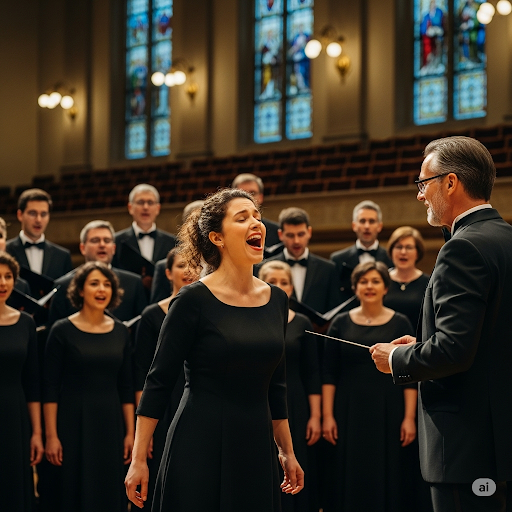

### IPA: /prɪˈdɒm.ɪ.nənt/
### Class: adj
### Câu truyện ẩn dụ:
Trong một dàn hợp xướng, có một ca sĩ sở hữu chất giọng cực kỳ cao và nội lực. Khi họ cất tiếng hát, dường như mọi âm thanh khác đều bị lu mờ. Nhạc trưởng đã nhận xét: "Giọng hát của cậu ấy khi lên những nốt ***bờriđôminần*** (bờ-ri-đô-mi-nần) thực sự là yếu tố **chiếm ưu thế** (predominant) trong cả bản nhạc. Nó nổi bật và dẫn dắt toàn bộ giai điệu. Chúng ta cần phải điều chỉnh lại một chút để tạo sự hài hòa hơn, nhưng không thể phủ nhận rằng đó là màu sắc chủ đạo của màn trình diễn."

### Định nghĩa : 
Chiếm ưu thế, chủ yếu, nổi bật.

### English definition: 
More noticeable or important, or larger in number, than others.

### Sentence of stroy:
The **predominant** style in women’s attire was enormous dresses.

## 13. reputable

### IPA: /ˈrep.jə.tə.bəl/
### Class: adj
### Câu truyện ẩn dụ:
Một du khách hỏi người dân địa phương: "Tôi muốn tìm một cửa hàng bán đồ lưu niệm uy tín, ông có thể gợi ý cho tôi không?" Người đàn ông chỉ tay về phía một cửa hàng lớn và nói: "Anh cứ đến đó. Cửa hàng đó **có danh tiếng** (reputable) nhất vùng này. Họ làm ăn rất đàng hoàng, đến mức anh chỉ cần nói ***répyutơbồ*** (rep you a table - đặt cho bạn một bàn) là họ sẵn sàng giữ hàng cho anh mà không cần đặt cọc. Cứ yên tâm về chất lượng và giá cả nhé."

### Định nghĩa : 
Có uy tín, có danh tiếng tốt.

### English definition: 
Having a good reputation and able to be trusted.

### Sentence of stroy:
**Reputable** men wore wigs of long curly hair.

## 14. rouge
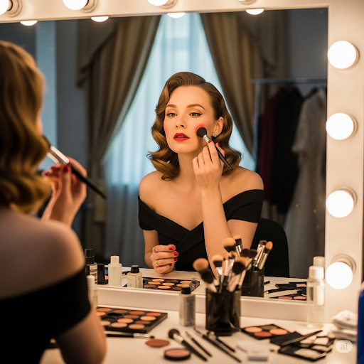

### IPA: /ruːʒ/
### Class: n
### Câu truyện ẩn dụ:
Một nữ diễn viên đang ngồi trước bàn trang điểm, chuẩn bị cho cảnh quay. Cô nhìn vào gương và thấy khuôn mặt mình hơi nhợt nhạt dưới ánh đèn trường quay. Cô liền lấy một hộp phấn màu hồng, dùng cọ thoa nhẹ lên má. Chuyên gia trang điểm đi qua, gật gù: "Đúng rồi, thêm một chút **phấn má hồng** (rouge) là hoàn hảo. Đôi má ửng hồng lên trông cô có sức sống hẳn, dịu dàng như một em bé đang được mẹ ***ru*** ngủ vậy. Sắc hồng này sẽ bắt sáng rất tốt trên máy quay."

### Định nghĩa : 
Phấn má hồng.

### English definition: 
A red powder or cream used for giving a pink colour to the cheeks.

### Sentence of stroy:
...the men wore lipstick and put **rouge** on their cheeks.

## 15. signify
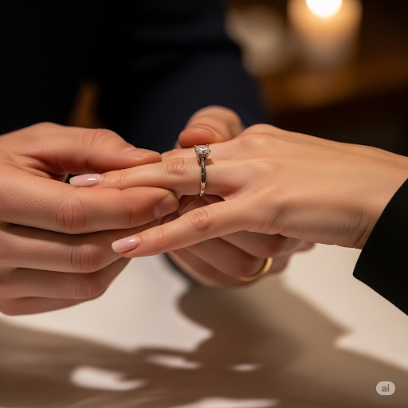

### IPA: /ˈsɪɡ.nɪ.faɪ/
### Class: v
### Câu truyện ẩn dụ:
Trong lễ đính hôn, chàng trai trao cho cô gái một chiếc nhẫn bạch kim và nói: "Chiếc nhẫn này được làm từ kim loại quý nhất, nó ***sẽniphai*** (sẽ ni phai) màu theo thời gian. Cũng giống như tình yêu của anh dành cho em vậy, nó sẽ không bao giờ thay đổi." Cô gái cảm động đáp: "Em hiểu. Chiếc nhẫn này không chỉ là một món trang sức, nó **biểu thị** (signify) cho lời hứa và sự gắn kết vĩnh cửu của chúng ta. Nó là dấu hiệu cho một khởi đầu mới."

### Định nghĩa : 
Biểu thị, có nghĩa là, là dấu hiệu của.

### English definition: 
To be a sign of something; to mean.

### Sentence of stroy:
...for the clothing **signified** his wealth and status.

## 16. strap
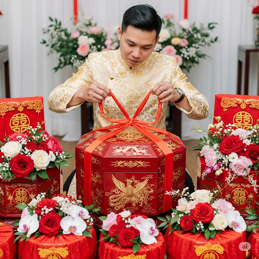

### IPA: /stræp/
### Class: n
### Câu truyện ẩn dụ:
Trong một đám hỏi theo phong tục xưa, nhà trai mang đến một chiếc tráp sơn son thếp vàng rất đẹp. Mọi người xúm lại trầm trồ. Chú rể muốn mở chiếc tráp ra để trình lễ vật, nhưng nó được buộc rất chặt. Một người nói: "Muốn mở cái ***tráp*** này, cháu phải cởi cái **dây đai** (strap) bằng lụa đỏ buộc xung quanh ra trước đã. Dây đai này tượng trưng cho sự gắn kết bền chặt của đôi uyên ương, phải cẩn thận không làm đứt nó nhé."

### Định nghĩa : 
Dây đai, dây đeo, quai.

### English definition: 
A narrow piece of leather or other strong material used for fastening something or giving support.

### Sentence of stroy:
It took several maids stretching fabric and pulling **straps**...

## 17. tangle
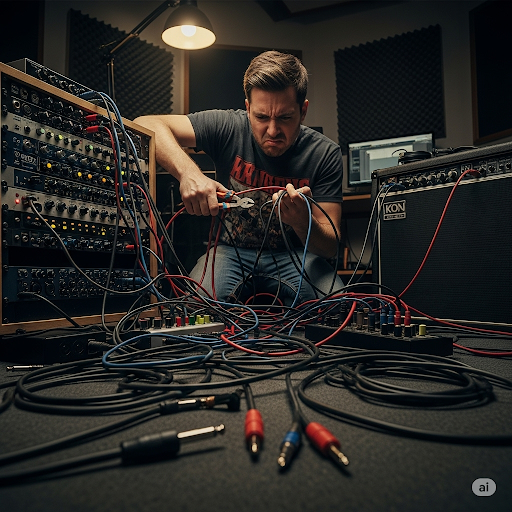

### IPA: /ˈtæŋ.ɡəl/
### Class: n
### Câu truyện ẩn dụ:
Một nhạc sĩ đang cố gắng gỡ mớ dây cáp lằng nhằng sau dàn âm thanh. Anh ta bực bội nói: "Thật không thể tin được, mới hôm qua còn gọn gàng mà sao hôm nay nó lại biến thành một **mớ rối** (tangle) thế này?" Người bạn bên cạnh trêu: "Chắc là do mớ dây này bị ***tănggồ*** (tăng độ gồ) ghề lên đấy. Càng cố gỡ nhanh nó lại càng siết chặt vào nhau. Anh phải thật bình tĩnh và kiên nhẫn mới có thể gỡ được cái tình trạng lộn xộn này."

### Định nghĩa : 
Một mớ rối, tình trạng lộn xộn.

### English definition: 
A confused mass of something twisted together.

### Sentence of stroy:
The columns of hair were a ridiculous **tangle** of wigs, jewels, flowers...

## 18. vanity

### IPA: /ˈvæn.ə.ti/
### Class: n
### Câu truyện ẩn dụ:
Có một cô gái rất xinh đẹp nhưng lại quá chú trọng đến vẻ ngoài của mình. Mỗi ngày cô dành hàng giờ trước gương, chỉ để đảm bảo không có một khuyết điểm nào. Một ngày nọ, cô phát hiện một nốt mụn nhỏ xíu. Cô hoảng hốt: "Trời ơi, có một chút ***vaniti*** (va ni ti) trên mặt mình!". Mẹ cô thở dài: "Con gái à, đó chỉ là một nốt mụn nhỏ thôi. **Sự phù phiếm** (vanity) và quá ám ảnh về ngoại hình sẽ khiến con mệt mỏi. Vẻ đẹp thực sự đến từ tâm hồn."

### Định nghĩa : 
Sự phù phiếm, tính kiêu căng, thói tự cao tự đại về ngoại hình.

### English definition: 
The fact that you are too interested in your own appearance or achievements.

### Sentence of stroy:
Though such **vanity** would seem vulgar today...

## 19. vie
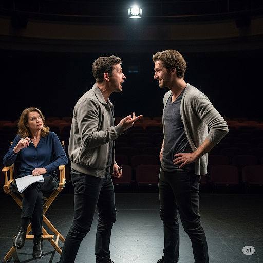

### IPA: /vaɪ/
### Class: v
### Câu truyện ẩn dụ:
Trong một buổi thử vai cho một bộ phim bom tấn, có hai diễn viên hàng đầu cùng nhắm đến một vai diễn chính. Họ là bạn thân ngoài đời, nhưng trên sân khấu, họ phải **ganh đua** (vie) với nhau một cách quyết liệt. Đạo diễn nói với trợ lý: "Nhìn họ xem, vì một ***vai*** diễn mà họ cạnh tranh không khoan nhượng. Cả hai đều thể hiện hết khả năng của mình. Cuộc tranh giành này thực sự rất khó khăn cho tôi để đưa ra quyết định cuối cùng. Ai cũng xứng đáng cả."

### Định nghĩa : 
Ganh đua, tranh giành.

### English definition: 
To compete with other people to achieve or get something.

### Sentence of stroy:
The men **vied** with one another to see who wore the more expensive clothes...

## 20. vulgar

### IPA: /ˈvʌl.ɡər/
### Class: adj
### Câu truyện ẩn dụ:
Trong một quán cà phê sang trọng, mọi người đang nói chuyện nhỏ nhẹ. Bỗng có một người đàn ông nói chuyện điện thoại rất to tiếng, dùng những từ ngữ kém văn minh. Một bà lão ngồi bàn bên cạnh nhíu mày và nói với bạn mình: "Cách ăn nói của anh ta thật **thô tục** (vulgar). Nghe như một kẻ ***vôgia*** (vô gia) cư ngoài đường vậy, không hề có chút lịch sự hay tinh tế nào. Anh ta đã phá hỏng cả không gian yên tĩnh và thanh lịch ở đây."

### Định nghĩa : 
Thô tục, tầm thường, thiếu tinh tế.

### English definition: 
Not suitable, simple, dignified or beautiful; not in the style preferred by the upper classes of society.

### Sentence of stroy:
Though such vanity would seem **vulgar** today...