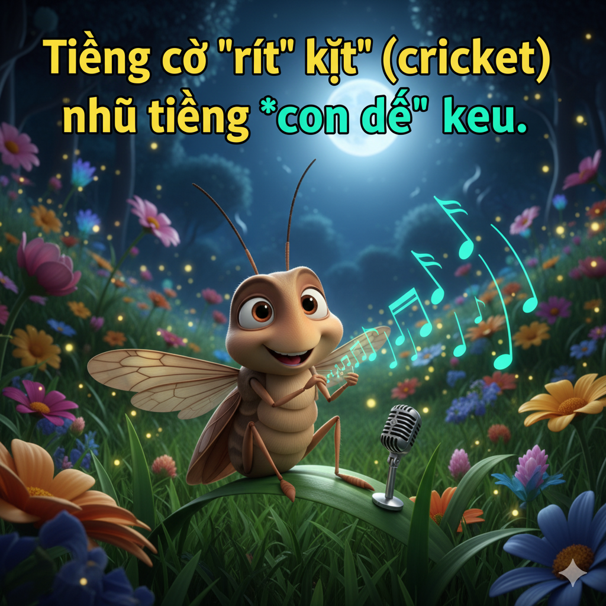

# The Mad Hatter

One morning, Lucas sat outside with his grandfather. They looked past the gravel road that led to a natural reservoir on the delta. On the other side of the water, there was a cottage.

“ Does a ghost live there?” Lucas asked.

“ No, a mad hatter lives there,” said his grandfather. Lucas didn’t know what a mad hatter was, but the image of a scary man haunted him.

Later, Lucas went for a walk in the forest. He collected pieces of amber and granite that he found on the ground. He looked at the moss on the trees and watched a bird peck at the ground. But the forest was like a maze. Soon, Lucas was lost.

Lucas heard somebody behind him. He wanted to run away, but he fell. He had a streak of blood on his shirt and some pebbles stuck in his skin. Then a man appeared.

“ I will take you home. First, let’s get you cleaned up,” he said.

Lucas followed him. When they arrived at the cottage, he realized the man was the mad hatter!

He sat down inside. It smelled like charcoal, but it looked like a normal house. The man brought Lucas back some medicine.

“ It’s a bit old, but it’s not expired,” the man said.

While Lucas cleaned his cut, the man washed the blood out of his shirt with detergent.

Lucas asked, “Are you a mad hatter?”

The man laughed and replied, “That’s a euphemism for a crazy person. Actually, I’m pretty normal. I’m a columnist fora newspaper,” said the man. He pointed to his credentials which hung on the wall.

Lucas could hear the crickets outside. It was getting dark, so he asked, “Could you take me home now?”

The man said yes. Lucas was surprised that people thought the man was crazy. He was actually very courteous. Maybe Lucas should have a more liberal attitude. Next time, Lucas wouldn’t make judgments about people without getting to know them first.

## Sentences of story

The Mad Hatter

One morning, Lucas sat outside with his grandfather.

They looked past the gravel road that led to a natural reservoir on the delta.

On the other side of the water, there was a cottage.

“ Does a ghost live there?” Lucas asked.

“ No, a mad hatter lives there,” said his grandfather.

Lucas didn’t know what a mad hatter was, but the image of a scary man haunted him.

Later, Lucas went for a walk in the forest.

He collected pieces of amber and granite that he found on the ground.

He looked at the moss on the trees and watched a bird peck at the ground.

But the forest was like a maze.

Soon, Lucas was lost.

Lucas heard somebody behind him.

He wanted to run away, but he fell.

He had a streak of blood on his shirt and some pebbles stuck in his skin.

Then a man appeared.

“ I will take you home. First, let’s get you cleaned up,” he said.

Lucas followed him.

When they arrived at the cottage, he realized the man was the mad hatter!

He sat down inside.

It smelled like charcoal, but it looked like a normal house.

The man brought Lucas back some medicine.

“ It’s a bit old, but it’s not expired,” the man said.

While Lucas cleaned his cut, the man washed the blood out of his shirt with detergent.

Lucas asked, “Are you a mad hatter?”

The man laughed and replied, “That’s a euphemism for a crazy person. Actually, I’m pretty normal. I’m a columnist fora newspaper,” said the man.

He pointed to his credentials which hung on the wall.

Lucas could hear the crickets outside.

It was getting dark, so he asked, “Could you take me home now?”

The man said yes.

Lucas was surprised that people thought the man was crazy.

He was actually very courteous.

Maybe Lucas should have a more liberal attitude.

Next time, Lucas wouldn’t make judgments about people without getting to know them first.

## List of word

amber, charcoal, columnist, courteous, credentials, cricket, delta, detergent, euphemism, expire, granite, gravel, haunt, liberal, maze, moss, pebble, peck, reservoir, streak

## 1. amber

### IPA: /ˈæm.bər/
### Class: n
### Câu truyện ẩn dụ:

`Am` `bờ` (amber) sông có rất nhiều **hổ phách**.

### Định nghĩa : 
Hổ phách.

### English definition: 
A hard translucent fossilized resin produced by extinct coniferous trees of the Tertiary period, typically yellowish in colour.

### Sentence of stroy:
He collected pieces of **amber** and granite that he found on the ground.

## 2. charcoal

### IPA: /ˈtʃɑː.kəʊl/
### Class: n
### Câu truyện ẩn dụ:

`Cha` `cô` (charcoal) bán **than củi**.

### Định nghĩa : 
Than củi, than gỗ.

### English definition: 
A porous black solid, consisting of an amorphous form of carbon, obtained as a residue when wood, bone, or other organic matter is heated in the absence of air.

### Sentence of stroy:
It smelled like **charcoal**, but it looked like a normal house.

## 3. columnist

### IPA: /ˈkɒl.əm.nɪst/
### Class: n
### Câu truyện ẩn dụ:

`Có` `lắm` `nít` (columnist) muốn làm **nhà báo chuyên mục**.

### Định nghĩa : 
Người phụ trách một chuyên mục trên báo, nhà báo chuyên mục.

### English definition: 
A journalist contributing regularly to a newspaper or magazine.

### Sentence of stroy:
I’m a **columnist** fora newspaper,” said the man.

## 4. courteous

### IPA: /ˈkɜː.ti.əs/
### Class: adj
### Câu truyện ẩn dụ:

`Cơ` `tới` `ớt` (courteous) cũng phải **lịch sự** khi nói chuyện với nhau.

### Định nghĩa : 
Lịch sự, nhã nhặn.

### English definition: 
Polite, respectful, or considerate in manner.

### Sentence of stroy:
He was actually very **courteous**.

## 5. credentials

### IPA: /krəˈden.ʃəlz/
### Class: n
### Câu truyện ẩn dụ:

`Cờ` `đe` `sờ` (credentials) vào **giấy tờ chứng thực** của tôi à?

### Định nghĩa : 
Giấy tờ chứng thực, bằng cấp, tư cách.

### English definition: 
A qualification, achievement, personal quality, or aspect of a person's background, typically when used to indicate that they are suitable for something.

### Sentence of stroy:
He pointed to his **credentials** which hung on the wall.

## 6. cricket

### IPA: /ˈkrɪk.ɪt/
### Class: n
### Câu truyện ẩn dụ:

Tiếng cờ `rít` `kịt` (cricket) như tiếng **con dế** kêu.

### Định nghĩa : 
Con dế.

### English definition: 
An insect related to the grasshoppers but with shorter legs. The male produces a characteristic musical chirping sound.

### Sentence of stroy:
Lucas could hear the **crickets** outside.

## 7. delta

### IPA: /ˈdel.tə/
### Class: n
### Câu truyện ẩn dụ:

`Đeo` `tạ` (delta) đi khắp **đồng bằng** sông Cửu Long.

### Định nghĩa : 
Đồng bằng, châu thổ.

### English definition: 
A triangular tract of sediment deposited at the mouth of a river, typically where it diverges into several outlets.

### Sentence of stroy:
They looked past the gravel road that led to a natural reservoir on the **delta**.

## 8. detergent

### IPA: /dɪˈtɜː.dʒənt/
### Class: n
### Câu truyện ẩn dụ:

`Đi` `tơ` `dần` (detergent) vì mua nhiều **chất tẩy rửa**.

### Định nghĩa : 
Chất tẩy rửa, bột giặt.

### English definition: 
A chemical substance in the form of a powder or a liquid for removing dirt from clothes, dishes, etc.

### Sentence of stroy:
While Lucas cleaned his cut, the man washed the blood out of his shirt with **detergent**.

## 9. euphemism

### IPA: /ˈjuː.fə.mɪ.zəm/
### Class: n
### Câu truyện ẩn dụ:

`Du` `phê` `mì` `dầm` (euphemism) là một **lời nói giảm nói tránh** cho việc ăn uống không lành mạnh.

### Định nghĩa : 
Lời nói giảm nói tránh, uyển ngữ.

### English definition: 
A mild or indirect word or expression substituted for one considered to be too harsh or blunt when referring to something unpleasant or embarrassing.

### Sentence of stroy:
“That’s a **euphemism** for a crazy person.

## 10. expire

### IPA: /ɪkˈspaɪər/
### Class: v
### Câu truyện ẩn dụ:

`Ích` `xài` `ơ` (expire), vì thuốc này đã **hết hạn** rồi.

### Định nghĩa : 
Hết hạn, mãn hạn.

### English definition: 
(of a document, authorization, or agreement) cease to be valid, typically after a fixed period of time.

### Sentence of stroy:
“ It’s a bit old, but it’s not **expired**,” the man said.

## 11. granite

### IPA: /ˈɡræn.ɪt/
### Class: n
### Câu truyện ẩn dụ:

`Gờ` `ra` `nít` (granite) lại bằng **đá hoa cương**.

### Định nghĩa : 
Đá hoa cương.

### English definition: 
A very hard, granular, crystalline, igneous rock consisting mainly of quartz, mica, and feldspar and often used as a building stone.

### Sentence of stroy:
He collected pieces of amber and **granite** that he found on the ground.

## 12. gravel

### IPA: /ˈɡræv.əl/
### Class: n
### Câu truyện ẩn dụ:

`Gờ` `ráp` `vồ` (gravel) lên vì con đường trải đầy **sỏi**.

### Định nghĩa : 
Sỏi.

### English definition: 
A loose aggregation of small water-worn or pounded stones.

### Sentence of stroy:
They looked past the **gravel** road that led to a natural reservoir on the delta.

## 13. haunt

### IPA: /hɔːnt/
### Class: v
### Câu truyện ẩn dụ:

`Hòn` `đá` (haunt) này bị **ám ảnh** bởi một linh hồn.

### Định nghĩa : 
Ám ảnh.

### English definition: 
(of a ghost) manifest itself at (a place) regularly.

### Sentence of stroy:
Lucas didn’t know what a mad hatter was, but the image of a scary man **haunted** him.

## 14. liberal

### IPA: /ˈlɪb.ər.əl/
### Class: adj
### Câu truyện ẩn dụ:

`Lí` `bồ` `ruồi` (liberal) có thái độ rất **phóng khoáng** trong các mối quan hệ.

### Định nghĩa : 
Phóng khoáng, rộng rãi, tự do.

### English definition: 
Willing to respect or accept behaviour or opinions different from one's own; open to new ideas.

### Sentence of stroy:
Maybe Lucas should have a more **liberal** attitude.

## 15. maze

### IPA: /meɪz/
### Class: n
### Câu truyện ẩn dụ:

Lạc vào **mê cung** nên `mê` (maze) luôn không ra được.

### Định nghĩa : 
Mê cung.

### English definition: 
A network of paths and hedges designed as a puzzle through which one has to find a way.

### Sentence of stroy:
But the forest was like a **maze**.

## 16. moss

### IPA: /mɒs/
### Class: n
### Câu truyện ẩn dụ:

Phải `mót` (moss) từng đồng để mua **rêu** về trang trí.

### Định nghĩa : 
Rêu.

### English definition: 
A small flowerless green plant which lacks true roots, growing in low carpets or rounded cushions in damp habitats and reproducing by means of spores released from stalked capsules.

### Sentence of stroy:
He looked at the **moss** on the trees and watched a bird peck at the ground.

## 17. pebble

### IPA: /ˈpeb.əl/
### Class: n
### Câu truyện ẩn dụ:

`Bé` `bồ` (pebble) của tôi thích nhặt **đá cuội** ở bờ biển.

### Định nghĩa : 
Đá cuội, sỏi nhỏ.

### English definition: 
A small stone made smooth and round by the action of water or sand.

### Sentence of stroy:
He had a streak of blood on his shirt and some **pebbles** stuck in his skin.

## 18. peck

### IPA: /pek/
### Class: v
### Câu truyện ẩn dụ:

Con chim `béc` (peck) một phát là cái **mổ** của nó.

### Định nghĩa : 
Mổ, đớp.

### English definition: 
(of a bird) strike or bite something with its beak.

### Sentence of stroy:
He looked at the moss on the trees and watched a bird **peck** at the ground.

## 19. reservoir

### IPA: /ˈrez.ə.vwɑːr/
### Class: n
### Câu truyện ẩn dụ:

`Re` `xơ` `vòi` (reservoir) nước ở **hồ chứa** nước.

### Định nghĩa : 
Hồ chứa nước, bể chứa.

### English definition: 
A large natural or artificial lake used as a source of water supply.

### Sentence of stroy:
They looked past the gravel road that led to a natural **reservoir** on the delta.

## 20. streak

### IPA: /striːk/
### Class: n
### Câu truyện ẩn dụ:

Sờ vào vết `trích` (streak) máu, để lại một **vệt** dài.

### Định nghĩa : 
Vệt, đường sọc.

### English definition: 
A long, thin line or mark of a different substance or colour from its surroundings.

### Sentence of stroy:
He had a **streak** of blood on his shirt and some pebbles stuck in his skin.