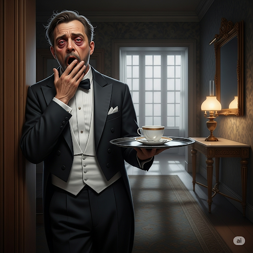
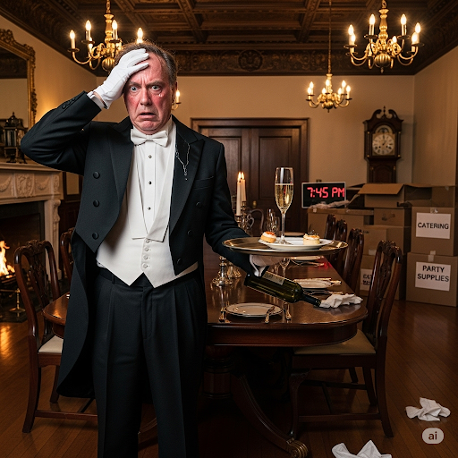
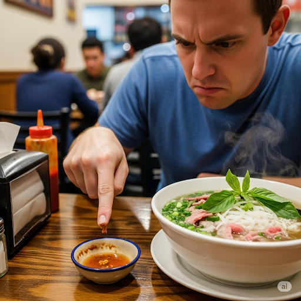

# The Butler’s Bad Day 

The Superintendent of Civic Projects was a busy man. He worked every day of the week and had fancy parties at his house every night.

However, if there was someone busier than him, it was his butler. He worked all day organizing the superintendent’s parties and then cleaned up after them late at night. Hence, while the superintendent slept soundly, snoring loudly in his bed, the butler was still awake.

Sadly, though the butler was always overworked, his profession’s intrinsic nature demanded he never be outspoken. Therefore, his employer never knew the butler hadn’t slept for several days. On any day the butler might make a mistake.

One day, the superintendent said, “This particular party is important. People from the ministry are coming. Everything must be perfect.”

The butler began preparing at once. First he went to the attic to get more chairs and tables. But on his descent, he realized he needed to make the food. A gourmet dinner was necessary for such a party. He boiled water in a kettle for soup and chopped some beef into chunks. Just as he was starting the soup, he remembered that he had to sweep the veranda. As he was sweeping the veranda, he realized that he had to clean the sauna.

By this time, the first guests had arrived. The veranda was still dirty. There were not enough chairs for the guests to sit on, and the soup tasted too pungent. Some guests were dissatisfied. They started to make a fuss, and the party was filled with a din of complaints.

The superintendent’s party was a disaster. He wondered why his butler had made so many mistakes. At last, the butler admitted to being exhausted. His boss felt pity for the butler. He had no idea the butler was so tired. He said, “You should have told me earlier, then we could have avoided this whole ordeal.”

## Sentences of story

The Butler’s Bad Day 

The Superintendent of Civic Projects was a busy man.

He worked every day of the week and had fancy parties at his house every night.

However, if there was someone busier than him, it was his butler.

He worked all day organizing the superintendent’s parties and then cleaned up after them late at night.

Hence, while the superintendent slept soundly, snoring loudly in his bed, the butler was still awake.

Sadly, though the butler was always overworked, his profession’s intrinsic nature demanded he never be outspoken.

Therefore, his employer never knew the butler hadn’t slept for several days.

On any day the butler might make a mistake.

One day, the superintendent said, “This particular party is important.

People from the ministry are coming.

Everything must be perfect.”

The butler began preparing at once.

First he went to the attic to get more chairs and tables.

But on his descent, he realized he needed to make the food.

A gourmet dinner was necessary for such a party.

He boiled water in a kettle for soup and chopped some beef into chunks.

Just as he was starting the soup, he remembered that he had to sweep the veranda.

As he was sweeping the veranda, he realized that he had to clean the sauna.

By this time, the first guests had arrived.

The veranda was still dirty.

There were not enough chairs for the guests to sit on, and the soup tasted too pungent.

Some guests were dissatisfied.

They started to make a fuss, and the party was filled with a din of complaints.

The superintendent’s party was a disaster.

He wondered why his butler had made so many mistakes.

At last, the butler admitted to being exhausted.

His boss felt pity for the butler.

He had no idea the butler was so tired.

He said, “You should have told me earlier, then we could have avoided this whole ordeal.”

## List of word

attic, chunk, civic, descent, din, dissatisfy, fuss, gourmet, hence, intrinsic, kettle, ministry, ordeal, outspoken, overwork, particular, pungent, snore, soundly, superintendent

## 1. attic

### IPA: /ˈæt.ɪk/
### Class: n
### Câu truyện ẩn dụ:
Cậu bé tìm thấy một cuốn nhật ký cũ trên gác mái. Cậu tò mò, "Ai mà ***ắt tích*** (ắt-tích) trữ đồ cũ trên này thế nhỉ?" Hóa ra đó là kho báu kỷ niệm của ông nội, cất giấu trên **gác xép** (attic).

### Định nghĩa : 
Gác xép, gác mái.

### English definition: 
A space or room just below the roof of a building.

### Sentence of stroy:
First he went to the **attic** to get more chairs and tables.

## 2. chunk

### IPA: /tʃʌŋk/
### Class: n
### Câu truyện ẩn dụ:

Ngày Tết, mẹ cắt chiếc bánh **chưng** và đưa cho tôi một **khúc** rất to.

### Định nghĩa : 
Một khúc, một miếng to.

### English definition: 
A large, solid piece of something.

### Sentence of stroy:
...and chopped some beef into **chunks**.

## 3. civic

### IPA: /ˈsɪv.ɪk/
### Class: adj
### Câu truyện ẩn dụ:

Chú vịt lái chiếc **xe** hình **vịt** đi quanh thành phố để tuyên truyền về nghĩa vụ **công dân**. Do đó, khi nghe civic (phát âm như /xe vịt/), bạn hãy nhớ ngay đến các vấn đề (thuộc) công dân và thành phố.

### Định nghĩa : 
(thuộc) công dân, (thuộc) thành phố.

### English definition: 
Relating to a town or city or the people who live in it.

### Sentence of stroy:
The Superintendent of **Civic** Projects was a busy man.

## 4. descent

### IPA: /dɪˈsent/
### Class: n
### Câu truyện ẩn dụ:

Cô gái tên **Sen** bắt đầu hành trình đi xuống một con **dốc núi**. Chuyến **đi** của **Sen** là để về thăm quê hương, nơi có dòng dõi tổ tiên.

### Định nghĩa : 
Sự đi xuống, sự hạ xuống.

### English definition: 
The act of going or coming down.

### Sentence of stroy:
But on his **descent**, he realized he needed to make the food.

## 5. din

### IPA: /dɪn/
### Class: n
### Câu truyện ẩn dụ:
Trong xưởng mộc, hàng chục người thợ cùng lúc dùng búa đóng **đinh**. Âm thanh này tạo thành một tiếng **ồn ào, inh tai** và rất khó chịu.

### Định nghĩa : 
Tiếng ồn ào, huyên náo, inh tai.

### English definition: 
A loud, unpleasant, and prolonged noise.

### Sentence of stroy:
...and the party was filled with a **din** of complaints.

## 6. dissatisfy

### IPA: /ˌdɪsˈsæt.ɪs.faɪ/
### Class: v
### Câu truyện ẩn dụ:

Một vị khách gọi phở và bực mình chỉ vào cái **đĩa sa tế đã phai** màu. Ông nói: "Cảnh tượng này làm tôi **không hài lòng**!"

### Định nghĩa : 
Làm không hài lòng, làm thất vọng.

### English definition: 
To make someone feel disappointed or not pleased.

### Sentence of stroy:
Some guests were **dissatisfied**.

## 7. fuss

### IPA: /fʌs/
### Class: n
### Câu truyện ẩn dụ:
Bà cụ làm ầm lên như một tên `phát xít` chỉ vì một hạt cơm rơi. Sự **om sòm, rùm beng** không cần thiết này của bà thật mệt mỏi.

### Định nghĩa : 
Sự ầm ĩ, sự om sòm, sự rối rít.

### English definition: 
A show of anger, worry, or excitement that is unnecessary or greater than the situation deserves.

### Sentence of stroy:
They started to make a **fuss**...

## 8. gourmet

### IPA: /ˈɡɔː.meɪ/
### Class: adj
### Câu truyện ẩn dụ:
Anh `Gô` rất `mê` ẩm thực, nhưng chỉ ăn những món chất lượng cao. Ai cũng nói anh Gô Mê là một **người sành ăn** và chỉ thích ẩm thực cao cấp.

### Định nghĩa : 
(thuộc) người sành ăn, (thuộc) ẩm thực chất lượng cao.

### English definition: 
(of food) of very high quality.

### Sentence of stroy:
A **gourmet** dinner was necessary for such a party.

## 9. hence

### IPA: /hens/
### Class: adv
### Câu truyện ẩn dụ:
Anh sinh viên lười học nhưng lại rất `hên` vì trúng tủ ngay câu duy nhất đã học. Anh nghĩ: "Mình `hên` quá, **do đó** mình sẽ làm được bài!"

### Định nghĩa : 
Do đó, vì vậy.

### English definition: 
For this reason; as a result.

### Sentence of stroy:
**Hence**, while the superintendent slept soundly...

## 10. intrinsic

### IPA: /ɪnˈtrɪn.zɪk/
### Class: adj
### Câu truyện ẩn dụ:
Cỗ máy thần kỳ `in` ra hình ảnh cô `Trinh` cùng một sợi dây `xích`. Sợi xích đó tượng trưng cho lòng tốt, là giá trị bên trong, là **bản chất cố hữu** của cô.

### Định nghĩa : 
(thuộc) bản chất, bên trong, cố hữu.

### English definition: 
Being an extremely important and basic characteristic of a person or thing.

### Sentence of stroy:
...his profession’s **intrinsic** nature demanded he never be outspoken.

## 11. kettle

### IPA: /ˈket.əl/
### Class: n
### Câu truyện ẩn dụ:
Anh chàng tên `Tồ` đãng trí để quên **ấm đun nước** trên bếp cho đến khi nó bốc mùi `khét` lẹt.

### Định nghĩa : 
Ấm đun nước.

### English definition: 
A container with a lid, a handle, and a spout, used for boiling water.

### Sentence of stroy:
He boiled water in a **kettle** for soup...

## 12. ministry

### IPA: /ˈmɪn.ɪ.stri/
### Class: n
### Câu truyện ẩn dụ:
Anh chàng tên `Minh Trí` vô cùng tài giỏi nên đã được tuyển vào làm việc tại một **Bộ** quan trọng của nhà nước.

### Định nghĩa : 
Bộ (trong chính phủ).

### English definition: 
A government department headed by a minister.

### Sentence of stroy:
People from the **ministry** are coming.

## 13. ordeal

### IPA: /ɔːˈdɪəl/
### Class: n
### Câu truyện ẩn dụ:
Chú bò lạc đàn kêu "`ò... ò..."` thảm thiết khi phải vượt qua một con `đèo` hiểm trở. Đó thật sự là một **thử thách gian nan, một trải nghiệm đau đớn**.

### Định nghĩa : 
Thử thách gian nan, sự trải nghiệm đau khổ.

### English definition: 
A very unpleasant and painful or difficult experience.

### Sentence of stroy:
...then we could have avoided this whole **ordeal**.

## 14. outspoken

### IPA: /ˌaʊtˈspəʊ.kən/
### Class: adj
### Câu truyện ẩn dụ:
Trong cuộc họp, không ai dám lên tiếng. Một anh chàng chỉ vào cái `ao sâu` và tuyên bố: "`Cần` phải giải quyết ngay!" Mọi người biết anh là người **thẳng thắn, nói thẳng**.

### Định nghĩa : 
Thẳng thắn, nói thẳng.

### English definition: 
Expressing strong opinions very directly without worrying if other people are offended.

### Sentence of stroy:
...demanded he never be **outspoken**.

## 15. overwork

### IPA: /ˌəʊ.vəˈwɜːk/
### Class: v
### Câu truyện ẩn dụ:
Anh chồng đi làm về, mệt tới nỗi tay chân cứ `ô vờ quờ` vào mọi thứ. Anh than thở với vợ rằng mình đã phải **làm việc quá sức**.

### Định nghĩa : 
Làm việc quá sức.

### English definition: 
To work too hard or too much.

### Sentence of stroy:
Sadly, though the butler was always **overworked**...

## 16. particular

### IPA: /pəˈtɪk.jə.lər/
### Class: adj
### Câu truyện ẩn dụ:
Ông Ba rất kỹ tính về đồ ăn. Khi con cháu mời nhiều loại hạt, ông đều từ chối và nói: "`Ba thích củ lạc`". Ông chỉ muốn một loại **cụ thể** đó mà thôi.

### Định nghĩa : 
Cụ thể, đặc biệt.

### English definition: 
Special, or this and not any other.

### Sentence of stroy:
This **particular** party is important.

## 17. pungent

### IPA: /ˈpʌn.dʒənt/
### Class: adj
### Câu truyện ẩn dụ:
Mẹ nhờ cậu con trai `bưng` một bát `giấm`. Vừa bưng lên, **mùi hăng**, **nồng** đặc trưng của nó đã xộc thẳng vào mũi cậu bé, rất khó chịu.

### Định nghĩa : 
Hăng, nồng (mùi, vị).

### English definition: 
Smelling or tasting very strong and sharp.

### Sentence of stroy:
...and the soup tasted too **pungent**.

## 18. snore

### IPA: /snɔːr/
### Class: v
### Câu truyện ẩn dụ:
Ông chồng ăn `no` rồi ngủ, **ngáy** như sấm. Bà vợ không ngủ được, liền đưa tay `sờ` vào cái bụng `no` của ông để ông ngừng lại.

### Định nghĩa : 
Ngáy.

### English definition: 
To breathe in a very noisy way while you are sleeping.

### Sentence of stroy:
...**snoring** loudly in his bed...

## 19. soundly

### IPA: /ˈsaʊnd.li/
### Class: adv
### Câu truyện ẩn dụ:
Mẹ than thở: "`Sao` con `lỳ` thế, dỗ mãi không ngủ!" Nhưng khi cô bé đã ngủ, thì lại ngủ rất **say và ngon giấc**, không gì làm phiền được.

### Định nghĩa : 
(ngủ) say, ngon lành.

### English definition: 
(sleep) deeply and well.

### Sentence of stroy:
...while the superintendent slept **soundly**...

## 20. superintendent

### IPA: /ˌsuː.pər.ɪnˈten.dənt/
### Class: n
### Câu truyện ẩn dụ:
Anh công nhân phát hiện bát `súp` của mình `bị ten` (rỉ sét). Anh la lớn: "Phải `đền` bát khác! Gọi **người quản lý** ra đây!"

### Định nghĩa : 
Người giám thị, người trông nom, người quản lý.

### English definition: 
A person who is in charge of a large organization, a particular area of work, or the place where they work.

### Sentence of stroy:
The **Superintendent** of Civic Projects was a busy man.