# A Bet

Russell finished running a relay and joined his friend Becky in the cafeteria. He asked, “What’s for lunch?”

“Sesame chicken. It’s OK, except the meat’s charred. Oh, and watch out for the chili peppers,” Becky said.

“Chilies don’t bother me!” said Russell.

“ My stepmother says you should be careful with them,” replied Becky.

An argument ensued about eating chilies. “Chilies aren’t so bad. I bet I can take more bites of this chili than you,” Russell said.

Becky was wary of eating the pepper. Despite her reluctance, she didn’t want to say no to the bet. She wavered about whether to do it or not. She negotiated the details. “What will the winner get?” she asked.

“The loser has to carry the winner’s books for a year! I’ll even let you go first.”

Becky replied, “ Fine, but to clarify, you’ll carry my books for the entire school year, right?”

Russell restated the agreement, “That’s right I’ll carry your books all year if you win—which you won’t!”

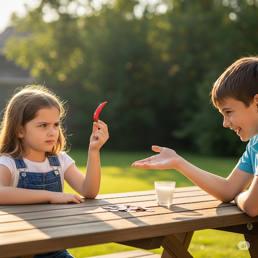

His dogged persuasion convinced her. The chili looked benign, but Becky knew it could cause a lot of pain. She bit the bottom of the pepper. Surprisingly, she felt nothing.

“ My turn,” said Russell. He bit the middle of the chili. Immediately, he seemed to be in distress. He gasped and his face alternated between brave and pained expressions. He experienced an overdose of spice. He was on the verge of tears and finally let out a horrible cry.

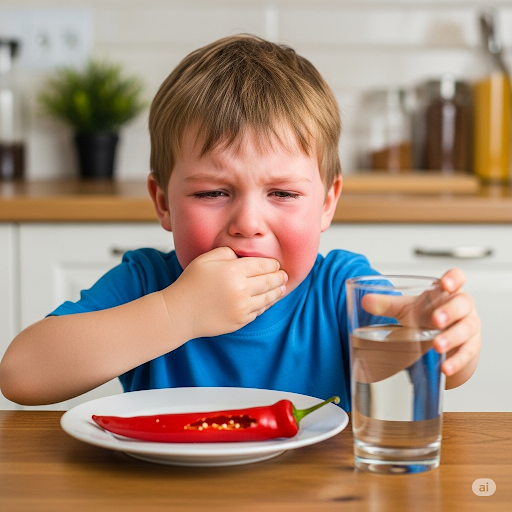

“Take this,” said Becky, handing him her drink.

“That was awful!” he said, continuing to sip from the glass.

That night, Becky researched chilies. The next day she said in an apologetic voice, “ I read that the hot part of chilies is in the middle, where the seeds are. I’m sorry—I feel like I cheated by going first.”

Russell was relieved, not only did he learn something new about chilies, but he learned that Becky was a good friend.

## Sentences of story

A Bet

Russell finished running a relay and joined his friend Becky in the cafeteria.

He asked, “What’s for lunch?”

“Sesame chicken.

It’s OK, except the meat’s charred.

Oh, and watch out for the chili peppers,” Becky said.

“Chilies don’t bother me!” said Russell.

“ My stepmother says you should be careful with them,” replied Becky.

An argument ensued about eating chilies.

“Chilies aren’t so bad.

I bet I can take more bites of this chili than you,” Russell said.

Becky was wary of eating the pepper.

Despite her reluctance, she didn’t want to say no to the bet.

She wavered about whether to do it or not.

She negotiated the details.

“What will the winner get?” she asked.

“The loser has to carry the winner’s books for a year!

I’ll even let you go first.”

Becky replied, “ Fine, but to clarify, you’ll carry my books for the entire school year, right?”

Russell restated the agreement, “That’s right I’ll carry your books all year if you win—which you won’t!”

His dogged persuasion convinced her.

The chili looked benign, but Becky knew it could cause a lot of pain.

She bit the bottom of the pepper.

Surprisingly, she felt nothing.

“ My turn,” said Russell.

He bit the middle of the chili.

Immediately, he seemed to be in distress.

He gasped and his face alternated between brave and pained expressions.

He experienced an overdose of spice.

He was on the verge of tears and finally let out a horrible cry.

“Take this,” said Becky, handing him her drink.

“That was awful!” he said, continuing to sip from the glass.

That night, Becky researched chilies.

The next day she said in an apologetic voice, “ I read that the hot part of chilies is in the middle, where the seeds are.

I’m sorry—I feel like I cheated by going first.”

Russell was relieved, not only did he learn something new about chilies, but he learned that Becky was a good friend.

## List of word

alternate, apologetic, benign, char, clarify, dogged, distress, ensue, gasp, negotiate, overdose, persuasion, relay, reluctance, restate, sesame, sip, verge, wary, waver

## 1. alternate

### IPA: /ˈɔːl.tə.neɪt/
### Class: v
### Câu truyện ẩn dụ:
`Anh tớ nết` (anh-tớ-nết) thay đổi thất thường, lúc vui lúc buồn, cứ **luân phiên, xen kẽ** nhau.

### Định nghĩa : 
Luân phiên, xen kẽ.

### English definition: 
To happen or exist one after the other repeatedly.

### Sentence of stroy:
He gasped and his face **alternated** between brave and pained expressions.

## 2. apologetic

### IPA: /əˌpɒl.əˈdʒet.ɪk/
### Class: adj
### Câu truyện ẩn dụ:
`Ơ, ba lôgetic` (ơ-ba-lô-dgetic) thật đấy, con làm sai mà không xin lỗi. Sau khi bị mắng, cậu bé tỏ ra **hối lỗi, biết lỗi**.

### Định nghĩa : 
Tỏ vẻ hối lỗi, xin lỗi.

### English definition: 
Showing that you feel sorry for something that has happened.

### Sentence of stroy:
The next day she said in an **apologetic** voice...

## 3. benign

### IPA: /bɪˈnaɪn/
### Class: adj
### Câu truyện ẩn dụ:
Chú chó tên `Bi` rất `ngoan` (bi-nain). Nhìn nó to lớn vậy thôi chứ thực ra rất **lành, hiền lành**.

### Định nghĩa : 
Lành, hiền lành, nhân từ.

### English definition: 
Pleasant and kind; not harmful or severe.

### Sentence of stroy:
The chili looked **benign**, but Becky knew it could cause a lot of pain.

## 4. char
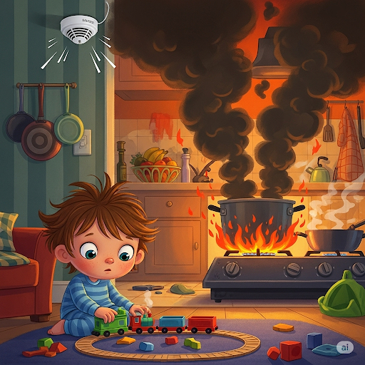

### IPA: /tʃɑːr/
### Class: v
### Câu truyện ẩn dụ:
Mẹ dặn con trông nồi thịt kho. Con mải chơi, thịt bị cháy `khét lẹt`. Mẹ hỏi "thịt đâu?", con `chà` tay vào nhau, đáp "cháy rồi ạ". Thịt đã bị **làm cháy, cháy thành than**.

### Định nghĩa : 
Làm cháy, cháy thành than.

### English definition: 
To burn something slightly or partly, so that its surface becomes black.

### Sentence of stroy:
...except the meat’s **charred**.

## 5. clarify
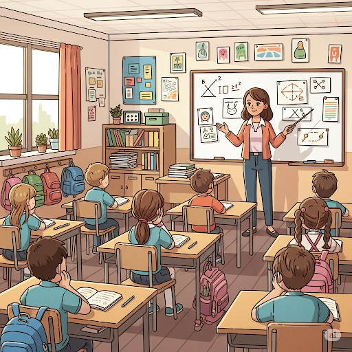

### IPA: /ˈklær.ə.faɪ/
### Class: v
### Câu truyện ẩn dụ:
Cô giáo hỏi "Các em `có le` (có lẽ) là `hiểu bài` chưa?". Cả lớp im lặng. Cô nói: "Vậy để cô **làm rõ, giảng giải lại** nhé."

### Định nghĩa : 
Làm rõ, làm sáng tỏ.

### English definition: 
To make something clear or easier to understand by giving more details or a simpler explanation.

### Sentence of stroy:
Fine, but to **clarify**, you’ll carry my books for the entire school year, right?

## 6. dogged
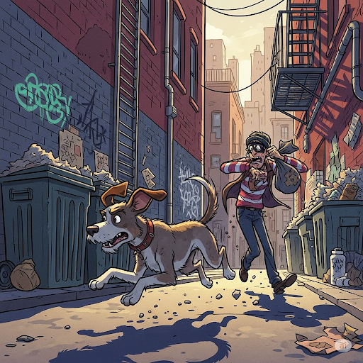

### IPA: /ˈdɒɡ.ɪd/
### Class: adj
### Câu truyện ẩn dụ:
Con chó (`dog`) cứ `gừ gừ` (dog-ged) đuổi theo tên trộm. Nó rất **gan góc, kiên trì**, không bỏ cuộc.

### Định nghĩa : 
Gan góc, kiên trì, bền bỉ.

### English definition: 
Very determined to do something, even if it is very difficult.

### Sentence of stroy:
His **dogged** persuasion convinced her.

## 7. distress
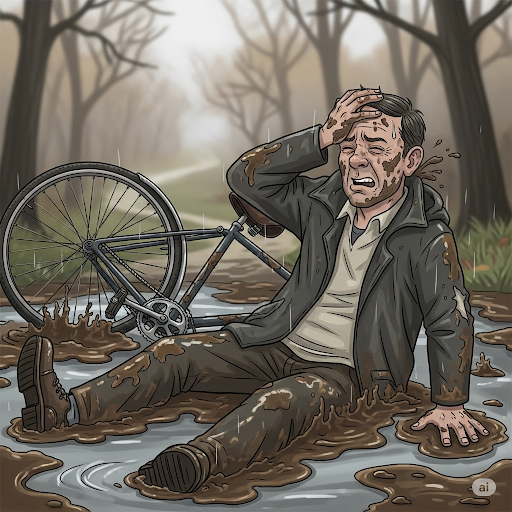

### IPA: /dɪˈstres/
### Class: n
### Câu truyện ẩn dụ:
Anh chàng bị `đít` con `trét` đầy bùn khi ngã xe. Anh ta cảm thấy vô cùng **đau buồn, phiền muộn**.

### Định nghĩa : 
Sự đau buồn, phiền muộn, thống khổ.

### English definition: 
A feeling of extreme worry, sadness, or pain.

### Sentence of stroy:
Immediately, he seemed to be in **distress**.

## 8. ensue
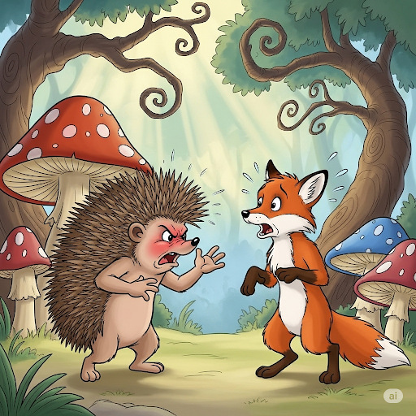

### IPA: /ɪnˈsjuː/
### Class: v
### Câu truyện ẩn dụ:
Sau khi `em xù` lông nhím lên, một trận cãi vã đã **xảy ra sau đó**.

### Định nghĩa : 
Xảy ra sau đó, nảy sinh ra.

### English definition: 
To happen after something else, especially as a result of it.

### Sentence of stroy:
An argument **ensued** about eating chilies.

## 9. gasp
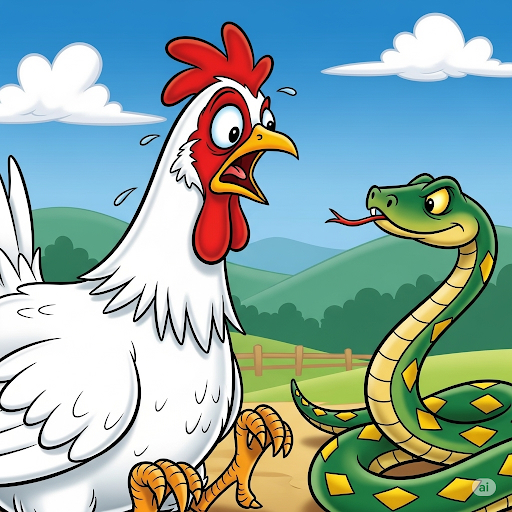

### IPA: /ɡɑːsp/
### Class: v
### Câu truyện ẩn dụ:
Con `gà` thấy một con `rắn`, nó sợ hãi đến mức **thở hổn hển, há hốc miệng**.

### Định nghĩa : 
Thở hổn hển, há hốc miệng (vì ngạc nhiên, đau đớn).

### English definition: 
To take a short, quick breath through the mouth, especially because of surprise, pain, or shock.

### Sentence of stroy:
He **gasped** and his face alternated between brave and pained expressions.

## 10. negotiate
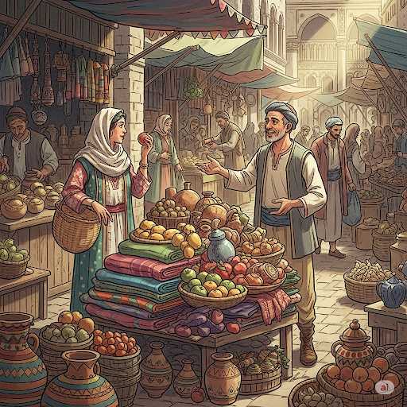

### IPA: /nəˈɡəʊ.ʃi.eɪt/
### Class: v
### Câu truyện ẩn dụ:
"Nè, `gô` (go) `sỉ hết` (shi-ate) lô hàng này được không?" - người bán hàng đang cố gắng **đàm phán, thương lượng** giá cả với khách.

### Định nghĩa : 
Đàm phán, thương lượng.

### English definition: 
To have formal discussions with someone in order to reach an agreement with them.

### Sentence of stroy:
She **negotiated** the details.

## 11. overdose

### IPA: /ˈəʊ.və.dəʊs/
### Class: n
### Câu truyện ẩn dụ:
`Ôi vợ đâu!` - người chồng hốt hoảng khi thấy vợ mình dùng thuốc **quá liều**.

### Định nghĩa : 
Sự quá liều (thuốc).

### English definition: 
Too much of a drug taken or given at one time, either intentionally or by accident.

### Sentence of stroy:
He experienced an **overdose** of spice.

## 12. persuasion
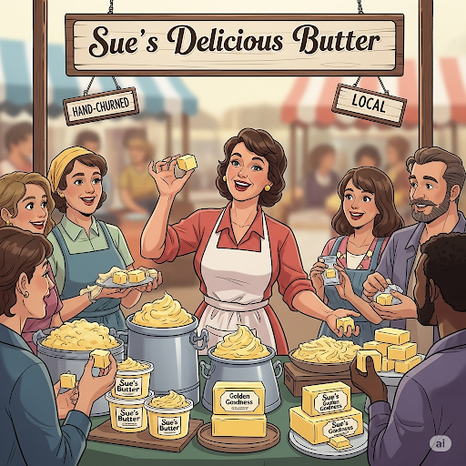

### IPA: /pəˈsweɪ.ʒən/
### Class: n
### Câu truyện ẩn dụ:
`Bơ` của `Sue` trông rất `ngon`. Cô ấy đã dùng tài **thuyết phục** của mình để bán hết chỗ bơ đó.

### Định nghĩa : 
Sự thuyết phục, sự làm cho tin.

### English definition: 
The action of persuading someone or of being persuaded.

### Sentence of stroy:
His dogged **persuasion** convinced her.

## 13. relay
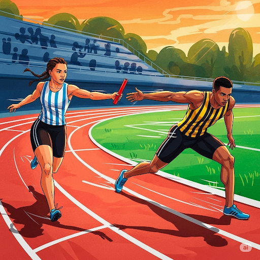

### IPA: /ˈriː.leɪ/
### Class: n
### Câu truyện ẩn dụ:
`Đi lấy` gậy từ đồng đội và chạy tiếp thôi! Đây là cuộc thi chạy **tiếp sức**.

### Định nghĩa : 
Cuộc chạy đua tiếp sức.

### English definition: 
A race between teams of runners, swimmers, etc., in which each member of the team runs or swims one part of the race.

### Sentence of stroy:
Russell finished running a **relay** and joined his friend Becky in the cafeteria.

## 14. reluctance
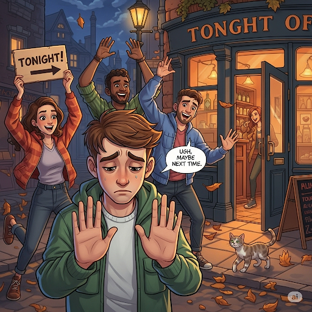

### IPA: /rɪˈlʌk.təns/
### Class: n
### Câu truyện ẩn dụ:
`Đi lắc` hả? `Tớ` không đi đâu. Anh chàng thể hiện **sự miễn cưỡng, bất đắc dĩ** khi được rủ đi chơi.

### Định nghĩa : 
Sự miễn cưỡng, sự bất đắc dĩ.

### English definition: 
An unwillingness to do something.

### Sentence of stroy:
Despite her **reluctance**, she didn’t want to say no to the bet.

## 15. restate

### IPA: /ˌriːˈsteɪt/
### Class: v
### Câu truyện ẩn dụ:
Thấy mọi người vẫn còn mơ hồ, sếp `đi` `state` (đi lại sân khấu) một lần nữa để **phát biểu lại, trình bày lại** kế hoạch cho rõ ràng.

### Định nghĩa : 
Phát biểu lại, trình bày lại.

### English definition: 
To say something again or in a different way.

### Sentence of stroy:
Russell **restated** the agreement...

## 16. sesame
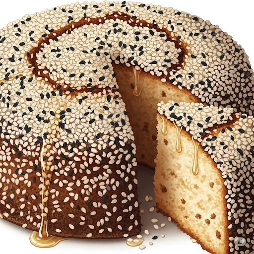

### IPA: /ˈses.ə.mi/
### Class: n
### Câu truyện ẩn dụ:
`Sợ sẽ mê` ly món bánh này lắm, vì nó có rất nhiều **vừng (mè)**.

### Định nghĩa : 
Vừng, mè.

### English definition: 
A small, flat seed, used in cooking and for its oil.

### Sentence of stroy:
**Sesame** chicken.

## 17. sip

### IPA: /sɪp/
### Class: v
### Câu truyện ẩn dụ:
Cô gái `xinh` đang ngồi **nhấm nháp, hớp từng ngụm** ly trà chiều.

### Định nghĩa : 
Nhấm nháp, hớp từng ngụm nhỏ.

### English definition: 
To drink, taking only a very small amount at a time.

### Sentence of stroy:
...continuing to **sip** from the glass.

## 18. verge
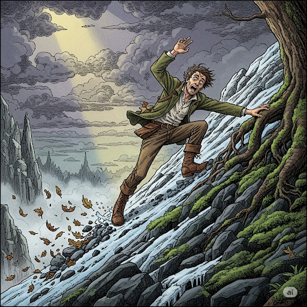

### IPA: /vɜːdʒ/
### Class: n
### Câu truyện ẩn dụ:
Con dốc này `vừa` dốc, `vừa` trơn. Anh ta đang ở **bên bờ, sắp sửa** bị ngã.

### Định nghĩa : 
Bờ, mép, bờ vực.

### English definition: 
The edge or border of something.

### Sentence of stroy:
He was on the **verge** of tears...

## 19. wary
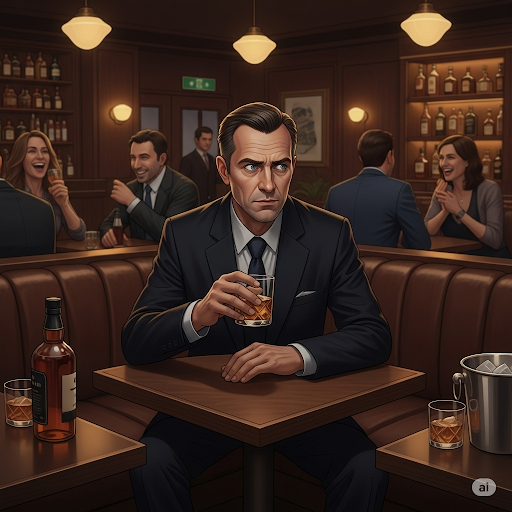

### IPA: /ˈweə.ri/
### Class: adj
### Câu truyện ẩn dụ:
Trong `quầy` bar `ri` (riêng) tư, anh ta vẫn tỏ ra **thận trọng, cảnh giác** với mọi người xung quanh.

### Định nghĩa : 
Thận trọng, cảnh giác, đề phòng.

### English definition: 
Not completely trusting or certain about something or someone.

### Sentence of stroy:
Becky was **wary** of eating the pepper.

## 20. waver

### IPA: /ˈweɪ.vər/
### Class: v
### Câu truyện ẩn dụ:
Thấy con sóng (`wave`) dập dờn, lòng anh `vờ` như không sợ nhưng thực ra đang **dao động, phân vân** có nên ra khơi không.

### Định nghĩa : 
Dao động, phân vân, do dự.

### English definition: 
To be or become uncertain in speech or mind; to fluctuate.

### Sentence of stroy:
She **wavered** about whether to do it or not.