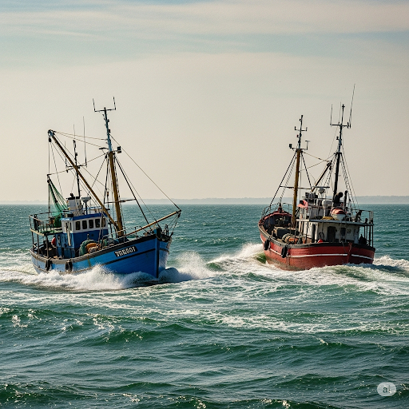
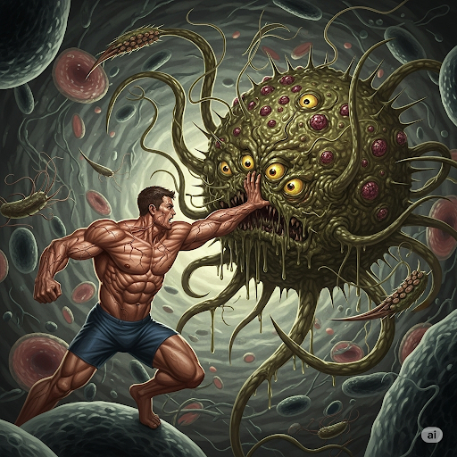

# Amazing Komodo Dragons

Once, a British gazette had an unusual story. Scientists at a zoo made a discovery about komodo dragons. Komodo dragons are giant lizards that grow up to two and a half meters long. A female lizard at the zoo had babies. However, it had never been around a male lizard in its entire life. After the scientists publicized their discovery, many people thought it was fictitious.

But it was true. It was discovered that female komodo dragons can have babies without the help of their male counterparts. This contradicts what scientists know about how most animals have babies.

In most cases, there are many things that can obstruct this type of reproduction. For example, adult males and females carry different genes needed to make an embryo. If the genes are homogeneous, the babies are weaker and have genetic problems. Over time, the weakened species dies out completely. This makes it necessary for the male to be involved. However, scientists verified that when Komodo babies are born, their genes aren’t the exact same genes as their mother. Also, they are devoid of any genetic problems.
s

Scientists theorize that Komodo dragons developed the ability because it helps the species fend off extinction. If a volcano erupts, lava can kill all of the komodo dragons on an island. However, as long as one female eludes death, she can prolong the survival of the species. Luckily, Komodo dragons are vigorous swimmers. So the surviving female can plunge into the ocean and swim to another island. When she comes ashore, she can reproduce by herself. Over time, the genes within the population diverge. Then, the sparse population increases. Once again there is a surplus of lizards on one island. Scientists think that this may be how the lizards took over all of the islands in that area.

## List of word

ashore, contradict, counterpart, devoid, diverge, elude, embryo, fend, fictitious, gazette, homogeneous, obstruct, plunge, prolong, publicize, sparse, surplus, theorize, verify, vigorous

## 1. ashore

### IPA: /əˈʃɔːr/
### Class: adv
### Câu truyện ẩn dụ:
`Ơ, sò` ở đâu mà nhiều thế? Hóa ra là sóng đánh sò **lên bờ**.

### Định nghĩa : 
Lên bờ, vào bờ.

### English definition: 
Towards or on the land from an area of water.

### Sentence of stroy:
When she comes **ashore**, she can reproduce by herself.

## 2. contradict

### IPA: /ˌkɒn.trəˈdɪkt/
### Class: v
### Câu truyện ẩn dụ:
`Con tra đích` thị là đang **mâu thuẫn, cãi lại** lời bố mẹ nói.

### Định nghĩa : 
Mâu thuẫn với, trái với, cãi lại.

### English definition: 
To say the opposite of what someone else has said, or to be so different from another fact or statement that one of them must be wrong.

### Sentence of stroy:
This **contradicts** what scientists know about how most animals have babies.

## 3. counterpart

### IPA: /ˈkaʊn.tə.pɑːt/
### Class: n
### Câu truyện ẩn dụ:
Ở `quầy` (`counter`) bên này có một cái `bạt`. **Bên tương ứng** bên kia cũng có một cái y hệt.

### Định nghĩa : 
Bên tương ứng, đối tác.

### English definition: 
A person or thing that has the same purpose as another one in a different place or organization.

### Sentence of stroy:
...without the help of their male **counterparts**.

## 4. devoid

### IPA: /dɪˈvɔɪd/
### Class: adj
### Câu truyện ẩn dụ:
`Đi voi` khắp khu rừng này mà chẳng thấy con nào. Khu rừng này **không có**, **trống rỗng** bóng voi.

### Định nghĩa : 
Không có, trống rỗng.

### English definition: 
To lack or be without something that is necessary or usual.

### Sentence of stroy:
Also, they are **devoid** of any genetic problems.

## 5. diverge

### IPA: /daɪˈvɜːdʒ/
### Class: v
### Câu truyện ẩn dụ:
Hai con thuyền cùng xuất phát nhưng sau đó **phân ra, rẽ ra** hai hướng khác nhau để `đi vớt` cá.

### Định nghĩa : 
Phân ra, rẽ ra, khác nhau.

### English definition: 
To follow a different direction, or to be or become different.

### Sentence of stroy:
Over time, the genes within the population **diverge**.

## 6. elude

### IPA: /iˈluːd/
### Class: v
### Câu truyện ẩn dụ:
Tên trộm `y` (hắn) **lẩn trốn, lảng tránh** cảnh sát bằng cách `lủi` vào con hẻm nhỏ.

### Định nghĩa : 
Lẩn trốn, lảng tránh.

### English definition: 
To manage to avoid or escape from someone or something, especially in a skillful way.

### Sentence of stroy:
However, as long as one female **eludes** death, she can prolong the survival of the species.

## 7. embryo

### IPA: /ˈem.bri.əʊ/
### Class: n
### Câu truyện ẩn dụ:
Mẹ lo lắng `em bị rỗ` mặt từ khi còn là **phôi thai**.

### Định nghĩa : 
Phôi thai.

### English definition: 
An animal that is developing either in its mother's womb or in an egg.

### Sentence of stroy:
For example, adult males and females carry different genes needed to make an **embryo**.

## 8. fend

### IPA: /fend/
### Class: v
### Câu truyện ẩn dụ:
Để **chống đỡ, tự vệ** khỏi đòn tấn công, võ sĩ phải đỡ hết `phen` này đến `phen` khác.

### Định nghĩa : 
Chống đỡ, tự vệ, lo liệu.

### English definition: 
To take care of and provide for yourself without depending on anyone else.

### Sentence of stroy:
Scientists theorize that Komodo dragons developed the ability because it helps the species **fend** off extinction.

## 9. fictitious

### IPA: /fɪkˈtɪʃ.əs/
### Class: adj
### Câu truyện ẩn dụ:
Cái `phích` nước biết nói chỉ là chuyện **hư cấu, không có thật**, đừng có `tí` là `sợ`.

### Định nghĩa : 
Hư cấu, không có thật, giả.

### English definition: 
Invented and not true or not existing.

### Sentence of stroy:
After the scientists publicized their discovery, many people thought it was **fictitious**.

## 10. gazette

### IPA: /ɡəˈzet/
### Class: n
### Câu truyện ẩn dụ:
Con `gà` bị `rét` vì đọc **công báo, tờ báo** thời tiết nói hôm nay trời lạnh mà không mặc áo.

### Định nghĩa : 
Công báo, tờ báo.

### English definition: 
A newspaper or official journal.

### Sentence of stroy:
Once, a British **gazette** had an unusual story.

## 11. homogeneous

### IPA: /ˌhɒm.əˈdʒiː.ni.əs/
### Class: adj
### Câu truyện ẩn dụ:
`Hôm` qua `mơ` `gì nhỉ`? À, `us` (chúng ta) đều mặc những bộ đồ **đồng nhất, thuần nhất**.

### Định nghĩa : 
Đồng nhất, thuần nhất.

### English definition: 
Consisting of parts or people that are all of the same type.

### Sentence of stroy:
If the genes are **homogeneous**, the babies are weaker and have genetic problems.

## 12. obstruct

### IPA: /əbˈstrʌkt/
### Class: v
### Câu truyện ẩn dụ:
Con đường bị những tảng đá `ọp` ẹp, `s` (xấu) xí, `trắc` trở gây **cản trở, làm tắc nghẽn** giao thông.

### Định nghĩa : 
Cản trở, làm tắc nghẽn.

### English definition: 
To try to stop something from happening or moving.

### Sentence of stroy:
In most cases, there are many things that can **obstruct** this type of reproduction.

## 13. plunge

### IPA: /plʌndʒ/
### Class: v
### Câu truyện ẩn dụ:
Anh ta đứng trên `bờ`, `lặn` xuống nước. Anh ấy đã **lao mình xuống, nhảy xuống** nước.

### Định nghĩa : 
Lao mình xuống, nhảy xuống.

### English definition: 
To (cause someone or something to) move or fall suddenly and often a long way forward, down, or into something.

### Sentence of stroy:
So the surviving female can **plunge** into the ocean and swim to another island.

## 14. prolong

### IPA: /prəˈlɒŋ/
### Class: v
### Câu truyện ẩn dụ:
Anh ấy `pro` (chuyên nghiệp) trong việc `lông` (long) nhong ngoài đường để **kéo dài** thời gian trước khi về nhà.

### Định nghĩa : 
Kéo dài.

### English definition: 
To make something last for a longer time.

### Sentence of stroy:
...she can **prolong** the survival of the species.

## 15. publicize

### IPA: /ˈpʌb.lɪ.saɪz/
### Class: v
### Câu truyện ẩn dụ:
Vụ việc `bắp` của nhà `lý` trưởng làm `sai` đã bị **công khai, quảng bá** cho cả làng biết.

### Định nghĩa : 
Công khai, quảng bá.

### English definition: 
To make information about something available to the public.

### Sentence of stroy:
After the scientists **publicized** their discovery, many people thought it was fictitious.

## 16. sparse

### IPA: /spɑːs/
### Class: adj
### Câu truyện ẩn dụ:
Rừng cây **thưa thớt, rải rác** đến nỗi có thể `sờ` được cái `bát` ở phía bên kia.

### Định nghĩa : 
Thưa thớt, rải rác.

### English definition: 
Small in numbers or amount, often spread over a large area.

### Sentence of stroy:
Then, the **sparse** population increases.

## 17. surplus

### IPA: /ˈsɜː.pləs/
### Class: n
### Câu truyện ẩn dụ:
`Sơ` sơ tính đã thấy `plus` (cộng) ra một khoản **thặng dư, dư thừa** lớn.

### Định nghĩa : 
Sự thặng dư, số dư, phần dư thừa.

### English definition: 
An amount that is more than is needed.

### Sentence of stroy:
Once again there is a **surplus** of lizards on one island.

## 18. theorize

### IPA: /ˈθɪə.raɪz/
### Class: v
### Câu truyện ẩn dụ:
Trong cuộc `thi`, `ơ`, `rai` (ai) cũng phải **đưa ra lý thuyết, lý luận** về vấn đề này.

### Định nghĩa : 
Đưa ra lý thuyết, lý luận.

### English definition: 
To develop a set of ideas about something.

### Sentence of stroy:
Scientists **theorize** that Komodo dragons developed the ability because it helps the species fend off extinction.

## 19. verify

### IPA: /ˈver.ɪ.faɪ/
### Class: v
### Câu truyện ẩn dụ:
Chiếc `vé` này `rất` quan trọng, phải **xác minh, kiểm lại** xem nó có bị `phai` màu hay không.

### Định nghĩa : 
Xác minh, kiểm lại, thẩm tra.

### English definition: 
To prove that something exists or is true, or to make certain that something is correct.

### Sentence of stroy:
However, scientists **verified** that when Komodo babies are born, their genes aren’t the exact same genes as their mother.

## 20. vigorous

### IPA: /ˈvɪɡ.ər.əs/
### Class: adj
### Câu truyện ẩn dụ:
Con `vi` khuẩn `gớm` này mà `rớt` vào người thì chỉ có người **mạnh mẽ, cường tráng** mới chống lại được.

### Định nghĩa : 
Mạnh mẽ, cường tráng, đầy sinh lực.

### English definition: 
Very forceful or energetic.

### Sentence of stroy:
Luckily, Komodo dragons are **vigorous** swimmers.
