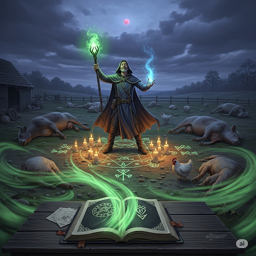
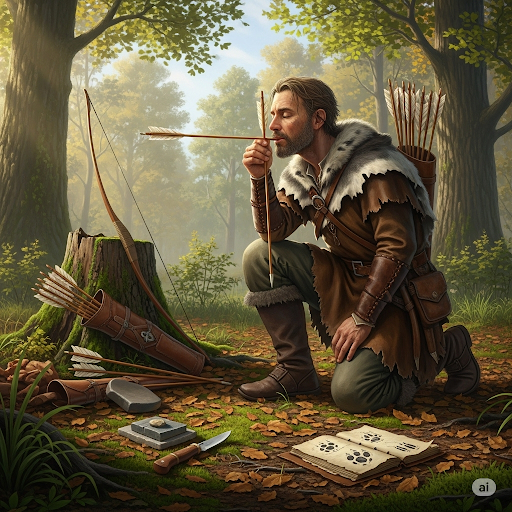

# Greek Magical Papyri

The Greek Magical Papyri is a collection of writing about magic. After it was found in the Egyptian desert, it took experts years to decipher it. The text was written in at least three different ancient languages. After many years, experts realized it contained a number of spells that varied greatly in scope.

The most common types of magic in the collection dealt with healing illnesses like pneumonia. Some spells also gave advice for treating people with mental illnesses, such as those who became psychotic. Some spells asked for unusual things, like crocodile dung. But botany was an important part of the magic. Many healing spells gave instructions on how to use herbs and plants that were believed to be therapeutic. For example, in order to cure arthritis, the book says that the magician should build an ornate altar. Then he should mash different types of herbs and place them on top of it. At dusk, he is supposed to say a spell, so the gods would be gratified.

Other parts of the collection describe how to hone one’s psychic abilities and how to give credible descriptions of the future. Often, the book advised people how to use different objects to tell the future, including tea leaves. Also, one part of the book tells what different dreams might mean. It gives advice for using dreams to tell the future.

A small part of the book, however, is more sinister than the rest. It is meant to cause strife and deception. For example, one tells how to give someone warts, while another will make all of the victim’s farm animals die. However, if someone’s farm animals died as a result of a curse, he could ask a magician to perform magic that makes the deceased come back to life.

## Sentences of story

Greek Magical Papyri

The Greek Magical Papyri is a collection of writing about magic.

After it was found in the Egyptian desert, it took experts years to decipher it.

The text was written in at least three different ancient languages.

After many years, experts realized it contained a number of spells that varied greatly in scope.

The most common types of magic in the collection dealt with healing illnesses like pneumonia.

Some spells also gave advice for treating people with mental illnesses, such as those who became psychotic.

Some spells asked for unusual things, like crocodile dung.

But botany was an important part of the magic.

Many healing spells gave instructions on how to use herbs and plants that were believed to be therapeutic.

For example, in order to cure arthritis, the book says that the magician should build an ornate altar.

Then he should mash different types of herbs and place them on top of it.

At dusk, he is supposed to say a spell, so the gods would be gratified.

Other parts of the collection describe how to hone one’s psychic abilities and how to give credible descriptions of the future.

Often, the book advised people how to use different objects to tell the future, including tea leaves.

Also, one part of the book tells what different dreams might mean.

It gives advice for using dreams to tell the future.

A small part of the book, however, is more sinister than the rest.

It is meant to cause strife and deception.

For example, one tells how to give someone warts, while another will make all of the victim’s farm animals die.

However, if someone’s farm animals died as a result of a curse, he could ask a magician to perform magic that makes the deceased come back to life.

## List of word

altar, arthritis, botany, credible, deceased, deception, decipher, dung, dusk, gratify, hone, mash, ornate, pneumonia, psychic, psychotic, scope, sinister, strife, therapeutic

## 1. altar

### IPA: /ˈɔːl.tər/
### Class: n
### Câu truyện ẩn dụ:
`Ông tơ` bà nguyệt se duyên cho các cặp đôi trên **bàn thờ** tình yêu.

### Định nghĩa : 
Bàn thờ, bệ thờ.

### English definition: 
A type of table used in religious ceremonies.

### Sentence of stroy:
...the magician should build an ornate **altar**.

## 2. arthritis

### IPA: /ɑːˈθraɪ.tɪs/
### Class: n
### Câu truyện ẩn dụ:
`A, phải trật` khớp rồi, đau quá! Chắc là bị **bệnh viêm khớp**.

### Định nghĩa : 
Bệnh viêm khớp.

### English definition: 
A serious condition in which a person's joints become painful, swollen, and stiff.

### Sentence of stroy:
For example, in order to cure **arthritis**...

## 3. botany

### IPA: /ˈbɒt.ən.i/
### Class: n
### Câu truyện ẩn dụ:
`Bó` `cỏ` `này` có gì đặc biệt mà cậu nghiên cứu kỹ thế? Tớ đang học **thực vật học** mà.

### Định nghĩa : 
Thực vật học.

### English definition: 
The scientific study of plants.

### Sentence of stroy:
But **botany** was an important part of the magic.

## 4. credible

### IPA: /ˈkred.ə.bəl/
### Class: adj
### Câu truyện ẩn dụ:
`Kẻo đi bồ` với anh ta là không được đâu, lời anh ta nói không **đáng tin, tin cậy** được.

### Định nghĩa : 
Đáng tin, tin cậy.

### English definition: 
Able to be believed or trusted.

### Sentence of stroy:
...and how to give **credible** descriptions of the future.

## 5. deceased

### IPA: /dɪˈsiːst/
### Class: adj
### Câu truyện ẩn dụ:
`Đi siết` nợ mà chủ nợ đã **chết, quá cố** rồi thì làm sao đòi được nữa.

### Định nghĩa : 
Đã chết, quá cố.

### English definition: 
Dead.

### Sentence of stroy:
...makes the **deceased** come back to life.

## 6. deception

### IPA: /dɪˈsep.ʃən/
### Class: n
### Câu truyện ẩn dụ:
`Đi dép` `sần` sùi để che giấu thân phận là một **sự lừa dối, dối trá**.

### Định nghĩa : 
Sự lừa dối, sự dối trá, sự lừa gạt.

### English definition: 
The act of hiding the truth, especially to get an advantage.

### Sentence of stroy:
It is meant to cause strife and **deception**.

## 7. decipher

### IPA: /dɪˈsaɪ.fər/
### Class: v
### Câu truyện ẩn dụ:
`Đi Sài Gòn` phải có bản đồ, nếu không sẽ rất khó **giải mã, đọc** được hệ thống đường sá phức tạp ở đây.

### Định nghĩa : 
Giải mã, đọc (chữ khó, chữ cổ).

### English definition: 
To discover the meaning of something written badly or in a difficult or hidden way.

### Sentence of stroy:
After it was found in the Egyptian desert, it took experts years to **decipher** it.

## 8. dung

### IPA: /dʌŋ/
### Class: n
### Câu truyện ẩn dụ:
`Đừng` giẫm vào đống **phân** bò kia!

### Định nghĩa : 
Phân (động vật).

### English definition: 
Solid waste from a large animal.

### Sentence of stroy:
Some spells asked for unusual things, like crocodile **dung**.

## 9. dusk

### IPA: /dʌsk/
### Class: n
### Câu truyện ẩn dụ:
`Đất` trời chuyển màu, **lúc chạng vạng, hoàng hôn** buông xuống.

### Định nghĩa : 
Lúc chạng vạng, lúc xẩm tối, hoàng hôn.

### English definition: 
The time before night when it is not yet dark.

### Sentence of stroy:
At **dusk**, he is supposed to say a spell...

## 10. gratify

### IPA: /ˈɡræt.ɪ.faɪ/
### Class: v
### Câu truyện ẩn dụ:
`Gà rán thì phải` ăn ngay lúc nóng mới **làm hài lòng, vừa lòng** thực khách.

### Định nghĩa : 
Làm hài lòng, làm vừa lòng.

### English definition: 
To please someone, or to satisfy a wish or need.

### Sentence of stroy:
...so the gods would be **gratified**.

## 11. hone

### IPA: /həʊn/
### Class: v
### Câu truyện ẩn dụ:
Người thợ săn **mài giũa, trau dồi** kỹ năng săn bắn của mình mỗi ngày, `hôn` vào mũi tên để lấy may.

### Định nghĩa : 
Mài giũa, trau dồi (kỹ năng).

### English definition: 
To make something perfect or completely suitable for its purpose.

### Sentence of stroy:
...describe how to **hone** one’s psychic abilities...

## 12. mash

### IPA: /mæʃ/
### Class: v
### Câu truyện ẩn dụ:

Người nghệ sĩ **nghiền nát, nhào nặn** những ý tưởng thô và nguồn cảm hứng của mình mỗi đêm, `gõ` vào bàn phím để gọi hồn con chữ.

### Định nghĩa : 
Nghiền, giã nát.

### English definition: 
To crush food, usually after cooking it, so that it forms a soft mass.

### Sentence of stroy:
Then he should **mash** different types of herbs and place them on top of it.

## 13. ornate

### IPA: /ɔːˈneɪt/
### Class: adj
### Câu truyện ẩn dụ:
Chiếc váy của `cô nết` na được trang trí **lộng lẫy, công phu** bằng vàng và kim cương.

### Định nghĩa : 
Lộng lẫy, trang trí công phu.

### English definition: 
Having a lot of complicated decoration.

### Sentence of stroy:
...the magician should build an **ornate** altar.

## 14. pneumonia

### IPA: /njuːˈməʊ.ni.ə/
### Class: n
### Câu truyện ẩn dụ:
`Níu` `áo` `mẹ` đi, con bị **viêm phổi**, lạnh lắm.

### Định nghĩa : 
Bệnh viêm phổi.

### English definition: 
A serious illness in which one or both lungs become red and swollen and filled with liquid.

### Sentence of stroy:
The most common types of magic in the collection dealt with healing illnesses like **pneumonia**.

## 15. psychic

### IPA: /ˈsaɪ.kɪk/
### Class: adj
### Câu truyện ẩn dụ:
Nhà tiên tri `sai` `kích` thước viên đá ma thuật, nên khả năng **thuộc về tâm linh, siêu nhiên** của nó bị giảm sút.

### Định nghĩa : 
(thuộc) tâm linh, siêu nhiên.

### English definition: 
Having a special mental ability, for example so that you are able to know what will happen in the future or what people are thinking.

### Sentence of stroy:
...describe how to hone one’s **psychic** abilities...

## 16. psychotic

### IPA: /saɪˈkɒt.ɪk/
### Class: adj
### Câu truyện ẩn dụ:
`Sai` một `cót` lúa là ông chủ nổi điên, la hét như một người **bị loạn thần kinh**.

### Định nghĩa : 
(bị) loạn thần kinh, điên.

### English definition: 
Suffering from a serious mental illness that makes you act strangely or believe things that are not true.

### Sentence of stroy:
...those who became **psychotic**.

## 17. scope

### IPA: /skəʊp/
### Class: n
### Câu truyện ẩn dụ:
`Sợ cốp` xe này nhỏ quá, không chứa hết đồ trong **phạm vi** cho phép.

### Định nghĩa : 
Phạm vi, tầm (kiến thức, hoạt động).

### English definition: 
The range of a subject covered by a book, program, discussion, class, etc.

### Sentence of stroy:
...spells that varied greatly in **scope**.

## 18. sinister

### IPA: /ˈsɪn.ɪ.stər/
### Class: adj
### Câu truyện ẩn dụ:
Tên trộm `xin ít` `tờ` tiền thôi, nhưng ánh mắt của hắn trông rất **nham hiểm, độc ác**.

### Định nghĩa : 
Nham hiểm, độc ác, gở.

### English definition: 
Making you feel that something bad or evil might happen.

### Sentence of stroy:
A small part of the book, however, is more **sinister** than the rest.

## 19. strife

### IPA: /straɪf/
### Class: n
### Câu truyện ẩn dụ:
`Sợ trái` ý sếp nên nhân viên không dám cãi lại, tránh gây ra **sự xung đột, mâu thuẫn**.

### Định nghĩa : 
Sự xung đột, sự mâu thuẫn, sự cãi cọ.

### English definition: 
Violent or angry disagreement.

### Sentence of stroy:
It is meant to cause **strife** and deception.

## 20. therapeutic

### IPA: /ˌθer.əˈpjuː.tɪk/
### Class: adj
### Câu truyện ẩn dụ:
`Xe ra` `bưu điện` để lấy thảo dược, chúng có tác dụng **chữa bệnh, trị liệu**.

### Định nghĩa : 
(thuộc) chữa bệnh, trị liệu.

### English definition: 
Causing someone to feel happier and more relaxed or to be more healthy.

### Sentence of stroy:
...plants that were believed to be **therapeutic**.