# Watch Out! 

Kevin stepped off the tram and walked toward the ship, holding a package tightly in his hands. He had been hired as a courier for an important broker. All he needed to do was deliver a package to an office in New York City; the ship would take him there.

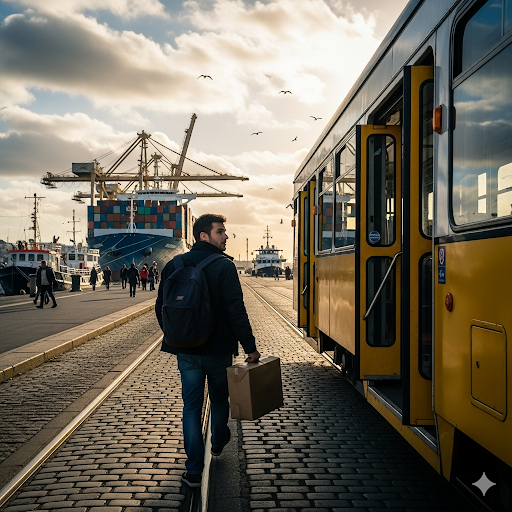

When he boarded, the ship was congested with people. As Kevin walked to his cabin, he saw the exclusive first-class section. Everybody inside was wearing fancy garments. He would have liked to socialize with the people inside, but it was against proper etiquette. People paid a premium for the privilege to ride in first-class.

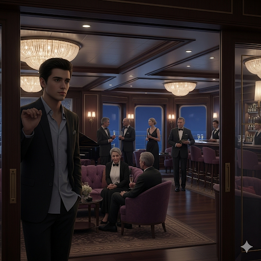

Instead, he went to his cabin next to the freight section of the boat. His room smelled bad, and the floorboards were warped and deformed in some areas. He could also hear the motor humming as it waited to propel the ship forward. Suddenly, Kevin was unsettled by something, but he wasn’t sure why.

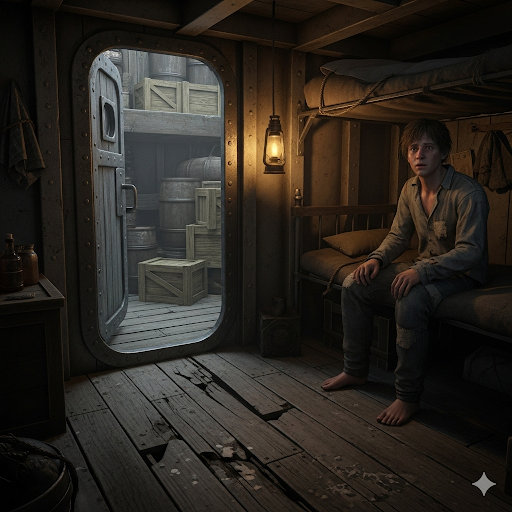

He took a short walk on the ship’s deck, but he still felt strange. That night, he suffered from insomnia—he couldn’t suppress his obsessing over how strange he felt.

Kevin went back on deck. It was cold and dark outside. He looked overboard, but it seemed that everything was all right. “Just go back inside,” he thought. Then Kevin saw it. A giant iceberg was sticking out of the ocean in the distance!

“ Help!” he yelled.

People looked at him as if he was crazy, but he continued to shout until he saw the captain.

“There’s an iceberg out there,” Kevin said to him. “ If the ship doesn’t move, we’re liable to crash,” he said, pointing toward the iceberg.

The captain saw it and immediately instructed the crew to change the ship’s direction. “Without your help, we would have definitely hit the iceberg. That would have been a terrible disaster!” he said to Kevin.

Kevin felt relieved. Now he knew to always trust his intuitive sense.

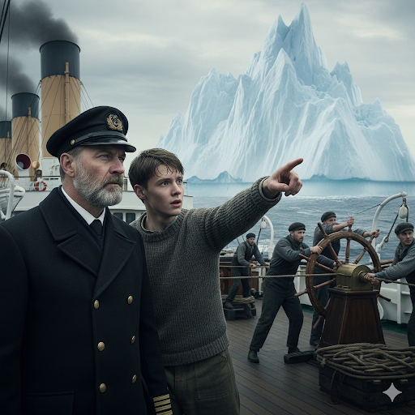

## Sentences of story

Kevin stepped off the tram and walked toward the ship, holding a package tightly in his hands.

He had been hired as a courier for an important broker.

All he needed to do was deliver a package to an office in New York City; the ship would take him there.

When he boarded, the ship was congested with people.

As Kevin walked to his cabin, he saw the exclusive first-class section.

Everybody inside was wearing fancy garments.

He would have liked to socialize with the people inside, but it was against proper etiquette.

People paid a premium for the privilege to ride in first-class.

Instead, he went to his cabin next to the freight section of the boat.

His room smelled bad, and the floorboards were warped and deformed in some areas.

He could also hear the motor humming as it waited to propel the ship forward.

Suddenly, Kevin was unsettled by something, but he wasn’t sure why.

He took a short walk on the ship’s deck, but he still felt strange.

That night, he suffered from insomnia—he couldn’t suppress his obsessing over how strange he felt.

Kevin went back on deck.

It was cold and dark outside.

He looked overboard, but it seemed that everything was all right.

“Just go back inside,” he thought.

Then Kevin saw it.

A giant iceberg was sticking out of the ocean in the distance!

“ Help!” he yelled.

People looked at him as if he was crazy, but he continued to shout until he saw the captain.

“There’s an iceberg out there,” Kevin said to him.

“ If the ship doesn’t move, we’re liable to crash,” he said, pointing toward the iceberg.

The captain saw it and immediately instructed the crew to change the ship’s direction.

“Without your help, we would have definitely hit the iceberg. That would have been a terrible disaster!” he said to Kevin.

Kevin felt relieved.

Now he knew to always trust his intuitive sense.

## List of word

congested, courier, deform, etiquette, exclusive, freight, garment, insomnia, intuitive, liable, obsess, overboard, premium, privilege, propel, socialize, suppress, tram, unsettle, warp

## 1. congested
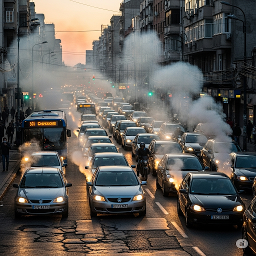

### IPA: /kənˈdʒes.tɪd/
### Class: adj
### Câu truyện ẩn dụ:
`Con ghét tịt` mũi vì đường phố **đông nghịt, chật ních** xe cộ và khói bụi.

### Định nghĩa : 
Đông nghịt, chật ních.

### English definition: 
Too blocked or crowded and causing difficulties.

### Sentence of stroy:
When he boarded, the ship was **congested** with people.

## 2. courier
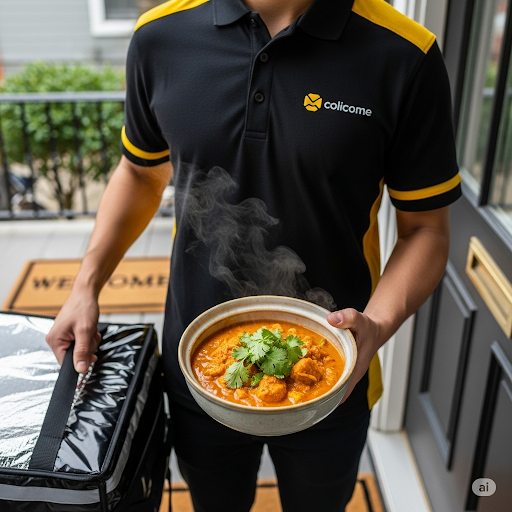

### IPA: /ˈkʊr.i.ər/
### Class: n
### Câu truyện ẩn dụ:
`Cua ri` này ngon quá, phải gọi **người đưa thư** mang đến cho bạn bè thưởng thức mới được.

### Định nghĩa : 
Người đưa thư, người chuyển phát.

### English definition: 
A person or company that takes messages, letters, or parcels from one person or place to another.

### Sentence of stroy:
He had been hired as a **courier** for an important broker.

## 3. deform
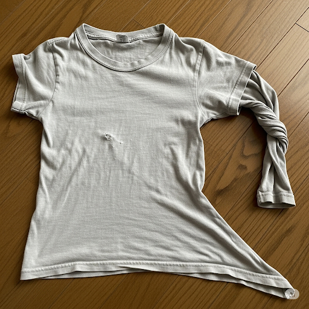

### IPA: /dɪˈfɔːm/
### Class: v
### Câu truyện ẩn dụ:
deform `Đi-phom `này mặc không vừa nữa rồi, nó đã bị **biến dạng** sau nhiều lần giặt.

### Định nghĩa : 
Làm cho méo mó, làm biến dạng.

### English definition: 
To change the original shape of something, especially in a way that makes it ugly.

### Sentence of stroy:
...the floorboards were warped and **deformed** in some areas.

## 4. etiquette

### IPA: /ˈet.ɪ.ket/
### Class: n
### Câu truyện ẩn dụ:
`Em đi kẹt` xe nên đến muộn, theo **nghi thức, phép xã giao**, em phải xin lỗi mọi người.

### Định nghĩa : 
Nghi thức, phép xã giao.

### English definition: 
The set of rules or customs that control accepted behavior in particular social groups or social situations.

### Sentence of stroy:
He would have liked to socialize with the people inside, but it was against proper **etiquette**.

## 5. exclusive
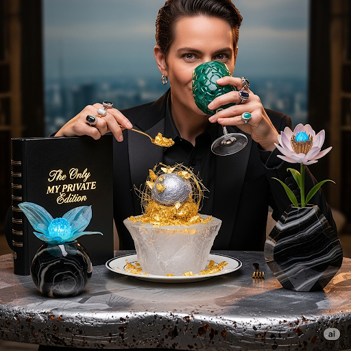

### IPA: /ɪkˈskluː.sɪv/
### Class: adj
### Câu truyện ẩn dụ:
`Ích kỷ lu bu` nên chỉ muốn hưởng những thứ **độc quyền, riêng biệt**.

### Định nghĩa : 
Độc quyền, riêng biệt.

### English definition: 
Limited to only one person or group of people.

### Sentence of stroy:
As Kevin walked to his cabin, he saw the **exclusive** first-class section.

## 6. freight

### IPA: /freɪt/
### Class: n
### Câu truyện ẩn dụ:
`Phải ráng` làm việc để có tiền gửi **hàng hóa** về cho gia đình.

### Định nghĩa : 
Hàng hóa (vận chuyển bằng tàu, máy bay, xe lửa).

### English definition: 
Goods, but not passengers, that are carried from one place to another, by ship, aircraft, train, or truck.

### Sentence of stroy:
Instead, he went to his cabin next to the **freight** section of the boat.

## 7. garment

### IPA: /ˈɡɑː.mənt/
### Class: n
### Câu truyện ẩn dụ:
`Gả mình` cho anh ta, cô dâu mặc bộ **quần áo** cưới lộng lẫy.

### Định nghĩa : 
Áo quần.

### English definition: 
A piece of clothing.

### Sentence of stroy:
Everybody inside was wearing fancy **garments**.

## 8. insomnia

### IPA: /ɪnˈsɒm.ni.ə/
### Class: n
### Câu truyện ẩn dụ:
`In` `sóm` `ni` a cũng bị **chứng mất ngủ** vì tiếng ồn.

### Định nghĩa : 
Chứng mất ngủ.

### English definition: 
The condition of being unable to sleep, over a period of time.

### Sentence of stroy:
That night, he suffered from **insomnia**...

## 9. intuitive

### IPA: /ɪnˈtʃuː.ɪ.tɪv/
### Class: adj
### Câu truyện ẩn dụ:
`In tu` `ít` `thôi`, vì anh ta có khả năng **(thuộc) trực giác**, biết hết mọi chuyện đó.

### Định nghĩa : 
(thuộc) trực giác.

### English definition: 
Based on feelings rather than facts or proof.

### Sentence of stroy:
Now he knew to always trust his **intuitive** sense.

## 10. liable
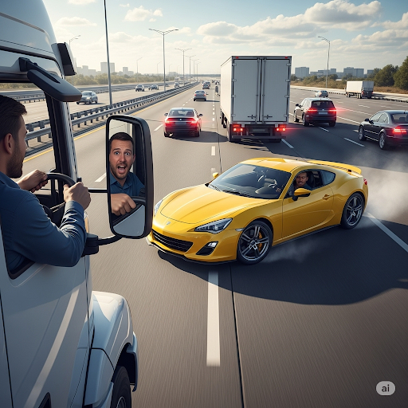

### IPA: /ˈlaɪ.ə.bəl/
### Class: adj
### Câu truyện ẩn dụ:
`Lái ẩu bồ` ơi, **có khả năng** gây tai nạn lắm đó.

### Định nghĩa : 
Có khả năng xảy ra, có thể.

### English definition: 
Very likely to do something.

### Sentence of stroy:
“ If the ship doesn’t move, we’re **liable** to crash,” he said, pointing toward the iceberg.

## 11. obsess
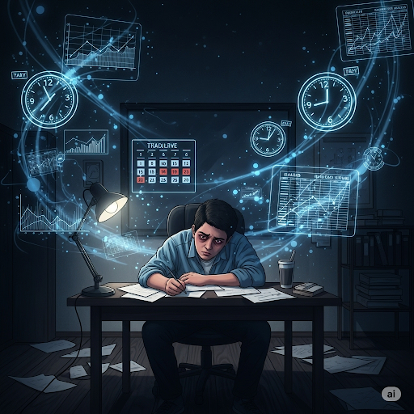

### IPA: /əbˈses/
### Class: v
### Câu truyện ẩn dụ:
`Ợp sếp` quá nên lúc nào cũng **ám ảnh** về công việc.

### Định nghĩa : 
Ám ảnh.

### English definition: 
To think about someone or something all the time.

### Sentence of stroy:
...he couldn’t suppress his **obsessing** over how strange he felt.

## 12. overboard

### IPA: /ˈəʊ.və.bɔːd/
### Class: adv
### Câu truyện ẩn dụ:
`Ở vơ` `bờ` đê mà không cẩn thận là ngã **xuống tàu, xuống biển** đó.

### Định nghĩa : 
Qua mạn tàu, xuống biển.

### English definition: 
Over the side of a boat or ship and into the water.

### Sentence of stroy:
He looked **overboard**, but it seemed that everything was all right.

## 13. premium
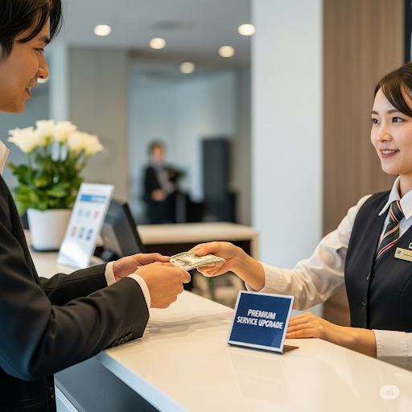

### IPA: /ˈpriː.mi.əm/
### Class: n
### Câu truyện ẩn dụ:
`Bí mật em` phải trả một **khoản phí thêm** để được hưởng dịch vụ cao cấp.

### Định nghĩa : 
Phí thêm, tiền thưởng, phần thưởng.

### English definition: 
An amount that is more than usual.

### Sentence of stroy:
People paid a **premium** for the privilege to ride in first-class.

## 14. privilege
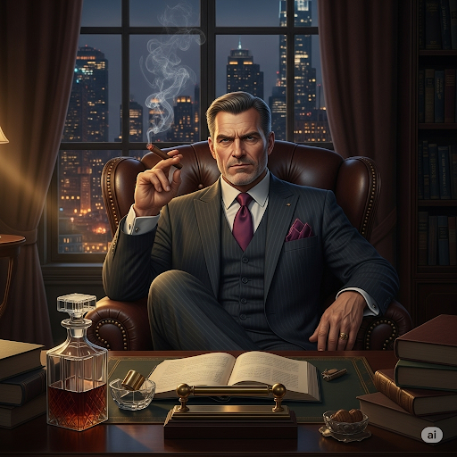

### IPA: /ˈprɪv.əl.ɪdʒ/
### Class: n
### Câu truyện ẩn dụ:
`Bị V.I.P rít` một hơi thuốc là **đặc quyền** của người có tiền.

### Định nghĩa : 
Đặc quyền, đặc ân.

### English definition: 
An advantage that only one person or group of people has, usually because of their position or because they are rich.

### Sentence of stroy:
People paid a premium for the **privilege** to ride in first-class.

## 15. propel
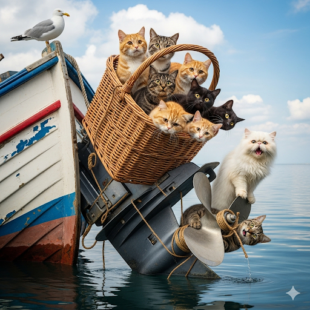

### IPA: /prəˈpel/
### Class: v
### Câu truyện ẩn dụ:
`Bỏ rổ meo` vào động cơ, nó sẽ không **đẩy** thuyền đi được đâu.

### Định nghĩa : 
Đẩy đi.

### English definition: 
To push or move something somewhere, often with a lot of force.

### Sentence of stroy:
He could also hear the motor humming as it waited to **propel** the ship forward.

## 16. socialize

### IPA: /ˈsəʊ.ʃəl.aɪz/
### Class: v
### Câu truyện ẩn dụ:
`Sợ sờ` `lãi` nên anh ta không dám **giao thiệp, hòa mình** vào giới kinh doanh.

### Định nghĩa : 
Giao thiệp, hòa mình (với xã hội).

### English definition: 
To spend time when you are not working with friends or with other people in order to enjoy yourself.

### Sentence of stroy:
He would have liked to **socialize** with the people inside, but it was against proper etiquette.

## 17. suppress
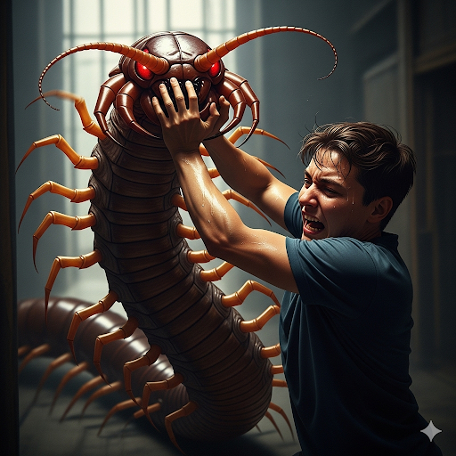

### IPA: /səˈpres/
### Class: v
### Câu truyện ẩn dụ:
`Sợ bị rết` cắn nên phải **đàn áp, kìm nén** nỗi sợ hãi lại.

### Định nghĩa : 
Đàn áp, kìm nén.

### English definition: 
To prevent something from being seen or expressed or from operating.

### Sentence of stroy:
...he couldn’t **suppress** his obsessing over how strange he felt.

## 18. tram
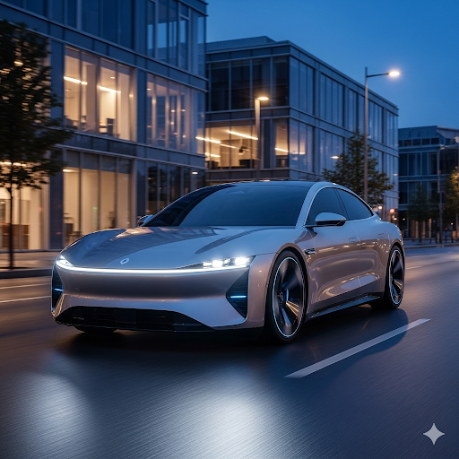

### IPA: /træm/
### Class: n
### Câu truyện ẩn dụ:
Đi **xe điện** rất `trầm` và êm.

### Định nghĩa : 
Xe điện, tàu điện.

### English definition: 
An electric vehicle that transports people, usually in cities, and goes along metal tracks in the road.

### Sentence of stroy:
Kevin stepped off the **tram** and walked toward the ship, holding a package tightly in his hands.

## 19. unsettle

### IPA: /ʌnˈset.əl/
### Class: v
### Câu truyện ẩn dụ:
`Ăn sét` `thồ` hàng làm tôi cảm thấy **bất an, lo lắng**.

### Định nghĩa : 
Làm lo lắng, làm bối rối, làm bất an.

### English definition: 
To make someone feel anxious or slightly worried.

### Sentence of stroy:
Suddenly, Kevin was **unsettled** by something, but he wasn’t sure why.

## 20. warp

### IPA: /wɔːp/
### Class: v
### Câu truyện ẩn dụ:
Tấm ván gỗ bị `oạp` đi do trời mưa, giờ nó đã **cong, vênh**.

### Định nghĩa : 
Làm cong, vênh.

### English definition: 
To become, or cause something to become, bent or twisted out of shape.

### Sentence of stroy:
His room smelled bad, and the floorboards were **warped** and deformed in some areas.
