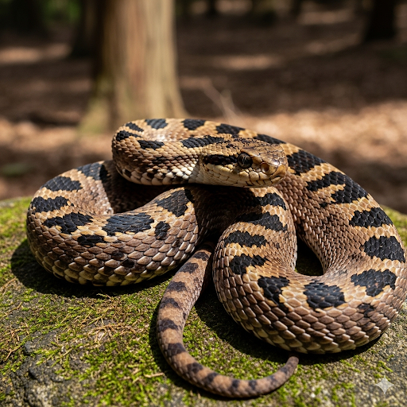
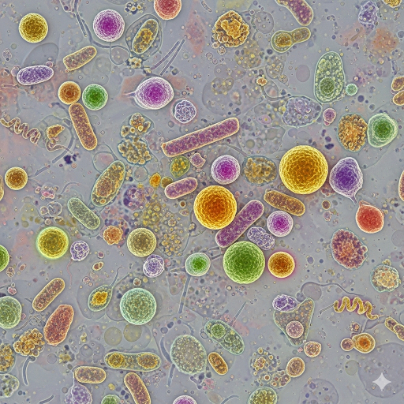
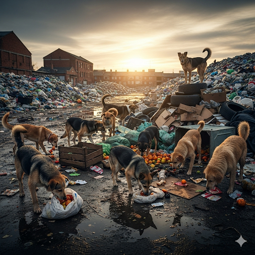
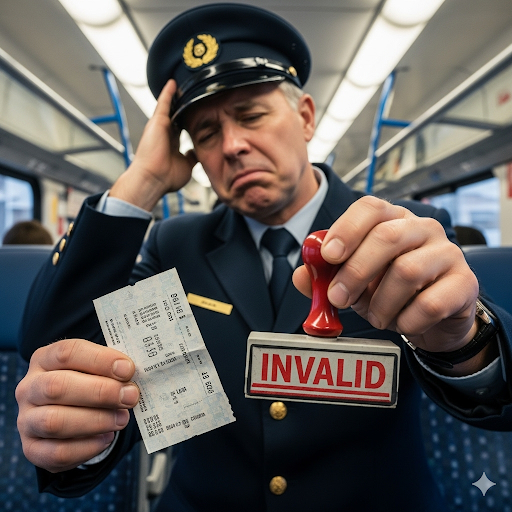
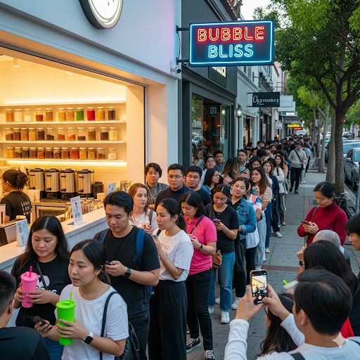
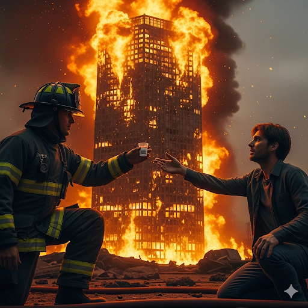
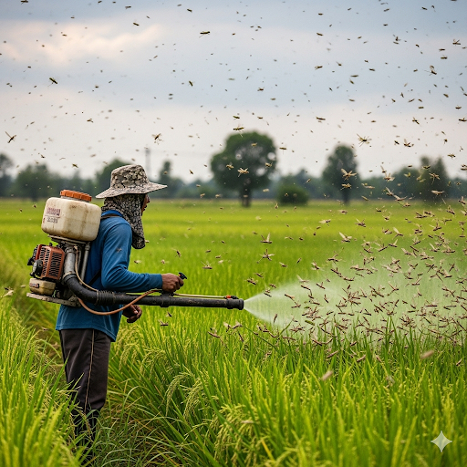
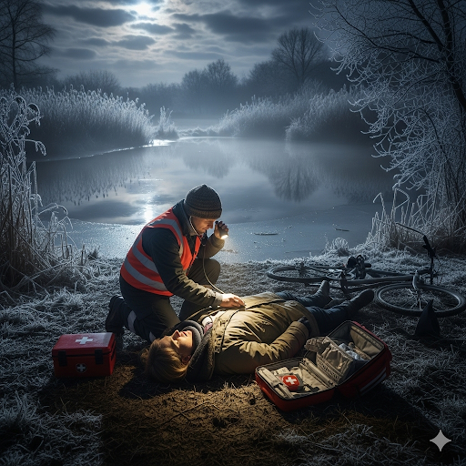
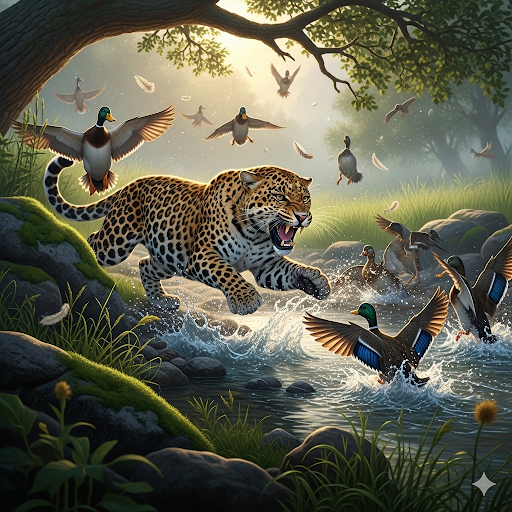

# Dangerous Bites 

There are many animals with dangerous bites in the world, but which one is the worst? Some would say that the elusive short-tailed mamushi has the worst bite. The snake only goes into homes to chase pests such as mice. Otherwise, it stays in the fields, where it’s dangerous to people who forage for food there. If someone stuns it by accidentally stepping on it, it bites to protect itself. At first, the effects of the bite may seem negligible because it doesn’t cause a lot of bleeding. However, after a few moments, the venom induces paralysis in the area where the individual was bitten. Furthermore, the venom can also impede respiration. If the person doesn’t go to the doctor, they are susceptible to kidney deterioration.

Others would argue that tigers have the worst bite. Mother tigers are inseparable from their babies and seem to be the gentlest creatures when they are around their young. However, if the babies are threatened, the mother tiger’s savage nature prevails. With strong jaws and the ability to move quickly, the tiger can kill someone with one bite. That’s because it always tries to bite an important artery when it attacks. If the artery is ruptured, the victim will bleed to death.

In the mainstream, animal bites are seen as the most dangerous. But some scientists think this idea is invalid. In fact, the most dangerous bite might be the human bite. When scientists magnified the contents in human saliva, they found about three hundred different microbes in it. A human bite can be dangerous if the bacteria enters the body through a cut, which can make people very sick. Furthermore, most people don’t realize how serious a man bit can be, so they don't go to the doctor right away. This gives the wound a chance to get infected and cause more problems.

## Sentences of story

Dangerous Bites 

There are many animals with dangerous bites in the world, but which one is the worst?

Some would say that the elusive short-tailed mamushi has the worst bite.

The snake only goes into homes to chase pests such as mice.

Otherwise, it stays in the fields, where it’s dangerous to people who forage for food there.

If someone stuns it by accidentally stepping on it, it bites to protect itself.

At first, the effects of the bite may seem negligible because it doesn’t cause a lot of bleeding.

However, after a few moments, the venom induces paralysis in the area where the individual was bitten.

Furthermore, the venom can also impede respiration.

If the person doesn’t go to the doctor, they are susceptible to kidney deterioration.

Others would argue that tigers have the worst bite.

Mother tigers are inseparable from their babies and seem to be the gentlest creatures when they are around their young.

However, if the babies are threatened, the mother tiger’s savage nature prevails.

With strong jaws and the ability to move quickly, the tiger can kill someone with one bite.

That’s because it always tries to bite an important artery when it attacks.

If the artery is ruptured, the victim will bleed to death.

In the mainstream, animal bites are seen as the most dangerous.

But some scientists think this idea is invalid.

In fact, the most dangerous bite might be the human bite.

When scientists magnified the contents in human saliva, they found about three hundred different microbes in it.

A human bite can be dangerous if the bacteria enters the body through a cut, which can make people very sick.

Furthermore, most people don’t realize how serious a man bit can be, so they don't go to the doctor right away.

This gives the wound a chance to get infected and cause more problems.

## List of word

artery, deterioration, elusive, forage, impede, induce, inseparable, invalid, magnify, mainstream, microbe, negligible, paralysis, pest, prevail, respiration, rupture, savage, stun, susceptible

## 1. artery

### IPA: /ˈɑː.tər.i/
### Class: n
### Câu truyện ẩn dụ:
Để giúp sinh viên nhớ bài, một bác sĩ chỉ vào sơ đồ cơ thể người và nói: "Các bạn thấy không? `A tờ ri`! Tờ giấy này ghi rất chi tiết về **động mạch**. Đây là mạch máu quan trọng nhất, vận chuyển sự sống đi khắp nơi. Cứ liên tưởng `a tờ ri` là tờ giấy vẽ **động mạch** nhé."

### Định nghĩa : 
Động mạch.

### English definition: 
One of the thick tubes that carry blood from the heart to other parts of the body.

### Sentence of stroy:
If the **artery** is ruptured, the victim will bleed to death.

## 2. deterioration

### IPA: /dɪˌtɪə.ri.əˈreɪ.ʃən/
### Class: n
### Câu truyện ẩn dụ:
Nhìn tòa nhà cổ bị bỏ hoang, một kiến trúc sư lắc đầu: "Công trình này đã `đi tơi ria rách sườn rồi`. Các chi tiết viền (`ria`) đã mục nát, khung sườn cũng hư hại. Đây là một ví dụ điển hình cho **sự xuống cấp** nghiêm trọng. Cứ nhớ đi tơi ria rách sườn là ra nghĩa **sự hư hỏng**."

### Định nghĩa : 
Sự suy thoái, sự hư hỏng, sự sa sút.

### English definition: 
The process of becoming worse.

### Sentence of stroy:
If the person doesn’t go to the doctor, they are susceptible to kidney **deterioration**.

## 3. elusive

### IPA: /iˈluː.sɪv/
### Class: adj
### Câu truyện ẩn dụ:

Một điệp viên có biệt danh là `Yêu Lưu Sếp`, vì anh ta luôn tìm cách cứu sếp mình khỏi nguy hiểm. Anh ta hành động rất bí ẩn và **khó nắm bắt**, không ai biết tung tích ở đâu cả. Mỗi khi có người hỏi về điệp viên `Yêu Lưu Sếp`, mọi người chỉ có thể nói rằng anh ta rất **lảng tránh** và **khó tìm**.

### Định nghĩa : 
Khó nắm bắt, hay lảng tránh.

### English definition: 
Difficult to describe, find, achieve, or remember.

### Sentence of stroy:
Some would say that the **elusive** short-tailed mamushi has the worst bite.

## 4. forage

### IPA: /ˈfɒr.ɪdʒ/
### Class: v
### Câu truyện ẩn dụ:

Bầy chó hoang đói lả xúm lại một đống rác lớn. Chúng liên tục dùng mõm `pho rác` lên để **lục lọi tìm thức ăn** thừa. Đối với chúng, việc `pho rác` mỗi ngày chính là cách duy nhất để **tìm kiếm thức ăn** và sinh tồn trong thành phố.

### Định nghĩa : 
Lục lọi, tìm tòi (thức ăn).

### English definition: 
To go from place to place searching for things that you can eat or use.

### Sentence of stroy:
...it’s dangerous to people who **forage** for food there.

## 5. impede

### IPA: /ɪmˈpiːd/
### Class: v
### Câu truyện ẩn dụ:

Để **cản trở** kế hoạch của đối thủ, tên gián điệp đã hành động rất nhanh. Hắn lẻn ra sau lưng và dùng tay `im bít` miệng người lính gác, khiến anh ta không thể la lên báo động. Hành động `im bít` bất ngờ này đã **ngăn cản** toàn bộ hệ thống phòng thủ bị phát giác.

### Định nghĩa : 
Cản trở, ngăn cản.

### English definition: 
To make it more difficult for something to happen or someone to do something.

### Sentence of stroy:
Furthermore, the venom can also **impede** respiration.

## 6. induce

### IPA: /ɪnˈdʒuːs/
### Class: v
### Câu truyện ẩn dụ:

Tên lừa đảo đã `in điêu` một bản hợp đồng với các điều khoản giả mạo. Hắn dùng nó để **thuyết phục** và **xui khiến** khách hàng ký vào mà không đọc kỹ. Chính tờ giấy `in điêu` đó đã **gây ra** một vụ tranh chấp lớn, khiến nạn nhân mất hết tài sản.

### Định nghĩa : 
Gây ra, xui khiến.

### English definition: 
To persuade someone to do something, or to cause something to happen.

### Sentence of stroy:
...the venom **induces** paralysis in the area where the individual was bitten.

## 7. inseparable

### IPA: /ɪnˈsep.ər.ə.bəl/
### Class: adj
### Câu truyện ẩn dụ:

Tấm ảnh của đôi bạn thân vừa được `in` ra, người ta nói đùa rằng dù có `xé` tấm ảnh này đi nữa, hai người `bồ` tri kỷ này vẫn sẽ tìm thấy nhau. Tình bạn của họ là **không thể tách rời**, một mối quan hệ mà không gì có thể **chia cắt** được.

### Định nghĩa : 
Không thể tách rời.

### English definition: 
Unable to be separated.

### Sentence of stroy:
Mother tigers are **inseparable** from their babies...

## 8. invalid

### IPA: /ɪnˈvæl.ɪd/
### Class: adj
### Câu truyện ẩn dụ:

Người soát vé tàu lắc đầu nói: “Tấm vé này rõ ràng là hàng `in vé lởm`, chất lượng giấy và mực rất kém.” Nói rồi ông đóng dấu đỏ lên vé, biến nó trở thành một tấm vé **không hợp lệ**. Bất cứ thứ gì là hàng `in vé lởm` đều sẽ bị coi là **vô hiệu**.

### Định nghĩa : 
Không hợp lệ, không có giá trị.

### English definition: 
Not legally or officially acceptable.

### Sentence of stroy:
But some scientists think this idea is **invalid**.

## 9. magnify

### IPA: /ˈmæɡ.nɪ.faɪ/
### Class: v
### Câu truyện ẩn dụ:

Người sếp cầm bản thiết kế nhãn hiệu lên rồi chau mày: “`Mác nơ phải` to lên chứ, bé thế này sao mà nổi bật được!”. Yêu cầu của ông chính là phải **phóng to** cái logo đó. Đối với ông, việc **làm lớn hơn** các chi tiết quan trọng là điều bắt buộc trong quảng cáo.

### Định nghĩa : 
Phóng to, làm to ra.

### English definition: 
To make something look larger than it is, especially by looking at it through a special piece of equipment.

### Sentence of stroy:
When scientists **magnified** the contents in human saliva...

## 10. mainstream

### IPA: /ˈmeɪn.striːm/
### Class: n
### Câu truyện ẩn dụ:

Các `men chờ` đến lượt mình để mua món trà sữa vị `rim` mới ra mắt. Việc xếp hàng chờ đợi này đã trở thành **xu hướng chủ đạo** của giới trẻ. Bất kỳ ai cũng muốn thử món đồ uống **đại trà** này để không bị coi là lỗi thời. Cảnh tượng các `men chờ` mua đồ `rim` chính là biểu hiện của một **trào lưu chính**.

### Định nghĩa : 
Xu hướng chủ đạo, đại trà.

### English definition: 
The ideas, attitudes, or activities that are shared by most people and regarded as normal or conventional.

### Sentence of stroy:
In the **mainstream**, animal bites are seen as the most dangerous.

## 11. microbe

### IPA: /ˈmaɪ.krəʊb/
### Class: n
### Câu truyện ẩn dụ:

Bác sĩ dặn cậu thanh niên bị nhiễm trùng da: “Lần sau, trước khi `mày cạo râu`, nhớ phải khử trùng lưỡi dao thật kỹ nhé.” Ông giải thích rằng trên đó có vô số **vi khuẩn**, **vi sinh vật** mà mắt thường không thấy được, chính chúng là nguyên nhân gây ra vấn đề này.

### Định nghĩa : 
Vi trùng, vi khuẩn.

### English definition: 
A very small living thing, especially one that causes disease, that can only be seen with a microscope.

### Sentence of stroy:
...they found about three hundred different **microbes** in it.

## 12. negligible

### IPA: /ˈneɡ.lɪ.dʒə.bəl/
### Class: adj
### Câu truyện ẩn dụ:

Giữa đám cháy lớn, một anh lính cứu hỏa đưa cho tôi một ly nước nhỏ xíu. Tôi gạt đi: “Thôi `né ly gì bồ` ơi, lượng nước này quá **không đáng kể**.” So với ngọn lửa khổng lồ, ly nước đó thật sự **không quan trọng** và chẳng giúp được gì.

### Định nghĩa : 
Không đáng kể, có thể bỏ qua.

### English definition: 
Too slight or small in amount to be of importance.

### Sentence of stroy:
...the effects of the bite may seem **negligible** because it doesn’t cause a lot of bleeding.

## 13. paralysis

### IPA: /pəˈræl.ə.sɪs/
### Class: n
### Câu truyện ẩn dụ:

Sau vụ tai nạn, người đàn ông nằm bất động. Vị bác sĩ buồn bã nói: "Tình trạng của anh ấy rất tệ, ngay cả việc đơn giản như `bê ra ly súp` nóng để ăn cũng không thể làm được." Toàn bộ cơ thể anh đã rơi vào trạng thái **tê liệt**, một **chứng liệt** rất nặng.

### Định nghĩa : 
Sự tê liệt, chứng liệt.

### English definition: 
A condition in which you are unable to move all or part of your body.

### Sentence of stroy:
...the venom induces **paralysis** in the area where the individual was bitten.

## 14. pest

### IPA: /pest/
### Class: n
### Câu truyện ẩn dụ:

Người nông dân nhìn thấy một bầy châu chấu đang phá hoại ruộng lúa, ông liền cầm bình thuốc trừ sâu xịt `pét` một tiếng lớn. Ông lẩm bẩm: "Phải dùng tiếng `pét` này để diệt hết lũ **sâu bệnh**". Đối với ông, những **loài vật gây hại** này là kẻ thù lớn nhất của nhà nông.

### Định nghĩa : 
Sâu bọ, côn trùng có hại.

### English definition: 
An insect or small animal that is harmful or damages crops.

### Sentence of stroy:
The snake only goes into homes to chase **pests** such as mice.

## 15. prevail

### IPA: /prɪˈveɪl/
### Class: v
### Câu truyện ẩn dụ:

Trong trận chiến, dù `bị vây` tứ phía, nhưng tinh thần của những người lính dũng cảm cuối cùng đã **thắng thế**. Lẽ phải và sự kiên cường luôn **chiếm ưu thế** trước cái ác, ngay cả khi gặp hoàn cảnh khó khăn nhất.

### Định nghĩa : 
Thắng thế, chiếm ưu thế.

### English definition: 
To get control or influence.

### Sentence of stroy:
...the mother tiger’s savage nature **prevails**.

## 16. respiration

### IPA: /ˌres.pɪˈreɪ.ʃən/
### Class: n
### Câu truyện ẩn dụ:

Bác sĩ kiểm tra cho người bị nạn trong đêm đông lạnh `rét`, bên `bờ ao` đầy `sình`. Ông ghé tai vào mũi người đó và nói: “Vẫn còn, tôi cảm nhận được **hơi thở** của anh ta”. Trong hoàn cảnh đó, dấu hiệu duy nhất của sự sống chính là **sự hô hấp** yếu ớt.

### Định nghĩa : 
Sự hô hấp.

### English definition: 
The act of breathing.

### Sentence of stroy:
Furthermore, the venom can also impede **respiration**.

## 17. rupture

### IPA: /ˈrʌp.tʃər/
### Class: v
### Câu truyện ẩn dụ:

Do bị áp suất quá cao, một đoạn đường ống nước bị `rộp` phồng lên một cách đáng sợ. Mọi người chỉ biết đứng nhìn và `chờ` đợi, họ biết rằng chỉ trong giây lát nữa thôi, nó sẽ **vỡ tung** ra, gây ra một **sự đứt gãy** nghiêm trọng cho toàn bộ hệ thống.

### Định nghĩa : 
Làm vỡ, làm nứt, làm đứt.

### English definition: 
To (cause something to) burst or break.

### Sentence of stroy:
If the artery is **ruptured**, the victim will bleed to death.

## 18. savage

### IPA: /ˈsæv.ɪdʒ/
### Class: adj
### Câu truyện ẩn dụ:

Con báo đói `sa` vào đàn `vịt` bên bờ suối mà không hề do dự. Nó tấn công một cách **dã man** và **tàn bạo**, thể hiện rõ bản năng săn mồi **hoang dã** của mình. Cảnh tượng con báo `sa vịt` thật sự là một cảnh tượng vô cùng **dữ tợn**.

### Định nghĩa : 
Hoang dã, dữ tợn.

### English definition: 
Extremely violent, wild, or frightening.

### Sentence of stroy:
...the mother tiger’s **savage** nature prevails.

## 19. stun

### IPA: /stʌn/
### Class: v
### Câu truyện ẩn dụ:

Tên cướp vừa `sờ` vào cây súng `tân` tiến của cảnh sát thì bất ngờ bị nó phóng ra một luồng điện. Cú giật mạnh đã **làm hắn choáng váng** và ngã gục ngay lập tức. Công nghệ mới này đã **làm sững sờ** tất cả những người xung quanh.

### Định nghĩa : 
Làm choáng váng, làm sững sờ.

### English definition: 
To make a person or animal unconscious or unable to think clearly, for a short time, especially by hitting them on the head.

### Sentence of stroy:
If someone **stuns** it by accidentally stepping on it, it bites to protect itself.

## 20. susceptible

### IPA: /səˈsep.tə.bəl/
### Class: adj
### Câu truyện ẩn dụ:

Cô nhân viên mới rất ngây thơ. Thấy cô hay nhận lời khuyên từ sếp, đồng nghiệp liền trêu: "`Sơ sếp tớ bồ` à?" (My boss is your first lover, right?). Cô ấy đỏ mặt tin ngay, chứng tỏ là một người rất **nhạy cảm** và **dễ bị ảnh hưởng** bởi lời nói xung quanh.

### Định nghĩa : 
Dễ bị ảnh hưởng, dễ bị tổn thương.

### English definition: 
Easily influenced or harmed by something.

### Sentence of stroy:
If the person doesn’t go to the doctor, they are **susceptible** to kidney deterioration.
